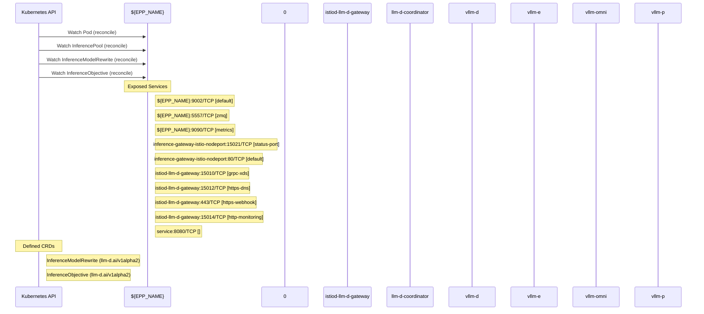

# llm-d-inference-scheduler: Dataflow

## Controller Watches

Kubernetes resources this controller monitors for changes. Each watch triggers reconciliation when the watched resource is created, updated, or deleted.

| Type | GVK | Source |
|------|-----|--------|
| For | /v1/Pod | [`pkg/epp/controller/pod_reconciler.go:91`](https://github.com/llm-d/llm-d-inference-scheduler/blob/c0adac19e0d16adf3e36a049929ff053ccb1fa72/pkg/epp/controller/pod_reconciler.go#L91) |
| For | api/v1/InferencePool | [`pkg/epp/controller/inferencepool_reconciler.go:80`](https://github.com/llm-d/llm-d-inference-scheduler/blob/c0adac19e0d16adf3e36a049929ff053ccb1fa72/pkg/epp/controller/inferencepool_reconciler.go#L80) |
| For | apix/v1alpha2/InferenceModelRewrite | [`pkg/epp/controller/inferencemodelrewrite_reconciler.go:89`](https://github.com/llm-d/llm-d-inference-scheduler/blob/c0adac19e0d16adf3e36a049929ff053ccb1fa72/pkg/epp/controller/inferencemodelrewrite_reconciler.go#L89) |
| For | apix/v1alpha2/InferenceObjective | [`pkg/epp/controller/inferenceobjective_reconciler.go:101`](https://github.com/llm-d/llm-d-inference-scheduler/blob/c0adac19e0d16adf3e36a049929ff053ccb1fa72/pkg/epp/controller/inferenceobjective_reconciler.go#L101) |

## Reconciliation Flow

How the controller interacts with the Kubernetes API during reconciliation.

### Webhooks

| Name | Type | Path | Failure Policy | Service | Overlays | Enable Condition | Sources |
|------|------|------|----------------|---------|----------|------------------|----------|
| namespace.sidecar-injector.istio.io | mutating | /inject | Fail | llm-d-istio-system/istiod-llm-d-gateway |  |  | [`deploy/components/istio-control-plane/webhooks.yaml`](https://github.com/llm-d/llm-d-inference-scheduler/blob/c0adac19e0d16adf3e36a049929ff053ccb1fa72/deploy/components/istio-control-plane/webhooks.yaml) |
| object.sidecar-injector.istio.io | mutating | /inject | Fail | llm-d-istio-system/istiod-llm-d-gateway |  |  | [`deploy/components/istio-control-plane/webhooks.yaml`](https://github.com/llm-d/llm-d-inference-scheduler/blob/c0adac19e0d16adf3e36a049929ff053ccb1fa72/deploy/components/istio-control-plane/webhooks.yaml) |
| rev.namespace.sidecar-injector.istio.io | mutating | /inject | Fail | llm-d-istio-system/istiod-llm-d-gateway |  |  | [`deploy/components/istio-control-plane/webhooks.yaml`](https://github.com/llm-d/llm-d-inference-scheduler/blob/c0adac19e0d16adf3e36a049929ff053ccb1fa72/deploy/components/istio-control-plane/webhooks.yaml) |
| rev.object.sidecar-injector.istio.io | mutating | /inject | Fail | llm-d-istio-system/istiod-llm-d-gateway |  |  | [`deploy/components/istio-control-plane/webhooks.yaml`](https://github.com/llm-d/llm-d-inference-scheduler/blob/c0adac19e0d16adf3e36a049929ff053ccb1fa72/deploy/components/istio-control-plane/webhooks.yaml) |
| rev.validation.istio.io | validating | /validate | Ignore | llm-d-istio-system/istiod-llm-d-gateway |  |  | [`deploy/components/istio-control-plane/webhooks.yaml`](https://github.com/llm-d/llm-d-inference-scheduler/blob/c0adac19e0d16adf3e36a049929ff053ccb1fa72/deploy/components/istio-control-plane/webhooks.yaml) |

### HTTP Endpoints

| Method | Path | Source |
|--------|------|--------|
| * | / | [`pkg/sidecar/proxy/proxy.go:616`](https://github.com/llm-d/llm-d-inference-scheduler/blob/c0adac19e0d16adf3e36a049929ff053ccb1fa72/pkg/sidecar/proxy/proxy.go#L616) |
| * | /metrics | [`cmd/coordinator/main.go:221`](https://github.com/llm-d/llm-d-inference-scheduler/blob/c0adac19e0d16adf3e36a049929ff053ccb1fa72/cmd/coordinator/main.go#L221) |
| * | /metrics | [`cmd/epp/runner/runner.go:1227`](https://github.com/llm-d/llm-d-inference-scheduler/blob/c0adac19e0d16adf3e36a049929ff053ccb1fa72/cmd/epp/runner/runner.go#L1227) |
| * | /metrics | [`pkg/sidecar/proxy/dns_metrics.go:140`](https://github.com/llm-d/llm-d-inference-scheduler/blob/c0adac19e0d16adf3e36a049929ff053ccb1fa72/pkg/sidecar/proxy/dns_metrics.go#L140) |
| * | GET /health | [`pkg/sidecar/proxy/proxy.go:605`](https://github.com/llm-d/llm-d-inference-scheduler/blob/c0adac19e0d16adf3e36a049929ff053ccb1fa72/pkg/sidecar/proxy/proxy.go#L605) |
| * | POST  | [`pkg/sidecar/proxy/proxy.go:611`](https://github.com/llm-d/llm-d-inference-scheduler/blob/c0adac19e0d16adf3e36a049929ff053ccb1fa72/pkg/sidecar/proxy/proxy.go#L611) |

## Configuration

ConfigMaps and Helm values that control this component's runtime behavior.

### ConfigMaps

| Name | Data Keys | Source |
|------|-----------|--------|
| istio-llm-d-gateway | mesh, meshNetworks | [`deploy/components/istio-control-plane/configmaps.yaml`](https://github.com/llm-d/llm-d-inference-scheduler/blob/c0adac19e0d16adf3e36a049929ff053ccb1fa72/deploy/components/istio-control-plane/configmaps.yaml) |
| istio-sidecar-injector-llm-d-gateway | config, values | [`deploy/components/istio-control-plane/configmaps.yaml`](https://github.com/llm-d/llm-d-inference-scheduler/blob/c0adac19e0d16adf3e36a049929ff053ccb1fa72/deploy/components/istio-control-plane/configmaps.yaml) |

### Helm

**Chart:** llm-d-router-gateway v0.0.0

