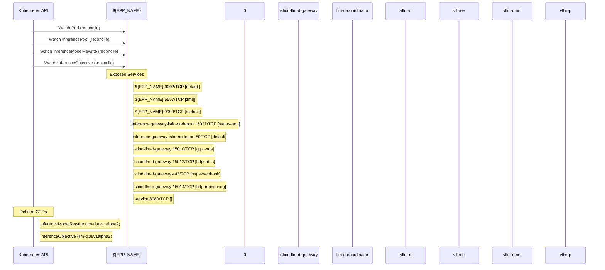

# llm-d-inference-scheduler: Dataflow

## Controller Watches

Kubernetes resources this controller monitors for changes. Each watch triggers reconciliation when the watched resource is created, updated, or deleted.

| Type | GVK | Source |
|------|-----|--------|
| For | /v1/Pod | [`pkg/epp/controller/pod_reconciler.go:91`](https://github.com/llm-d/llm-d-inference-scheduler/blob/4b77d9f2ba3b316abb610deac779ca0303d313d6/pkg/epp/controller/pod_reconciler.go#L91) |
| For | api/v1/InferencePool | [`pkg/epp/controller/inferencepool_reconciler.go:80`](https://github.com/llm-d/llm-d-inference-scheduler/blob/4b77d9f2ba3b316abb610deac779ca0303d313d6/pkg/epp/controller/inferencepool_reconciler.go#L80) |
| For | apix/v1alpha2/InferenceModelRewrite | [`pkg/epp/controller/inferencemodelrewrite_reconciler.go:82`](https://github.com/llm-d/llm-d-inference-scheduler/blob/4b77d9f2ba3b316abb610deac779ca0303d313d6/pkg/epp/controller/inferencemodelrewrite_reconciler.go#L82) |
| For | apix/v1alpha2/InferenceObjective | [`pkg/epp/controller/inferenceobjective_reconciler.go:99`](https://github.com/llm-d/llm-d-inference-scheduler/blob/4b77d9f2ba3b316abb610deac779ca0303d313d6/pkg/epp/controller/inferenceobjective_reconciler.go#L99) |

## Reconciliation Flow

How the controller interacts with the Kubernetes API during reconciliation.

```mermaid
sequenceDiagram
    %% Static dataflow for llm-d-inference-scheduler

    participant KubernetesAPI as Kubernetes API
    participant n___EPP_NAME_ as ${EPP_NAME}
    participant n_0 as 0
    participant istiod_llm_d_gateway as istiod-llm-d-gateway
    participant llm_d_coordinator as llm-d-coordinator
    participant vllm_d as vllm-d
    participant vllm_e as vllm-e
    participant vllm_omni as vllm-omni
    participant vllm_p as vllm-p

    KubernetesAPI->>+n___EPP_NAME_: Watch Pod (reconcile)
    KubernetesAPI->>+n___EPP_NAME_: Watch InferencePool (reconcile)
    KubernetesAPI->>+n___EPP_NAME_: Watch InferenceModelRewrite (reconcile)
    KubernetesAPI->>+n___EPP_NAME_: Watch InferenceObjective (reconcile)

    Note over n___EPP_NAME_: Exposed Services
    Note right of n___EPP_NAME_: ${EPP_NAME}:9002/TCP [default]
    Note right of n___EPP_NAME_: ${EPP_NAME}:5557/TCP [zmq]
    Note right of n___EPP_NAME_: ${EPP_NAME}:9090/TCP [metrics]
    Note right of n___EPP_NAME_: inference-gateway-istio-nodeport:15021/TCP [status-port]
    Note right of n___EPP_NAME_: inference-gateway-istio-nodeport:80/TCP [default]
    Note right of n___EPP_NAME_: istiod-llm-d-gateway:15010/TCP [grpc-xds]
    Note right of n___EPP_NAME_: istiod-llm-d-gateway:15012/TCP [https-dns]
    Note right of n___EPP_NAME_: istiod-llm-d-gateway:443/TCP [https-webhook]
    Note right of n___EPP_NAME_: istiod-llm-d-gateway:15014/TCP [http-monitoring]
    Note right of n___EPP_NAME_: service:8080/TCP []

    Note over KubernetesAPI: Defined CRDs
    Note right of KubernetesAPI: InferenceModelRewrite (llm-d.ai/v1alpha2)
    Note right of KubernetesAPI: InferenceObjective (llm-d.ai/v1alpha2)
```

### Webhooks

| Name | Type | Path | Failure Policy | Service | Overlays | Enable Condition | Sources |
|------|------|------|----------------|---------|----------|------------------|----------|
| namespace.sidecar-injector.istio.io | mutating | /inject | Fail | llm-d-istio-system/istiod-llm-d-gateway |  |  | [`deploy/components/istio-control-plane/webhooks.yaml`](https://github.com/llm-d/llm-d-inference-scheduler/blob/4b77d9f2ba3b316abb610deac779ca0303d313d6/deploy/components/istio-control-plane/webhooks.yaml) |
| object.sidecar-injector.istio.io | mutating | /inject | Fail | llm-d-istio-system/istiod-llm-d-gateway |  |  | [`deploy/components/istio-control-plane/webhooks.yaml`](https://github.com/llm-d/llm-d-inference-scheduler/blob/4b77d9f2ba3b316abb610deac779ca0303d313d6/deploy/components/istio-control-plane/webhooks.yaml) |
| rev.namespace.sidecar-injector.istio.io | mutating | /inject | Fail | llm-d-istio-system/istiod-llm-d-gateway |  |  | [`deploy/components/istio-control-plane/webhooks.yaml`](https://github.com/llm-d/llm-d-inference-scheduler/blob/4b77d9f2ba3b316abb610deac779ca0303d313d6/deploy/components/istio-control-plane/webhooks.yaml) |
| rev.object.sidecar-injector.istio.io | mutating | /inject | Fail | llm-d-istio-system/istiod-llm-d-gateway |  |  | [`deploy/components/istio-control-plane/webhooks.yaml`](https://github.com/llm-d/llm-d-inference-scheduler/blob/4b77d9f2ba3b316abb610deac779ca0303d313d6/deploy/components/istio-control-plane/webhooks.yaml) |
| rev.validation.istio.io | validating | /validate | Ignore | llm-d-istio-system/istiod-llm-d-gateway |  |  | [`deploy/components/istio-control-plane/webhooks.yaml`](https://github.com/llm-d/llm-d-inference-scheduler/blob/4b77d9f2ba3b316abb610deac779ca0303d313d6/deploy/components/istio-control-plane/webhooks.yaml) |

### HTTP Endpoints

| Method | Path | Source |
|--------|------|--------|
| * | / | [`pkg/sidecar/proxy/proxy.go:560`](https://github.com/llm-d/llm-d-inference-scheduler/blob/4b77d9f2ba3b316abb610deac779ca0303d313d6/pkg/sidecar/proxy/proxy.go#L560) |
| * | /metrics | [`cmd/coordinator/main.go:254`](https://github.com/llm-d/llm-d-inference-scheduler/blob/4b77d9f2ba3b316abb610deac779ca0303d313d6/cmd/coordinator/main.go#L254) |
| * | /metrics | [`cmd/epp/runner/runner.go:1306`](https://github.com/llm-d/llm-d-inference-scheduler/blob/4b77d9f2ba3b316abb610deac779ca0303d313d6/cmd/epp/runner/runner.go#L1306) |
| * | /metrics | [`pkg/sidecar/proxy/dns_metrics.go:144`](https://github.com/llm-d/llm-d-inference-scheduler/blob/4b77d9f2ba3b316abb610deac779ca0303d313d6/pkg/sidecar/proxy/dns_metrics.go#L144) |
| * | GET /health | [`pkg/sidecar/proxy/proxy.go:549`](https://github.com/llm-d/llm-d-inference-scheduler/blob/4b77d9f2ba3b316abb610deac779ca0303d313d6/pkg/sidecar/proxy/proxy.go#L549) |
| * | POST  | [`pkg/sidecar/proxy/proxy.go:555`](https://github.com/llm-d/llm-d-inference-scheduler/blob/4b77d9f2ba3b316abb610deac779ca0303d313d6/pkg/sidecar/proxy/proxy.go#L555) |

## Configuration

ConfigMaps and Helm values that control this component's runtime behavior.

### ConfigMaps

| Name | Data Keys | Source |
|------|-----------|--------|
| istio-llm-d-gateway | mesh, meshNetworks | [`deploy/components/istio-control-plane/configmaps.yaml`](https://github.com/llm-d/llm-d-inference-scheduler/blob/4b77d9f2ba3b316abb610deac779ca0303d313d6/deploy/components/istio-control-plane/configmaps.yaml) |
| istio-sidecar-injector-llm-d-gateway | config, values | [`deploy/components/istio-control-plane/configmaps.yaml`](https://github.com/llm-d/llm-d-inference-scheduler/blob/4b77d9f2ba3b316abb610deac779ca0303d313d6/deploy/components/istio-control-plane/configmaps.yaml) |

### Helm

**Chart:** llm-d-router-gateway v0.0.0

