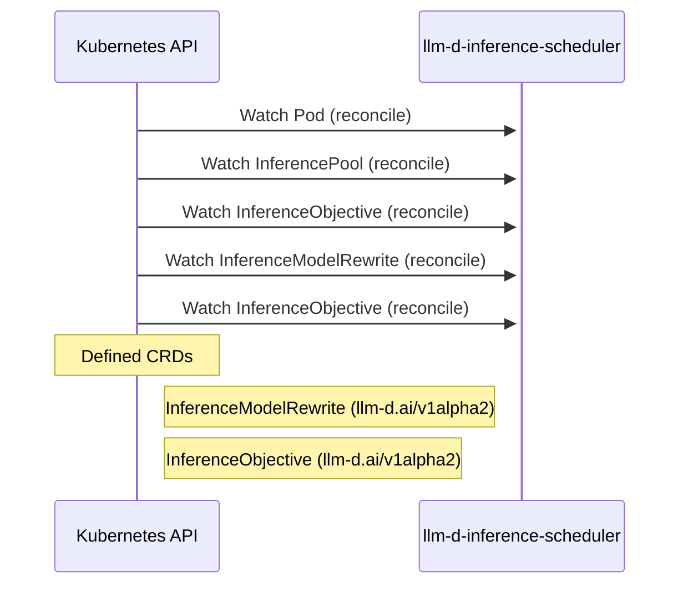

# llm-d-inference-scheduler: Dataflow

[Overview](index.md) · [Agent Context](agent-context.md) · [Extracted Data](details.md) · [Network](network.md) · [RBAC](rbac.md) · [Security](security.md) · [Dataflow](dataflow.md)

## Controller Watches

Kubernetes resources this controller monitors for changes. Each watch triggers reconciliation when the watched resource is created, updated, or deleted.

| Type | GVK | Source |
|------|-----|--------|
| For | /v1/Pod | [`pkg/epp/controller/pod_reconciler.go:91`](https://github.com/opendatahub-io/llm-d-inference-scheduler/blob/273e16edfb68fe76ebf4af0bfe981e8968ae09d4/pkg/epp/controller/pod_reconciler.go#L91) |
| For | api/v1/InferencePool | [`pkg/epp/controller/inferencepool_reconciler.go:79`](https://github.com/opendatahub-io/llm-d-inference-scheduler/blob/273e16edfb68fe76ebf4af0bfe981e8968ae09d4/pkg/epp/controller/inferencepool_reconciler.go#L79) |
| For | apix/v1/InferenceObjective | [`pkg/epp/controller/inferenceobjective_reconciler.go:170`](https://github.com/opendatahub-io/llm-d-inference-scheduler/blob/273e16edfb68fe76ebf4af0bfe981e8968ae09d4/pkg/epp/controller/inferenceobjective_reconciler.go#L170) |
| For | apix/v1alpha2/InferenceModelRewrite | [`pkg/epp/controller/inferencemodelrewrite_reconciler.go:82`](https://github.com/opendatahub-io/llm-d-inference-scheduler/blob/273e16edfb68fe76ebf4af0bfe981e8968ae09d4/pkg/epp/controller/inferencemodelrewrite_reconciler.go#L82) |
| For | apix/v1alpha2/InferenceObjective | [`pkg/epp/controller/inferenceobjective_reconciler.go:217`](https://github.com/opendatahub-io/llm-d-inference-scheduler/blob/273e16edfb68fe76ebf4af0bfe981e8968ae09d4/pkg/epp/controller/inferenceobjective_reconciler.go#L217) |

## Reconciliation Flow

How the controller interacts with the Kubernetes API during reconciliation.

```mermaid
sequenceDiagram
    %% Static dataflow for llm-d-inference-scheduler

    participant KubernetesAPI as Kubernetes API
    participant llm_d_inference_scheduler as llm-d-inference-scheduler

    KubernetesAPI->>+llm_d_inference_scheduler: Watch Pod (reconcile)
    KubernetesAPI->>+llm_d_inference_scheduler: Watch InferencePool (reconcile)
    KubernetesAPI->>+llm_d_inference_scheduler: Watch InferenceObjective (reconcile)
    KubernetesAPI->>+llm_d_inference_scheduler: Watch InferenceModelRewrite (reconcile)
    KubernetesAPI->>+llm_d_inference_scheduler: Watch InferenceObjective (reconcile)

    Note over KubernetesAPI: Defined CRDs
    Note right of KubernetesAPI: InferenceModelRewrite (llm-d.ai/v1alpha2)
    Note right of KubernetesAPI: InferenceObjective (llm-d.ai/v1alpha2)
```

### HTTP Endpoints

| Method | Path | Source |
|--------|------|--------|
| * | / | [`pkg/sidecar/proxy/proxy.go:620`](https://github.com/opendatahub-io/llm-d-inference-scheduler/blob/273e16edfb68fe76ebf4af0bfe981e8968ae09d4/pkg/sidecar/proxy/proxy.go#L620) |
| * | /metrics | [`cmd/coordinator/main.go:268`](https://github.com/opendatahub-io/llm-d-inference-scheduler/blob/273e16edfb68fe76ebf4af0bfe981e8968ae09d4/cmd/coordinator/main.go#L268) |
| * | /metrics | [`cmd/epp/runner/runner.go:1553`](https://github.com/opendatahub-io/llm-d-inference-scheduler/blob/273e16edfb68fe76ebf4af0bfe981e8968ae09d4/cmd/epp/runner/runner.go#L1553) |
| * | /metrics | [`pkg/sidecar/proxy/dns_metrics.go:147`](https://github.com/opendatahub-io/llm-d-inference-scheduler/blob/273e16edfb68fe76ebf4af0bfe981e8968ae09d4/pkg/sidecar/proxy/dns_metrics.go#L147) |
| * | GET /health | [`pkg/sidecar/proxy/proxy.go:587`](https://github.com/opendatahub-io/llm-d-inference-scheduler/blob/273e16edfb68fe76ebf4af0bfe981e8968ae09d4/pkg/sidecar/proxy/proxy.go#L587) |
| * | POST  | [`pkg/sidecar/proxy/proxy.go:592`](https://github.com/opendatahub-io/llm-d-inference-scheduler/blob/273e16edfb68fe76ebf4af0bfe981e8968ae09d4/pkg/sidecar/proxy/proxy.go#L592) |
| * | POST  | [`pkg/sidecar/proxy/proxy.go:593`](https://github.com/opendatahub-io/llm-d-inference-scheduler/blob/273e16edfb68fe76ebf4af0bfe981e8968ae09d4/pkg/sidecar/proxy/proxy.go#L593) |

## Configuration

ConfigMaps and Helm values that control this component's runtime behavior.

### Helm

**Chart:** llm-d-router-gateway v0.0.0

