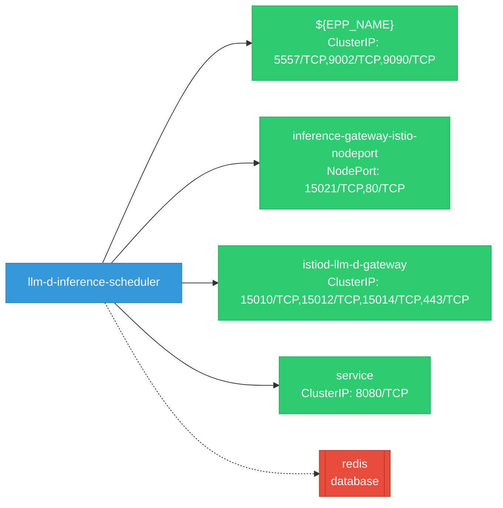

# llm-d-inference-scheduler: Network

## Service Map

### Services

| Name | Type | Ports | Source |
|------|------|-------|--------|
| ${EPP_NAME} | ClusterIP | 9002/TCP, 5557/TCP, 9090/TCP | [`deploy/components/inference-gateway/services.yaml`](https://github.com/llm-d/llm-d-inference-scheduler/blob/c0adac19e0d16adf3e36a049929ff053ccb1fa72/deploy/components/inference-gateway/services.yaml) |
| inference-gateway-istio-nodeport | NodePort | 15021/TCP, 80/TCP | [`deploy/environments/dev/base-kind-istio/services.yaml`](https://github.com/llm-d/llm-d-inference-scheduler/blob/c0adac19e0d16adf3e36a049929ff053ccb1fa72/deploy/environments/dev/base-kind-istio/services.yaml) |
| istiod-llm-d-gateway | ClusterIP | 15010/TCP, 15012/TCP, 443/TCP, 15014/TCP | [`deploy/components/istio-control-plane/services.yaml`](https://github.com/llm-d/llm-d-inference-scheduler/blob/c0adac19e0d16adf3e36a049929ff053ccb1fa72/deploy/components/istio-control-plane/services.yaml) |
| service | ClusterIP | 8080/TCP | [`deploy/environments/kubernetes-base/common/service.yaml`](https://github.com/llm-d/llm-d-inference-scheduler/blob/c0adac19e0d16adf3e36a049929ff053ccb1fa72/deploy/environments/kubernetes-base/common/service.yaml) |

### Ingress / Routing

| Kind | Name | Hosts | Paths | TLS | Source |
|------|------|-------|-------|-----|--------|
| Gateway | inference-gateway |  |  | no | [`config/manifests/gateway/agentgateway/gateway.yaml`](https://github.com/llm-d/llm-d-inference-scheduler/blob/c0adac19e0d16adf3e36a049929ff053ccb1fa72/config/manifests/gateway/agentgateway/gateway.yaml) |
| Gateway | inference-gateway |  |  | no | [`config/manifests/gateway/envoyaigateway/gateway.yaml`](https://github.com/llm-d/llm-d-inference-scheduler/blob/c0adac19e0d16adf3e36a049929ff053ccb1fa72/config/manifests/gateway/envoyaigateway/gateway.yaml) |
| Gateway | inference-gateway |  |  | no | [`config/manifests/gateway/gke/gateway.yaml`](https://github.com/llm-d/llm-d-inference-scheduler/blob/c0adac19e0d16adf3e36a049929ff053ccb1fa72/config/manifests/gateway/gke/gateway.yaml) |
| Gateway | inference-gateway |  |  | no | [`config/manifests/gateway/istio/gateway.yaml`](https://github.com/llm-d/llm-d-inference-scheduler/blob/c0adac19e0d16adf3e36a049929ff053ccb1fa72/config/manifests/gateway/istio/gateway.yaml) |
| Gateway | inference-gateway |  |  | no | [`config/manifests/gateway/nginxgatewayfabric/gateway.yaml`](https://github.com/llm-d/llm-d-inference-scheduler/blob/c0adac19e0d16adf3e36a049929ff053ccb1fa72/config/manifests/gateway/nginxgatewayfabric/gateway.yaml) |
| Gateway | inference-gateway |  |  | no | [`deploy/components/inference-gateway/gateways.yaml`](https://github.com/llm-d/llm-d-inference-scheduler/blob/c0adac19e0d16adf3e36a049929ff053ccb1fa72/deploy/components/inference-gateway/gateways.yaml) |
| HTTPRoute | ${OMNI_POOL_NAME}-audio-speech |  | /v1/audio/speech | no | [`deploy/environments/dev/multimodal-direct/httproutes.yaml`](https://github.com/llm-d/llm-d-inference-scheduler/blob/c0adac19e0d16adf3e36a049929ff053ccb1fa72/deploy/environments/dev/multimodal-direct/httproutes.yaml) |
| HTTPRoute | ${OMNI_POOL_NAME}-audio-transcriptions |  | /v1/audio/transcriptions | no | [`deploy/environments/dev/multimodal-direct/httproutes.yaml`](https://github.com/llm-d/llm-d-inference-scheduler/blob/c0adac19e0d16adf3e36a049929ff053ccb1fa72/deploy/environments/dev/multimodal-direct/httproutes.yaml) |
| HTTPRoute | ${OMNI_POOL_NAME}-images-generations |  | /v1/images/generations | no | [`deploy/environments/dev/multimodal-direct/httproutes.yaml`](https://github.com/llm-d/llm-d-inference-scheduler/blob/c0adac19e0d16adf3e36a049929ff053ccb1fa72/deploy/environments/dev/multimodal-direct/httproutes.yaml) |
| HTTPRoute | ${POOL_NAME}-inference-route |  | / | no | [`deploy/components/inference-gateway/httproutes.yaml`](https://github.com/llm-d/llm-d-inference-scheduler/blob/c0adac19e0d16adf3e36a049929ff053ccb1fa72/deploy/components/inference-gateway/httproutes.yaml) |
| Route | route |  |  | yes | [`deploy/environments/kubernetes-base/openshift/route.yaml`](https://github.com/llm-d/llm-d-inference-scheduler/blob/c0adac19e0d16adf3e36a049929ff053ccb1fa72/deploy/environments/kubernetes-base/openshift/route.yaml) |
| Route | route |  |  | no | [`deploy/environments/kubernetes-base/openshift/patch-route.yaml`](https://github.com/llm-d/llm-d-inference-scheduler/blob/c0adac19e0d16adf3e36a049929ff053ccb1fa72/deploy/environments/kubernetes-base/openshift/patch-route.yaml) |

!!! warning "No Network Policies"
    No NetworkPolicy resources were found in the analyzed sources. Network policies may exist in overlays, Helm values, or cluster-level configurations not captured by static analysis.

