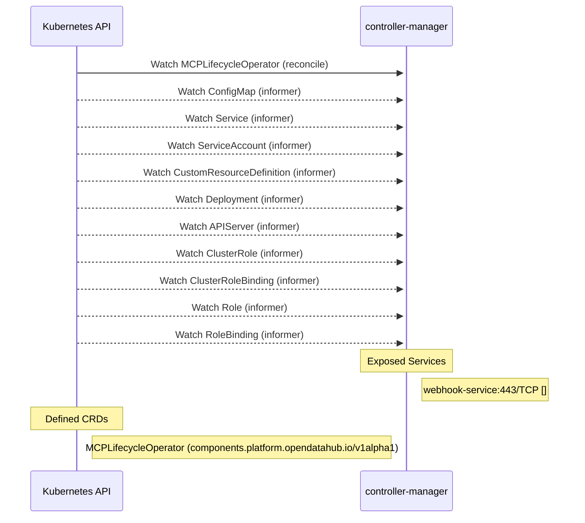

# mcp-lifecycle-module-operator: Dataflow

## Controller Watches

Kubernetes resources this controller monitors for changes. Each watch triggers reconciliation when the watched resource is created, updated, or deleted.

| Type | GVK | Source |
|------|-----|--------|
| For | api/v1alpha1/MCPLifecycleOperator | [`internal/controller/mcplifecycleoperator_reconciler.go:686`](https://github.com/opendatahub-io/mcp-lifecycle-module-operator/blob/ed1187c1c5382db14bac17ee53f5a8a1dd5dbd7d/internal/controller/mcplifecycleoperator_reconciler.go#L686) |
| Watches | /v1/ConfigMap | [`internal/controller/mcplifecycleoperator_reconciler.go:687`](https://github.com/opendatahub-io/mcp-lifecycle-module-operator/blob/ed1187c1c5382db14bac17ee53f5a8a1dd5dbd7d/internal/controller/mcplifecycleoperator_reconciler.go#L687) |
| Watches | /v1/Service | [`internal/controller/mcplifecycleoperator_reconciler.go:690`](https://github.com/opendatahub-io/mcp-lifecycle-module-operator/blob/ed1187c1c5382db14bac17ee53f5a8a1dd5dbd7d/internal/controller/mcplifecycleoperator_reconciler.go#L690) |
| Watches | /v1/ServiceAccount | [`internal/controller/mcplifecycleoperator_reconciler.go:689`](https://github.com/opendatahub-io/mcp-lifecycle-module-operator/blob/ed1187c1c5382db14bac17ee53f5a8a1dd5dbd7d/internal/controller/mcplifecycleoperator_reconciler.go#L689) |
| Watches | apiextensions.k8s.io/v1/CustomResourceDefinition | [`internal/controller/mcplifecycleoperator_reconciler.go:695`](https://github.com/opendatahub-io/mcp-lifecycle-module-operator/blob/ed1187c1c5382db14bac17ee53f5a8a1dd5dbd7d/internal/controller/mcplifecycleoperator_reconciler.go#L695) |
| Watches | apps/v1/Deployment | [`internal/controller/mcplifecycleoperator_reconciler.go:688`](https://github.com/opendatahub-io/mcp-lifecycle-module-operator/blob/ed1187c1c5382db14bac17ee53f5a8a1dd5dbd7d/internal/controller/mcplifecycleoperator_reconciler.go#L688) |
| Watches | config/v1/APIServer | [`internal/controller/mcplifecycleoperator_reconciler.go:698`](https://github.com/opendatahub-io/mcp-lifecycle-module-operator/blob/ed1187c1c5382db14bac17ee53f5a8a1dd5dbd7d/internal/controller/mcplifecycleoperator_reconciler.go#L698) |
| Watches | rbac.authorization.k8s.io/v1/ClusterRole | [`internal/controller/mcplifecycleoperator_reconciler.go:691`](https://github.com/opendatahub-io/mcp-lifecycle-module-operator/blob/ed1187c1c5382db14bac17ee53f5a8a1dd5dbd7d/internal/controller/mcplifecycleoperator_reconciler.go#L691) |
| Watches | rbac.authorization.k8s.io/v1/ClusterRoleBinding | [`internal/controller/mcplifecycleoperator_reconciler.go:692`](https://github.com/opendatahub-io/mcp-lifecycle-module-operator/blob/ed1187c1c5382db14bac17ee53f5a8a1dd5dbd7d/internal/controller/mcplifecycleoperator_reconciler.go#L692) |
| Watches | rbac.authorization.k8s.io/v1/Role | [`internal/controller/mcplifecycleoperator_reconciler.go:693`](https://github.com/opendatahub-io/mcp-lifecycle-module-operator/blob/ed1187c1c5382db14bac17ee53f5a8a1dd5dbd7d/internal/controller/mcplifecycleoperator_reconciler.go#L693) |
| Watches | rbac.authorization.k8s.io/v1/RoleBinding | [`internal/controller/mcplifecycleoperator_reconciler.go:694`](https://github.com/opendatahub-io/mcp-lifecycle-module-operator/blob/ed1187c1c5382db14bac17ee53f5a8a1dd5dbd7d/internal/controller/mcplifecycleoperator_reconciler.go#L694) |

## Reconciliation Flow

How the controller interacts with the Kubernetes API during reconciliation.

## Configuration

ConfigMaps and Helm values that control this component's runtime behavior.

