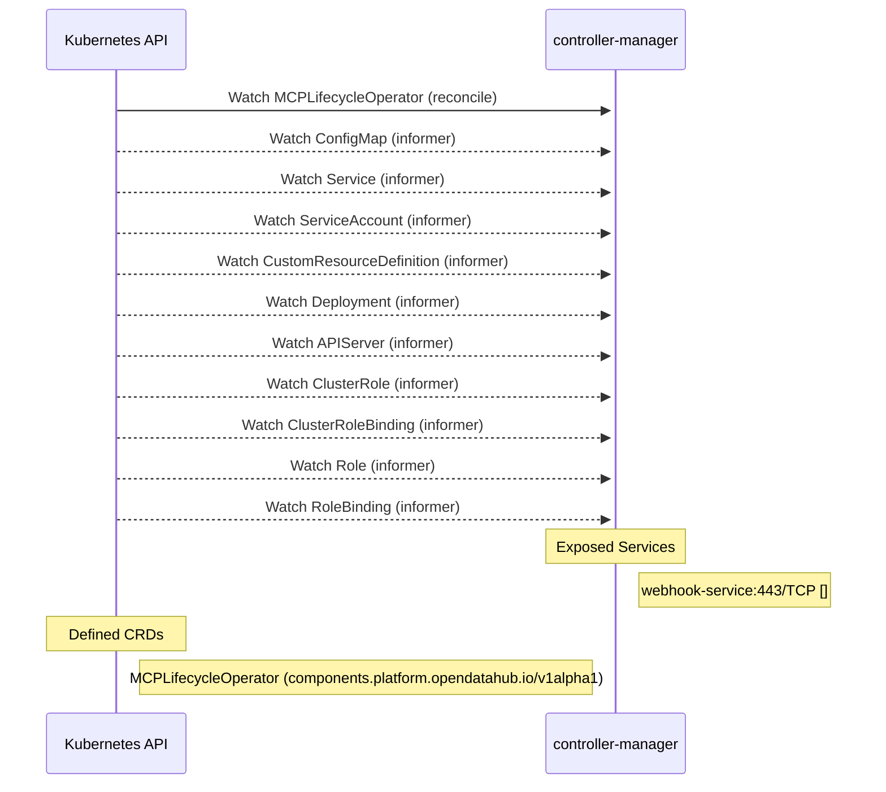

# mcp-lifecycle-module-operator: Dataflow

## Controller Watches

Kubernetes resources this controller monitors for changes. Each watch triggers reconciliation when the watched resource is created, updated, or deleted.

| Type | GVK | Source |
|------|-----|--------|
| For | api/v1alpha1/MCPLifecycleOperator | [`internal/controller/mcplifecycleoperator_reconciler.go:709`](https://github.com/opendatahub-io/mcp-lifecycle-module-operator/blob/bfacb7cefc37fc46f22209f5accd93bed36b3718/internal/controller/mcplifecycleoperator_reconciler.go#L709) |
| Watches | /v1/ConfigMap | [`internal/controller/mcplifecycleoperator_reconciler.go:710`](https://github.com/opendatahub-io/mcp-lifecycle-module-operator/blob/bfacb7cefc37fc46f22209f5accd93bed36b3718/internal/controller/mcplifecycleoperator_reconciler.go#L710) |
| Watches | /v1/Service | [`internal/controller/mcplifecycleoperator_reconciler.go:713`](https://github.com/opendatahub-io/mcp-lifecycle-module-operator/blob/bfacb7cefc37fc46f22209f5accd93bed36b3718/internal/controller/mcplifecycleoperator_reconciler.go#L713) |
| Watches | /v1/ServiceAccount | [`internal/controller/mcplifecycleoperator_reconciler.go:712`](https://github.com/opendatahub-io/mcp-lifecycle-module-operator/blob/bfacb7cefc37fc46f22209f5accd93bed36b3718/internal/controller/mcplifecycleoperator_reconciler.go#L712) |
| Watches | apiextensions.k8s.io/v1/CustomResourceDefinition | [`internal/controller/mcplifecycleoperator_reconciler.go:718`](https://github.com/opendatahub-io/mcp-lifecycle-module-operator/blob/bfacb7cefc37fc46f22209f5accd93bed36b3718/internal/controller/mcplifecycleoperator_reconciler.go#L718) |
| Watches | apps/v1/Deployment | [`internal/controller/mcplifecycleoperator_reconciler.go:711`](https://github.com/opendatahub-io/mcp-lifecycle-module-operator/blob/bfacb7cefc37fc46f22209f5accd93bed36b3718/internal/controller/mcplifecycleoperator_reconciler.go#L711) |
| Watches | config/v1/APIServer | [`internal/controller/mcplifecycleoperator_reconciler.go:721`](https://github.com/opendatahub-io/mcp-lifecycle-module-operator/blob/bfacb7cefc37fc46f22209f5accd93bed36b3718/internal/controller/mcplifecycleoperator_reconciler.go#L721) |
| Watches | rbac.authorization.k8s.io/v1/ClusterRole | [`internal/controller/mcplifecycleoperator_reconciler.go:714`](https://github.com/opendatahub-io/mcp-lifecycle-module-operator/blob/bfacb7cefc37fc46f22209f5accd93bed36b3718/internal/controller/mcplifecycleoperator_reconciler.go#L714) |
| Watches | rbac.authorization.k8s.io/v1/ClusterRoleBinding | [`internal/controller/mcplifecycleoperator_reconciler.go:715`](https://github.com/opendatahub-io/mcp-lifecycle-module-operator/blob/bfacb7cefc37fc46f22209f5accd93bed36b3718/internal/controller/mcplifecycleoperator_reconciler.go#L715) |
| Watches | rbac.authorization.k8s.io/v1/Role | [`internal/controller/mcplifecycleoperator_reconciler.go:716`](https://github.com/opendatahub-io/mcp-lifecycle-module-operator/blob/bfacb7cefc37fc46f22209f5accd93bed36b3718/internal/controller/mcplifecycleoperator_reconciler.go#L716) |
| Watches | rbac.authorization.k8s.io/v1/RoleBinding | [`internal/controller/mcplifecycleoperator_reconciler.go:717`](https://github.com/opendatahub-io/mcp-lifecycle-module-operator/blob/bfacb7cefc37fc46f22209f5accd93bed36b3718/internal/controller/mcplifecycleoperator_reconciler.go#L717) |

## Reconciliation Flow

How the controller interacts with the Kubernetes API during reconciliation.

## Configuration

ConfigMaps and Helm values that control this component's runtime behavior.

