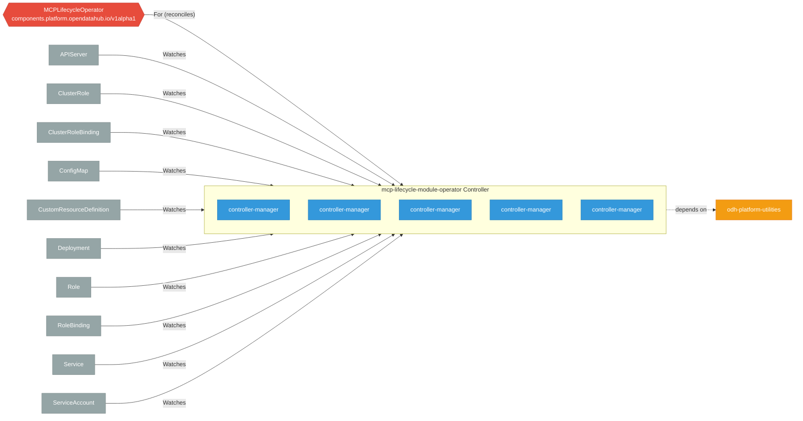

# mcp-lifecycle-module-operator

> **Architecture snapshot: 2026-10-03** (2026-10-03)

**Repository:** opendatahub-io/mcp-lifecycle-module-operator  
**Analyzer:** arch-analyzer dev  
**Extracted:** 2026-10-03T04:45:00Z

## Summary

| Metric | Count |
|--------|-------|
| CRDs | 1 |
| Deployments | 5 |
| Services | 1 |
| Secrets | 1 |
| Cluster Roles | 1 |
| Controller Watches | 11 |

## Component Architecture

CRDs, controllers, and owned Kubernetes resources.

### CRDs

| Group | Version | Kind | Scope | Fields | Validation Rules | Discovery | Source |
|-------|---------|------|-------|--------|------------------|-----------|--------|
| components.platform.opendatahub.io | v1alpha1 | MCPLifecycleOperator | Cluster | 24 | 1 | YAML | [`config/crd/bases/components.platform.opendatahub.io_mcplifecycleoperators.yaml`](https://github.com/opendatahub-io/mcp-lifecycle-module-operator/blob/ed1187c1c5382db14bac17ee53f5a8a1dd5dbd7d/config/crd/bases/components.platform.opendatahub.io_mcplifecycleoperators.yaml) |

## Dependencies

### Internal Platform Dependencies

| Component | Interaction |
|-----------|-------------|
| odh-platform-utilities | Go module dependency: github.com/opendatahub-io/odh-platform-utilities |

### Key External Dependencies

| Module | Version |
|--------|---------|
| k8s.io/api | v0.36.2 |
| k8s.io/apiextensions-apiserver | v0.36.2 |
| k8s.io/apimachinery | v0.36.2 |
| k8s.io/client-go | v0.36.2 |
| sigs.k8s.io/controller-runtime | v0.24.1 |

