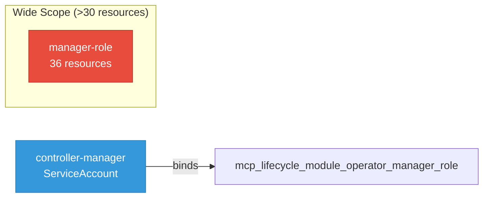

# mcp-lifecycle-module-operator: RBAC

ServiceAccount bindings, roles, and resource permissions.

## RBAC Overview

This component defines a large RBAC surface (81 diagram lines). The graph below groups roles by permission scope.

## Bindings

Subject-to-role mappings defining who has access to what.

| Binding | Type | Role | Subject |
|---------|------|------|---------|
| mcp-lifecycle-module-operator-manager-rolebinding | ClusterRoleBinding | mcp-lifecycle-module-operator-manager-role | ServiceAccount/controller-manager |

## Role Details

Per-rule breakdown of API groups, resources, and verbs for each role.

| Role | Kind | API Groups | Resources | Verbs |
|------|------|------------|-----------|-------|
| manager-role | ClusterRole |  |  | get |
| manager-role | ClusterRole |  | configmaps, namespaces, serviceaccounts, services | create, delete, get, list, patch, update, watch |
| manager-role | ClusterRole |  | pods, secrets | get, list, watch |
| manager-role | ClusterRole |  | events | create, patch |
| manager-role | ClusterRole |  | validatingwebhookconfigurations | create, delete, get, list, patch, update, watch |
| manager-role | ClusterRole |  | customresourcedefinitions | create, delete, get, list, patch, update, watch |
| manager-role | ClusterRole |  | deployments | create, delete, get, list, patch, update, watch |
| manager-role | ClusterRole |  | tokenreviews | create |
| manager-role | ClusterRole |  | subjectaccessreviews | create |
| manager-role | ClusterRole |  | certificates, issuers | create, delete, get, list, patch, update, watch |
| manager-role | ClusterRole |  | mcplifecycleoperators | create, delete, get, list, patch, update, watch |
| manager-role | ClusterRole |  | mcplifecycleoperators/finalizers | update |
| manager-role | ClusterRole |  | mcplifecycleoperators/status | get, patch, update |
| manager-role | ClusterRole |  | apiservers | get, list, watch |
| manager-role | ClusterRole |  | leases | create, delete, get, list, patch, update, watch |
| manager-role | ClusterRole |  | gateways | get, list, watch |
| manager-role | ClusterRole |  | httproutes | create, delete, get, list, patch, update, watch |
| manager-role | ClusterRole |  | mcpgatewayextensions | get, list, watch |
| manager-role | ClusterRole |  | mcpserverregistrations | create, delete, get, list, patch, update, watch |
| manager-role | ClusterRole |  | mcpgatewaybindings, mcpservers | create, delete, deletecollection, get, list, patch, update, watch |
| manager-role | ClusterRole |  | mcpgatewaybindings/finalizers, mcpservers/finalizers | update |
| manager-role | ClusterRole |  | mcpgatewaybindings/status, mcpservers/status | get, patch, update |
| manager-role | ClusterRole |  | storageversionmigrations | create, delete, get |
| manager-role | ClusterRole |  | servicemonitors | create, delete, get, list, patch, update, watch |
| manager-role | ClusterRole |  | networkpolicies | create, delete, get, list, patch, update, watch |
| manager-role | ClusterRole |  | clusterrolebindings, clusterroles, rolebindings, roles | create, delete, get, list, patch, update, watch |

