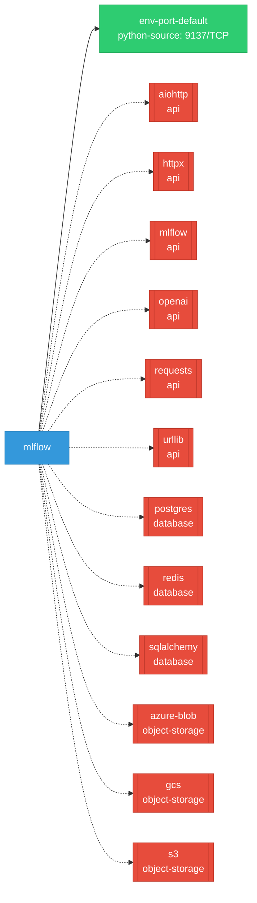

# mlflow: Network

## Service Map

### Services

| Name | Type | Ports | Source |
|------|------|-------|--------|
| env-port-default | python-source | 9137/TCP | [`dev/benchmarks/gateway/fake_server.py:66`](https://github.com/opendatahub-io/mlflow/blob/218c92d73cd0dc5d06cc6604f97ed92d22fc9591/dev/benchmarks/gateway/fake_server.py#L66) |

!!! warning "No Network Policies"
    No NetworkPolicy resources were found in the analyzed sources. Network policies may exist in overlays, Helm values, or cluster-level configurations not captured by static analysis.

