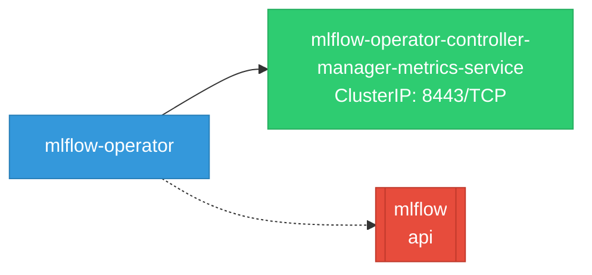
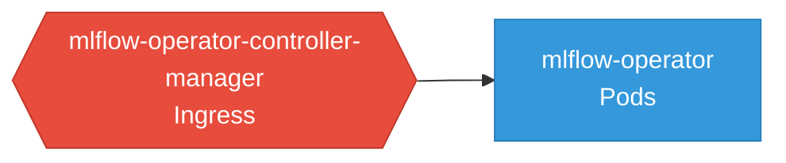

# mlflow-operator: Network

## Service Map

### Services

| Name | Type | Ports | Source |
|------|------|-------|--------|
| mlflow-operator-controller-manager-metrics-service | ClusterIP | 8443/TCP | [`kustomize:config/overlays/odh`](https://github.com/opendatahub-io/mlflow-operator/blob/6df31b94f07284e6e0465e174e3b0c039d219726/kustomize:config/overlays/odh) |

### Ingress / Routing

| Kind | Name | Hosts | Paths | TLS | Source |
|------|------|-------|-------|-----|--------|
| HTTPRoute | rbac-inferred |  |  | no | [`rbac/manager-role`](https://github.com/opendatahub-io/mlflow-operator/blob/6df31b94f07284e6e0465e174e3b0c039d219726/rbac/manager-role) |

### Network Policies

| Name | Policy Types | Source |
|------|-------------|--------|
| mlflow-operator-controller-manager | Ingress | [`kustomize:config/overlays/odh`](https://github.com/opendatahub-io/mlflow-operator/blob/6df31b94f07284e6e0465e174e3b0c039d219726/kustomize:config/overlays/odh) |

## Network Policy Graph

Visual representation of NetworkPolicy rules. Ingress rules show what traffic is allowed into pods, egress rules show what traffic is allowed out.

