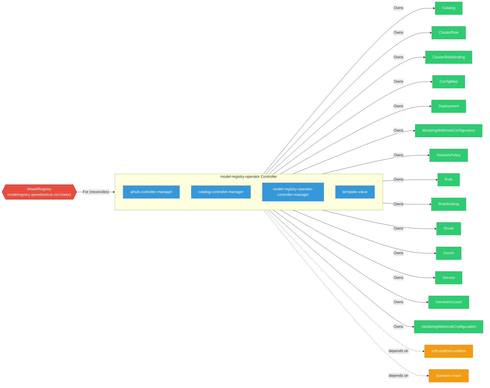

# model-registry-operator

> **Architecture snapshot: 2026-09-07** (2026-09-07)

**Repository:** opendatahub-io/model-registry-operator  
**Analyzer:** arch-analyzer dev  
**Extracted:** 2026-09-07T03:56:48Z

## Summary

| Metric | Count |
|--------|-------|
| CRDs | 1 |
| Deployments | 4 |
| Services | 5 |
| Secrets | 4 |
| Cluster Roles | 6 |
| Controller Watches | 30 |

## Component Architecture

CRDs, controllers, and owned Kubernetes resources.

### CRDs

| Group | Version | Kind | Scope | Fields | Validation Rules | Discovery | Source |
|-------|---------|------|-------|--------|------------------|-----------|--------|
| modelregistry.opendatahub.io | v1beta1 | ModelRegistry | Namespaced | 113 | 6 | YAML | [`config/crd/bases/modelregistry.opendatahub.io_modelregistries.yaml`](https://github.com/opendatahub-io/model-registry-operator/blob/655e3f2fe563582cb56b8a603c852325f70c51c5/config/crd/bases/modelregistry.opendatahub.io_modelregistries.yaml) |

## Dependencies

### Internal Platform Dependencies

| Component | Interaction |
|-----------|-------------|
| odh-platform-utilities | Go module dependency: github.com/opendatahub-io/odh-platform-utilities |
| operator-chaos | Go module dependency: github.com/opendatahub-io/operator-chaos |

### Key External Dependencies

| Module | Version |
|--------|---------|
| github.com/go-logr/logr | v1.4.4 |
| k8s.io/api | v0.37.0 |
| k8s.io/apiextensions-apiserver | v0.37.0 |
| k8s.io/apimachinery | v0.37.0 |
| k8s.io/client-go | v0.37.0 |
| sigs.k8s.io/controller-runtime | v0.24.1 |

