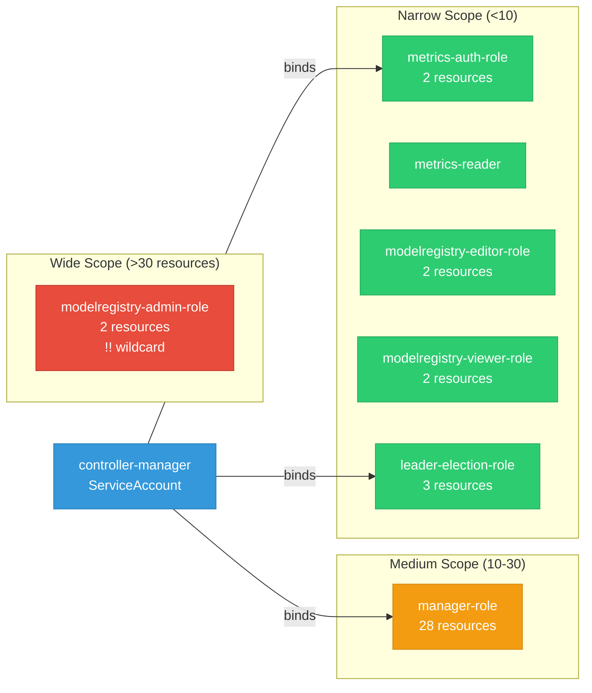

# model-registry-operator: RBAC

ServiceAccount bindings, roles, and resource permissions.

## RBAC Overview

This component defines a large RBAC surface (95 diagram lines). The graph below groups roles by permission scope.

## Bindings

Subject-to-role mappings defining who has access to what.

| Binding | Type | Role | Subject |
|---------|------|------|---------|
| manager-rolebinding | ClusterRoleBinding | manager-role | ServiceAccount/controller-manager |
| metrics-auth-rolebinding | ClusterRoleBinding | metrics-auth-role | ServiceAccount/controller-manager |
| leader-election-rolebinding | RoleBinding | leader-election-role | ServiceAccount/controller-manager |

## Role Details

Per-rule breakdown of API groups, resources, and verbs for each role.

| Role | Kind | API Groups | Resources | Verbs |
|------|------|------------|-----------|-------|
| manager-role | ClusterRole |  | configmaps, persistentvolumeclaims, secrets, serviceaccounts, services | create, delete, get, list, patch, update, watch |
| manager-role | ClusterRole |  | endpoints, pods, pods/log | get, list, watch |
| manager-role | ClusterRole |  | events | create, patch |
| manager-role | ClusterRole |  | customresourcedefinitions | get, list, watch |
| manager-role | ClusterRole |  | deployments | create, delete, get, list, patch, update, watch |
| manager-role | ClusterRole |  | tokenreviews | create |
| manager-role | ClusterRole |  | subjectaccessreviews | create |
| manager-role | ClusterRole |  | modelregistries | get, list, watch |
| manager-role | ClusterRole |  | httproutes | create, delete, get, list, patch, update, watch |
| manager-role | ClusterRole |  | referencegrants | create, get, list, watch |
| manager-role | ClusterRole |  | storageversionmigrations | create, delete, get, list, patch, update, watch |
| manager-role | ClusterRole |  | modelregistries | create, delete, get, list, patch, update, watch |
| manager-role | ClusterRole |  | modelregistries/finalizers | update |
| manager-role | ClusterRole |  | modelregistries/status | get, patch, update |
| manager-role | ClusterRole |  | networkpolicies | create, delete, get, list, patch, update, watch |
| manager-role | ClusterRole |  | clusterrolebindings, rolebindings, roles | create, delete, get, list, patch, update, watch |
| manager-role | ClusterRole |  | routes, routes/custom-host | create, delete, get, list, patch, update, watch |
| manager-role | ClusterRole |  | auths | get, list, watch |
| manager-role | ClusterRole |  | groups | create, delete, get, list, update, watch |
| metrics-auth-role | ClusterRole |  | tokenreviews | create |
| metrics-auth-role | ClusterRole |  | subjectaccessreviews | create |
| metrics-reader | ClusterRole |  |  | get |
| modelregistry-admin-role | ClusterRole |  | modelregistries | * |
| modelregistry-admin-role | ClusterRole |  | modelregistries/status | get |
| modelregistry-editor-role | ClusterRole |  | modelregistries | create, delete, get, list, patch, update, watch |
| modelregistry-editor-role | ClusterRole |  | modelregistries/status | get |
| modelregistry-viewer-role | ClusterRole |  | modelregistries | get, list, watch |
| modelregistry-viewer-role | ClusterRole |  | modelregistries/status | get |
| leader-election-role | Role |  | configmaps | get, list, watch, create, update, patch, delete |
| leader-election-role | Role |  | leases | get, list, watch, create, update, patch, delete |
| leader-election-role | Role |  | events | create, patch |

