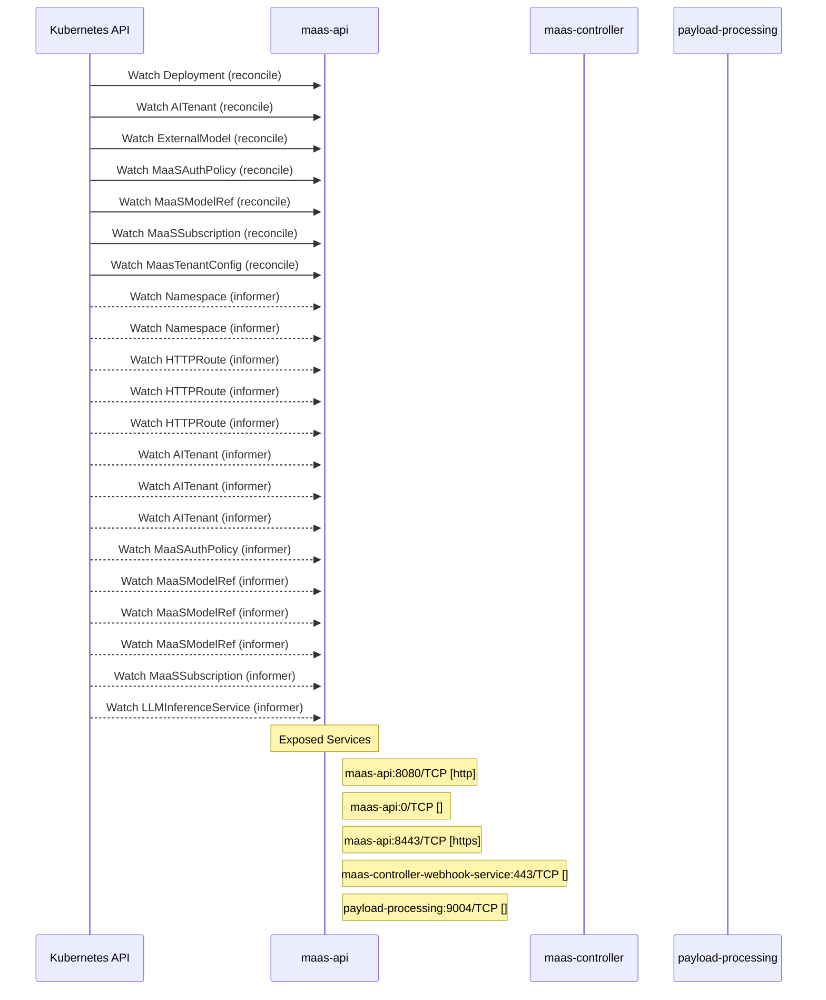

# models-as-a-service: Dataflow

## Controller Watches

Kubernetes resources this controller monitors for changes. Each watch triggers reconciliation when the watched resource is created, updated, or deleted.

| Type | GVK | Source |
|------|-----|--------|
| For | apps/v1/Deployment | [`maas-controller/pkg/controller/maas/self_deployment_controller.go:1030`](https://github.com/opendatahub-io/models-as-a-service/blob/14a17015864b01735eec4fa9c9fe7fbc0008de9e/maas-controller/pkg/controller/maas/self_deployment_controller.go#L1030) |
| For | maas/v1alpha1/AITenant | [`maas-controller/pkg/controller/maas/aitenant_controller.go:285`](https://github.com/opendatahub-io/models-as-a-service/blob/14a17015864b01735eec4fa9c9fe7fbc0008de9e/maas-controller/pkg/controller/maas/aitenant_controller.go#L285) |
| For | maas/v1alpha1/ExternalModel | [`maas-controller/pkg/reconciler/externalmodel/reconciler.go:438`](https://github.com/opendatahub-io/models-as-a-service/blob/14a17015864b01735eec4fa9c9fe7fbc0008de9e/maas-controller/pkg/reconciler/externalmodel/reconciler.go#L438) |
| For | maas/v1alpha1/MaaSAuthPolicy | [`maas-controller/pkg/controller/maas/maasauthpolicy_controller.go:1914`](https://github.com/opendatahub-io/models-as-a-service/blob/14a17015864b01735eec4fa9c9fe7fbc0008de9e/maas-controller/pkg/controller/maas/maasauthpolicy_controller.go#L1914) |
| For | maas/v1alpha1/MaaSModelRef | [`maas-controller/pkg/controller/maas/maasmodelref_controller.go:546`](https://github.com/opendatahub-io/models-as-a-service/blob/14a17015864b01735eec4fa9c9fe7fbc0008de9e/maas-controller/pkg/controller/maas/maasmodelref_controller.go#L546) |
| For | maas/v1alpha1/MaaSSubscription | [`maas-controller/pkg/controller/maas/maassubscription_controller.go:1076`](https://github.com/opendatahub-io/models-as-a-service/blob/14a17015864b01735eec4fa9c9fe7fbc0008de9e/maas-controller/pkg/controller/maas/maassubscription_controller.go#L1076) |
| For | maas/v1alpha1/MaasTenantConfig | [`maas-controller/pkg/controller/maas/tenant_controller.go:229`](https://github.com/opendatahub-io/models-as-a-service/blob/14a17015864b01735eec4fa9c9fe7fbc0008de9e/maas-controller/pkg/controller/maas/tenant_controller.go#L229) |
| Watches | /v1/Namespace | [`maas-controller/pkg/controller/maas/maasauthpolicy_controller.go:1958`](https://github.com/opendatahub-io/models-as-a-service/blob/14a17015864b01735eec4fa9c9fe7fbc0008de9e/maas-controller/pkg/controller/maas/maasauthpolicy_controller.go#L1958) |
| Watches | /v1/Namespace | [`maas-controller/pkg/controller/maas/maassubscription_controller.go:1122`](https://github.com/opendatahub-io/models-as-a-service/blob/14a17015864b01735eec4fa9c9fe7fbc0008de9e/maas-controller/pkg/controller/maas/maassubscription_controller.go#L1122) |
| Watches | apis/v1/HTTPRoute | [`maas-controller/pkg/controller/maas/maasauthpolicy_controller.go:1920`](https://github.com/opendatahub-io/models-as-a-service/blob/14a17015864b01735eec4fa9c9fe7fbc0008de9e/maas-controller/pkg/controller/maas/maasauthpolicy_controller.go#L1920) |
| Watches | apis/v1/HTTPRoute | [`maas-controller/pkg/controller/maas/maasmodelref_controller.go:552`](https://github.com/opendatahub-io/models-as-a-service/blob/14a17015864b01735eec4fa9c9fe7fbc0008de9e/maas-controller/pkg/controller/maas/maasmodelref_controller.go#L552) |
| Watches | apis/v1/HTTPRoute | [`maas-controller/pkg/controller/maas/maassubscription_controller.go:1089`](https://github.com/opendatahub-io/models-as-a-service/blob/14a17015864b01735eec4fa9c9fe7fbc0008de9e/maas-controller/pkg/controller/maas/maassubscription_controller.go#L1089) |
| Watches | maas/v1alpha1/AITenant | [`maas-controller/pkg/controller/maas/maasauthpolicy_controller.go:1934`](https://github.com/opendatahub-io/models-as-a-service/blob/14a17015864b01735eec4fa9c9fe7fbc0008de9e/maas-controller/pkg/controller/maas/maasauthpolicy_controller.go#L1934) |
| Watches | maas/v1alpha1/AITenant | [`maas-controller/pkg/controller/maas/maasmodelref_controller.go:610`](https://github.com/opendatahub-io/models-as-a-service/blob/14a17015864b01735eec4fa9c9fe7fbc0008de9e/maas-controller/pkg/controller/maas/maasmodelref_controller.go#L610) |
| Watches | maas/v1alpha1/AITenant | [`maas-controller/pkg/controller/maas/maassubscription_controller.go:1098`](https://github.com/opendatahub-io/models-as-a-service/blob/14a17015864b01735eec4fa9c9fe7fbc0008de9e/maas-controller/pkg/controller/maas/maassubscription_controller.go#L1098) |
| Watches | maas/v1alpha1/MaaSAuthPolicy | [`maas-controller/pkg/controller/maas/maasmodelref_controller.go:604`](https://github.com/opendatahub-io/models-as-a-service/blob/14a17015864b01735eec4fa9c9fe7fbc0008de9e/maas-controller/pkg/controller/maas/maasmodelref_controller.go#L604) |
| Watches | maas/v1alpha1/MaaSModelRef | [`maas-controller/pkg/controller/maas/maassubscription_controller.go:1093`](https://github.com/opendatahub-io/models-as-a-service/blob/14a17015864b01735eec4fa9c9fe7fbc0008de9e/maas-controller/pkg/controller/maas/maassubscription_controller.go#L1093) |
| Watches | maas/v1alpha1/MaaSModelRef | [`maas-controller/pkg/controller/maas/maasmodelref_controller.go:562`](https://github.com/opendatahub-io/models-as-a-service/blob/14a17015864b01735eec4fa9c9fe7fbc0008de9e/maas-controller/pkg/controller/maas/maasmodelref_controller.go#L562) |
| Watches | maas/v1alpha1/MaaSModelRef | [`maas-controller/pkg/controller/maas/maasauthpolicy_controller.go:1924`](https://github.com/opendatahub-io/models-as-a-service/blob/14a17015864b01735eec4fa9c9fe7fbc0008de9e/maas-controller/pkg/controller/maas/maasauthpolicy_controller.go#L1924) |
| Watches | maas/v1alpha1/MaaSSubscription | [`maas-controller/pkg/controller/maas/maasmodelref_controller.go:600`](https://github.com/opendatahub-io/models-as-a-service/blob/14a17015864b01735eec4fa9c9fe7fbc0008de9e/maas-controller/pkg/controller/maas/maasmodelref_controller.go#L600) |
| Watches | serving/v1alpha2/LLMInferenceService | [`maas-controller/pkg/controller/maas/maasmodelref_controller.go:588`](https://github.com/opendatahub-io/models-as-a-service/blob/14a17015864b01735eec4fa9c9fe7fbc0008de9e/maas-controller/pkg/controller/maas/maasmodelref_controller.go#L588) |

## Reconciliation Flow

How the controller interacts with the Kubernetes API during reconciliation.

### Webhooks

| Name | Type | Path | Failure Policy | Service | Overlays | Enable Condition | Sources |
|------|------|------|----------------|---------|----------|------------------|----------|
| vaitenant.kb.io | validating | /validate-maas-opendatahub-io-v1alpha1-aitenant | Fail | system/maas-controller-webhook-service |  |  | [`deployment/base/maas-controller/webhook/validating_webhook_configuration.yaml`](https://github.com/opendatahub-io/models-as-a-service/blob/14a17015864b01735eec4fa9c9fe7fbc0008de9e/deployment/base/maas-controller/webhook/validating_webhook_configuration.yaml) |
| vmaasauthpolicy.kb.io | validating | /validate-maas-opendatahub-io-v1alpha1-maasauthpolicy | Fail | system/maas-controller-webhook-service |  |  | [`deployment/base/maas-controller/webhook/validating_webhook_configuration.yaml`](https://github.com/opendatahub-io/models-as-a-service/blob/14a17015864b01735eec4fa9c9fe7fbc0008de9e/deployment/base/maas-controller/webhook/validating_webhook_configuration.yaml) |
| vmaasmodelref.kb.io | validating | /validate-maas-opendatahub-io-v1alpha1-maasmodelref | Fail | system/maas-controller-webhook-service |  |  | [`deployment/base/maas-controller/webhook/validating_webhook_configuration.yaml`](https://github.com/opendatahub-io/models-as-a-service/blob/14a17015864b01735eec4fa9c9fe7fbc0008de9e/deployment/base/maas-controller/webhook/validating_webhook_configuration.yaml) |
| vmaassubscription.kb.io | validating | /validate-maas-opendatahub-io-v1alpha1-maassubscription | Fail | system/maas-controller-webhook-service |  |  | [`deployment/base/maas-controller/webhook/validating_webhook_configuration.yaml`](https://github.com/opendatahub-io/models-as-a-service/blob/14a17015864b01735eec4fa9c9fe7fbc0008de9e/deployment/base/maas-controller/webhook/validating_webhook_configuration.yaml) |

### HTTP Endpoints

| Method | Path | Source |
|--------|------|--------|
| OPTIONS | /*path | [`maas-api/cmd/main.go:169`](https://github.com/opendatahub-io/models-as-a-service/blob/14a17015864b01735eec4fa9c9fe7fbc0008de9e/maas-api/cmd/main.go#L169) |
| DELETE | /:id | [`maas-api/cmd/main.go:312`](https://github.com/opendatahub-io/models-as-a-service/blob/14a17015864b01735eec4fa9c9fe7fbc0008de9e/maas-api/cmd/main.go#L312) |
| GET | /:id | [`maas-api/cmd/main.go:311`](https://github.com/opendatahub-io/models-as-a-service/blob/14a17015864b01735eec4fa9c9fe7fbc0008de9e/maas-api/cmd/main.go#L311) |
| * | /api-keys | [`maas-api/cmd/main.go:307`](https://github.com/opendatahub-io/models-as-a-service/blob/14a17015864b01735eec4fa9c9fe7fbc0008de9e/maas-api/cmd/main.go#L307) |
| POST | /api-keys/cleanup | [`maas-api/cmd/main.go:326`](https://github.com/opendatahub-io/models-as-a-service/blob/14a17015864b01735eec4fa9c9fe7fbc0008de9e/maas-api/cmd/main.go#L326) |
| POST | /api-keys/search | [`maas-api/cmd/main.go:315`](https://github.com/opendatahub-io/models-as-a-service/blob/14a17015864b01735eec4fa9c9fe7fbc0008de9e/maas-api/cmd/main.go#L315) |
| POST | /api-keys/validate | [`maas-api/cmd/main.go:325`](https://github.com/opendatahub-io/models-as-a-service/blob/14a17015864b01735eec4fa9c9fe7fbc0008de9e/maas-api/cmd/main.go#L325) |
| POST | /bulk-revoke | [`maas-api/cmd/main.go:310`](https://github.com/opendatahub-io/models-as-a-service/blob/14a17015864b01735eec4fa9c9fe7fbc0008de9e/maas-api/cmd/main.go#L310) |
| GET | /config | [`maas-api/cmd/main.go:308`](https://github.com/opendatahub-io/models-as-a-service/blob/14a17015864b01735eec4fa9c9fe7fbc0008de9e/maas-api/cmd/main.go#L308) |
| GET | /health | [`maas-api/cmd/main.go:248`](https://github.com/opendatahub-io/models-as-a-service/blob/14a17015864b01735eec4fa9c9fe7fbc0008de9e/maas-api/cmd/main.go#L248) |
| * | /internal/v1 | [`maas-api/cmd/main.go:324`](https://github.com/opendatahub-io/models-as-a-service/blob/14a17015864b01735eec4fa9c9fe7fbc0008de9e/maas-api/cmd/main.go#L324) |
| * | /metrics | [`maas-api/internal/metrics/server.go:86`](https://github.com/opendatahub-io/models-as-a-service/blob/14a17015864b01735eec4fa9c9fe7fbc0008de9e/maas-api/internal/metrics/server.go#L86) |
| GET | /model/:model-id/subscriptions | [`maas-api/cmd/main.go:300`](https://github.com/opendatahub-io/models-as-a-service/blob/14a17015864b01735eec4fa9c9fe7fbc0008de9e/maas-api/cmd/main.go#L300) |
| GET | /models | [`maas-api/cmd/main.go:295`](https://github.com/opendatahub-io/models-as-a-service/blob/14a17015864b01735eec4fa9c9fe7fbc0008de9e/maas-api/cmd/main.go#L295) |
| GET | /subscriptions | [`maas-api/cmd/main.go:299`](https://github.com/opendatahub-io/models-as-a-service/blob/14a17015864b01735eec4fa9c9fe7fbc0008de9e/maas-api/cmd/main.go#L299) |
| POST | /subscriptions/select | [`maas-api/cmd/main.go:328`](https://github.com/opendatahub-io/models-as-a-service/blob/14a17015864b01735eec4fa9c9fe7fbc0008de9e/maas-api/cmd/main.go#L328) |
| GET | /tenants | [`maas-api/cmd/main.go:319`](https://github.com/opendatahub-io/models-as-a-service/blob/14a17015864b01735eec4fa9c9fe7fbc0008de9e/maas-api/cmd/main.go#L319) |
| DELETE | /tenants/:tenant/api-keys | [`maas-api/cmd/main.go:327`](https://github.com/opendatahub-io/models-as-a-service/blob/14a17015864b01735eec4fa9c9fe7fbc0008de9e/maas-api/cmd/main.go#L327) |
| * | /v1 | [`maas-api/cmd/main.go:256`](https://github.com/opendatahub-io/models-as-a-service/blob/14a17015864b01735eec4fa9c9fe7fbc0008de9e/maas-api/cmd/main.go#L256) |

## Configuration

ConfigMaps and Helm values that control this component's runtime behavior.

