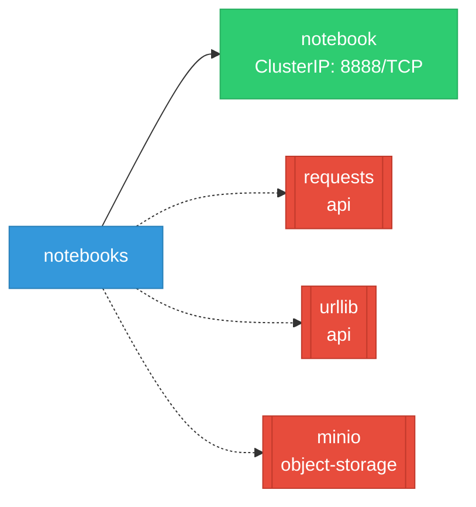

# notebooks: Network

## Service Map

*1 unique services (9 total, duplicates from test fixtures collapsed).*

### Services

| Name | Type | Ports | Source |
|------|------|-------|--------|
| notebook | ClusterIP | 8888/TCP | [`jupyter/baseline/ubi9-python-3.12/kustomize/base/service.yaml`](https://github.com/opendatahub-io/notebooks/blob/9ba54dc738b06c12d8844cc62771b4c2cc1e2d42/jupyter/baseline/ubi9-python-3.12/kustomize/base/service.yaml) |
| notebook | ClusterIP | 8888/TCP | [`jupyter/datascience/ubi9-python-3.12/kustomize/base/service.yaml`](https://github.com/opendatahub-io/notebooks/blob/9ba54dc738b06c12d8844cc62771b4c2cc1e2d42/jupyter/datascience/ubi9-python-3.12/kustomize/base/service.yaml) |
| notebook | ClusterIP | 8888/TCP | [`jupyter/minimal/ubi9-python-3.12/kustomize/base/service.yaml`](https://github.com/opendatahub-io/notebooks/blob/9ba54dc738b06c12d8844cc62771b4c2cc1e2d42/jupyter/minimal/ubi9-python-3.12/kustomize/base/service.yaml) |
| notebook | ClusterIP | 8888/TCP | [`jupyter/pytorch/ubi9-python-3.12/kustomize/base/service.yaml`](https://github.com/opendatahub-io/notebooks/blob/9ba54dc738b06c12d8844cc62771b4c2cc1e2d42/jupyter/pytorch/ubi9-python-3.12/kustomize/base/service.yaml) |
| notebook | ClusterIP | 8888/TCP | [`jupyter/pytorch+llmcompressor/ubi9-python-3.12/kustomize/base/service.yaml`](https://github.com/opendatahub-io/notebooks/blob/9ba54dc738b06c12d8844cc62771b4c2cc1e2d42/jupyter/pytorch+llmcompressor/ubi9-python-3.12/kustomize/base/service.yaml) |
| notebook | ClusterIP | 8888/TCP | [`jupyter/rocm/pytorch/ubi9-python-3.12/kustomize/base/service.yaml`](https://github.com/opendatahub-io/notebooks/blob/9ba54dc738b06c12d8844cc62771b4c2cc1e2d42/jupyter/rocm/pytorch/ubi9-python-3.12/kustomize/base/service.yaml) |
| notebook | ClusterIP | 8888/TCP | [`jupyter/rocm/tensorflow/ubi9-python-3.12/kustomize/base/service.yaml`](https://github.com/opendatahub-io/notebooks/blob/9ba54dc738b06c12d8844cc62771b4c2cc1e2d42/jupyter/rocm/tensorflow/ubi9-python-3.12/kustomize/base/service.yaml) |
| notebook | ClusterIP | 8888/TCP | [`jupyter/tensorflow/ubi9-python-3.12/kustomize/base/service.yaml`](https://github.com/opendatahub-io/notebooks/blob/9ba54dc738b06c12d8844cc62771b4c2cc1e2d42/jupyter/tensorflow/ubi9-python-3.12/kustomize/base/service.yaml) |
| notebook | ClusterIP | 8888/TCP | [`jupyter/trustyai/ubi9-python-3.12/kustomize/base/service.yaml`](https://github.com/opendatahub-io/notebooks/blob/9ba54dc738b06c12d8844cc62771b4c2cc1e2d42/jupyter/trustyai/ubi9-python-3.12/kustomize/base/service.yaml) |

!!! warning "No Network Policies"
    No NetworkPolicy resources were found in the analyzed sources. Network policies may exist in overlays, Helm values, or cluster-level configurations not captured by static analysis.

