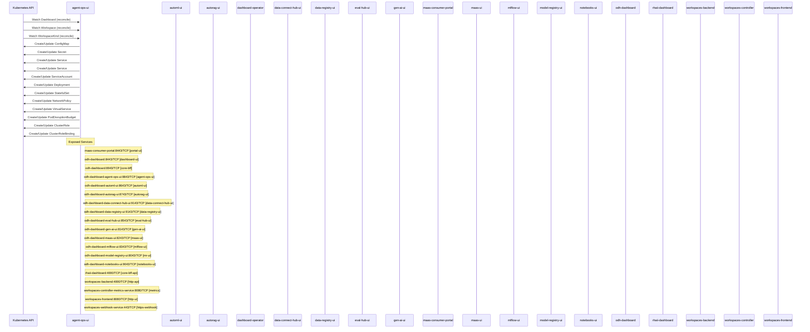

# odh-dashboard: Dataflow

## Controller Watches

Kubernetes resources this controller monitors for changes. Each watch triggers reconciliation when the watched resource is created, updated, or deleted.

| Type | GVK | Source |
|------|-----|--------|
| For | api/v1alpha1/Dashboard | [`dashboard-operator/internal/controller/dashboard_reconciler.go:1029`](https://github.com/opendatahub-io/odh-dashboard/blob/f3c2750a796db454dde96b63987b6ddae095335c/dashboard-operator/internal/controller/dashboard_reconciler.go#L1029) |
| For | api/v1beta1/Workspace | [`packages/notebooks/upstream/workspaces/controller/internal/controller/workspace_controller.go:753`](https://github.com/opendatahub-io/odh-dashboard/blob/f3c2750a796db454dde96b63987b6ddae095335c/packages/notebooks/upstream/workspaces/controller/internal/controller/workspace_controller.go#L753) |
| For | api/v1beta1/WorkspaceKind | [`packages/notebooks/upstream/workspaces/controller/internal/controller/workspacekind_controller.go:285`](https://github.com/opendatahub-io/odh-dashboard/blob/f3c2750a796db454dde96b63987b6ddae095335c/packages/notebooks/upstream/workspaces/controller/internal/controller/workspacekind_controller.go#L285) |
| Owns | /v1/ConfigMap | [`dashboard-operator/internal/controller/dashboard_reconciler.go:1032`](https://github.com/opendatahub-io/odh-dashboard/blob/f3c2750a796db454dde96b63987b6ddae095335c/dashboard-operator/internal/controller/dashboard_reconciler.go#L1032) |
| Owns | /v1/Secret | [`dashboard-operator/internal/controller/dashboard_reconciler.go:1034`](https://github.com/opendatahub-io/odh-dashboard/blob/f3c2750a796db454dde96b63987b6ddae095335c/dashboard-operator/internal/controller/dashboard_reconciler.go#L1034) |
| Owns | /v1/Service | [`packages/notebooks/upstream/workspaces/controller/internal/controller/workspace_controller.go:755`](https://github.com/opendatahub-io/odh-dashboard/blob/f3c2750a796db454dde96b63987b6ddae095335c/packages/notebooks/upstream/workspaces/controller/internal/controller/workspace_controller.go#L755) |
| Owns | /v1/Service | [`dashboard-operator/internal/controller/dashboard_reconciler.go:1031`](https://github.com/opendatahub-io/odh-dashboard/blob/f3c2750a796db454dde96b63987b6ddae095335c/dashboard-operator/internal/controller/dashboard_reconciler.go#L1031) |
| Owns | /v1/ServiceAccount | [`dashboard-operator/internal/controller/dashboard_reconciler.go:1033`](https://github.com/opendatahub-io/odh-dashboard/blob/f3c2750a796db454dde96b63987b6ddae095335c/dashboard-operator/internal/controller/dashboard_reconciler.go#L1033) |
| Owns | apps/v1/Deployment | [`dashboard-operator/internal/controller/dashboard_reconciler.go:1030`](https://github.com/opendatahub-io/odh-dashboard/blob/f3c2750a796db454dde96b63987b6ddae095335c/dashboard-operator/internal/controller/dashboard_reconciler.go#L1030) |
| Owns | apps/v1/StatefulSet | [`packages/notebooks/upstream/workspaces/controller/internal/controller/workspace_controller.go:754`](https://github.com/opendatahub-io/odh-dashboard/blob/f3c2750a796db454dde96b63987b6ddae095335c/packages/notebooks/upstream/workspaces/controller/internal/controller/workspace_controller.go#L754) |
| Owns | networking.k8s.io/v1/NetworkPolicy | [`dashboard-operator/internal/controller/dashboard_reconciler.go:1035`](https://github.com/opendatahub-io/odh-dashboard/blob/f3c2750a796db454dde96b63987b6ddae095335c/dashboard-operator/internal/controller/dashboard_reconciler.go#L1035) |
| Owns | networking/v1/VirtualService | [`packages/notebooks/upstream/workspaces/controller/internal/controller/workspace_controller.go:758`](https://github.com/opendatahub-io/odh-dashboard/blob/f3c2750a796db454dde96b63987b6ddae095335c/packages/notebooks/upstream/workspaces/controller/internal/controller/workspace_controller.go#L758) |
| Owns | policy/v1/PodDisruptionBudget | [`dashboard-operator/internal/controller/dashboard_reconciler.go:1038`](https://github.com/opendatahub-io/odh-dashboard/blob/f3c2750a796db454dde96b63987b6ddae095335c/dashboard-operator/internal/controller/dashboard_reconciler.go#L1038) |
| Owns | rbac.authorization.k8s.io/v1/ClusterRole | [`dashboard-operator/internal/controller/dashboard_reconciler.go:1036`](https://github.com/opendatahub-io/odh-dashboard/blob/f3c2750a796db454dde96b63987b6ddae095335c/dashboard-operator/internal/controller/dashboard_reconciler.go#L1036) |
| Owns | rbac.authorization.k8s.io/v1/ClusterRoleBinding | [`dashboard-operator/internal/controller/dashboard_reconciler.go:1037`](https://github.com/opendatahub-io/odh-dashboard/blob/f3c2750a796db454dde96b63987b6ddae095335c/dashboard-operator/internal/controller/dashboard_reconciler.go#L1037) |

## Reconciliation Flow

How the controller interacts with the Kubernetes API during reconciliation.

### HTTP Endpoints

| Method | Path | Source |
|--------|------|--------|
| * | / | [`packages/notebooks/upstream/workspaces/backend/api/app.go:137`](https://github.com/opendatahub-io/odh-dashboard/blob/f3c2750a796db454dde96b63987b6ddae095335c/packages/notebooks/upstream/workspaces/backend/api/app.go#L137) |
| * | / | [`distributions/core-bff/bff/internal/api/routes.go:102`](https://github.com/opendatahub-io/odh-dashboard/blob/f3c2750a796db454dde96b63987b6ddae095335c/distributions/core-bff/bff/internal/api/routes.go#L102) |
| GET | /api/v1/all-groups | [`packages/maas/bff/openapi.yaml`](https://github.com/opendatahub-io/odh-dashboard/blob/f3c2750a796db454dde96b63987b6ddae095335c/packages/maas/bff/openapi.yaml) |
| GET | /api/v1/all-maas-models | [`packages/maas/bff/openapi.yaml`](https://github.com/opendatahub-io/odh-dashboard/blob/f3c2750a796db454dde96b63987b6ddae095335c/packages/maas/bff/openapi.yaml) |
| GET | /api/v1/all-policies | [`packages/maas/bff/openapi.yaml`](https://github.com/opendatahub-io/odh-dashboard/blob/f3c2750a796db454dde96b63987b6ddae095335c/packages/maas/bff/openapi.yaml) |
| GET | /api/v1/all-subscriptions | [`packages/maas/bff/openapi.yaml`](https://github.com/opendatahub-io/odh-dashboard/blob/f3c2750a796db454dde96b63987b6ddae095335c/packages/maas/bff/openapi.yaml) |
| POST | /api/v1/api-keys | [`packages/maas/bff/openapi.yaml`](https://github.com/opendatahub-io/odh-dashboard/blob/f3c2750a796db454dde96b63987b6ddae095335c/packages/maas/bff/openapi.yaml) |
| POST | /api/v1/api-keys/bulk-revoke | [`packages/maas/bff/openapi.yaml`](https://github.com/opendatahub-io/odh-dashboard/blob/f3c2750a796db454dde96b63987b6ddae095335c/packages/maas/bff/openapi.yaml) |
| POST | /api/v1/api-keys/search | [`packages/maas/bff/openapi.yaml`](https://github.com/opendatahub-io/odh-dashboard/blob/f3c2750a796db454dde96b63987b6ddae095335c/packages/maas/bff/openapi.yaml) |
| DELETE | /api/v1/api-keys/{id} | [`packages/maas/bff/openapi.yaml`](https://github.com/opendatahub-io/odh-dashboard/blob/f3c2750a796db454dde96b63987b6ddae095335c/packages/maas/bff/openapi.yaml) |
| GET | /api/v1/api-keys/{id} | [`packages/maas/bff/openapi.yaml`](https://github.com/opendatahub-io/odh-dashboard/blob/f3c2750a796db454dde96b63987b6ddae095335c/packages/maas/bff/openapi.yaml) |
| DELETE | /api/v1/delete-policy/{name} | [`packages/maas/bff/openapi.yaml`](https://github.com/opendatahub-io/odh-dashboard/blob/f3c2750a796db454dde96b63987b6ddae095335c/packages/maas/bff/openapi.yaml) |
| GET | /api/v1/externalmodel | [`packages/maas/bff/openapi.yaml`](https://github.com/opendatahub-io/odh-dashboard/blob/f3c2750a796db454dde96b63987b6ddae095335c/packages/maas/bff/openapi.yaml) |
| POST | /api/v1/externalmodel | [`packages/maas/bff/openapi.yaml`](https://github.com/opendatahub-io/odh-dashboard/blob/f3c2750a796db454dde96b63987b6ddae095335c/packages/maas/bff/openapi.yaml) |
| DELETE | /api/v1/externalmodel/{namespace}/{name} | [`packages/maas/bff/openapi.yaml`](https://github.com/opendatahub-io/odh-dashboard/blob/f3c2750a796db454dde96b63987b6ddae095335c/packages/maas/bff/openapi.yaml) |
| PUT | /api/v1/externalmodel/{namespace}/{name} | [`packages/maas/bff/openapi.yaml`](https://github.com/opendatahub-io/odh-dashboard/blob/f3c2750a796db454dde96b63987b6ddae095335c/packages/maas/bff/openapi.yaml) |
| GET | /api/v1/externalprovider | [`packages/maas/bff/openapi.yaml`](https://github.com/opendatahub-io/odh-dashboard/blob/f3c2750a796db454dde96b63987b6ddae095335c/packages/maas/bff/openapi.yaml) |
| POST | /api/v1/externalprovider | [`packages/maas/bff/openapi.yaml`](https://github.com/opendatahub-io/odh-dashboard/blob/f3c2750a796db454dde96b63987b6ddae095335c/packages/maas/bff/openapi.yaml) |
| DELETE | /api/v1/externalprovider/{namespace}/{name} | [`packages/maas/bff/openapi.yaml`](https://github.com/opendatahub-io/odh-dashboard/blob/f3c2750a796db454dde96b63987b6ddae095335c/packages/maas/bff/openapi.yaml) |
| PUT | /api/v1/externalprovider/{namespace}/{name} | [`packages/maas/bff/openapi.yaml`](https://github.com/opendatahub-io/odh-dashboard/blob/f3c2750a796db454dde96b63987b6ddae095335c/packages/maas/bff/openapi.yaml) |
| GET | /api/v1/is-maas-admin | [`packages/maas/bff/openapi.yaml`](https://github.com/opendatahub-io/odh-dashboard/blob/f3c2750a796db454dde96b63987b6ddae095335c/packages/maas/bff/openapi.yaml) |
| POST | /api/v1/maasmodel | [`packages/maas/bff/openapi.yaml`](https://github.com/opendatahub-io/odh-dashboard/blob/f3c2750a796db454dde96b63987b6ddae095335c/packages/maas/bff/openapi.yaml) |
| DELETE | /api/v1/maasmodel/{namespace}/{name} | [`packages/maas/bff/openapi.yaml`](https://github.com/opendatahub-io/odh-dashboard/blob/f3c2750a796db454dde96b63987b6ddae095335c/packages/maas/bff/openapi.yaml) |
| PUT | /api/v1/maasmodel/{namespace}/{name} | [`packages/maas/bff/openapi.yaml`](https://github.com/opendatahub-io/odh-dashboard/blob/f3c2750a796db454dde96b63987b6ddae095335c/packages/maas/bff/openapi.yaml) |
| GET | /api/v1/models | [`packages/maas/bff/openapi.yaml`](https://github.com/opendatahub-io/odh-dashboard/blob/f3c2750a796db454dde96b63987b6ddae095335c/packages/maas/bff/openapi.yaml) |
| GET | /api/v1/namespaces | [`packages/maas/bff/openapi.yaml`](https://github.com/opendatahub-io/odh-dashboard/blob/f3c2750a796db454dde96b63987b6ddae095335c/packages/maas/bff/openapi.yaml) |
| POST | /api/v1/new-policy | [`packages/maas/bff/openapi.yaml`](https://github.com/opendatahub-io/odh-dashboard/blob/f3c2750a796db454dde96b63987b6ddae095335c/packages/maas/bff/openapi.yaml) |
| POST | /api/v1/new-subscription | [`packages/maas/bff/openapi.yaml`](https://github.com/opendatahub-io/odh-dashboard/blob/f3c2750a796db454dde96b63987b6ddae095335c/packages/maas/bff/openapi.yaml) |
| GET | /api/v1/secrets | [`packages/maas/bff/openapi.yaml`](https://github.com/opendatahub-io/odh-dashboard/blob/f3c2750a796db454dde96b63987b6ddae095335c/packages/maas/bff/openapi.yaml) |
| POST | /api/v1/secrets | [`packages/maas/bff/openapi.yaml`](https://github.com/opendatahub-io/odh-dashboard/blob/f3c2750a796db454dde96b63987b6ddae095335c/packages/maas/bff/openapi.yaml) |
| GET | /api/v1/subscription-info/{name} | [`packages/maas/bff/openapi.yaml`](https://github.com/opendatahub-io/odh-dashboard/blob/f3c2750a796db454dde96b63987b6ddae095335c/packages/maas/bff/openapi.yaml) |
| DELETE | /api/v1/subscription/{name} | [`packages/maas/bff/openapi.yaml`](https://github.com/opendatahub-io/odh-dashboard/blob/f3c2750a796db454dde96b63987b6ddae095335c/packages/maas/bff/openapi.yaml) |
| GET | /api/v1/subscriptions | [`packages/maas/bff/openapi.yaml`](https://github.com/opendatahub-io/odh-dashboard/blob/f3c2750a796db454dde96b63987b6ddae095335c/packages/maas/bff/openapi.yaml) |
| GET | /api/v1/subscriptions/{id} | [`packages/maas/bff/openapi.yaml`](https://github.com/opendatahub-io/odh-dashboard/blob/f3c2750a796db454dde96b63987b6ddae095335c/packages/maas/bff/openapi.yaml) |
| PUT | /api/v1/update-policy/{name} | [`packages/maas/bff/openapi.yaml`](https://github.com/opendatahub-io/odh-dashboard/blob/f3c2750a796db454dde96b63987b6ddae095335c/packages/maas/bff/openapi.yaml) |
| PUT | /api/v1/update-subscription/{name} | [`packages/maas/bff/openapi.yaml`](https://github.com/opendatahub-io/odh-dashboard/blob/f3c2750a796db454dde96b63987b6ddae095335c/packages/maas/bff/openapi.yaml) |
| GET | /api/v1/user | [`packages/maas/bff/openapi.yaml`](https://github.com/opendatahub-io/odh-dashboard/blob/f3c2750a796db454dde96b63987b6ddae095335c/packages/maas/bff/openapi.yaml) |
| GET | /api/v1/view-policy/{name} | [`packages/maas/bff/openapi.yaml`](https://github.com/opendatahub-io/odh-dashboard/blob/f3c2750a796db454dde96b63987b6ddae095335c/packages/maas/bff/openapi.yaml) |
| GET | /api/v1/yaml | [`packages/maas/bff/openapi.yaml`](https://github.com/opendatahub-io/odh-dashboard/blob/f3c2750a796db454dde96b63987b6ddae095335c/packages/maas/bff/openapi.yaml) |
| GET | /healthcheck | [`packages/model-registry/upstream/bff/openapi/swagger.yaml`](https://github.com/opendatahub-io/odh-dashboard/blob/f3c2750a796db454dde96b63987b6ddae095335c/packages/model-registry/upstream/bff/openapi/swagger.yaml) |
| GET | /healthcheck | [`packages/notebooks/upstream/workspaces/backend/openapi/swagger.json`](https://github.com/opendatahub-io/odh-dashboard/blob/f3c2750a796db454dde96b63987b6ddae095335c/packages/notebooks/upstream/workspaces/backend/openapi/swagger.json) |
| GET | /healthcheck | [`packages/model-registry/upstream/bff/openapi/swagger.json`](https://github.com/opendatahub-io/odh-dashboard/blob/f3c2750a796db454dde96b63987b6ddae095335c/packages/model-registry/upstream/bff/openapi/swagger.json) |
| GET | /healthcheck | [`packages/maas/bff/openapi.yaml`](https://github.com/opendatahub-io/odh-dashboard/blob/f3c2750a796db454dde96b63987b6ddae095335c/packages/maas/bff/openapi.yaml) |
| GET | /namespaces | [`packages/notebooks/upstream/workspaces/backend/openapi/swagger.json`](https://github.com/opendatahub-io/odh-dashboard/blob/f3c2750a796db454dde96b63987b6ddae095335c/packages/notebooks/upstream/workspaces/backend/openapi/swagger.json) |
| GET | /persistentvolumeclaims/{namespace} | [`packages/notebooks/upstream/workspaces/backend/openapi/swagger.json`](https://github.com/opendatahub-io/odh-dashboard/blob/f3c2750a796db454dde96b63987b6ddae095335c/packages/notebooks/upstream/workspaces/backend/openapi/swagger.json) |
| POST | /persistentvolumeclaims/{namespace} | [`packages/notebooks/upstream/workspaces/backend/openapi/swagger.json`](https://github.com/opendatahub-io/odh-dashboard/blob/f3c2750a796db454dde96b63987b6ddae095335c/packages/notebooks/upstream/workspaces/backend/openapi/swagger.json) |
| DELETE | /persistentvolumeclaims/{namespace}/{name} | [`packages/notebooks/upstream/workspaces/backend/openapi/swagger.json`](https://github.com/opendatahub-io/odh-dashboard/blob/f3c2750a796db454dde96b63987b6ddae095335c/packages/notebooks/upstream/workspaces/backend/openapi/swagger.json) |
| GET | /secrets/{namespace} | [`packages/notebooks/upstream/workspaces/backend/openapi/swagger.json`](https://github.com/opendatahub-io/odh-dashboard/blob/f3c2750a796db454dde96b63987b6ddae095335c/packages/notebooks/upstream/workspaces/backend/openapi/swagger.json) |
| POST | /secrets/{namespace} | [`packages/notebooks/upstream/workspaces/backend/openapi/swagger.json`](https://github.com/opendatahub-io/odh-dashboard/blob/f3c2750a796db454dde96b63987b6ddae095335c/packages/notebooks/upstream/workspaces/backend/openapi/swagger.json) |
| DELETE | /secrets/{namespace}/{name} | [`packages/notebooks/upstream/workspaces/backend/openapi/swagger.json`](https://github.com/opendatahub-io/odh-dashboard/blob/f3c2750a796db454dde96b63987b6ddae095335c/packages/notebooks/upstream/workspaces/backend/openapi/swagger.json) |
| GET | /secrets/{namespace}/{name} | [`packages/notebooks/upstream/workspaces/backend/openapi/swagger.json`](https://github.com/opendatahub-io/odh-dashboard/blob/f3c2750a796db454dde96b63987b6ddae095335c/packages/notebooks/upstream/workspaces/backend/openapi/swagger.json) |
| PUT | /secrets/{namespace}/{name} | [`packages/notebooks/upstream/workspaces/backend/openapi/swagger.json`](https://github.com/opendatahub-io/odh-dashboard/blob/f3c2750a796db454dde96b63987b6ddae095335c/packages/notebooks/upstream/workspaces/backend/openapi/swagger.json) |
| GET | /storageclasses | [`packages/notebooks/upstream/workspaces/backend/openapi/swagger.json`](https://github.com/opendatahub-io/odh-dashboard/blob/f3c2750a796db454dde96b63987b6ddae095335c/packages/notebooks/upstream/workspaces/backend/openapi/swagger.json) |
| GET | /user | [`packages/notebooks/upstream/workspaces/backend/openapi/swagger.json`](https://github.com/opendatahub-io/odh-dashboard/blob/f3c2750a796db454dde96b63987b6ddae095335c/packages/notebooks/upstream/workspaces/backend/openapi/swagger.json) |
| GET | /workspacekinds | [`packages/notebooks/upstream/workspaces/backend/openapi/swagger.json`](https://github.com/opendatahub-io/odh-dashboard/blob/f3c2750a796db454dde96b63987b6ddae095335c/packages/notebooks/upstream/workspaces/backend/openapi/swagger.json) |
| POST | /workspacekinds | [`packages/notebooks/upstream/workspaces/backend/openapi/swagger.json`](https://github.com/opendatahub-io/odh-dashboard/blob/f3c2750a796db454dde96b63987b6ddae095335c/packages/notebooks/upstream/workspaces/backend/openapi/swagger.json) |
| DELETE | /workspacekinds/{name} | [`packages/notebooks/upstream/workspaces/backend/openapi/swagger.json`](https://github.com/opendatahub-io/odh-dashboard/blob/f3c2750a796db454dde96b63987b6ddae095335c/packages/notebooks/upstream/workspaces/backend/openapi/swagger.json) |
| GET | /workspacekinds/{name} | [`packages/notebooks/upstream/workspaces/backend/openapi/swagger.json`](https://github.com/opendatahub-io/odh-dashboard/blob/f3c2750a796db454dde96b63987b6ddae095335c/packages/notebooks/upstream/workspaces/backend/openapi/swagger.json) |
| PUT | /workspacekinds/{name} | [`packages/notebooks/upstream/workspaces/backend/openapi/swagger.json`](https://github.com/opendatahub-io/odh-dashboard/blob/f3c2750a796db454dde96b63987b6ddae095335c/packages/notebooks/upstream/workspaces/backend/openapi/swagger.json) |
| GET | /workspacekinds/{name}/assets/icon | [`packages/notebooks/upstream/workspaces/backend/openapi/swagger.json`](https://github.com/opendatahub-io/odh-dashboard/blob/f3c2750a796db454dde96b63987b6ddae095335c/packages/notebooks/upstream/workspaces/backend/openapi/swagger.json) |
| GET | /workspacekinds/{name}/assets/logo | [`packages/notebooks/upstream/workspaces/backend/openapi/swagger.json`](https://github.com/opendatahub-io/odh-dashboard/blob/f3c2750a796db454dde96b63987b6ddae095335c/packages/notebooks/upstream/workspaces/backend/openapi/swagger.json) |
| POST | /workspacekinds/{name}/podtemplate/options/listvalues | [`packages/notebooks/upstream/workspaces/backend/openapi/swagger.json`](https://github.com/opendatahub-io/odh-dashboard/blob/f3c2750a796db454dde96b63987b6ddae095335c/packages/notebooks/upstream/workspaces/backend/openapi/swagger.json) |
| GET | /workspaces | [`packages/notebooks/upstream/workspaces/backend/openapi/swagger.json`](https://github.com/opendatahub-io/odh-dashboard/blob/f3c2750a796db454dde96b63987b6ddae095335c/packages/notebooks/upstream/workspaces/backend/openapi/swagger.json) |
| GET | /workspaces/{namespace} | [`packages/notebooks/upstream/workspaces/backend/openapi/swagger.json`](https://github.com/opendatahub-io/odh-dashboard/blob/f3c2750a796db454dde96b63987b6ddae095335c/packages/notebooks/upstream/workspaces/backend/openapi/swagger.json) |
| POST | /workspaces/{namespace} | [`packages/notebooks/upstream/workspaces/backend/openapi/swagger.json`](https://github.com/opendatahub-io/odh-dashboard/blob/f3c2750a796db454dde96b63987b6ddae095335c/packages/notebooks/upstream/workspaces/backend/openapi/swagger.json) |
| DELETE | /workspaces/{namespace}/{name} | [`packages/notebooks/upstream/workspaces/backend/openapi/swagger.json`](https://github.com/opendatahub-io/odh-dashboard/blob/f3c2750a796db454dde96b63987b6ddae095335c/packages/notebooks/upstream/workspaces/backend/openapi/swagger.json) |
| GET | /workspaces/{namespace}/{name} | [`packages/notebooks/upstream/workspaces/backend/openapi/swagger.json`](https://github.com/opendatahub-io/odh-dashboard/blob/f3c2750a796db454dde96b63987b6ddae095335c/packages/notebooks/upstream/workspaces/backend/openapi/swagger.json) |
| PUT | /workspaces/{namespace}/{name} | [`packages/notebooks/upstream/workspaces/backend/openapi/swagger.json`](https://github.com/opendatahub-io/odh-dashboard/blob/f3c2750a796db454dde96b63987b6ddae095335c/packages/notebooks/upstream/workspaces/backend/openapi/swagger.json) |
| POST | /workspaces/{namespace}/{name}/actions/pause | [`packages/notebooks/upstream/workspaces/backend/openapi/swagger.json`](https://github.com/opendatahub-io/odh-dashboard/blob/f3c2750a796db454dde96b63987b6ddae095335c/packages/notebooks/upstream/workspaces/backend/openapi/swagger.json) |
| * | GET  | [`distributions/core-bff/bff/internal/api/routes_model_serving.go:63`](https://github.com/opendatahub-io/odh-dashboard/blob/f3c2750a796db454dde96b63987b6ddae095335c/distributions/core-bff/bff/internal/api/routes_model_serving.go#L63) |
| * | GET  | [`distributions/core-bff/bff/internal/api/routes_model_serving.go:64`](https://github.com/opendatahub-io/odh-dashboard/blob/f3c2750a796db454dde96b63987b6ddae095335c/distributions/core-bff/bff/internal/api/routes_model_serving.go#L64) |
| * | GET  | [`distributions/core-bff/bff/internal/api/routes_model_serving.go:65`](https://github.com/opendatahub-io/odh-dashboard/blob/f3c2750a796db454dde96b63987b6ddae095335c/distributions/core-bff/bff/internal/api/routes_model_serving.go#L65) |
| * | GET  | [`distributions/core-bff/bff/internal/api/routes_model_serving.go:62`](https://github.com/opendatahub-io/odh-dashboard/blob/f3c2750a796db454dde96b63987b6ddae095335c/distributions/core-bff/bff/internal/api/routes_model_serving.go#L62) |

## Configuration

ConfigMaps and Helm values that control this component's runtime behavior.

### ConfigMaps

| Name | Data Keys | Source |
|------|-----------|--------|
| model-registry-ui-config | images-jobs-async-upload | [`manifests/base/model-registry/configmap.yaml`](https://github.com/opendatahub-io/odh-dashboard/blob/f3c2750a796db454dde96b63987b6ddae095335c/manifests/base/model-registry/configmap.yaml) |

### Helm

**Chart:** dashboard v0.1.0

