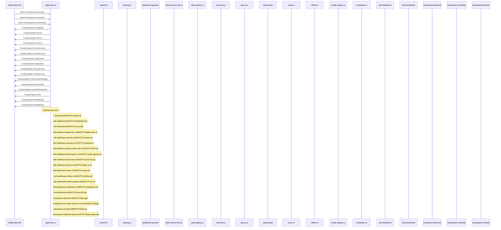

# odh-dashboard: Dataflow

## Controller Watches

Kubernetes resources this controller monitors for changes. Each watch triggers reconciliation when the watched resource is created, updated, or deleted.

| Type | GVK | Source |
|------|-----|--------|
| For | api/v1alpha1/Dashboard | [`dashboard-operator/internal/controller/dashboard_reconciler.go:1194`](https://github.com/opendatahub-io/odh-dashboard/blob/7f54754971919c2083c3a599e4febe353cd74ee3/dashboard-operator/internal/controller/dashboard_reconciler.go#L1194) |
| For | api/v1beta1/Workspace | [`packages/notebooks/upstream/workspaces/controller/internal/controller/workspace_controller.go:940`](https://github.com/opendatahub-io/odh-dashboard/blob/7f54754971919c2083c3a599e4febe353cd74ee3/packages/notebooks/upstream/workspaces/controller/internal/controller/workspace_controller.go#L940) |
| For | api/v1beta1/WorkspaceKind | [`packages/notebooks/upstream/workspaces/controller/internal/controller/workspacekind_controller.go:285`](https://github.com/opendatahub-io/odh-dashboard/blob/7f54754971919c2083c3a599e4febe353cd74ee3/packages/notebooks/upstream/workspaces/controller/internal/controller/workspacekind_controller.go#L285) |
| Owns | /v1/ConfigMap | [`dashboard-operator/internal/controller/dashboard_reconciler.go:1197`](https://github.com/opendatahub-io/odh-dashboard/blob/7f54754971919c2083c3a599e4febe353cd74ee3/dashboard-operator/internal/controller/dashboard_reconciler.go#L1197) |
| Owns | /v1/Secret | [`dashboard-operator/internal/controller/dashboard_reconciler.go:1199`](https://github.com/opendatahub-io/odh-dashboard/blob/7f54754971919c2083c3a599e4febe353cd74ee3/dashboard-operator/internal/controller/dashboard_reconciler.go#L1199) |
| Owns | /v1/Service | [`dashboard-operator/internal/controller/dashboard_reconciler.go:1196`](https://github.com/opendatahub-io/odh-dashboard/blob/7f54754971919c2083c3a599e4febe353cd74ee3/dashboard-operator/internal/controller/dashboard_reconciler.go#L1196) |
| Owns | /v1/Service | [`packages/notebooks/upstream/workspaces/controller/internal/controller/workspace_controller.go:942`](https://github.com/opendatahub-io/odh-dashboard/blob/7f54754971919c2083c3a599e4febe353cd74ee3/packages/notebooks/upstream/workspaces/controller/internal/controller/workspace_controller.go#L942) |
| Owns | /v1/ServiceAccount | [`packages/notebooks/upstream/workspaces/controller/internal/controller/workspace_controller.go:943`](https://github.com/opendatahub-io/odh-dashboard/blob/7f54754971919c2083c3a599e4febe353cd74ee3/packages/notebooks/upstream/workspaces/controller/internal/controller/workspace_controller.go#L943) |
| Owns | /v1/ServiceAccount | [`dashboard-operator/internal/controller/dashboard_reconciler.go:1198`](https://github.com/opendatahub-io/odh-dashboard/blob/7f54754971919c2083c3a599e4febe353cd74ee3/dashboard-operator/internal/controller/dashboard_reconciler.go#L1198) |
| Owns | apps/v1/Deployment | [`dashboard-operator/internal/controller/dashboard_reconciler.go:1195`](https://github.com/opendatahub-io/odh-dashboard/blob/7f54754971919c2083c3a599e4febe353cd74ee3/dashboard-operator/internal/controller/dashboard_reconciler.go#L1195) |
| Owns | apps/v1/StatefulSet | [`packages/notebooks/upstream/workspaces/controller/internal/controller/workspace_controller.go:941`](https://github.com/opendatahub-io/odh-dashboard/blob/7f54754971919c2083c3a599e4febe353cd74ee3/packages/notebooks/upstream/workspaces/controller/internal/controller/workspace_controller.go#L941) |
| Owns | networking.k8s.io/v1/NetworkPolicy | [`dashboard-operator/internal/controller/dashboard_reconciler.go:1200`](https://github.com/opendatahub-io/odh-dashboard/blob/7f54754971919c2083c3a599e4febe353cd74ee3/dashboard-operator/internal/controller/dashboard_reconciler.go#L1200) |
| Owns | networking/v1/VirtualService | [`packages/notebooks/upstream/workspaces/controller/internal/controller/workspace_controller.go:947`](https://github.com/opendatahub-io/odh-dashboard/blob/7f54754971919c2083c3a599e4febe353cd74ee3/packages/notebooks/upstream/workspaces/controller/internal/controller/workspace_controller.go#L947) |
| Owns | policy/v1/PodDisruptionBudget | [`dashboard-operator/internal/controller/dashboard_reconciler.go:1205`](https://github.com/opendatahub-io/odh-dashboard/blob/7f54754971919c2083c3a599e4febe353cd74ee3/dashboard-operator/internal/controller/dashboard_reconciler.go#L1205) |
| Owns | rbac.authorization.k8s.io/v1/ClusterRole | [`dashboard-operator/internal/controller/dashboard_reconciler.go:1201`](https://github.com/opendatahub-io/odh-dashboard/blob/7f54754971919c2083c3a599e4febe353cd74ee3/dashboard-operator/internal/controller/dashboard_reconciler.go#L1201) |
| Owns | rbac.authorization.k8s.io/v1/ClusterRoleBinding | [`dashboard-operator/internal/controller/dashboard_reconciler.go:1202`](https://github.com/opendatahub-io/odh-dashboard/blob/7f54754971919c2083c3a599e4febe353cd74ee3/dashboard-operator/internal/controller/dashboard_reconciler.go#L1202) |
| Owns | rbac.authorization.k8s.io/v1/Role | [`dashboard-operator/internal/controller/dashboard_reconciler.go:1203`](https://github.com/opendatahub-io/odh-dashboard/blob/7f54754971919c2083c3a599e4febe353cd74ee3/dashboard-operator/internal/controller/dashboard_reconciler.go#L1203) |
| Owns | rbac.authorization.k8s.io/v1/RoleBinding | [`packages/notebooks/upstream/workspaces/controller/internal/controller/workspace_controller.go:944`](https://github.com/opendatahub-io/odh-dashboard/blob/7f54754971919c2083c3a599e4febe353cd74ee3/packages/notebooks/upstream/workspaces/controller/internal/controller/workspace_controller.go#L944) |
| Owns | rbac.authorization.k8s.io/v1/RoleBinding | [`dashboard-operator/internal/controller/dashboard_reconciler.go:1204`](https://github.com/opendatahub-io/odh-dashboard/blob/7f54754971919c2083c3a599e4febe353cd74ee3/dashboard-operator/internal/controller/dashboard_reconciler.go#L1204) |

## Reconciliation Flow

How the controller interacts with the Kubernetes API during reconciliation.

```mermaid
sequenceDiagram
    %% Static dataflow for odh-dashboard

    participant KubernetesAPI as Kubernetes API
    participant agent_ops_ui as agent-ops-ui
    participant automl_ui as automl-ui
    participant autorag_ui as autorag-ui
    participant dashboard_operator as dashboard-operator
    participant data_connect_hub_ui as data-connect-hub-ui
    participant data_registry_ui as data-registry-ui
    participant eval_hub_ui as eval-hub-ui
    participant gen_ai_ui as gen-ai-ui
    participant maas_portal as maas-portal
    participant maas_ui as maas-ui
    participant mlflow_ui as mlflow-ui
    participant model_registry_ui as model-registry-ui
    participant notebooks_ui as notebooks-ui
    participant odh_dashboard as odh-dashboard
    participant rhaii_dashboard as rhaii-dashboard
    participant workspaces_backend as workspaces-backend
    participant workspaces_controller as workspaces-controller
    participant workspaces_frontend as workspaces-frontend

    KubernetesAPI->>+agent_ops_ui: Watch Dashboard (reconcile)
    KubernetesAPI->>+agent_ops_ui: Watch Workspace (reconcile)
    KubernetesAPI->>+agent_ops_ui: Watch WorkspaceKind (reconcile)
    agent_ops_ui->>KubernetesAPI: Create/Update ConfigMap
    agent_ops_ui->>KubernetesAPI: Create/Update Secret
    agent_ops_ui->>KubernetesAPI: Create/Update Service
    agent_ops_ui->>KubernetesAPI: Create/Update Service
    agent_ops_ui->>KubernetesAPI: Create/Update ServiceAccount
    agent_ops_ui->>KubernetesAPI: Create/Update ServiceAccount
    agent_ops_ui->>KubernetesAPI: Create/Update Deployment
    agent_ops_ui->>KubernetesAPI: Create/Update StatefulSet
    agent_ops_ui->>KubernetesAPI: Create/Update NetworkPolicy
    agent_ops_ui->>KubernetesAPI: Create/Update VirtualService
    agent_ops_ui->>KubernetesAPI: Create/Update PodDisruptionBudget
    agent_ops_ui->>KubernetesAPI: Create/Update ClusterRole
    agent_ops_ui->>KubernetesAPI: Create/Update ClusterRoleBinding
    agent_ops_ui->>KubernetesAPI: Create/Update Role
    agent_ops_ui->>KubernetesAPI: Create/Update RoleBinding
    agent_ops_ui->>KubernetesAPI: Create/Update RoleBinding

    Note over agent_ops_ui: Exposed Services
    Note right of agent_ops_ui: maas-portal:8443/TCP [portal-ui]
    Note right of agent_ops_ui: odh-dashboard:8443/TCP [dashboard-ui]
    Note right of agent_ops_ui: odh-dashboard:8943/TCP [core-bff]
    Note right of agent_ops_ui: odh-dashboard-agent-ops-ui:8843/TCP [agent-ops-ui]
    Note right of agent_ops_ui: odh-dashboard-automl-ui:8643/TCP [automl-ui]
    Note right of agent_ops_ui: odh-dashboard-autorag-ui:8743/TCP [autorag-ui]
    Note right of agent_ops_ui: odh-dashboard-data-connect-hub-ui:9243/TCP [dch-ui]
    Note right of agent_ops_ui: odh-dashboard-data-registry-ui:9143/TCP [data-registry-ui]
    Note right of agent_ops_ui: odh-dashboard-eval-hub-ui:8543/TCP [eval-hub-ui]
    Note right of agent_ops_ui: odh-dashboard-gen-ai-ui:8143/TCP [gen-ai-ui]
    Note right of agent_ops_ui: odh-dashboard-maas-ui:8243/TCP [maas-ui]
    Note right of agent_ops_ui: odh-dashboard-mlflow-ui:8343/TCP [mlflow-ui]
    Note right of agent_ops_ui: odh-dashboard-model-registry-ui:8043/TCP [mr-ui]
    Note right of agent_ops_ui: odh-dashboard-notebooks-ui:9043/TCP [notebooks-ui]
    Note right of agent_ops_ui: rhaii-dashboard:4000/TCP [core-bff-api]
    Note right of agent_ops_ui: workspaces-backend:4000/TCP [http-api]
    Note right of agent_ops_ui: workspaces-controller-metrics-service:8443/TCP [https]
    Note right of agent_ops_ui: workspaces-frontend:8080/TCP [http-ui]
    Note right of agent_ops_ui: workspaces-webhook-service:443/TCP [https-webhook]
```

### HTTP Endpoints

| Method | Path | Source |
|--------|------|--------|
| * | / | [`distributions/core-bff/bff/internal/api/routes.go:102`](https://github.com/opendatahub-io/odh-dashboard/blob/7f54754971919c2083c3a599e4febe353cd74ee3/distributions/core-bff/bff/internal/api/routes.go#L102) |
| * | / | [`packages/notebooks/upstream/workspaces/backend/api/app.go:151`](https://github.com/opendatahub-io/odh-dashboard/blob/7f54754971919c2083c3a599e4febe353cd74ee3/packages/notebooks/upstream/workspaces/backend/api/app.go#L151) |
| GET | /api/v1/all-groups | [`packages/maas/bff/openapi.yaml`](https://github.com/opendatahub-io/odh-dashboard/blob/7f54754971919c2083c3a599e4febe353cd74ee3/packages/maas/bff/openapi.yaml) |
| GET | /api/v1/all-maas-models | [`packages/maas/bff/openapi.yaml`](https://github.com/opendatahub-io/odh-dashboard/blob/7f54754971919c2083c3a599e4febe353cd74ee3/packages/maas/bff/openapi.yaml) |
| GET | /api/v1/all-policies | [`packages/maas/bff/openapi.yaml`](https://github.com/opendatahub-io/odh-dashboard/blob/7f54754971919c2083c3a599e4febe353cd74ee3/packages/maas/bff/openapi.yaml) |
| GET | /api/v1/all-subscriptions | [`packages/maas/bff/openapi.yaml`](https://github.com/opendatahub-io/odh-dashboard/blob/7f54754971919c2083c3a599e4febe353cd74ee3/packages/maas/bff/openapi.yaml) |
| POST | /api/v1/api-keys | [`packages/maas/bff/openapi.yaml`](https://github.com/opendatahub-io/odh-dashboard/blob/7f54754971919c2083c3a599e4febe353cd74ee3/packages/maas/bff/openapi.yaml) |
| GET | /api/v1/api-keys-config | [`packages/maas/bff/openapi.yaml`](https://github.com/opendatahub-io/odh-dashboard/blob/7f54754971919c2083c3a599e4febe353cd74ee3/packages/maas/bff/openapi.yaml) |
| POST | /api/v1/api-keys/bulk-revoke | [`packages/maas/bff/openapi.yaml`](https://github.com/opendatahub-io/odh-dashboard/blob/7f54754971919c2083c3a599e4febe353cd74ee3/packages/maas/bff/openapi.yaml) |
| POST | /api/v1/api-keys/search | [`packages/maas/bff/openapi.yaml`](https://github.com/opendatahub-io/odh-dashboard/blob/7f54754971919c2083c3a599e4febe353cd74ee3/packages/maas/bff/openapi.yaml) |
| DELETE | /api/v1/api-keys/{id} | [`packages/maas/bff/openapi.yaml`](https://github.com/opendatahub-io/odh-dashboard/blob/7f54754971919c2083c3a599e4febe353cd74ee3/packages/maas/bff/openapi.yaml) |
| GET | /api/v1/api-keys/{id} | [`packages/maas/bff/openapi.yaml`](https://github.com/opendatahub-io/odh-dashboard/blob/7f54754971919c2083c3a599e4febe353cd74ee3/packages/maas/bff/openapi.yaml) |
| DELETE | /api/v1/delete-policy/{name} | [`packages/maas/bff/openapi.yaml`](https://github.com/opendatahub-io/odh-dashboard/blob/7f54754971919c2083c3a599e4febe353cd74ee3/packages/maas/bff/openapi.yaml) |
| GET | /api/v1/externalmodel | [`packages/maas/bff/openapi.yaml`](https://github.com/opendatahub-io/odh-dashboard/blob/7f54754971919c2083c3a599e4febe353cd74ee3/packages/maas/bff/openapi.yaml) |
| POST | /api/v1/externalmodel | [`packages/maas/bff/openapi.yaml`](https://github.com/opendatahub-io/odh-dashboard/blob/7f54754971919c2083c3a599e4febe353cd74ee3/packages/maas/bff/openapi.yaml) |
| DELETE | /api/v1/externalmodel/{namespace}/{name} | [`packages/maas/bff/openapi.yaml`](https://github.com/opendatahub-io/odh-dashboard/blob/7f54754971919c2083c3a599e4febe353cd74ee3/packages/maas/bff/openapi.yaml) |
| PUT | /api/v1/externalmodel/{namespace}/{name} | [`packages/maas/bff/openapi.yaml`](https://github.com/opendatahub-io/odh-dashboard/blob/7f54754971919c2083c3a599e4febe353cd74ee3/packages/maas/bff/openapi.yaml) |
| GET | /api/v1/externalprovider | [`packages/maas/bff/openapi.yaml`](https://github.com/opendatahub-io/odh-dashboard/blob/7f54754971919c2083c3a599e4febe353cd74ee3/packages/maas/bff/openapi.yaml) |
| POST | /api/v1/externalprovider | [`packages/maas/bff/openapi.yaml`](https://github.com/opendatahub-io/odh-dashboard/blob/7f54754971919c2083c3a599e4febe353cd74ee3/packages/maas/bff/openapi.yaml) |
| DELETE | /api/v1/externalprovider/{namespace}/{name} | [`packages/maas/bff/openapi.yaml`](https://github.com/opendatahub-io/odh-dashboard/blob/7f54754971919c2083c3a599e4febe353cd74ee3/packages/maas/bff/openapi.yaml) |
| PUT | /api/v1/externalprovider/{namespace}/{name} | [`packages/maas/bff/openapi.yaml`](https://github.com/opendatahub-io/odh-dashboard/blob/7f54754971919c2083c3a599e4febe353cd74ee3/packages/maas/bff/openapi.yaml) |
| GET | /api/v1/gateway-url | [`packages/maas/bff/openapi.yaml`](https://github.com/opendatahub-io/odh-dashboard/blob/7f54754971919c2083c3a599e4febe353cd74ee3/packages/maas/bff/openapi.yaml) |
| GET | /api/v1/is-maas-admin | [`packages/maas/bff/openapi.yaml`](https://github.com/opendatahub-io/odh-dashboard/blob/7f54754971919c2083c3a599e4febe353cd74ee3/packages/maas/bff/openapi.yaml) |
| POST | /api/v1/maasmodel | [`packages/maas/bff/openapi.yaml`](https://github.com/opendatahub-io/odh-dashboard/blob/7f54754971919c2083c3a599e4febe353cd74ee3/packages/maas/bff/openapi.yaml) |
| DELETE | /api/v1/maasmodel/{namespace}/{name} | [`packages/maas/bff/openapi.yaml`](https://github.com/opendatahub-io/odh-dashboard/blob/7f54754971919c2083c3a599e4febe353cd74ee3/packages/maas/bff/openapi.yaml) |
| PUT | /api/v1/maasmodel/{namespace}/{name} | [`packages/maas/bff/openapi.yaml`](https://github.com/opendatahub-io/odh-dashboard/blob/7f54754971919c2083c3a599e4febe353cd74ee3/packages/maas/bff/openapi.yaml) |
| GET | /api/v1/models | [`packages/maas/bff/openapi.yaml`](https://github.com/opendatahub-io/odh-dashboard/blob/7f54754971919c2083c3a599e4febe353cd74ee3/packages/maas/bff/openapi.yaml) |
| GET | /api/v1/namespaces | [`packages/maas/bff/openapi.yaml`](https://github.com/opendatahub-io/odh-dashboard/blob/7f54754971919c2083c3a599e4febe353cd74ee3/packages/maas/bff/openapi.yaml) |
| POST | /api/v1/new-policy | [`packages/maas/bff/openapi.yaml`](https://github.com/opendatahub-io/odh-dashboard/blob/7f54754971919c2083c3a599e4febe353cd74ee3/packages/maas/bff/openapi.yaml) |
| POST | /api/v1/new-subscription | [`packages/maas/bff/openapi.yaml`](https://github.com/opendatahub-io/odh-dashboard/blob/7f54754971919c2083c3a599e4febe353cd74ee3/packages/maas/bff/openapi.yaml) |
| GET | /api/v1/secrets | [`packages/maas/bff/openapi.yaml`](https://github.com/opendatahub-io/odh-dashboard/blob/7f54754971919c2083c3a599e4febe353cd74ee3/packages/maas/bff/openapi.yaml) |
| POST | /api/v1/secrets | [`packages/maas/bff/openapi.yaml`](https://github.com/opendatahub-io/odh-dashboard/blob/7f54754971919c2083c3a599e4febe353cd74ee3/packages/maas/bff/openapi.yaml) |
| GET | /api/v1/subscription-info/{name} | [`packages/maas/bff/openapi.yaml`](https://github.com/opendatahub-io/odh-dashboard/blob/7f54754971919c2083c3a599e4febe353cd74ee3/packages/maas/bff/openapi.yaml) |
| DELETE | /api/v1/subscription/{name} | [`packages/maas/bff/openapi.yaml`](https://github.com/opendatahub-io/odh-dashboard/blob/7f54754971919c2083c3a599e4febe353cd74ee3/packages/maas/bff/openapi.yaml) |
| GET | /api/v1/subscriptions | [`packages/maas/bff/openapi.yaml`](https://github.com/opendatahub-io/odh-dashboard/blob/7f54754971919c2083c3a599e4febe353cd74ee3/packages/maas/bff/openapi.yaml) |
| GET | /api/v1/subscriptions/{id} | [`packages/maas/bff/openapi.yaml`](https://github.com/opendatahub-io/odh-dashboard/blob/7f54754971919c2083c3a599e4febe353cd74ee3/packages/maas/bff/openapi.yaml) |
| PUT | /api/v1/update-policy/{name} | [`packages/maas/bff/openapi.yaml`](https://github.com/opendatahub-io/odh-dashboard/blob/7f54754971919c2083c3a599e4febe353cd74ee3/packages/maas/bff/openapi.yaml) |
| PUT | /api/v1/update-subscription/{name} | [`packages/maas/bff/openapi.yaml`](https://github.com/opendatahub-io/odh-dashboard/blob/7f54754971919c2083c3a599e4febe353cd74ee3/packages/maas/bff/openapi.yaml) |
| GET | /api/v1/user | [`packages/maas/bff/openapi.yaml`](https://github.com/opendatahub-io/odh-dashboard/blob/7f54754971919c2083c3a599e4febe353cd74ee3/packages/maas/bff/openapi.yaml) |
| GET | /api/v1/view-policy/{name} | [`packages/maas/bff/openapi.yaml`](https://github.com/opendatahub-io/odh-dashboard/blob/7f54754971919c2083c3a599e4febe353cd74ee3/packages/maas/bff/openapi.yaml) |
| GET | /api/v1/yaml | [`packages/maas/bff/openapi.yaml`](https://github.com/opendatahub-io/odh-dashboard/blob/7f54754971919c2083c3a599e4febe353cd74ee3/packages/maas/bff/openapi.yaml) |
| GET | /api/v1alpha1/data/connection-types | [`packages/data-connect-hub/bff/internal/api/connection_types_handler.go:112`](https://github.com/opendatahub-io/odh-dashboard/blob/7f54754971919c2083c3a599e4febe353cd74ee3/packages/data-connect-hub/bff/internal/api/connection_types_handler.go#L112) |
| GET | /api/v1alpha1/data/connection-types/ | [`packages/data-connect-hub/bff/internal/api/connection_types_handler.go:186`](https://github.com/opendatahub-io/odh-dashboard/blob/7f54754971919c2083c3a599e4febe353cd74ee3/packages/data-connect-hub/bff/internal/api/connection_types_handler.go#L186) |
| GET | /api/v1alpha1/data/connections | [`packages/data-connect-hub/bff/internal/api/connections_handler.go:82`](https://github.com/opendatahub-io/odh-dashboard/blob/7f54754971919c2083c3a599e4febe353cd74ee3/packages/data-connect-hub/bff/internal/api/connections_handler.go#L82) |
| POST | /api/v1alpha1/data/connections | [`packages/data-connect-hub/bff/internal/api/connection_create_handler.go:90`](https://github.com/opendatahub-io/odh-dashboard/blob/7f54754971919c2083c3a599e4febe353cd74ee3/packages/data-connect-hub/bff/internal/api/connection_create_handler.go#L90) |
| DELETE | /api/v1alpha1/data/connections/ | [`packages/data-connect-hub/bff/internal/api/connection_delete_handler.go:54`](https://github.com/opendatahub-io/odh-dashboard/blob/7f54754971919c2083c3a599e4febe353cd74ee3/packages/data-connect-hub/bff/internal/api/connection_delete_handler.go#L54) |
| POST | /api/v1alpha1/data/connections/ | [`packages/data-connect-hub/bff/internal/api/connection_readiness_handler.go:57`](https://github.com/opendatahub-io/odh-dashboard/blob/7f54754971919c2083c3a599e4febe353cd74ee3/packages/data-connect-hub/bff/internal/api/connection_readiness_handler.go#L57) |
| POST | /api/v1alpha1/data/test/credentials | [`packages/data-connect-hub/bff/internal/api/test_credentials_handler.go:76`](https://github.com/opendatahub-io/odh-dashboard/blob/7f54754971919c2083c3a599e4febe353cd74ee3/packages/data-connect-hub/bff/internal/api/test_credentials_handler.go#L76) |
| GET | /healthcheck | [`packages/notebooks/upstream/workspaces/backend/openapi/swagger.json`](https://github.com/opendatahub-io/odh-dashboard/blob/7f54754971919c2083c3a599e4febe353cd74ee3/packages/notebooks/upstream/workspaces/backend/openapi/swagger.json) |
| GET | /healthcheck | [`packages/model-registry/upstream/bff/openapi/swagger.json`](https://github.com/opendatahub-io/odh-dashboard/blob/7f54754971919c2083c3a599e4febe353cd74ee3/packages/model-registry/upstream/bff/openapi/swagger.json) |
| GET | /healthcheck | [`packages/model-registry/upstream/bff/openapi/swagger.yaml`](https://github.com/opendatahub-io/odh-dashboard/blob/7f54754971919c2083c3a599e4febe353cd74ee3/packages/model-registry/upstream/bff/openapi/swagger.yaml) |
| GET | /healthcheck | [`packages/maas/bff/openapi.yaml`](https://github.com/opendatahub-io/odh-dashboard/blob/7f54754971919c2083c3a599e4febe353cd74ee3/packages/maas/bff/openapi.yaml) |
| GET | /namespaces | [`packages/notebooks/upstream/workspaces/backend/openapi/swagger.json`](https://github.com/opendatahub-io/odh-dashboard/blob/7f54754971919c2083c3a599e4febe353cd74ee3/packages/notebooks/upstream/workspaces/backend/openapi/swagger.json) |
| GET | /persistentvolumeclaims/{namespace} | [`packages/notebooks/upstream/workspaces/backend/openapi/swagger.json`](https://github.com/opendatahub-io/odh-dashboard/blob/7f54754971919c2083c3a599e4febe353cd74ee3/packages/notebooks/upstream/workspaces/backend/openapi/swagger.json) |
| POST | /persistentvolumeclaims/{namespace} | [`packages/notebooks/upstream/workspaces/backend/openapi/swagger.json`](https://github.com/opendatahub-io/odh-dashboard/blob/7f54754971919c2083c3a599e4febe353cd74ee3/packages/notebooks/upstream/workspaces/backend/openapi/swagger.json) |
| DELETE | /persistentvolumeclaims/{namespace}/{name} | [`packages/notebooks/upstream/workspaces/backend/openapi/swagger.json`](https://github.com/opendatahub-io/odh-dashboard/blob/7f54754971919c2083c3a599e4febe353cd74ee3/packages/notebooks/upstream/workspaces/backend/openapi/swagger.json) |
| GET | /secrets/{namespace} | [`packages/notebooks/upstream/workspaces/backend/openapi/swagger.json`](https://github.com/opendatahub-io/odh-dashboard/blob/7f54754971919c2083c3a599e4febe353cd74ee3/packages/notebooks/upstream/workspaces/backend/openapi/swagger.json) |
| POST | /secrets/{namespace} | [`packages/notebooks/upstream/workspaces/backend/openapi/swagger.json`](https://github.com/opendatahub-io/odh-dashboard/blob/7f54754971919c2083c3a599e4febe353cd74ee3/packages/notebooks/upstream/workspaces/backend/openapi/swagger.json) |
| DELETE | /secrets/{namespace}/{name} | [`packages/notebooks/upstream/workspaces/backend/openapi/swagger.json`](https://github.com/opendatahub-io/odh-dashboard/blob/7f54754971919c2083c3a599e4febe353cd74ee3/packages/notebooks/upstream/workspaces/backend/openapi/swagger.json) |
| GET | /secrets/{namespace}/{name} | [`packages/notebooks/upstream/workspaces/backend/openapi/swagger.json`](https://github.com/opendatahub-io/odh-dashboard/blob/7f54754971919c2083c3a599e4febe353cd74ee3/packages/notebooks/upstream/workspaces/backend/openapi/swagger.json) |
| PUT | /secrets/{namespace}/{name} | [`packages/notebooks/upstream/workspaces/backend/openapi/swagger.json`](https://github.com/opendatahub-io/odh-dashboard/blob/7f54754971919c2083c3a599e4febe353cd74ee3/packages/notebooks/upstream/workspaces/backend/openapi/swagger.json) |
| GET | /storageclasses | [`packages/notebooks/upstream/workspaces/backend/openapi/swagger.json`](https://github.com/opendatahub-io/odh-dashboard/blob/7f54754971919c2083c3a599e4febe353cd74ee3/packages/notebooks/upstream/workspaces/backend/openapi/swagger.json) |
| GET | /user | [`packages/notebooks/upstream/workspaces/backend/openapi/swagger.json`](https://github.com/opendatahub-io/odh-dashboard/blob/7f54754971919c2083c3a599e4febe353cd74ee3/packages/notebooks/upstream/workspaces/backend/openapi/swagger.json) |
| GET | /workspacekinds | [`packages/notebooks/upstream/workspaces/backend/openapi/swagger.json`](https://github.com/opendatahub-io/odh-dashboard/blob/7f54754971919c2083c3a599e4febe353cd74ee3/packages/notebooks/upstream/workspaces/backend/openapi/swagger.json) |
| POST | /workspacekinds | [`packages/notebooks/upstream/workspaces/backend/openapi/swagger.json`](https://github.com/opendatahub-io/odh-dashboard/blob/7f54754971919c2083c3a599e4febe353cd74ee3/packages/notebooks/upstream/workspaces/backend/openapi/swagger.json) |
| DELETE | /workspacekinds/{name} | [`packages/notebooks/upstream/workspaces/backend/openapi/swagger.json`](https://github.com/opendatahub-io/odh-dashboard/blob/7f54754971919c2083c3a599e4febe353cd74ee3/packages/notebooks/upstream/workspaces/backend/openapi/swagger.json) |
| GET | /workspacekinds/{name} | [`packages/notebooks/upstream/workspaces/backend/openapi/swagger.json`](https://github.com/opendatahub-io/odh-dashboard/blob/7f54754971919c2083c3a599e4febe353cd74ee3/packages/notebooks/upstream/workspaces/backend/openapi/swagger.json) |
| PUT | /workspacekinds/{name} | [`packages/notebooks/upstream/workspaces/backend/openapi/swagger.json`](https://github.com/opendatahub-io/odh-dashboard/blob/7f54754971919c2083c3a599e4febe353cd74ee3/packages/notebooks/upstream/workspaces/backend/openapi/swagger.json) |
| GET | /workspacekinds/{name}/assets/icon | [`packages/notebooks/upstream/workspaces/backend/openapi/swagger.json`](https://github.com/opendatahub-io/odh-dashboard/blob/7f54754971919c2083c3a599e4febe353cd74ee3/packages/notebooks/upstream/workspaces/backend/openapi/swagger.json) |
| GET | /workspacekinds/{name}/assets/logo | [`packages/notebooks/upstream/workspaces/backend/openapi/swagger.json`](https://github.com/opendatahub-io/odh-dashboard/blob/7f54754971919c2083c3a599e4febe353cd74ee3/packages/notebooks/upstream/workspaces/backend/openapi/swagger.json) |
| POST | /workspacekinds/{name}/podtemplate/options/listvalues | [`packages/notebooks/upstream/workspaces/backend/openapi/swagger.json`](https://github.com/opendatahub-io/odh-dashboard/blob/7f54754971919c2083c3a599e4febe353cd74ee3/packages/notebooks/upstream/workspaces/backend/openapi/swagger.json) |
| GET | /workspaces | [`packages/notebooks/upstream/workspaces/backend/openapi/swagger.json`](https://github.com/opendatahub-io/odh-dashboard/blob/7f54754971919c2083c3a599e4febe353cd74ee3/packages/notebooks/upstream/workspaces/backend/openapi/swagger.json) |
| GET | /workspaces/{namespace} | [`packages/notebooks/upstream/workspaces/backend/openapi/swagger.json`](https://github.com/opendatahub-io/odh-dashboard/blob/7f54754971919c2083c3a599e4febe353cd74ee3/packages/notebooks/upstream/workspaces/backend/openapi/swagger.json) |
| POST | /workspaces/{namespace} | [`packages/notebooks/upstream/workspaces/backend/openapi/swagger.json`](https://github.com/opendatahub-io/odh-dashboard/blob/7f54754971919c2083c3a599e4febe353cd74ee3/packages/notebooks/upstream/workspaces/backend/openapi/swagger.json) |
| DELETE | /workspaces/{namespace}/{name} | [`packages/notebooks/upstream/workspaces/backend/openapi/swagger.json`](https://github.com/opendatahub-io/odh-dashboard/blob/7f54754971919c2083c3a599e4febe353cd74ee3/packages/notebooks/upstream/workspaces/backend/openapi/swagger.json) |
| GET | /workspaces/{namespace}/{name} | [`packages/notebooks/upstream/workspaces/backend/openapi/swagger.json`](https://github.com/opendatahub-io/odh-dashboard/blob/7f54754971919c2083c3a599e4febe353cd74ee3/packages/notebooks/upstream/workspaces/backend/openapi/swagger.json) |
| PUT | /workspaces/{namespace}/{name} | [`packages/notebooks/upstream/workspaces/backend/openapi/swagger.json`](https://github.com/opendatahub-io/odh-dashboard/blob/7f54754971919c2083c3a599e4febe353cd74ee3/packages/notebooks/upstream/workspaces/backend/openapi/swagger.json) |
| POST | /workspaces/{namespace}/{name}/actions/pause | [`packages/notebooks/upstream/workspaces/backend/openapi/swagger.json`](https://github.com/opendatahub-io/odh-dashboard/blob/7f54754971919c2083c3a599e4febe353cd74ee3/packages/notebooks/upstream/workspaces/backend/openapi/swagger.json) |
| GET | /workspaces/{namespace}/{name}/podtemplate/details | [`packages/notebooks/upstream/workspaces/backend/openapi/swagger.json`](https://github.com/opendatahub-io/odh-dashboard/blob/7f54754971919c2083c3a599e4febe353cd74ee3/packages/notebooks/upstream/workspaces/backend/openapi/swagger.json) |
| GET | /workspaces/{namespace}/{name}/podtemplate/logs/batch | [`packages/notebooks/upstream/workspaces/backend/openapi/swagger.json`](https://github.com/opendatahub-io/odh-dashboard/blob/7f54754971919c2083c3a599e4febe353cd74ee3/packages/notebooks/upstream/workspaces/backend/openapi/swagger.json) |
| * | GET  | [`distributions/core-bff/bff/internal/api/routes_model_serving.go:65`](https://github.com/opendatahub-io/odh-dashboard/blob/7f54754971919c2083c3a599e4febe353cd74ee3/distributions/core-bff/bff/internal/api/routes_model_serving.go#L65) |
| * | GET  | [`distributions/core-bff/bff/internal/api/routes_model_serving.go:64`](https://github.com/opendatahub-io/odh-dashboard/blob/7f54754971919c2083c3a599e4febe353cd74ee3/distributions/core-bff/bff/internal/api/routes_model_serving.go#L64) |
| * | GET  | [`distributions/core-bff/bff/internal/api/routes_model_serving.go:63`](https://github.com/opendatahub-io/odh-dashboard/blob/7f54754971919c2083c3a599e4febe353cd74ee3/distributions/core-bff/bff/internal/api/routes_model_serving.go#L63) |
| * | GET  | [`distributions/core-bff/bff/internal/api/routes_model_serving.go:62`](https://github.com/opendatahub-io/odh-dashboard/blob/7f54754971919c2083c3a599e4febe353cd74ee3/distributions/core-bff/bff/internal/api/routes_model_serving.go#L62) |

## Configuration

ConfigMaps and Helm values that control this component's runtime behavior.

### ConfigMaps

| Name | Data Keys | Source |
|------|-----------|--------|
| data-registry-config | apiURL | [`manifests/modules/data-registry/configmap.yaml`](https://github.com/opendatahub-io/odh-dashboard/blob/7f54754971919c2083c3a599e4febe353cd74ee3/manifests/modules/data-registry/configmap.yaml) |
| model-registry-ui-config | images-jobs-async-upload | [`manifests/base/model-registry/configmap.yaml`](https://github.com/opendatahub-io/odh-dashboard/blob/7f54754971919c2083c3a599e4febe353cd74ee3/manifests/base/model-registry/configmap.yaml) |

### Helm

**Chart:** dashboard v0.1.0

