# odh-dashboard: RBAC

ServiceAccount bindings, roles, and resource permissions.

## RBAC Overview

This component defines a large RBAC surface (261 diagram lines). The graph below groups roles by permission scope.

```mermaid
graph LR
    classDef wide fill:#e74c3c,stroke:#c0392b,color:#fff
    classDef medium fill:#f39c12,stroke:#d68910,color:#fff
    classDef narrow fill:#2ecc71,stroke:#27ae60,color:#fff
    classDef subject fill:#3498db,stroke:#2980b9,color:#fff

    subgraph wide["Wide Scope (>30 resources)"]
    odh_dashboard["odh-dashboard\n34 resources"]:::wide
    end
    subgraph med["Medium Scope (10-30)"]
    odh_dashboard_gen_ai["odh-dashboard-gen-ai\n17 resources"]:::medium
    odh_dashboard["odh-dashboard\n19 resources"]:::medium
    end
    subgraph nar["Narrow Scope (<10)"]
    odh_dashboard_agent_ops["odh-dashboard-agent-ops\n4 resources"]:::narrow
    odh_dashboard_automl["odh-dashboard-automl\n1 resources"]:::narrow
    odh_dashboard_autorag["odh-dashboard-autorag\n1 resources"]:::narrow
    odh_dashboard_data_registry_ui["odh-dashboard-data-registry-ui\n1 resources"]:::narrow
    odh_dashboard_eval_hub["odh-dashboard-eval-hub\n1 resources"]:::narrow
    odh_dashboard_maas["odh-dashboard-maas\n3 resources"]:::narrow
    odh_dashboard_mlflow["odh-dashboard-mlflow\n2 resources"]:::narrow
    odh_dashboard_model_registry["odh-dashboard-model-registry\n1 resources"]:::narrow
    odh_dashboard_notebooks["odh-dashboard-notebooks\n10 resources"]:::narrow
    servingruntimes_config_updater["servingruntimes-config-updater\n2 resources"]:::narrow
    end

    subj_odh_dashboard["odh-dashboard\nServiceAccount"]:::subject
    subj_odh_dashboard -->|binds| odh_dashboard
    subj_odh_dashboard_agent_ops["odh-dashboard-agent-ops\nServiceAccount"]:::subject
    subj_odh_dashboard_agent_ops -->|binds| odh_dashboard_agent_ops
    subj_odh_dashboard -->|binds| system_auth_delegator
    subj_odh_dashboard_automl["odh-dashboard-automl\nServiceAccount"]:::subject
    subj_odh_dashboard_automl -->|binds| odh_dashboard_automl
    subj_odh_dashboard_autorag["odh-dashboard-autorag\nServiceAccount"]:::subject
    subj_odh_dashboard_autorag -->|binds| odh_dashboard_autorag
    subj_odh_dashboard_data_registry_ui["odh-dashboard-data-registry-ui\nServiceAccount"]:::subject
    subj_odh_dashboard_data_registry_ui -->|binds| odh_dashboard_data_registry_ui
    subj_odh_dashboard_eval_hub["odh-dashboard-eval-hub\nServiceAccount"]:::subject
    subj_odh_dashboard_eval_hub -->|binds| odh_dashboard_eval_hub
    subj_odh_dashboard_gen_ai["odh-dashboard-gen-ai\nServiceAccount"]:::subject
    subj_odh_dashboard_gen_ai -->|binds| odh_dashboard_gen_ai
    subj_odh_dashboard_maas["odh-dashboard-maas\nServiceAccount"]:::subject
    subj_odh_dashboard_maas -->|binds| odh_dashboard_maas
    subj_odh_dashboard_mlflow["odh-dashboard-mlflow\nServiceAccount"]:::subject
    subj_odh_dashboard_mlflow -->|binds| odh_dashboard_mlflow
    subj_odh_dashboard_model_registry["odh-dashboard-model-registry\nServiceAccount"]:::subject
    subj_odh_dashboard_model_registry -->|binds| odh_dashboard_model_registry
    subj_odh_dashboard -->|binds| cluster_monitoring_view
    subj_odh_dashboard_notebooks["odh-dashboard-notebooks\nServiceAccount"]:::subject
    subj_odh_dashboard_notebooks -->|binds| odh_dashboard_notebooks
    subj_system_serviceaccounts["system:serviceaccounts\nGroup"]:::subject
    subj_system_serviceaccounts -->|binds| system_image_puller
    subj_odh_dashboard -->|binds| odh_dashboard
    subj_system_authenticated["system:authenticated\nGroup"]:::subject
    subj_system_authenticated -->|binds| servingruntimes_config_updater
```

## Bindings

Subject-to-role mappings defining who has access to what.

| Binding | Type | Role | Subject |
|---------|------|------|---------|
| odh-dashboard | ClusterRoleBinding | odh-dashboard | ServiceAccount/odh-dashboard |
| odh-dashboard-agent-ops | ClusterRoleBinding | odh-dashboard-agent-ops | ServiceAccount/odh-dashboard-agent-ops |
| odh-dashboard-auth-delegator | ClusterRoleBinding | system:auth-delegator | ServiceAccount/odh-dashboard |
| odh-dashboard-automl | ClusterRoleBinding | odh-dashboard-automl | ServiceAccount/odh-dashboard-automl |
| odh-dashboard-autorag | ClusterRoleBinding | odh-dashboard-autorag | ServiceAccount/odh-dashboard-autorag |
| odh-dashboard-data-registry-ui | ClusterRoleBinding | odh-dashboard-data-registry-ui | ServiceAccount/odh-dashboard-data-registry-ui |
| odh-dashboard-eval-hub | ClusterRoleBinding | odh-dashboard-eval-hub | ServiceAccount/odh-dashboard-eval-hub |
| odh-dashboard-gen-ai | ClusterRoleBinding | odh-dashboard-gen-ai | ServiceAccount/odh-dashboard-gen-ai |
| odh-dashboard-maas | ClusterRoleBinding | odh-dashboard-maas | ServiceAccount/odh-dashboard-maas |
| odh-dashboard-mlflow | ClusterRoleBinding | odh-dashboard-mlflow | ServiceAccount/odh-dashboard-mlflow |
| odh-dashboard-model-registry | ClusterRoleBinding | odh-dashboard-model-registry | ServiceAccount/odh-dashboard-model-registry |
| odh-dashboard-monitoring | ClusterRoleBinding | cluster-monitoring-view | ServiceAccount/odh-dashboard |
| odh-dashboard-notebooks | ClusterRoleBinding | odh-dashboard-notebooks | ServiceAccount/odh-dashboard-notebooks |
| cluster-image-pullers | RoleBinding | system:image-puller | Group/system:serviceaccounts |
| odh-dashboard | RoleBinding | odh-dashboard | ServiceAccount/odh-dashboard |
| servingruntimes-config-updater | RoleBinding | servingruntimes-config-updater | Group/system:authenticated |

## Role Details

Per-rule breakdown of API groups, resources, and verbs for each role.

| Role | Kind | API Groups | Resources | Verbs |
|------|------|------------|-----------|-------|
| odh-dashboard | ClusterRole |  | nodes | get, list |
| odh-dashboard | ClusterRole |  | machineautoscalers, machinesets | get, list |
| odh-dashboard | ClusterRole |  | clusterversions, ingresses | get, watch, list |
| odh-dashboard | ClusterRole |  | clusterserviceversions, subscriptions | get, list, watch |
| odh-dashboard | ClusterRole |  | imagestreams/layers | get |
| odh-dashboard | ClusterRole |  | routes | get, list, watch |
| odh-dashboard | ClusterRole |  | consolelinks | get, list, watch |
| odh-dashboard | ClusterRole |  | consoles | get, list, watch |
| odh-dashboard | ClusterRole |  | rhmis | get, watch, list |
| odh-dashboard | ClusterRole |  | groups | get, list, watch |
| odh-dashboard | ClusterRole |  | users | get, list, watch |
| odh-dashboard | ClusterRole |  | pods, serviceaccounts, services | get, list, watch |
| odh-dashboard | ClusterRole |  | namespaces | patch |
| odh-dashboard | ClusterRole |  | rolebindings, roles | list, get, create, patch, delete |
| odh-dashboard | ClusterRole |  | events | get, list, watch |
| odh-dashboard | ClusterRole |  | events | get, list, watch |
| odh-dashboard | ClusterRole |  | notebooks | get, list, watch, create, update, patch, delete |
| odh-dashboard | ClusterRole |  | datascienceclusters | list, watch, get |
| odh-dashboard | ClusterRole |  | dscinitializations | list, watch, get |
| odh-dashboard | ClusterRole |  | inferenceservices | get, list, watch |
| odh-dashboard | ClusterRole |  | modelregistries | get, list, watch, create, update, patch, delete |
| odh-dashboard | ClusterRole |  | endpoints | get |
| odh-dashboard | ClusterRole |  | auths | get |
| odh-dashboard | ClusterRole |  | featurestores | get, list, watch |
| odh-dashboard | ClusterRole |  | configmaps | get, list |
| odh-dashboard | ClusterRole |  | mlflows | get, list, watch |
| odh-dashboard | ClusterRole |  | tokenreviews | create |
| odh-dashboard | ClusterRole |  | subjectaccessreviews | create |
| odh-dashboard-agent-ops | ClusterRole |  | sandboxes | get, list, patch |
| odh-dashboard-agent-ops | ClusterRole |  | routes | get, list |
| odh-dashboard-agent-ops | ClusterRole |  | mcpserverregistrations | get, list |
| odh-dashboard-agent-ops | ClusterRole |  | subjectaccessreviews | create |
| odh-dashboard-automl | ClusterRole |  | subjectaccessreviews | create |
| odh-dashboard-autorag | ClusterRole |  | subjectaccessreviews | create |
| odh-dashboard-data-registry-ui | ClusterRole |  | configmaps | get, list, watch |
| odh-dashboard-eval-hub | ClusterRole |  | subjectaccessreviews | create |
| odh-dashboard-gen-ai | ClusterRole |  | mlflows | get, list, watch |
| odh-dashboard-gen-ai | ClusterRole |  | ingresses | get, list, watch |
| odh-dashboard-gen-ai | ClusterRole |  | opentelemetrycollectors | get, list, create, update, delete |
| odh-dashboard-gen-ai | ClusterRole |  | subjectaccessreviews | create |
| odh-dashboard-gen-ai | ClusterRole |  | secrets, services, persistentvolumeclaims, configmaps | create |
| odh-dashboard-gen-ai | ClusterRole |  | secrets, services, persistentvolumeclaims, configmaps | get, update, delete |
| odh-dashboard-gen-ai | ClusterRole |  | deployments | create |
| odh-dashboard-gen-ai | ClusterRole |  | deployments | get, update, delete |
| odh-dashboard-gen-ai | ClusterRole |  | networkpolicies | create |
| odh-dashboard-gen-ai | ClusterRole |  | networkpolicies | get, update, delete |
| odh-dashboard-gen-ai | ClusterRole |  | storageclasses | list |
| odh-dashboard-maas | ClusterRole |  | datascienceclusters | list |
| odh-dashboard-maas | ClusterRole |  | ingresses | get, list, watch |
| odh-dashboard-maas | ClusterRole |  | subjectaccessreviews | create |
| odh-dashboard-mlflow | ClusterRole |  | mlflows | get, list, watch |
| odh-dashboard-mlflow | ClusterRole |  | subjectaccessreviews | create |
| odh-dashboard-model-registry | ClusterRole |  | subjectaccessreviews | create |
| odh-dashboard-notebooks | ClusterRole |  | namespaces, configmaps, pods, persistentvolumes | get, list, watch |
| odh-dashboard-notebooks | ClusterRole |  | secrets | get, list, watch, create, update, patch, delete |
| odh-dashboard-notebooks | ClusterRole |  | persistentvolumeclaims | get, list, watch, create, delete |
| odh-dashboard-notebooks | ClusterRole |  | storageclasses | get, list, watch |
| odh-dashboard-notebooks | ClusterRole |  | workspaces, workspacekinds | get, list, watch, create, update, patch, delete |
| odh-dashboard-notebooks | ClusterRole |  | subjectaccessreviews | create |
| odh-dashboard | Role |  | acceleratorprofiles | create, get, list, update, patch, delete |
| odh-dashboard | Role |  | routes | get, list, watch |
| odh-dashboard | Role |  | cronjobs | get, update, delete |
| odh-dashboard | Role |  | imagestreams | create, get, list, update, patch, delete |
| odh-dashboard | Role |  | builds, buildconfigs | list |
| odh-dashboard | Role |  | deployments | patch, update |
| odh-dashboard | Role |  | deploymentconfigs, deploymentconfigs/instantiate | get, list, watch, create, update, patch, delete |
| odh-dashboard | Role |  | odhdashboardconfigs | get, list, watch, create, update, patch, delete |
| odh-dashboard | Role |  | notebooks | get, list, watch, create, update, patch, delete |
| odh-dashboard | Role |  | odhapplications | get, list |
| odh-dashboard | Role |  | odhdocuments | get, list |
| odh-dashboard | Role |  | odhquickstarts | get, list |
| odh-dashboard | Role |  | templates | get, list, watch, create, update, patch, delete |
| odh-dashboard | Role |  | servingruntimes | get, list, watch, create, update, patch, delete |
| odh-dashboard | Role |  | accounts | get, list, watch, create, update, patch, delete |
| odh-dashboard | Role |  | configmaps | get, list, create, update, patch, delete |
| odh-dashboard | Role |  | secrets | get, create, update |
| servingruntimes-config-updater | Role |  | templates | get, list, watch |
| servingruntimes-config-updater | Role |  | odhdashboardconfigs | get, list |

