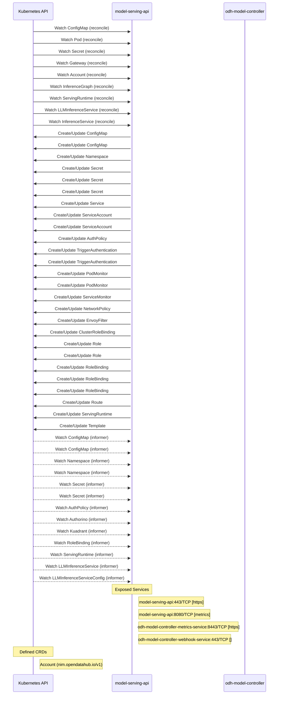

# odh-model-controller: Dataflow

## Controller Watches

Kubernetes resources this controller monitors for changes. Each watch triggers reconciliation when the watched resource is created, updated, or deleted.

| Type | GVK | Source |
|------|-----|--------|
| For | /v1/ConfigMap | [`internal/controller/core/configmap_controller.go:157`](https://github.com/opendatahub-io/odh-model-controller/blob/43ebf90dd5af130a94cb3b1857f6ebd45ecd28cf/internal/controller/core/configmap_controller.go#L157) |
| For | /v1/Pod | [`internal/controller/core/pod_controller.go:53`](https://github.com/opendatahub-io/odh-model-controller/blob/43ebf90dd5af130a94cb3b1857f6ebd45ecd28cf/internal/controller/core/pod_controller.go#L53) |
| For | /v1/Secret | [`internal/controller/core/secret_controller.go:251`](https://github.com/opendatahub-io/odh-model-controller/blob/43ebf90dd5af130a94cb3b1857f6ebd45ecd28cf/internal/controller/core/secret_controller.go#L251) |
| For | apis/v1/Gateway | [`internal/controller/serving/llm/gateway_controller.go:1003`](https://github.com/opendatahub-io/odh-model-controller/blob/43ebf90dd5af130a94cb3b1857f6ebd45ecd28cf/internal/controller/serving/llm/gateway_controller.go#L1003) |
| For | nim/v1/Account | [`internal/controller/nim/account_controller.go:86`](https://github.com/opendatahub-io/odh-model-controller/blob/43ebf90dd5af130a94cb3b1857f6ebd45ecd28cf/internal/controller/nim/account_controller.go#L86) |
| For | serving/v1alpha1/InferenceGraph | [`internal/controller/serving/inferencegraph_controller.go:74`](https://github.com/opendatahub-io/odh-model-controller/blob/43ebf90dd5af130a94cb3b1857f6ebd45ecd28cf/internal/controller/serving/inferencegraph_controller.go#L74) |
| For | serving/v1alpha1/ServingRuntime | [`internal/controller/serving/servingruntime_controller.go:418`](https://github.com/opendatahub-io/odh-model-controller/blob/43ebf90dd5af130a94cb3b1857f6ebd45ecd28cf/internal/controller/serving/servingruntime_controller.go#L418) |
| For | serving/v1alpha2/LLMInferenceService | [`internal/controller/serving/llm/llm_inferenceservice_controller.go:160`](https://github.com/opendatahub-io/odh-model-controller/blob/43ebf90dd5af130a94cb3b1857f6ebd45ecd28cf/internal/controller/serving/llm/llm_inferenceservice_controller.go#L160) |
| For | serving/v1beta1/InferenceService | [`internal/controller/serving/inferenceservice_controller.go:203`](https://github.com/opendatahub-io/odh-model-controller/blob/43ebf90dd5af130a94cb3b1857f6ebd45ecd28cf/internal/controller/serving/inferenceservice_controller.go#L203) |
| Owns | /v1/ConfigMap | [`internal/controller/nim/account_controller.go:87`](https://github.com/opendatahub-io/odh-model-controller/blob/43ebf90dd5af130a94cb3b1857f6ebd45ecd28cf/internal/controller/nim/account_controller.go#L87) |
| Owns | /v1/ConfigMap | [`internal/controller/serving/inferenceservice_controller.go:209`](https://github.com/opendatahub-io/odh-model-controller/blob/43ebf90dd5af130a94cb3b1857f6ebd45ecd28cf/internal/controller/serving/inferenceservice_controller.go#L209) |
| Owns | /v1/Namespace | [`internal/controller/serving/inferenceservice_controller.go:205`](https://github.com/opendatahub-io/odh-model-controller/blob/43ebf90dd5af130a94cb3b1857f6ebd45ecd28cf/internal/controller/serving/inferenceservice_controller.go#L205) |
| Owns | /v1/Secret | [`internal/controller/serving/llm/llm_inferenceservice_controller.go:162`](https://github.com/opendatahub-io/odh-model-controller/blob/43ebf90dd5af130a94cb3b1857f6ebd45ecd28cf/internal/controller/serving/llm/llm_inferenceservice_controller.go#L162) |
| Owns | /v1/Secret | [`internal/controller/nim/account_controller.go:88`](https://github.com/opendatahub-io/odh-model-controller/blob/43ebf90dd5af130a94cb3b1857f6ebd45ecd28cf/internal/controller/nim/account_controller.go#L88) |
| Owns | /v1/Secret | [`internal/controller/serving/inferenceservice_controller.go:210`](https://github.com/opendatahub-io/odh-model-controller/blob/43ebf90dd5af130a94cb3b1857f6ebd45ecd28cf/internal/controller/serving/inferenceservice_controller.go#L210) |
| Owns | /v1/Service | [`internal/controller/serving/inferenceservice_controller.go:208`](https://github.com/opendatahub-io/odh-model-controller/blob/43ebf90dd5af130a94cb3b1857f6ebd45ecd28cf/internal/controller/serving/inferenceservice_controller.go#L208) |
| Owns | /v1/ServiceAccount | [`internal/controller/serving/llm/llm_inferenceservice_controller.go:161`](https://github.com/opendatahub-io/odh-model-controller/blob/43ebf90dd5af130a94cb3b1857f6ebd45ecd28cf/internal/controller/serving/llm/llm_inferenceservice_controller.go#L161) |
| Owns | /v1/ServiceAccount | [`internal/controller/serving/inferenceservice_controller.go:207`](https://github.com/opendatahub-io/odh-model-controller/blob/43ebf90dd5af130a94cb3b1857f6ebd45ecd28cf/internal/controller/serving/inferenceservice_controller.go#L207) |
| Owns | api/v1/AuthPolicy | [`internal/controller/serving/llm/gateway_controller.go:1009`](https://github.com/opendatahub-io/odh-model-controller/blob/43ebf90dd5af130a94cb3b1857f6ebd45ecd28cf/internal/controller/serving/llm/gateway_controller.go#L1009) |
| Owns | keda/v1alpha1/TriggerAuthentication | [`internal/controller/serving/llm/llm_inferenceservice_controller.go:202`](https://github.com/opendatahub-io/odh-model-controller/blob/43ebf90dd5af130a94cb3b1857f6ebd45ecd28cf/internal/controller/serving/llm/llm_inferenceservice_controller.go#L202) |
| Owns | keda/v1alpha1/TriggerAuthentication | [`internal/controller/serving/inferenceservice_controller.go:276`](https://github.com/opendatahub-io/odh-model-controller/blob/43ebf90dd5af130a94cb3b1857f6ebd45ecd28cf/internal/controller/serving/inferenceservice_controller.go#L276) |
| Owns | monitoring/v1/PodMonitor | [`internal/controller/serving/llm/gateway_controller.go:1012`](https://github.com/opendatahub-io/odh-model-controller/blob/43ebf90dd5af130a94cb3b1857f6ebd45ecd28cf/internal/controller/serving/llm/gateway_controller.go#L1012) |
| Owns | monitoring/v1/PodMonitor | [`internal/controller/serving/inferenceservice_controller.go:214`](https://github.com/opendatahub-io/odh-model-controller/blob/43ebf90dd5af130a94cb3b1857f6ebd45ecd28cf/internal/controller/serving/inferenceservice_controller.go#L214) |
| Owns | monitoring/v1/ServiceMonitor | [`internal/controller/serving/inferenceservice_controller.go:213`](https://github.com/opendatahub-io/odh-model-controller/blob/43ebf90dd5af130a94cb3b1857f6ebd45ecd28cf/internal/controller/serving/inferenceservice_controller.go#L213) |
| Owns | networking.k8s.io/v1/NetworkPolicy | [`internal/controller/serving/inferenceservice_controller.go:212`](https://github.com/opendatahub-io/odh-model-controller/blob/43ebf90dd5af130a94cb3b1857f6ebd45ecd28cf/internal/controller/serving/inferenceservice_controller.go#L212) |
| Owns | networking/v1alpha3/EnvoyFilter | [`internal/controller/serving/llm/gateway_controller.go:1006`](https://github.com/opendatahub-io/odh-model-controller/blob/43ebf90dd5af130a94cb3b1857f6ebd45ecd28cf/internal/controller/serving/llm/gateway_controller.go#L1006) |
| Owns | rbac.authorization.k8s.io/v1/ClusterRoleBinding | [`internal/controller/serving/inferenceservice_controller.go:211`](https://github.com/opendatahub-io/odh-model-controller/blob/43ebf90dd5af130a94cb3b1857f6ebd45ecd28cf/internal/controller/serving/inferenceservice_controller.go#L211) |
| Owns | rbac.authorization.k8s.io/v1/Role | [`internal/controller/serving/llm/llm_inferenceservice_controller.go:163`](https://github.com/opendatahub-io/odh-model-controller/blob/43ebf90dd5af130a94cb3b1857f6ebd45ecd28cf/internal/controller/serving/llm/llm_inferenceservice_controller.go#L163) |
| Owns | rbac.authorization.k8s.io/v1/Role | [`internal/controller/serving/inferenceservice_controller.go:215`](https://github.com/opendatahub-io/odh-model-controller/blob/43ebf90dd5af130a94cb3b1857f6ebd45ecd28cf/internal/controller/serving/inferenceservice_controller.go#L215) |
| Owns | rbac.authorization.k8s.io/v1/RoleBinding | [`internal/controller/serving/inferenceservice_controller.go:216`](https://github.com/opendatahub-io/odh-model-controller/blob/43ebf90dd5af130a94cb3b1857f6ebd45ecd28cf/internal/controller/serving/inferenceservice_controller.go#L216) |
| Owns | rbac.authorization.k8s.io/v1/RoleBinding | [`internal/controller/serving/llm/llm_inferenceservice_controller.go:164`](https://github.com/opendatahub-io/odh-model-controller/blob/43ebf90dd5af130a94cb3b1857f6ebd45ecd28cf/internal/controller/serving/llm/llm_inferenceservice_controller.go#L164) |
| Owns | rbac.authorization.k8s.io/v1/RoleBinding | [`internal/controller/serving/servingruntime_controller.go:420`](https://github.com/opendatahub-io/odh-model-controller/blob/43ebf90dd5af130a94cb3b1857f6ebd45ecd28cf/internal/controller/serving/servingruntime_controller.go#L420) |
| Owns | route/v1/Route | [`internal/controller/serving/inferenceservice_controller.go:206`](https://github.com/opendatahub-io/odh-model-controller/blob/43ebf90dd5af130a94cb3b1857f6ebd45ecd28cf/internal/controller/serving/inferenceservice_controller.go#L206) |
| Owns | serving/v1alpha1/ServingRuntime | [`internal/controller/serving/inferenceservice_controller.go:204`](https://github.com/opendatahub-io/odh-model-controller/blob/43ebf90dd5af130a94cb3b1857f6ebd45ecd28cf/internal/controller/serving/inferenceservice_controller.go#L204) |
| Owns | template/v1/Template | [`internal/controller/nim/account_controller.go:89`](https://github.com/opendatahub-io/odh-model-controller/blob/43ebf90dd5af130a94cb3b1857f6ebd45ecd28cf/internal/controller/nim/account_controller.go#L89) |
| Watches | /v1/ConfigMap | [`internal/controller/serving/llm/gateway_controller.go:1062`](https://github.com/opendatahub-io/odh-model-controller/blob/43ebf90dd5af130a94cb3b1857f6ebd45ecd28cf/internal/controller/serving/llm/gateway_controller.go#L1062) |
| Watches | /v1/ConfigMap | [`internal/controller/nim/account_controller.go:103`](https://github.com/opendatahub-io/odh-model-controller/blob/43ebf90dd5af130a94cb3b1857f6ebd45ecd28cf/internal/controller/nim/account_controller.go#L103) |
| Watches | /v1/Namespace | [`internal/controller/serving/llm/gateway_controller.go:1049`](https://github.com/opendatahub-io/odh-model-controller/blob/43ebf90dd5af130a94cb3b1857f6ebd45ecd28cf/internal/controller/serving/llm/gateway_controller.go#L1049) |
| Watches | /v1/Namespace | [`internal/controller/serving/servingruntime_controller.go:437`](https://github.com/opendatahub-io/odh-model-controller/blob/43ebf90dd5af130a94cb3b1857f6ebd45ecd28cf/internal/controller/serving/servingruntime_controller.go#L437) |
| Watches | /v1/Secret | [`internal/controller/serving/inferenceservice_controller.go:248`](https://github.com/opendatahub-io/odh-model-controller/blob/43ebf90dd5af130a94cb3b1857f6ebd45ecd28cf/internal/controller/serving/inferenceservice_controller.go#L248) |
| Watches | /v1/Secret | [`internal/controller/nim/account_controller.go:90`](https://github.com/opendatahub-io/odh-model-controller/blob/43ebf90dd5af130a94cb3b1857f6ebd45ecd28cf/internal/controller/nim/account_controller.go#L90) |
| Watches | api/v1/AuthPolicy | [`internal/controller/serving/llm/llm_inferenceservice_controller.go:172`](https://github.com/opendatahub-io/odh-model-controller/blob/43ebf90dd5af130a94cb3b1857f6ebd45ecd28cf/internal/controller/serving/llm/llm_inferenceservice_controller.go#L172) |
| Watches | api/v1beta1/Authorino | [`internal/controller/serving/llm/llm_inferenceservice_controller.go:196`](https://github.com/opendatahub-io/odh-model-controller/blob/43ebf90dd5af130a94cb3b1857f6ebd45ecd28cf/internal/controller/serving/llm/llm_inferenceservice_controller.go#L196) |
| Watches | api/v1beta1/Kuadrant | [`internal/controller/serving/llm/llm_inferenceservice_controller.go:190`](https://github.com/opendatahub-io/odh-model-controller/blob/43ebf90dd5af130a94cb3b1857f6ebd45ecd28cf/internal/controller/serving/llm/llm_inferenceservice_controller.go#L190) |
| Watches | rbac.authorization.k8s.io/v1/RoleBinding | [`internal/controller/serving/servingruntime_controller.go:452`](https://github.com/opendatahub-io/odh-model-controller/blob/43ebf90dd5af130a94cb3b1857f6ebd45ecd28cf/internal/controller/serving/servingruntime_controller.go#L452) |
| Watches | serving/v1alpha1/ServingRuntime | [`internal/controller/serving/inferenceservice_controller.go:218`](https://github.com/opendatahub-io/odh-model-controller/blob/43ebf90dd5af130a94cb3b1857f6ebd45ecd28cf/internal/controller/serving/inferenceservice_controller.go#L218) |
| Watches | serving/v1alpha2/LLMInferenceService | [`internal/controller/serving/llm/gateway_controller.go:1016`](https://github.com/opendatahub-io/odh-model-controller/blob/43ebf90dd5af130a94cb3b1857f6ebd45ecd28cf/internal/controller/serving/llm/gateway_controller.go#L1016) |
| Watches | serving/v1alpha2/LLMInferenceServiceConfig | [`internal/controller/serving/llm/gateway_controller.go:1034`](https://github.com/opendatahub-io/odh-model-controller/blob/43ebf90dd5af130a94cb3b1857f6ebd45ecd28cf/internal/controller/serving/llm/gateway_controller.go#L1034) |

### Programmatic Resource Operations

| Verb | Kind | Group | Condition |
|------|------|-------|----------|
| create | Secret |  |  |
| update | Secret |  |  |
| update | Account | nim |  |
| patch | Account | nim |  |
| update | TriggerAuthentication | keda |  |
| update | ServiceAccount |  |  |
| update | Role | rbac.authorization.k8s.io |  |
| update | RoleBinding | rbac.authorization.k8s.io |  |
| patch | InferenceService | serving |  |
| delete | RoleBinding | rbac.authorization.k8s.io |  |
| delete | Secret |  |  |
| create | EnvoyFilter | networking |  |
| update | EnvoyFilter | networking |  |
| create | AuthPolicy | api |  |
| update | AuthPolicy | api |  |
| create | PodMonitor | monitoring |  |
| update | PodMonitor | monitoring |  |

## Reconciliation Flow

How the controller interacts with the Kubernetes API during reconciliation.

### Webhooks

| Name | Type | Path | Failure Policy | Service | Overlays | Enable Condition | Sources |
|------|------|------|----------------|---------|----------|------------------|----------|
| connection-llmisvc-v1alpha1.odh-model-controller.opendatahub.io | mutating | /mutate-serving-kserve-io-v1alpha1-llminferenceservice | Fail | opendatahub/odh-model-controller-webhook-service | config/overlays/odh |  | [`config/webhook/manifests.yaml`](https://github.com/opendatahub-io/odh-model-controller/blob/43ebf90dd5af130a94cb3b1857f6ebd45ecd28cf/config/webhook/manifests.yaml), [`kustomize:config/overlays/odh (mutating.odh-model-controller.opendatahub.io)`](https://github.com/opendatahub-io/odh-model-controller/blob/43ebf90dd5af130a94cb3b1857f6ebd45ecd28cf/kustomize:config/overlays/odh %28mutating.odh-model-controller.opendatahub.io%29) |
| connection-llmisvc-v1alpha2.odh-model-controller.opendatahub.io | mutating | /mutate-serving-kserve-io-v1alpha2-llminferenceservice | Fail | opendatahub/odh-model-controller-webhook-service | config/overlays/odh |  | [`config/webhook/manifests.yaml`](https://github.com/opendatahub-io/odh-model-controller/blob/43ebf90dd5af130a94cb3b1857f6ebd45ecd28cf/config/webhook/manifests.yaml), [`kustomize:config/overlays/odh (mutating.odh-model-controller.opendatahub.io)`](https://github.com/opendatahub-io/odh-model-controller/blob/43ebf90dd5af130a94cb3b1857f6ebd45ecd28cf/kustomize:config/overlays/odh %28mutating.odh-model-controller.opendatahub.io%29) |
| minferencegraph-v1alpha1.odh-model-controller.opendatahub.io | mutating | /mutate-serving-kserve-io-v1alpha1-inferencegraph | Fail | opendatahub/odh-model-controller-webhook-service | config/overlays/odh |  | [`config/webhook/manifests.yaml`](https://github.com/opendatahub-io/odh-model-controller/blob/43ebf90dd5af130a94cb3b1857f6ebd45ecd28cf/config/webhook/manifests.yaml), [`kustomize:config/overlays/odh (mutating.odh-model-controller.opendatahub.io)`](https://github.com/opendatahub-io/odh-model-controller/blob/43ebf90dd5af130a94cb3b1857f6ebd45ecd28cf/kustomize:config/overlays/odh %28mutating.odh-model-controller.opendatahub.io%29) |
| minferenceservice-v1beta1.odh-model-controller.opendatahub.io | mutating | /mutate-serving-kserve-io-v1beta1-inferenceservice | Fail | opendatahub/odh-model-controller-webhook-service | config/overlays/odh |  | [`config/webhook/manifests.yaml`](https://github.com/opendatahub-io/odh-model-controller/blob/43ebf90dd5af130a94cb3b1857f6ebd45ecd28cf/config/webhook/manifests.yaml), [`kustomize:config/overlays/odh (mutating.odh-model-controller.opendatahub.io)`](https://github.com/opendatahub-io/odh-model-controller/blob/43ebf90dd5af130a94cb3b1857f6ebd45ecd28cf/kustomize:config/overlays/odh %28mutating.odh-model-controller.opendatahub.io%29) |
| mutating.pod.odh-model-controller.opendatahub.io | mutating | /mutate--v1-pod | Fail | opendatahub/odh-model-controller-webhook-service | config/overlays/odh |  | [`config/webhook/manifests.yaml`](https://github.com/opendatahub-io/odh-model-controller/blob/43ebf90dd5af130a94cb3b1857f6ebd45ecd28cf/config/webhook/manifests.yaml), [`kustomize:config/overlays/odh (mutating.odh-model-controller.opendatahub.io)`](https://github.com/opendatahub-io/odh-model-controller/blob/43ebf90dd5af130a94cb3b1857f6ebd45ecd28cf/kustomize:config/overlays/odh %28mutating.odh-model-controller.opendatahub.io%29) |
| validating.isvc.odh-model-controller.opendatahub.io | validating | /validate-serving-kserve-io-v1beta1-inferenceservice | Fail | opendatahub/odh-model-controller-webhook-service | config/overlays/odh |  | [`config/webhook/manifests.yaml`](https://github.com/opendatahub-io/odh-model-controller/blob/43ebf90dd5af130a94cb3b1857f6ebd45ecd28cf/config/webhook/manifests.yaml), [`kustomize:config/overlays/odh (validating.odh-model-controller.opendatahub.io)`](https://github.com/opendatahub-io/odh-model-controller/blob/43ebf90dd5af130a94cb3b1857f6ebd45ecd28cf/kustomize:config/overlays/odh %28validating.odh-model-controller.opendatahub.io%29) |
| validating.nim.account.odh-model-controller.opendatahub.io | validating | /validate-nim-opendatahub-io-v1-account | Fail | opendatahub/odh-model-controller-webhook-service | config/overlays/odh |  | [`config/webhook/manifests.yaml`](https://github.com/opendatahub-io/odh-model-controller/blob/43ebf90dd5af130a94cb3b1857f6ebd45ecd28cf/config/webhook/manifests.yaml), [`kustomize:config/overlays/odh (validating.odh-model-controller.opendatahub.io)`](https://github.com/opendatahub-io/odh-model-controller/blob/43ebf90dd5af130a94cb3b1857f6ebd45ecd28cf/kustomize:config/overlays/odh %28validating.odh-model-controller.opendatahub.io%29) |
| vinferencegraph-v1alpha1.odh-model-controller.opendatahub.io | validating | /validate-serving-kserve-io-v1alpha1-inferencegraph | Fail | opendatahub/odh-model-controller-webhook-service | config/overlays/odh |  | [`config/webhook/manifests.yaml`](https://github.com/opendatahub-io/odh-model-controller/blob/43ebf90dd5af130a94cb3b1857f6ebd45ecd28cf/config/webhook/manifests.yaml), [`kustomize:config/overlays/odh (validating.odh-model-controller.opendatahub.io)`](https://github.com/opendatahub-io/odh-model-controller/blob/43ebf90dd5af130a94cb3b1857f6ebd45ecd28cf/kustomize:config/overlays/odh %28validating.odh-model-controller.opendatahub.io%29) |

#### validating.isvc.odh-model-controller.opendatahub.io Behavior

| Field | Operation | Condition |
|-------|-----------|----------|
| metadata.namespace | invalid |  |

### HTTP Endpoints

| Method | Path | Source |
|--------|------|--------|
| * | /api/v1/gateways | [`server/server.go:23`](https://github.com/opendatahub-io/odh-model-controller/blob/43ebf90dd5af130a94cb3b1857f6ebd45ecd28cf/server/server.go#L23) |
| * | /api/v1/samples/llm-d | [`server/server.go:27`](https://github.com/opendatahub-io/odh-model-controller/blob/43ebf90dd5af130a94cb3b1857f6ebd45ecd28cf/server/server.go#L27) |
| * | /healthz | [`server/server.go:19`](https://github.com/opendatahub-io/odh-model-controller/blob/43ebf90dd5af130a94cb3b1857f6ebd45ecd28cf/server/server.go#L19) |
| * | /metrics | [`server/observability/observability.go:87`](https://github.com/opendatahub-io/odh-model-controller/blob/43ebf90dd5af130a94cb3b1857f6ebd45ecd28cf/server/observability/observability.go#L87) |
| * | /readyz | [`server/server.go:20`](https://github.com/opendatahub-io/odh-model-controller/blob/43ebf90dd5af130a94cb3b1857f6ebd45ecd28cf/server/server.go#L20) |
| * | gateway.networking.k8s.io | [`internal/controller/serving/llm/fixture/gwapi_builders.go:258`](https://github.com/opendatahub-io/odh-model-controller/blob/43ebf90dd5af130a94cb3b1857f6ebd45ecd28cf/internal/controller/serving/llm/fixture/gwapi_builders.go#L258) |
| * | gateway.networking.k8s.io | [`internal/controller/serving/llm/fixture/gwapi_builders.go:276`](https://github.com/opendatahub-io/odh-model-controller/blob/43ebf90dd5af130a94cb3b1857f6ebd45ecd28cf/internal/controller/serving/llm/fixture/gwapi_builders.go#L276) |
| * | gateway.networking.k8s.io | [`internal/controller/serving/llm/fixture/gwapi_builders.go:448`](https://github.com/opendatahub-io/odh-model-controller/blob/43ebf90dd5af130a94cb3b1857f6ebd45ecd28cf/internal/controller/serving/llm/fixture/gwapi_builders.go#L448) |
| * | inference.networking.x-k8s.io | [`internal/controller/serving/llm/fixture/gwapi_builders.go:350`](https://github.com/opendatahub-io/odh-model-controller/blob/43ebf90dd5af130a94cb3b1857f6ebd45ecd28cf/internal/controller/serving/llm/fixture/gwapi_builders.go#L350) |

## Configuration

ConfigMaps and Helm values that control this component's runtime behavior.

