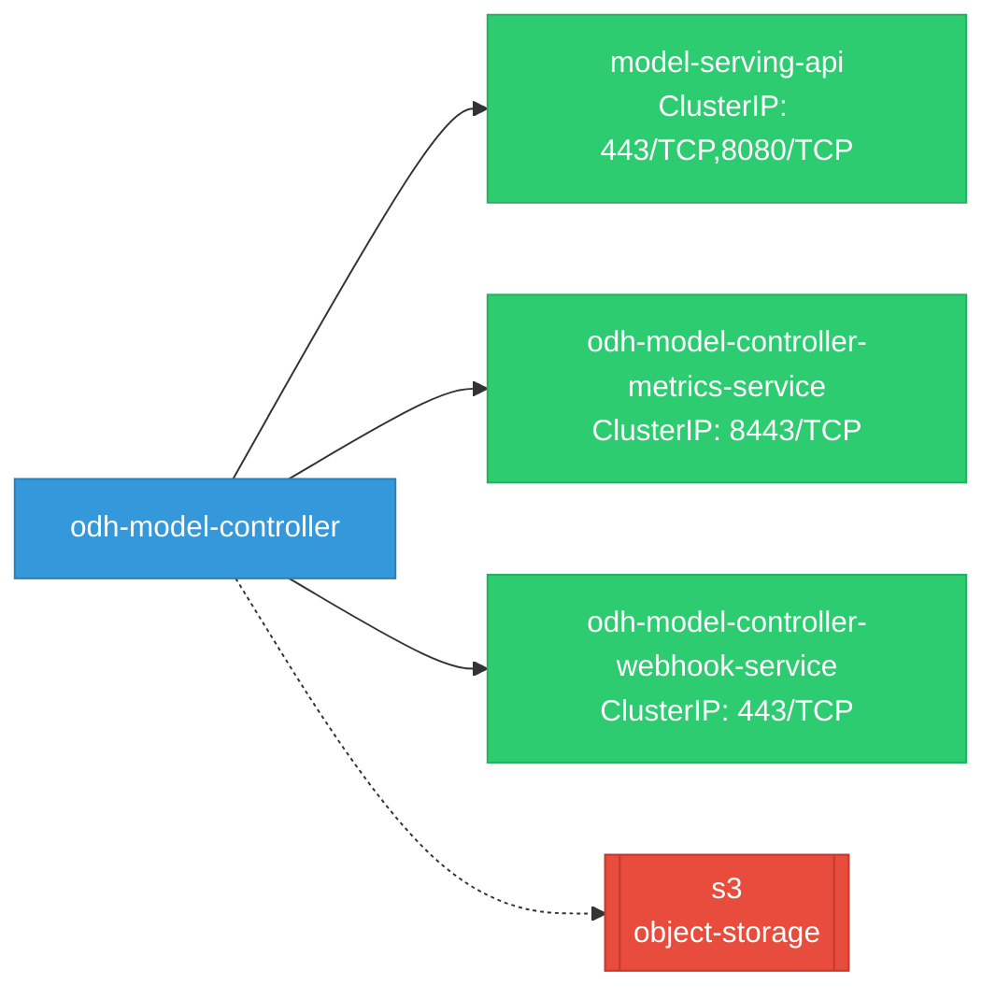
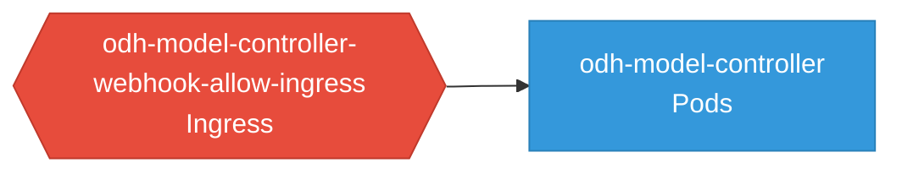

# odh-model-controller: Network

## Service Map

### Services

| Name | Type | Ports | Source |
|------|------|-------|--------|
| model-serving-api | ClusterIP | 443/TCP, 8080/TCP | [`kustomize:config/overlays/odh`](https://github.com/opendatahub-io/odh-model-controller/blob/43ebf90dd5af130a94cb3b1857f6ebd45ecd28cf/kustomize:config/overlays/odh) |
| odh-model-controller-metrics-service | ClusterIP | 8443/TCP | [`kustomize:config/overlays/odh`](https://github.com/opendatahub-io/odh-model-controller/blob/43ebf90dd5af130a94cb3b1857f6ebd45ecd28cf/kustomize:config/overlays/odh) |
| odh-model-controller-webhook-service | ClusterIP | 443/TCP | [`kustomize:config/overlays/odh`](https://github.com/opendatahub-io/odh-model-controller/blob/43ebf90dd5af130a94cb3b1857f6ebd45ecd28cf/kustomize:config/overlays/odh) |

### Ingress / Routing

| Kind | Name | Hosts | Paths | TLS | Source |
|------|------|-------|-------|-----|--------|
| Gateway | rbac-inferred |  |  | no | [`rbac/odh-model-controller-role`](https://github.com/opendatahub-io/odh-model-controller/blob/43ebf90dd5af130a94cb3b1857f6ebd45ecd28cf/rbac/odh-model-controller-role) |
| HTTPRoute | rbac-inferred |  |  | no | [`rbac/odh-model-controller-role`](https://github.com/opendatahub-io/odh-model-controller/blob/43ebf90dd5af130a94cb3b1857f6ebd45ecd28cf/rbac/odh-model-controller-role) |
| Ingress | rbac-inferred |  |  | no | [`rbac/odh-model-controller-role`](https://github.com/opendatahub-io/odh-model-controller/blob/43ebf90dd5af130a94cb3b1857f6ebd45ecd28cf/rbac/odh-model-controller-role) |

### Network Policies

| Name | Policy Types | Source |
|------|-------------|--------|
| odh-model-controller-webhook-allow-ingress |  | [`kustomize:config/overlays/odh`](https://github.com/opendatahub-io/odh-model-controller/blob/43ebf90dd5af130a94cb3b1857f6ebd45ecd28cf/kustomize:config/overlays/odh) |

## Network Policy Graph

Visual representation of NetworkPolicy rules. Ingress rules show what traffic is allowed into pods, egress rules show what traffic is allowed out.

