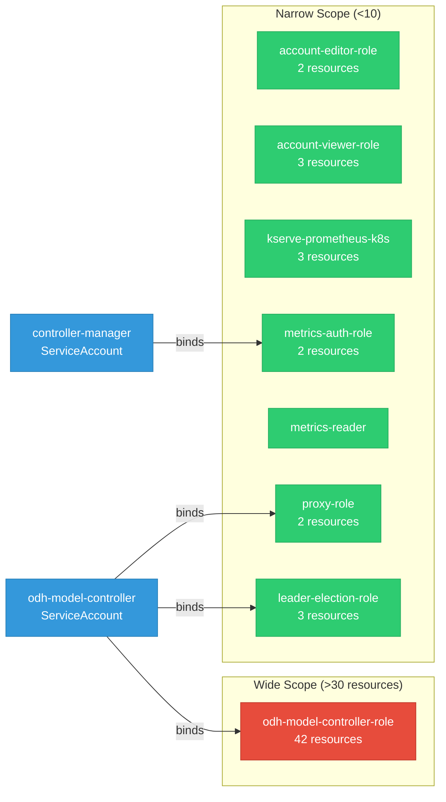

# odh-model-controller: RBAC

ServiceAccount bindings, roles, and resource permissions.

## RBAC Overview

This component defines a large RBAC surface (135 diagram lines). The graph below groups roles by permission scope.

## Bindings

Subject-to-role mappings defining who has access to what.

| Binding | Type | Role | Subject |
|---------|------|------|---------|
| metrics-auth-rolebinding | ClusterRoleBinding | metrics-auth-role | ServiceAccount/controller-manager |
| odh-model-controller-rolebinding-opendatahub | ClusterRoleBinding | odh-model-controller-role | ServiceAccount/odh-model-controller |
| proxy-rolebinding | ClusterRoleBinding | proxy-role | ServiceAccount/odh-model-controller |
| leader-election-rolebinding | RoleBinding | leader-election-role | ServiceAccount/odh-model-controller |

## Role Details

Per-rule breakdown of API groups, resources, and verbs for each role.

| Role | Kind | API Groups | Resources | Verbs |
|------|------|------------|-----------|-------|
| account-editor-role | ClusterRole |  | accounts | create, delete, get, list, patch, update, watch |
| account-editor-role | ClusterRole |  | accounts/finalizers | get, update |
| account-viewer-role | ClusterRole |  | accounts | get, list, watch |
| account-viewer-role | ClusterRole |  | accounts/status, accounts/finalizers | get, update |
| kserve-prometheus-k8s | ClusterRole |  | services, endpoints, pods | get, list, watch |
| metrics-auth-role | ClusterRole |  | tokenreviews | create |
| metrics-auth-role | ClusterRole |  | subjectaccessreviews | create |
| metrics-reader | ClusterRole |  |  | get |
| odh-model-controller-role | ClusterRole |  | configmaps, secrets, serviceaccounts, services | create, delete, get, list, patch, update, watch |
| odh-model-controller-role | ClusterRole |  | endpoints, namespaces, pods | create, get, list, patch, update, watch |
| odh-model-controller-role | ClusterRole |  | events | create, patch |
| odh-model-controller-role | ClusterRole |  | datascienceclusters | get, list, watch |
| odh-model-controller-role | ClusterRole |  | dscinitializations | get, list, watch |
| odh-model-controller-role | ClusterRole |  | ingresses | get, list, watch |
| odh-model-controller-role | ClusterRole |  | gateways | get, list, patch, update, watch |
| odh-model-controller-role | ClusterRole |  | gateways/finalizers | patch, update |
| odh-model-controller-role | ClusterRole |  | httproutes | get, list, watch |
| odh-model-controller-role | ClusterRole |  | hardwareprofiles | get, list, watch |
| odh-model-controller-role | ClusterRole |  | triggerauthentications | create, delete, get, list, patch, update, watch |
| odh-model-controller-role | ClusterRole |  | authpolicies | create, delete, get, list, patch, update, watch |
| odh-model-controller-role | ClusterRole |  | authpolicies/status | get, patch, update |
| odh-model-controller-role | ClusterRole |  | kuadrants | get, list, watch |
| odh-model-controller-role | ClusterRole |  | nodes, pods | get, list, watch |
| odh-model-controller-role | ClusterRole |  | podmonitors, servicemonitors | create, delete, get, list, patch, update, watch |
| odh-model-controller-role | ClusterRole |  | envoyfilters | create, delete, get, list, patch, update, watch |
| odh-model-controller-role | ClusterRole |  | networkpolicies | create, delete, get, list, patch, update, watch |
| odh-model-controller-role | ClusterRole |  | accounts | get, list, patch, update, watch |
| odh-model-controller-role | ClusterRole |  | accounts/finalizers | update |
| odh-model-controller-role | ClusterRole |  | accounts/status | get, list, update, watch |
| odh-model-controller-role | ClusterRole |  | authorinos | get, list, watch |
| odh-model-controller-role | ClusterRole |  | clusterrolebindings, rolebindings, roles | create, delete, get, list, patch, update, watch |
| odh-model-controller-role | ClusterRole |  | inferencegraphs, llminferenceserviceconfigs | get, list, watch |
| odh-model-controller-role | ClusterRole |  | inferencegraphs/finalizers, servingruntimes/finalizers | update |
| odh-model-controller-role | ClusterRole |  | inferenceservices | get, list, patch, update, watch |
| odh-model-controller-role | ClusterRole |  | inferenceservices/finalizers | create, delete, get, list, patch, update, watch |
| odh-model-controller-role | ClusterRole |  | llminferenceservices | get, list, patch, post, update, watch |
| odh-model-controller-role | ClusterRole |  | llminferenceservices/finalizers | patch, update |
| odh-model-controller-role | ClusterRole |  | llminferenceservices/status | get, patch, update |
| odh-model-controller-role | ClusterRole |  | servingruntimes | create, get, list, update, watch |
| proxy-role | ClusterRole |  | tokenreviews | create |
| proxy-role | ClusterRole |  | subjectaccessreviews | create |
| leader-election-role | Role |  | configmaps | get, list, watch, create, update, patch, delete |
| leader-election-role | Role |  | leases | get, list, watch, create, update, patch, delete |
| leader-election-role | Role |  | events | create, patch |

