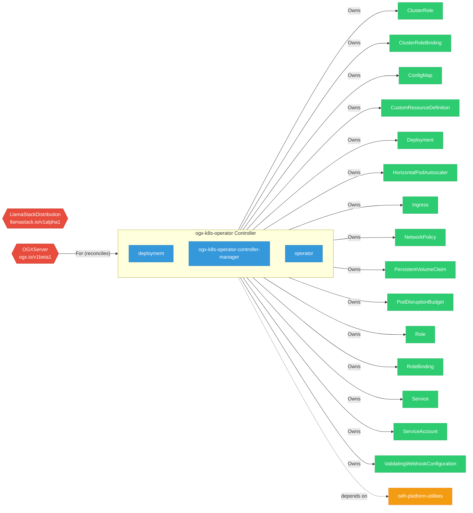

# ogx-k8s-operator

> **Architecture snapshot: 2026-09-07** (2026-09-07)

**Repository:** ogx-ai/ogx-k8s-operator  
**Analyzer:** arch-analyzer dev  
**Extracted:** 2026-09-07T03:59:02Z

## Summary

| Metric | Count |
|--------|-------|
| CRDs | 2 |
| Deployments | 3 |
| Services | 2 |
| Secrets | 2 |
| Cluster Roles | 5 |
| Controller Watches | 22 |

## Component Architecture

CRDs, controllers, and owned Kubernetes resources.

### CRDs

| Group | Version | Kind | Scope | Fields | Validation Rules | Discovery | Source |
|-------|---------|------|-------|--------|------------------|-----------|--------|
| llamastack.io | v1alpha1 | LlamaStackDistribution | Namespaced | 372 | 1 | YAML | [`config/crd/bases/llamastack.io_llamastackdistributions.yaml`](https://github.com/ogx-ai/ogx-k8s-operator/blob/e70c51de8847c4f108e84e6fb1a8aa7ab2bad7b4/config/crd/bases/llamastack.io_llamastackdistributions.yaml) |
| ogx.io | v1beta1 | OGXServer | Namespaced | 942 | 125 | YAML | [`config/crd/bases/ogx.io_ogxservers.yaml`](https://github.com/ogx-ai/ogx-k8s-operator/blob/e70c51de8847c4f108e84e6fb1a8aa7ab2bad7b4/config/crd/bases/ogx.io_ogxservers.yaml) |

## Dependencies

### Internal Platform Dependencies

| Component | Interaction |
|-----------|-------------|
| odh-platform-utilities | Go module dependency: github.com/opendatahub-io/odh-platform-utilities |

### Key External Dependencies

| Module | Version |
|--------|---------|
| github.com/go-logr/logr | v1.4.4 |
| github.com/prometheus-operator/prometheus-operator/pkg/apis/monitoring | v0.82.0 |
| k8s.io/api | v0.35.2 |
| k8s.io/api | v0.35.2 |
| k8s.io/apiextensions-apiserver | v0.35.1 |
| k8s.io/apiextensions-apiserver | v0.35.2 |
| k8s.io/apimachinery | v0.35.2 |
| k8s.io/apimachinery | v0.35.4 |
| k8s.io/client-go | v0.35.2 |
| k8s.io/client-go | v0.35.2 |
| sigs.k8s.io/controller-runtime | v0.23.3 |
| sigs.k8s.io/controller-runtime | v0.23.3 |

