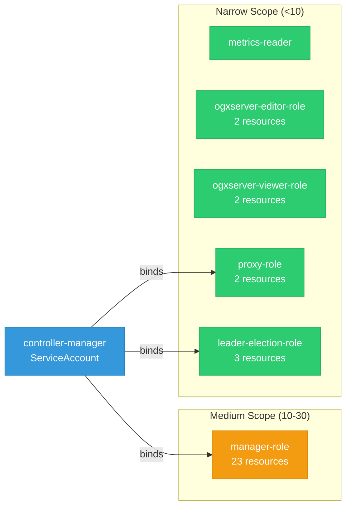

# ogx-k8s-operator: RBAC

ServiceAccount bindings, roles, and resource permissions.

## RBAC Overview

This component defines a large RBAC surface (81 diagram lines). The graph below groups roles by permission scope.

## Bindings

Subject-to-role mappings defining who has access to what.

| Binding | Type | Role | Subject |
|---------|------|------|---------|
| manager-rolebinding | ClusterRoleBinding | manager-role | ServiceAccount/controller-manager |
| proxy-rolebinding | ClusterRoleBinding | proxy-role | ServiceAccount/controller-manager |
| leader-election-rolebinding | RoleBinding | leader-election-role | ServiceAccount/controller-manager |

## Role Details

Per-rule breakdown of API groups, resources, and verbs for each role.

| Role | Kind | API Groups | Resources | Verbs |
|------|------|------------|-----------|-------|
| manager-role | ClusterRole |  | configmaps, persistentvolumeclaims | create, get, list, patch, update, watch |
| manager-role | ClusterRole |  | pods | list |
| manager-role | ClusterRole |  | secrets | get, list, watch |
| manager-role | ClusterRole |  | serviceaccounts, services | create, delete, get, list, patch, update, watch |
| manager-role | ClusterRole |  | customresourcedefinitions | get, list, watch |
| manager-role | ClusterRole |  | deployments | create, delete, get, list, patch, update, watch |
| manager-role | ClusterRole |  | replicasets | get, list, watch |
| manager-role | ClusterRole |  | horizontalpodautoscalers | create, delete, get, list, patch, update, watch |
| manager-role | ClusterRole |  | prometheusrules, servicemonitors | create, delete, get, list, patch, update, watch |
| manager-role | ClusterRole |  | ingresses, networkpolicies | create, delete, get, list, patch, update, watch |
| manager-role | ClusterRole |  | ogxservers | create, delete, get, list, patch, update, watch |
| manager-role | ClusterRole |  | ogxservers/finalizers | update |
| manager-role | ClusterRole |  | ogxservers/status | get, patch, update |
| manager-role | ClusterRole |  | poddisruptionbudgets | create, delete, get, list, patch, update, watch |
| manager-role | ClusterRole |  | clusterrolebindings | delete, get, list |
| manager-role | ClusterRole |  | clusterroles | get, list, watch |
| manager-role | ClusterRole |  | rolebindings | create, delete, get, list, patch, update, watch |
| manager-role | ClusterRole |  | securitycontextconstraints | use |
| manager-role | ClusterRole |  | securitycontextconstraints | use |
| metrics-reader | ClusterRole |  |  | get |
| ogxserver-editor-role | ClusterRole |  | ogxservers | create, delete, get, list, patch, update, watch |
| ogxserver-editor-role | ClusterRole |  | ogxservers/status | get |
| ogxserver-viewer-role | ClusterRole |  | ogxservers | get, list, watch |
| ogxserver-viewer-role | ClusterRole |  | ogxservers/status | get |
| proxy-role | ClusterRole |  | tokenreviews | create |
| proxy-role | ClusterRole |  | subjectaccessreviews | create |
| leader-election-role | Role |  | configmaps | get, list, watch, create, update, patch, delete |
| leader-election-role | Role |  | leases | get, list, watch, create, update, patch, delete |
| leader-election-role | Role |  | events | create, patch |

