# opendatahub-operator

> **Architecture snapshot: 2026-09-07** (2026-09-07)

**Repository:** opendatahub-io/opendatahub-operator  
**Analyzer:** arch-analyzer dev  
**Extracted:** 2026-09-07T03:56:59Z

## Summary

| Metric | Count |
|--------|-------|
| CRDs | 1 |
| Deployments | 22 |
| Services | 3 |
| Secrets | 4 |
| Cluster Roles | 19 |
| Controller Watches | 51 |

## Component Architecture

CRDs, controllers, and owned Kubernetes resources.

```mermaid
graph LR
    %% Component architecture for opendatahub-operator

    classDef crd fill:#e74c3c,stroke:#c0392b,color:#fff
    classDef controller fill:#3498db,stroke:#2980b9,color:#fff
    classDef owned fill:#2ecc71,stroke:#27ae60,color:#fff
    classDef external fill:#95a5a6,stroke:#7f8c8d,color:#fff
    classDef dep fill:#f39c12,stroke:#e67e22,color:#fff

    subgraph controller["opendatahub-operator Controller"]
        dep_1["aws-cloud-manager-operator"]
        class dep_1 controller
        dep_2["aws-cloud-manager-operator"]
        class dep_2 controller
        dep_3["aws-cloud-manager-operator"]
        class dep_3 controller
        dep_4["azure-cloud-manager-operator"]
        class dep_4 controller
        dep_5["azure-cloud-manager-operator"]
        class dep_5 controller
        dep_6["azure-cloud-manager-operator"]
        class dep_6 controller
        dep_7["controller-manager"]
        class dep_7 controller
        dep_8["controller-manager"]
        class dep_8 controller
        dep_9["controller-manager"]
        class dep_9 controller
        dep_10["controller-manager"]
        class dep_10 controller
        dep_11["controller-manager"]
        class dep_11 controller
        dep_12["controller-manager"]
        class dep_12 controller
        dep_13["controller-manager"]
        class dep_13 controller
        dep_14["coreweave-cloud-manager-operator"]
        class dep_14 controller
        dep_15["coreweave-cloud-manager-operator"]
        class dep_15 controller
        dep_16["coreweave-cloud-manager-operator"]
        class dep_16 controller
        dep_17["rhods-operator"]
        class dep_17 controller
        dep_18["rhods-operator"]
        class dep_18 controller
        dep_19["rhods-operator"]
        class dep_19 controller
        dep_20["rhods-operator"]
        class dep_20 controller
        dep_21["rhods-operator"]
        class dep_21 controller
        dep_22["rhods-operator"]
        class dep_22 controller
    end

    crd_FeatureTracker{{"FeatureTracker\nfeatures.opendatahub.io/v1"}}
    class crd_FeatureTracker crd
    controller -->|"Owns"| owned_23["ClusterRole"]
    class owned_23 owned
    controller -->|"Owns"| owned_24["ClusterRoleBinding"]
    class owned_24 owned
    controller -->|"Owns"| owned_25["ConfigMap"]
    class owned_25 owned
    controller -->|"Owns"| owned_26["Deployment"]
    class owned_26 owned
    controller -->|"Owns"| owned_27["MutatingWebhookConfiguration"]
    class owned_27 owned
    controller -->|"Owns"| owned_28["NetworkPolicy"]
    class owned_28 owned
    controller -->|"Owns"| owned_29["PodMonitor"]
    class owned_29 owned
    controller -->|"Owns"| owned_30["PrometheusRule"]
    class owned_30 owned
    controller -->|"Owns"| owned_31["Role"]
    class owned_31 owned
    controller -->|"Owns"| owned_32["RoleBinding"]
    class owned_32 owned
    controller -->|"Owns"| owned_33["Secret"]
    class owned_33 owned
    controller -->|"Owns"| owned_34["SecurityContextConstraints"]
    class owned_34 owned
    controller -->|"Owns"| owned_35["Service"]
    class owned_35 owned
    controller -->|"Owns"| owned_36["ServiceAccount"]
    class owned_36 owned
    controller -->|"Owns"| owned_37["ServiceMonitor"]
    class owned_37 owned
    controller -->|"Owns"| owned_38["ValidatingWebhookConfiguration"]
    class owned_38 owned
    watch_39["Auth"] -->|"Watches"| controller
    class watch_39 external
    watch_40["ClusterRole"] -->|"Watches"| controller
    class watch_40 external
    watch_41["Namespace"] -->|"Watches"| controller
    class watch_41 external
    controller -.->|"depends on"| odh_42["models-as-a-service"]
    class odh_42 dep
    controller -.->|"depends on"| odh_43["odh-platform-utilities"]
    class odh_43 dep
    controller -.->|"depends on"| odh_44["opendatahub-operator"]
    class odh_44 dep
    controller -.->|"depends on"| odh_45["opendatahub-operator"]
    class odh_45 dep
    controller -.->|"depends on"| odh_46["opendatahub-operator"]
    class odh_46 dep
    controller -.->|"depends on"| odh_47["opendatahub-operator"]
    class odh_47 dep
    controller -.->|"depends on"| odh_48["opendatahub-operator"]
    class odh_48 dep
    controller -.->|"depends on"| odh_49["opendatahub-operator"]
    class odh_49 dep
    controller -.->|"depends on"| odh_50["opendatahub-operator"]
    class odh_50 dep
    controller -.->|"depends on"| odh_51["opendatahub-operator"]
    class odh_51 dep
    controller -.->|"depends on"| odh_52["opendatahub-operator"]
    class odh_52 dep
    controller -.->|"depends on"| odh_53["opendatahub-operator"]
    class odh_53 dep
    controller -.->|"depends on"| odh_54["opendatahub-operator"]
    class odh_54 dep
```

### CRDs

| Group | Version | Kind | Scope | Fields | Validation Rules | Discovery | Source |
|-------|---------|------|-------|--------|------------------|-----------|--------|
| features.opendatahub.io | v1 | FeatureTracker | Cluster | 19 | 0 | Go AST | [`/home/runner/work/_temp/arch-analyzer-repos/opendatahub-operator/api/features/v1/features_types.go`](https://github.com/opendatahub-io/opendatahub-operator/blob/a51f8abe6d56585efe2082a3bcc90351f9b4eefc//home/runner/work/_temp/arch-analyzer-repos/opendatahub-operator/api/features/v1/features_types.go) |

## Dependencies

### Internal Platform Dependencies

| Component | Interaction |
|-----------|-------------|
| models-as-a-service | Go module dependency: github.com/opendatahub-io/models-as-a-service/maas-controller |
| odh-platform-utilities | Go module dependency: github.com/opendatahub-io/odh-platform-utilities/framework |
| opendatahub-operator | Go module dependency: github.com/opendatahub-io/opendatahub-operator/pkg/failureclassifier |
| opendatahub-operator | Go module dependency: github.com/opendatahub-io/opendatahub-operator/pkg/clusterhealth |
| opendatahub-operator | Go module dependency: github.com/opendatahub-io/opendatahub-operator/pkg/mcptools |
| opendatahub-operator | Go module dependency: github.com/opendatahub-io/opendatahub-operator/pkg/clusterhealth |
| opendatahub-operator | Go module dependency: github.com/opendatahub-io/opendatahub-operator/pkg/scoperules |
| opendatahub-operator | Go module dependency: github.com/opendatahub-io/opendatahub-operator/pkg/clusterhealth |
| opendatahub-operator | Go module dependency: github.com/opendatahub-io/opendatahub-operator/pkg/failureclassifier |
| opendatahub-operator | Go module dependency: github.com/opendatahub-io/opendatahub-operator/pkg/scoperules |
| opendatahub-operator | Go module dependency: github.com/opendatahub-io/opendatahub-operator/pkg/clusterhealth |
| opendatahub-operator | Go module dependency: github.com/opendatahub-io/opendatahub-operator/pkg/clusterhealth |
| opendatahub-operator | Go module dependency: github.com/opendatahub-io/opendatahub-operator/pkg/failureclassifier |

### Key External Dependencies

| Module | Version |
|--------|---------|
| github.com/go-logr/logr | v1.4.3 |
| github.com/operator-framework/api | v0.42.0 |
| github.com/prometheus-operator/prometheus-operator/pkg/apis/monitoring | v0.74.0 |
| github.com/prometheus/client_golang | v1.23.2 |
| k8s.io/api | v0.35.3 |
| k8s.io/api | v0.36.3 |
| k8s.io/api | v0.35.3 |
| k8s.io/api | v0.36.2 |
| k8s.io/apiextensions-apiserver | v0.36.1 |
| k8s.io/apimachinery | v0.35.3 |
| k8s.io/apimachinery | v0.36.2 |
| k8s.io/apimachinery | v0.35.3 |
| k8s.io/apimachinery | v0.35.3 |
| k8s.io/apimachinery | v0.36.3 |
| k8s.io/apimachinery | v0.35.3 |
| k8s.io/client-go | v0.35.3 |
| k8s.io/client-go | v0.36.3 |
| k8s.io/client-go | v0.35.3 |
| k8s.io/client-go | v0.35.3 |
| k8s.io/client-go | v0.35.3 |
| k8s.io/client-go | v0.36.1 |
| sigs.k8s.io/controller-runtime | v0.22.4 |
| sigs.k8s.io/controller-runtime | v0.22.4 |
| sigs.k8s.io/controller-runtime | v0.24.1 |
| sigs.k8s.io/controller-runtime | v0.22.4 |
| sigs.k8s.io/controller-runtime | v0.22.4 |

