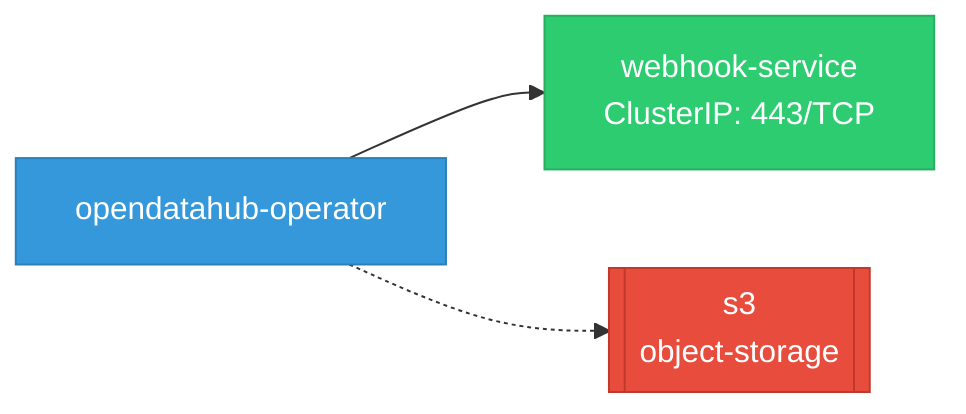
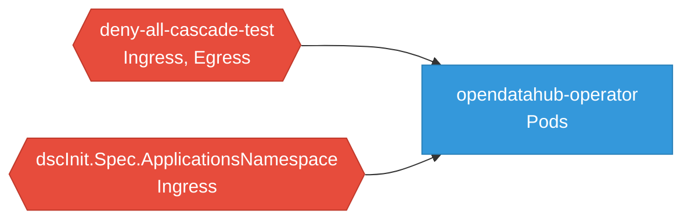

# opendatahub-operator: Network

## Service Map

*1 unique services (3 total, duplicates from test fixtures collapsed).*

### Services

| Name | Type | Ports | Source |
|------|------|-------|--------|
| webhook-service | ClusterIP | 443/TCP | [`config/rhaii/webhook/service.yaml`](https://github.com/opendatahub-io/opendatahub-operator/blob/a51f8abe6d56585efe2082a3bcc90351f9b4eefc/config/rhaii/webhook/service.yaml) |
| webhook-service | ClusterIP | 443/TCP | [`config/rhoai/webhook/service.yaml`](https://github.com/opendatahub-io/opendatahub-operator/blob/a51f8abe6d56585efe2082a3bcc90351f9b4eefc/config/rhoai/webhook/service.yaml) |
| webhook-service | ClusterIP | 443/TCP | [`config/webhook/service.yaml`](https://github.com/opendatahub-io/opendatahub-operator/blob/a51f8abe6d56585efe2082a3bcc90351f9b4eefc/config/webhook/service.yaml) |

### Network Policies

| Name | Policy Types | Source |
|------|-------------|--------|
| deny-all-cascade-test | Ingress, Egress | [`cmd/mcp-server/scenarios/cascading-failure-networkpolicy.yaml`](https://github.com/opendatahub-io/opendatahub-operator/blob/a51f8abe6d56585efe2082a3bcc90351f9b4eefc/cmd/mcp-server/scenarios/cascading-failure-networkpolicy.yaml) |
| dscInit.Spec.ApplicationsNamespace | Ingress | [`internal/controller/dscinitialization/utils.go:160`](https://github.com/opendatahub-io/opendatahub-operator/blob/a51f8abe6d56585efe2082a3bcc90351f9b4eefc/internal/controller/dscinitialization/utils.go#L160) |

## Network Policy Graph

Visual representation of NetworkPolicy rules. Ingress rules show what traffic is allowed into pods, egress rules show what traffic is allowed out.

