# opendatahub-operator: RBAC

ServiceAccount bindings, roles, and resource permissions.

## RBAC Overview

This component defines a large RBAC surface (81 diagram lines). The graph below groups roles by permission scope.

```mermaid
graph LR
    classDef wide fill:#e74c3c,stroke:#c0392b,color:#fff
    classDef medium fill:#f39c12,stroke:#d68910,color:#fff
    classDef narrow fill:#2ecc71,stroke:#27ae60,color:#fff
    classDef subject fill:#3498db,stroke:#2980b9,color:#fff

    subgraph nar["Narrow Scope (<10)"]
    auth_editor_role["auth-editor-role\n2 resources"]:::narrow
    auth_viewer_role["auth-viewer-role\n2 resources"]:::narrow
    dashboard_editor_role["dashboard-editor-role\n2 resources"]:::narrow
    dashboard_viewer_role["dashboard-viewer-role\n2 resources"]:::narrow
    datasciencepipelines_editor_role["datasciencepipelines-editor-role\n2 resources"]:::narrow
    datasciencepipelines_viewer_role["datasciencepipelines-viewer-role\n2 resources"]:::narrow
    kserve_editor_role["kserve-editor-role\n2 resources"]:::narrow
    kserve_viewer_role["kserve-viewer-role\n2 resources"]:::narrow
    kueue_editor_role["kueue-editor-role\n2 resources"]:::narrow
    kueue_viewer_role["kueue-viewer-role\n2 resources"]:::narrow
    metrics_reader["metrics-reader"]:::narrow
    modelregistry_editor_role["modelregistry-editor-role\n2 resources"]:::narrow
    modelregistry_viewer_role["modelregistry-viewer-role\n2 resources"]:::narrow
    ray_editor_role["ray-editor-role\n2 resources"]:::narrow
    ray_viewer_role["ray-viewer-role\n2 resources"]:::narrow
    trustyai_editor_role["trustyai-editor-role\n2 resources"]:::narrow
    trustyai_viewer_role["trustyai-viewer-role\n2 resources"]:::narrow
    workbenches_editor_role["workbenches-editor-role\n2 resources"]:::narrow
    workbenches_viewer_role["workbenches-viewer-role\n2 resources"]:::narrow
    end

    subj_controller_manager["controller-manager\nServiceAccount"]:::subject
    subj_controller_manager -->|binds| controller_manager_role
```

## Bindings

Subject-to-role mappings defining who has access to what.

| Binding | Type | Role | Subject |
|---------|------|------|---------|
| controller-manager-rolebinding | ClusterRoleBinding | controller-manager-role | ServiceAccount/controller-manager |

## Role Details

Per-rule breakdown of API groups, resources, and verbs for each role.

| Role | Kind | API Groups | Resources | Verbs |
|------|------|------------|-----------|-------|
| auth-editor-role | ClusterRole |  | auths | create, delete, get, list, patch, update, watch |
| auth-editor-role | ClusterRole |  | auths/status | get |
| auth-viewer-role | ClusterRole |  | auths | get, list, watch |
| auth-viewer-role | ClusterRole |  | auths/status | get |
| dashboard-editor-role | ClusterRole |  | dashboards | create, delete, get, list, patch, update, watch |
| dashboard-editor-role | ClusterRole |  | dashboards/status | get |
| dashboard-viewer-role | ClusterRole |  | dashboards | get, list, watch |
| dashboard-viewer-role | ClusterRole |  | dashboards/status | get |
| datasciencepipelines-editor-role | ClusterRole |  | datasciencepipelines | create, delete, get, list, patch, update, watch |
| datasciencepipelines-editor-role | ClusterRole |  | datasciencepipelines/status | get |
| datasciencepipelines-viewer-role | ClusterRole |  | datasciencepipelines | get, list, watch |
| datasciencepipelines-viewer-role | ClusterRole |  | datasciencepipelines/status | get |
| kserve-editor-role | ClusterRole |  | kserves | create, delete, get, list, patch, update, watch |
| kserve-editor-role | ClusterRole |  | kserves/status | get |
| kserve-viewer-role | ClusterRole |  | kserves | get, list, watch |
| kserve-viewer-role | ClusterRole |  | kserves/status | get |
| kueue-editor-role | ClusterRole |  | kueues | create, delete, get, list, patch, update, watch |
| kueue-editor-role | ClusterRole |  | kueues/status | get |
| kueue-viewer-role | ClusterRole |  | kueues | get, list, watch |
| kueue-viewer-role | ClusterRole |  | kueues/status | get |
| metrics-reader | ClusterRole |  |  | get |
| modelregistry-editor-role | ClusterRole |  | modelregistries | create, delete, get, list, patch, update, watch |
| modelregistry-editor-role | ClusterRole |  | modelregistries/status | get |
| modelregistry-viewer-role | ClusterRole |  | modelregistries | get, list, watch |
| modelregistry-viewer-role | ClusterRole |  | modelregistries/status | get |
| ray-editor-role | ClusterRole |  | rays | create, delete, get, list, patch, update, watch |
| ray-editor-role | ClusterRole |  | rays/status | get |
| ray-viewer-role | ClusterRole |  | rays | get, list, watch |
| ray-viewer-role | ClusterRole |  | rays/status | get |
| trustyai-editor-role | ClusterRole |  | trustyais | create, delete, get, list, patch, update, watch |
| trustyai-editor-role | ClusterRole |  | trustyais/status | get |
| trustyai-viewer-role | ClusterRole |  | trustyais | get, list, watch |
| trustyai-viewer-role | ClusterRole |  | trustyais/status | get |
| workbenches-editor-role | ClusterRole |  | workbenches | create, delete, get, list, patch, update, watch |
| workbenches-editor-role | ClusterRole |  | workbenches/status | get |
| workbenches-viewer-role | ClusterRole |  | workbenches | get, list, watch |
| workbenches-viewer-role | ClusterRole |  | workbenches/status | get |

