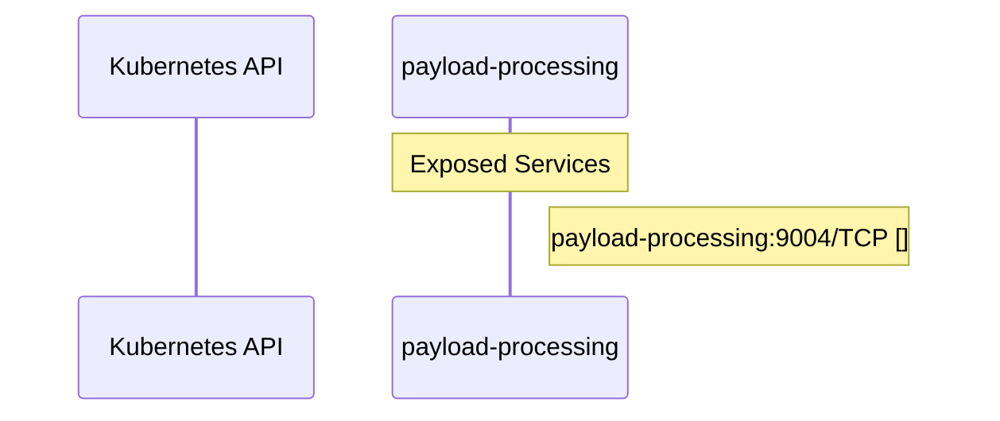

# praxis-extproc: Dataflow

## Controller Watches

Kubernetes resources this controller monitors for changes. Each watch triggers reconciliation when the watched resource is created, updated, or deleted.

No controller watches found in analyzed sources.

## Reconciliation Flow

How the controller interacts with the Kubernetes API during reconciliation.

## Configuration

ConfigMaps and Helm values that control this component's runtime behavior.

### ConfigMaps

| Name | Data Keys | Source |
|------|-----------|--------|
| payload-processing-plugins | extproc.yaml, pre-extproc.yaml | [`deploy/base/config/configmap.yaml`](https://github.com/opendatahub-io/praxis-extproc/blob/7b3635d211870144f8de7829e3b0e3550e76382e/deploy/base/config/configmap.yaml) |
| payload-processing-plugins | extproc.yaml | [`deploy/overlays/demo/workload/configmap-patch.yaml`](https://github.com/opendatahub-io/praxis-extproc/blob/7b3635d211870144f8de7829e3b0e3550e76382e/deploy/overlays/demo/workload/configmap-patch.yaml) |

