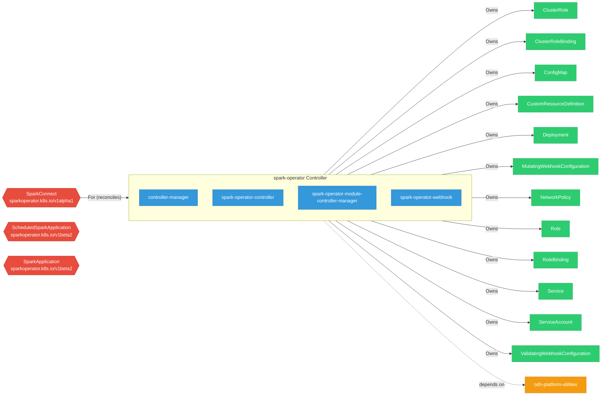

# spark-operator

> **Architecture snapshot: 2026-09-07** (2026-09-07)

**Repository:** kubeflow/spark-operator  
**Analyzer:** arch-analyzer dev  
**Extracted:** 2026-09-07T03:57:01Z

## Summary

| Metric | Count |
|--------|-------|
| CRDs | 3 |
| Deployments | 4 |
| Services | 1 |
| Secrets | 1 |
| Cluster Roles | 6 |
| Controller Watches | 15 |

## Component Architecture

CRDs, controllers, and owned Kubernetes resources.

### CRDs

| Group | Version | Kind | Scope | Fields | Validation Rules | Discovery | Source |
|-------|---------|------|-------|--------|------------------|-----------|--------|
| sparkoperator.k8s.io | v1alpha1 | SparkConnect | Namespaced | 95 | 0 | YAML | [`config/crd/bases/sparkoperator.k8s.io_sparkconnects.yaml`](https://github.com/kubeflow/spark-operator/blob/ba4f90ed3a4296379cb602b3bcab96524cb92690/config/crd/bases/sparkoperator.k8s.io_sparkconnects.yaml) |
| sparkoperator.k8s.io | v1beta2 | ScheduledSparkApplication | Namespaced | 1741 | 0 | YAML | [`config/crd/bases/sparkoperator.k8s.io_scheduledsparkapplications.yaml`](https://github.com/kubeflow/spark-operator/blob/ba4f90ed3a4296379cb602b3bcab96524cb92690/config/crd/bases/sparkoperator.k8s.io_scheduledsparkapplications.yaml) |
| sparkoperator.k8s.io | v1beta2 | SparkApplication | Namespaced | 1744 | 0 | YAML | [`config/crd/bases/sparkoperator.k8s.io_sparkapplications.yaml`](https://github.com/kubeflow/spark-operator/blob/ba4f90ed3a4296379cb602b3bcab96524cb92690/config/crd/bases/sparkoperator.k8s.io_sparkapplications.yaml) |

## Dependencies

### Internal Platform Dependencies

| Component | Interaction |
|-----------|-------------|
| odh-platform-utilities | Go module dependency: github.com/opendatahub-io/odh-platform-utilities |

### Key External Dependencies

| Module | Version |
|--------|---------|
| github.com/go-logr/logr | v1.4.3 |
| github.com/prometheus/client_golang | v1.23.2 |
| k8s.io/api | v0.35.4 |
| k8s.io/api | v0.35.2 |
| k8s.io/apiextensions-apiserver | v0.35.2 |
| k8s.io/apiextensions-apiserver | v0.35.4 |
| k8s.io/apimachinery | v0.35.4 |
| k8s.io/apimachinery | v0.35.4 |
| k8s.io/apiserver | v0.35.4 |
| k8s.io/client-go | v0.35.2 |
| k8s.io/client-go | v0.35.4 |
| sigs.k8s.io/controller-runtime | v0.23.3 |
| sigs.k8s.io/controller-runtime | v0.23.3 |

