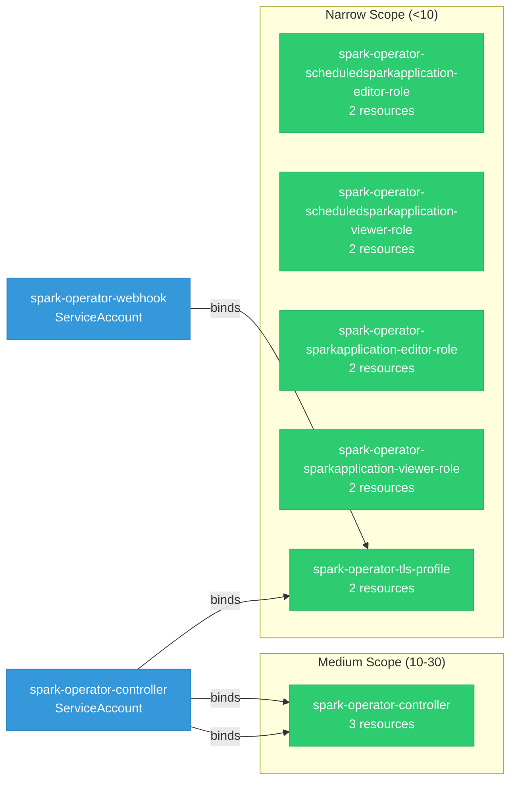

# spark-operator: RBAC

ServiceAccount bindings, roles, and resource permissions.

## RBAC Overview

This component defines a large RBAC surface (77 diagram lines). The graph below groups roles by permission scope.

## Bindings

Subject-to-role mappings defining who has access to what.

| Binding | Type | Role | Subject |
|---------|------|------|---------|
| spark-operator-controller | ClusterRoleBinding | spark-operator-controller | ServiceAccount/spark-operator-controller |
| spark-operator-tls-profile | ClusterRoleBinding | spark-operator-tls-profile | ServiceAccount/spark-operator-controller |
| spark-operator-tls-profile | ClusterRoleBinding | spark-operator-tls-profile | ServiceAccount/spark-operator-webhook |
| spark-operator-controller | RoleBinding | spark-operator-controller | ServiceAccount/spark-operator-controller |

## Role Details

Per-rule breakdown of API groups, resources, and verbs for each role.

| Role | Kind | API Groups | Resources | Verbs |
|------|------|------------|-----------|-------|
| spark-operator-controller | ClusterRole |  | configmaps | create, get, list, patch, update, watch |
| spark-operator-controller | ClusterRole |  | events | create, patch, update |
| spark-operator-controller | ClusterRole |  | pods | create, delete, get, list, update, watch |
| spark-operator-controller | ClusterRole |  | services | create, delete, get, list, patch, update, watch |
| spark-operator-controller | ClusterRole |  | customresourcedefinitions | get |
| spark-operator-controller | ClusterRole |  | ingresses | create, delete, get, update |
| spark-operator-controller | ClusterRole |  | poddisruptionbudgets | create, delete, get, list, watch |
| spark-operator-controller | ClusterRole |  | scheduledsparkapplications, sparkconnects | get, list, watch |
| spark-operator-controller | ClusterRole |  | scheduledsparkapplications/finalizers, scheduledsparkapplications/status, sparkapplications/finalizers, sparkapplications/status, sparkconnects/finalizers, sparkconnects/status | update |
| spark-operator-controller | ClusterRole |  | sparkapplications | create, delete, get, list, watch |
| spark-operator-scheduledsparkapplication-editor-role | ClusterRole |  | scheduledsparkapplications | create, delete, get, list, patch, update, watch |
| spark-operator-scheduledsparkapplication-editor-role | ClusterRole |  | scheduledsparkapplications/status | get |
| spark-operator-scheduledsparkapplication-viewer-role | ClusterRole |  | scheduledsparkapplications | get, list, watch |
| spark-operator-scheduledsparkapplication-viewer-role | ClusterRole |  | scheduledsparkapplications/status | get |
| spark-operator-sparkapplication-editor-role | ClusterRole |  | sparkapplications | create, delete, get, list, patch, update, watch |
| spark-operator-sparkapplication-editor-role | ClusterRole |  | sparkapplications/status | get |
| spark-operator-sparkapplication-viewer-role | ClusterRole |  | sparkapplications | get, list, watch |
| spark-operator-sparkapplication-viewer-role | ClusterRole |  | sparkapplications/status | get |
| spark-operator-tls-profile | ClusterRole |  | apiservers | get |
| spark-operator-tls-profile | ClusterRole |  | apiservers | list, watch |
| spark-operator-controller | Role |  | events | create, update, patch |
| spark-operator-controller | Role |  | leases | create |
| spark-operator-controller | Role |  | leases | get, update |

