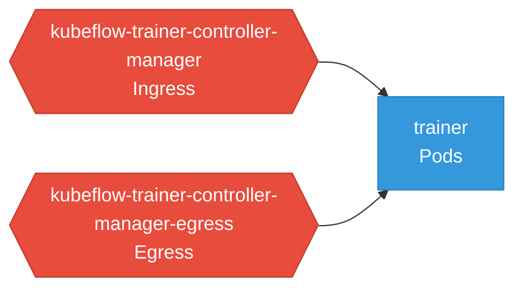

# trainer: Network

### Services

No services found in analyzed sources.

### Network Policies

| Name | Policy Types | Source |
|------|-------------|--------|
| kubeflow-trainer-controller-manager | Ingress | [`manifests/rhoai/networkpolicy-ingress.yaml`](https://github.com/kubeflow/trainer/blob/24c87a6591d04a247b7408d19cddda6bd434c842/manifests/rhoai/networkpolicy-ingress.yaml) |
| kubeflow-trainer-controller-manager-egress | Egress | [`manifests/rhoai/networkpolicy-egress.yaml`](https://github.com/kubeflow/trainer/blob/24c87a6591d04a247b7408d19cddda6bd434c842/manifests/rhoai/networkpolicy-egress.yaml) |

## Network Policy Graph

Visual representation of NetworkPolicy rules. Ingress rules show what traffic is allowed into pods, egress rules show what traffic is allowed out.

