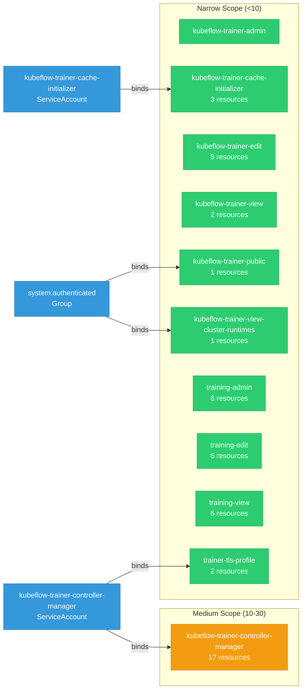

# trainer: RBAC

ServiceAccount bindings, roles, and resource permissions.

## RBAC Overview

This component defines a large RBAC surface (123 diagram lines). The graph below groups roles by permission scope.

## Bindings

Subject-to-role mappings defining who has access to what.

| Binding | Type | Role | Subject |
|---------|------|------|---------|
| kubeflow-trainer-controller-manager | ClusterRoleBinding | kubeflow-trainer-controller-manager | ServiceAccount/kubeflow-trainer-controller-manager |
| kubeflow-trainer-view-cluster-runtimes | ClusterRoleBinding | kubeflow-trainer-view-cluster-runtimes | Group/system:authenticated |
| trainer-tls-profile | ClusterRoleBinding | trainer-tls-profile | ServiceAccount/kubeflow-trainer-controller-manager |
| kubeflow-trainer-cache-initializer | RoleBinding | kubeflow-trainer-cache-initializer | ServiceAccount/kubeflow-trainer-cache-initializer |
| kubeflow-trainer-public | RoleBinding | kubeflow-trainer-public | Group/system:authenticated |

## Role Details

Per-rule breakdown of API groups, resources, and verbs for each role.

| Role | Kind | API Groups | Resources | Verbs |
|------|------|------------|-----------|-------|
| kubeflow-trainer-cache-initializer | ClusterRole |  | leaderworkersets | create, get, list, watch |
| kubeflow-trainer-cache-initializer | ClusterRole |  | services | create, get, list, watch |
| kubeflow-trainer-cache-initializer | ClusterRole |  | serviceaccounts | create, delete, get, list, watch |
| kubeflow-trainer-controller-manager | ClusterRole |  | configmaps, secrets | create, get, list, patch, update, watch |
| kubeflow-trainer-controller-manager | ClusterRole |  | limitranges | get, list, watch |
| kubeflow-trainer-controller-manager | ClusterRole |  | events | create, patch, update, watch |
| kubeflow-trainer-controller-manager | ClusterRole |  | mutatingwebhookconfigurations, validatingwebhookconfigurations | get, list, update, watch |
| kubeflow-trainer-controller-manager | ClusterRole |  | leases | create, get, list, update |
| kubeflow-trainer-controller-manager | ClusterRole |  | jobsets | create, delete, get, list, patch, update, watch |
| kubeflow-trainer-controller-manager | ClusterRole |  | runtimeclasses | get, list, watch |
| kubeflow-trainer-controller-manager | ClusterRole |  | podgroups | create, get, list, patch, update, watch |
| kubeflow-trainer-controller-manager | ClusterRole |  | clustertrainingruntimes, trainingruntimes, trainjobs | get, list, patch, update, watch |
| kubeflow-trainer-controller-manager | ClusterRole |  | clustertrainingruntimes/finalizers, trainingruntimes/finalizers, trainjobs/finalizers, trainjobs/status | get, patch, update |
| kubeflow-trainer-edit | ClusterRole |  | trainingruntimes | get, list, watch |
| kubeflow-trainer-edit | ClusterRole |  | trainjobs | create, patch, get, list, watch, delete |
| kubeflow-trainer-edit | ClusterRole |  | pods, pods/log, events | get, list, watch |
| kubeflow-trainer-view | ClusterRole |  | trainingruntimes, trainjobs | get, list, watch |
| kubeflow-trainer-view-cluster-runtimes | ClusterRole |  | clustertrainingruntimes | get, list, watch |
| trainer-tls-profile | ClusterRole |  | apiservers | get |
| trainer-tls-profile | ClusterRole |  | apiservers | list, watch |
| training-admin | ClusterRole |  | trainjobs, trainingruntimes, clustertrainingruntimes | create, delete, get, list, patch, update, watch |
| training-admin | ClusterRole |  | trainjobs/status, trainingruntimes/status, clustertrainingruntimes/status | get |
| training-edit | ClusterRole |  | trainjobs | create, delete, get, list, patch, update, watch |
| training-edit | ClusterRole |  | trainjobs/status | get |
| training-edit | ClusterRole |  | trainingruntimes, clustertrainingruntimes | get, list, watch |
| training-edit | ClusterRole |  | trainingruntimes/status, clustertrainingruntimes/status | get |
| training-view | ClusterRole |  | trainjobs, trainingruntimes, clustertrainingruntimes | get, list, watch |
| training-view | ClusterRole |  | trainjobs/status, trainingruntimes/status, clustertrainingruntimes/status | get |
| kubeflow-trainer-public | Role |  | configmaps | get, list, watch |

