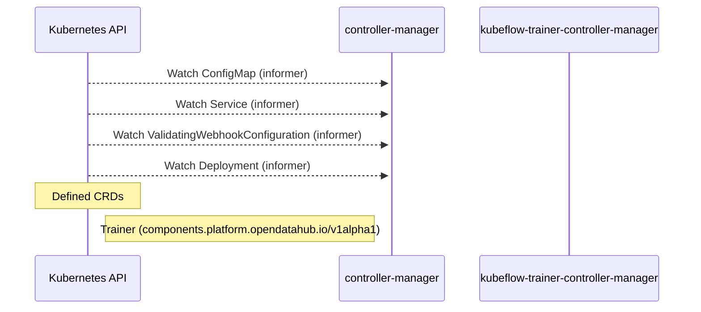

# trainer-operator: Dataflow

## Controller Watches

Kubernetes resources this controller monitors for changes. Each watch triggers reconciliation when the watched resource is created, updated, or deleted.

| Type | GVK | Source |
|------|-----|--------|
| Watches | /v1/ConfigMap | [`internal/controller/trainer_controller.go:200`](https://github.com/opendatahub-io/trainer-operator/blob/90322983edf391c7adb195654221cc83d172b2a3/internal/controller/trainer_controller.go#L200) |
| Watches | /v1/Service | [`internal/controller/trainer_controller.go:199`](https://github.com/opendatahub-io/trainer-operator/blob/90322983edf391c7adb195654221cc83d172b2a3/internal/controller/trainer_controller.go#L199) |
| Watches | admissionregistration.k8s.io/v1/ValidatingWebhookConfiguration | [`internal/controller/trainer_controller.go:201`](https://github.com/opendatahub-io/trainer-operator/blob/90322983edf391c7adb195654221cc83d172b2a3/internal/controller/trainer_controller.go#L201) |
| Watches | apps/v1/Deployment | [`internal/controller/trainer_controller.go:197`](https://github.com/opendatahub-io/trainer-operator/blob/90322983edf391c7adb195654221cc83d172b2a3/internal/controller/trainer_controller.go#L197) |

## Reconciliation Flow

How the controller interacts with the Kubernetes API during reconciliation.

## Configuration

ConfigMaps and Helm values that control this component's runtime behavior.

