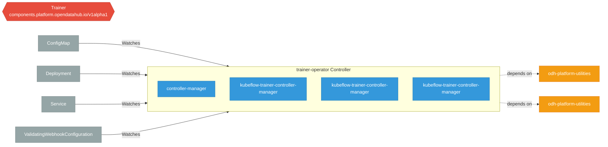

# trainer-operator

> **Architecture snapshot: 2026-10-10** (2026-10-10)

**Repository:** opendatahub-io/trainer-operator  
**Analyzer:** arch-analyzer dev  
**Extracted:** 2026-10-10T05:16:56Z

## Summary

| Metric | Count |
|--------|-------|
| CRDs | 1 |
| Deployments | 4 |
| Services | 0 |
| Secrets | 1 |
| Cluster Roles | 15 |
| Controller Watches | 4 |

## Component Architecture

CRDs, controllers, and owned Kubernetes resources.

### CRDs

| Group | Version | Kind | Scope | Fields | Validation Rules | Discovery | Source |
|-------|---------|------|-------|--------|------------------|-----------|--------|
| components.platform.opendatahub.io | v1alpha1 | Trainer | Cluster | 30 | 1 | YAML | [`config/crd/bases/components.platform.opendatahub.io_trainers.yaml`](https://github.com/opendatahub-io/trainer-operator/blob/90322983edf391c7adb195654221cc83d172b2a3/config/crd/bases/components.platform.opendatahub.io_trainers.yaml) |

## Dependencies

### Internal Platform Dependencies

| Component | Interaction |
|-----------|-------------|
| odh-platform-utilities | Go module dependency: github.com/opendatahub-io/odh-platform-utilities |
| odh-platform-utilities | Go module dependency: github.com/opendatahub-io/odh-platform-utilities/framework |

### Key External Dependencies

| Module | Version |
|--------|---------|
| github.com/go-logr/logr | v1.4.3 |
| github.com/operator-framework/api | v0.42.0 |
| k8s.io/api | v0.36.2 |
| k8s.io/apiextensions-apiserver | v0.36.2 |
| k8s.io/apimachinery | v0.36.2 |
| k8s.io/client-go | v0.36.2 |
| sigs.k8s.io/controller-runtime | v0.24.1 |

