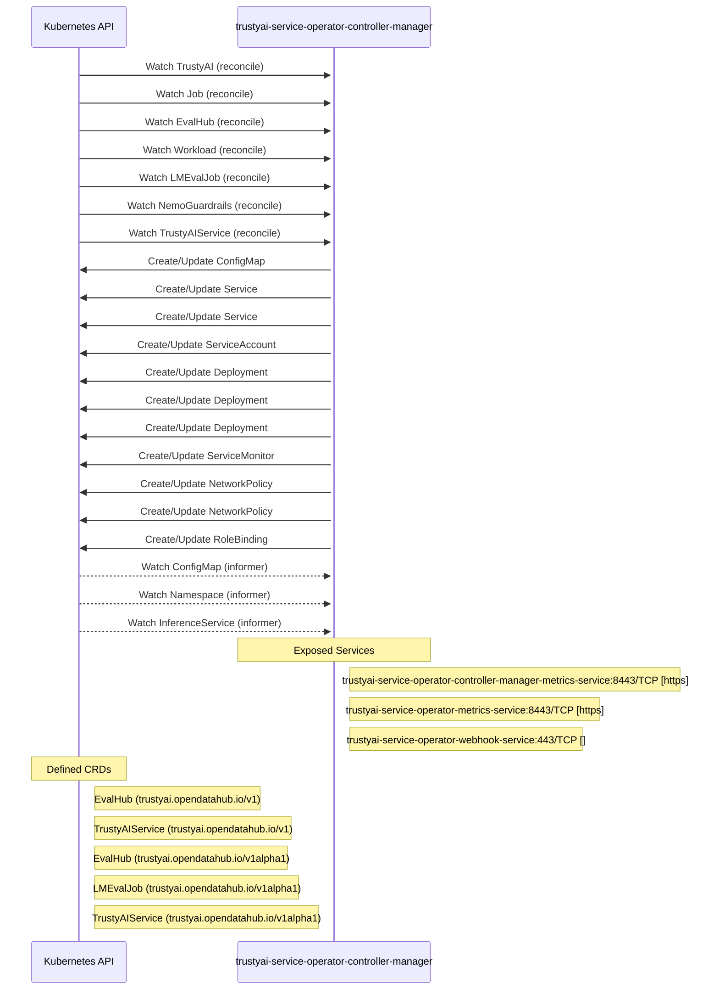

# trustyai-service-operator: Dataflow

## Controller Watches

Kubernetes resources this controller monitors for changes. Each watch triggers reconciliation when the watched resource is created, updated, or deleted.

| Type | GVK | Source |
|------|-----|--------|
| For | apis/v1alpha1/TrustyAI | [`trustyai-operator-module/pkg/trustyaimodule/reconciler.go:505`](https://github.com/trustyai-explainability/trustyai-service-operator/blob/72b468d8183142d6a01284db134bcc0471d4cf54/trustyai-operator-module/pkg/trustyaimodule/reconciler.go#L505) |
| For | batch/v1/Job | [`controllers/evalhub/evaluation_job_failure_reconciler.go:210`](https://github.com/trustyai-explainability/trustyai-service-operator/blob/72b468d8183142d6a01284db134bcc0471d4cf54/controllers/evalhub/evaluation_job_failure_reconciler.go#L210) |
| For | evalhub/v1/EvalHub | [`controllers/evalhub/evalhub_controller.go:382`](https://github.com/trustyai-explainability/trustyai-service-operator/blob/72b468d8183142d6a01284db134bcc0471d4cf54/controllers/evalhub/evalhub_controller.go#L382) |
| For | kueue/v1beta1/Workload | [`controllers/evalhub/evaluation_failed_kueue_workloads_reconciler.go:90`](https://github.com/trustyai-explainability/trustyai-service-operator/blob/72b468d8183142d6a01284db134bcc0471d4cf54/controllers/evalhub/evaluation_failed_kueue_workloads_reconciler.go#L90) |
| For | lmes/v1alpha1/LMEvalJob | [`controllers/lmes/lmevaljob_controller.go:351`](https://github.com/trustyai-explainability/trustyai-service-operator/blob/72b468d8183142d6a01284db134bcc0471d4cf54/controllers/lmes/lmevaljob_controller.go#L351) |
| For | nemo_guardrails/v1alpha1/NemoGuardrails | [`controllers/nemo_guardrails/nemoguardrail_controller.go:233`](https://github.com/trustyai-explainability/trustyai-service-operator/blob/72b468d8183142d6a01284db134bcc0471d4cf54/controllers/nemo_guardrails/nemoguardrail_controller.go#L233) |
| For | tas/v1/TrustyAIService | [`controllers/tas/trustyaiservice_controller.go:315`](https://github.com/trustyai-explainability/trustyai-service-operator/blob/72b468d8183142d6a01284db134bcc0471d4cf54/controllers/tas/trustyaiservice_controller.go#L315) |
| Owns | /v1/ConfigMap | [`controllers/evalhub/evalhub_controller.go:386`](https://github.com/trustyai-explainability/trustyai-service-operator/blob/72b468d8183142d6a01284db134bcc0471d4cf54/controllers/evalhub/evalhub_controller.go#L386) |
| Owns | /v1/Service | [`controllers/evalhub/evalhub_controller.go:385`](https://github.com/trustyai-explainability/trustyai-service-operator/blob/72b468d8183142d6a01284db134bcc0471d4cf54/controllers/evalhub/evalhub_controller.go#L385) |
| Owns | /v1/Service | [`trustyai-operator-module/pkg/trustyaimodule/reconciler.go:507`](https://github.com/trustyai-explainability/trustyai-service-operator/blob/72b468d8183142d6a01284db134bcc0471d4cf54/trustyai-operator-module/pkg/trustyaimodule/reconciler.go#L507) |
| Owns | /v1/ServiceAccount | [`trustyai-operator-module/pkg/trustyaimodule/reconciler.go:506`](https://github.com/trustyai-explainability/trustyai-service-operator/blob/72b468d8183142d6a01284db134bcc0471d4cf54/trustyai-operator-module/pkg/trustyaimodule/reconciler.go#L506) |
| Owns | apps/v1/Deployment | [`controllers/tas/trustyaiservice_controller.go:316`](https://github.com/trustyai-explainability/trustyai-service-operator/blob/72b468d8183142d6a01284db134bcc0471d4cf54/controllers/tas/trustyaiservice_controller.go#L316) |
| Owns | apps/v1/Deployment | [`controllers/evalhub/evalhub_controller.go:383`](https://github.com/trustyai-explainability/trustyai-service-operator/blob/72b468d8183142d6a01284db134bcc0471d4cf54/controllers/evalhub/evalhub_controller.go#L383) |
| Owns | apps/v1/Deployment | [`trustyai-operator-module/pkg/trustyaimodule/reconciler.go:508`](https://github.com/trustyai-explainability/trustyai-service-operator/blob/72b468d8183142d6a01284db134bcc0471d4cf54/trustyai-operator-module/pkg/trustyaimodule/reconciler.go#L508) |
| Owns | monitoring/v1/ServiceMonitor | [`controllers/evalhub/evalhub_controller.go:391`](https://github.com/trustyai-explainability/trustyai-service-operator/blob/72b468d8183142d6a01284db134bcc0471d4cf54/controllers/evalhub/evalhub_controller.go#L391) |
| Owns | networking.k8s.io/v1/NetworkPolicy | [`controllers/lmes/lmevaljob_controller.go:357`](https://github.com/trustyai-explainability/trustyai-service-operator/blob/72b468d8183142d6a01284db134bcc0471d4cf54/controllers/lmes/lmevaljob_controller.go#L357) |
| Owns | networking.k8s.io/v1/NetworkPolicy | [`controllers/evalhub/evalhub_controller.go:384`](https://github.com/trustyai-explainability/trustyai-service-operator/blob/72b468d8183142d6a01284db134bcc0471d4cf54/controllers/evalhub/evalhub_controller.go#L384) |
| Owns | rbac.authorization.k8s.io/v1/RoleBinding | [`trustyai-operator-module/pkg/trustyaimodule/reconciler.go:509`](https://github.com/trustyai-explainability/trustyai-service-operator/blob/72b468d8183142d6a01284db134bcc0471d4cf54/trustyai-operator-module/pkg/trustyaimodule/reconciler.go#L509) |
| Watches | /v1/ConfigMap | [`controllers/evalhub/evalhub_controller.go:388`](https://github.com/trustyai-explainability/trustyai-service-operator/blob/72b468d8183142d6a01284db134bcc0471d4cf54/controllers/evalhub/evalhub_controller.go#L388) |
| Watches | /v1/Namespace | [`controllers/evalhub/evalhub_controller.go:387`](https://github.com/trustyai-explainability/trustyai-service-operator/blob/72b468d8183142d6a01284db134bcc0471d4cf54/controllers/evalhub/evalhub_controller.go#L387) |
| Watches | serving/v1beta1/InferenceService | [`controllers/tas/trustyaiservice_controller.go:317`](https://github.com/trustyai-explainability/trustyai-service-operator/blob/72b468d8183142d6a01284db134bcc0471d4cf54/controllers/tas/trustyaiservice_controller.go#L317) |

### Programmatic Resource Operations

| Verb | Kind | Group | Condition |
|------|------|-------|----------|
| create | ConfigMap |  |  |
| update | ConfigMap |  |  |
| create | Deployment | apps |  |
| update | Deployment | apps |  |
| update | EvalHub | evalhub |  |
| patch | Job | batch |  |
| create | Route | route |  |
| update | Route | route |  |
| create | Service |  |  |
| update | Service |  |  |
| create | ServiceMonitor | monitoring |  |
| update | LMEvalJob | lmes |  |
| patch | Pod |  |  |
| patch | NemoGuardrails | nemo_guardrails |  |
| update | TrustyAIService | tas |  |

## Reconciliation Flow

How the controller interacts with the Kubernetes API during reconciliation.

## Configuration

ConfigMaps and Helm values that control this component's runtime behavior.

