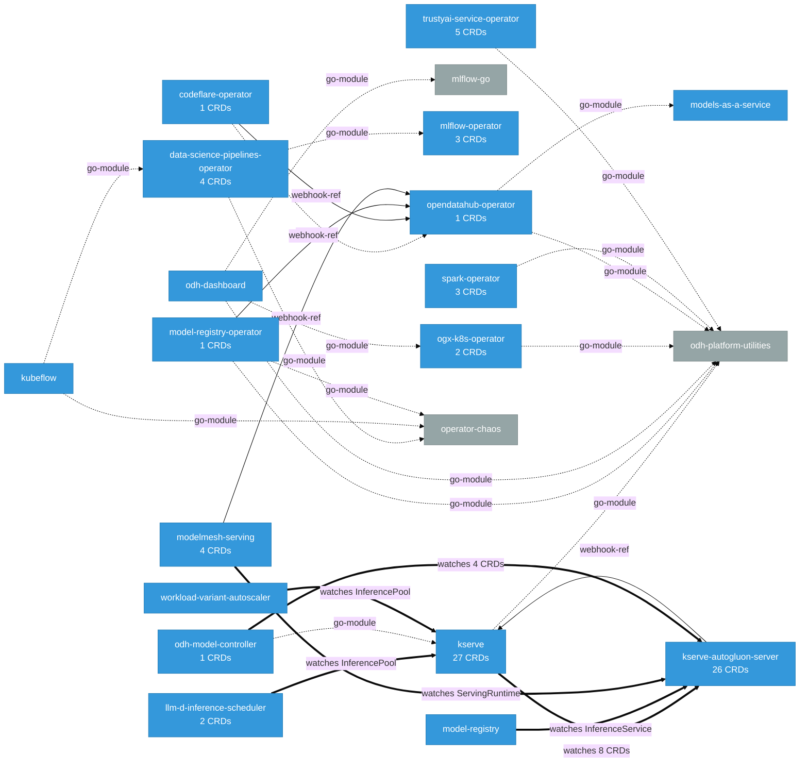

# Platform Platform Analysis

> **Architecture snapshot: 2026-09-07** (2026-09-07)

*Generated by architecture-analyzer. All data produced by deterministic static analysis.*

## Platform Summary

| Metric | Count |
|--------|-------|
| Components | 42 |
| CRDs | 94 |
| Services | 83 |
| Secrets | 62 |
| Cluster Roles | 111 |
| Cross-Component Dependencies | 40 |
| Webhooks | 116 |

## Component Dependency Graph

## Components Analyzed

| Component | CRDs |
|-----------|------|
| agents-operator | 0 |
| ai4rag | 0 |
| argo-workflows | 0 |
| batch-gateway | 0 |
| codeflare-operator | 1 |
| data-science-pipelines | 3 |
| data-science-pipelines-operator | 4 |
| distributed-workloads | 0 |
| eval-hub | 0 |
| feast | 0 |
| fms-guardrails-orchestrator | 0 |
| guardrails-detectors | 0 |
| kserve | 27 |
| kserve-autogluon-server | 26 |
| kube-auth-proxy | 0 |
| kube-rbac-proxy | 0 |
| kubeflow | 0 |
| kuberay | 0 |
| kueue | 2 |
| llama-stack | 0 |
| llama-stack-provider-trustyai-garak | 0 |
| llm-d | 0 |
| llm-d-inference-scheduler | 2 |
| llm-d-kv-cache | 0 |
| lm-evaluation-harness | 0 |
| mlflow | 0 |
| mlflow-operator | 3 |
| model-registry | 0 |
| model-registry-operator | 1 |
| modelmesh | 0 |
| modelmesh-serving | 4 |
| models-as-a-service | 0 |
| notebooks | 0 |
| odh-dashboard | 0 |
| odh-model-controller | 1 |
| ogx-k8s-operator | 2 |
| opendatahub-operator | 1 |
| spark-operator | 3 |
| trainer | 3 |
| training-operator | 6 |
| trustyai-service-operator | 5 |
| workload-variant-autoscaler | 0 |

