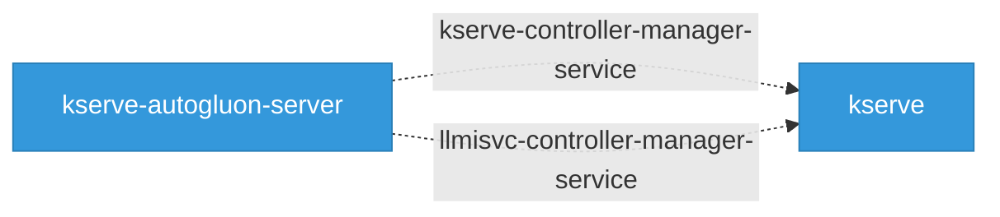

# Network Topology

83 Kubernetes services across the platform.

## Network Topology Graph

Interactive service mesh view of the platform. Drag nodes to rearrange, hover to highlight connections, click for details. Double-click background to fit all.

  <button data-action="fit" title="Fit to view">Fit</button>
  <button data-action="zoom-in" title="Zoom in">+</button>
  <button data-action="zoom-out" title="Zoom out">&minus;</button>
  <button data-action="relayout" title="Re-run layout">Relayout</button>
  <button data-action="fullscreen" title="Toggle fullscreen">Fullscreen</button>

  

   Component
   Has Ingress
   Has NetworkPolicy
   External
   CRD Watch
   Sidecar
   Module
   External

## Cross-Component Service References

Services referenced across component boundaries. When component A defines a service that component B also references, it indicates a deployment dependency.

## Services by Component

| Component | Services | Webhook (443) | Metrics (8443) | Data |
|-----------|----------|---------------|----------------|------|
| agents-operator | 2 | 1 | 0 | 1 |
| codeflare-operator | 1 | 1 | 0 | 0 |
| data-science-pipelines | 1 | 0 | 0 | 1 |
| data-science-pipelines-operator | 7 | 0 | 2 | 5 |
| feast | 1 | 0 | 0 | 1 |
| kserve | 6 | 3 | 3 | 0 |
| kserve-autogluon-server | 6 | 3 | 3 | 0 |
| kubeflow | 2 | 2 | 0 | 0 |
| kuberay | 2 | 1 | 0 | 1 |
| kueue | 2 | 2 | 0 | 0 |
| llama-stack | 1 | 0 | 0 | 1 |
| llm-d | 3 | 0 | 0 | 3 |
| llm-d-inference-scheduler | 6 | 1 | 0 | 5 |
| mlflow | 1 | 0 | 0 | 1 |
| mlflow-operator | 1 | 0 | 1 | 0 |
| model-registry | 1 | 0 | 0 | 1 |
| model-registry-operator | 4 | 2 | 1 | 1 |
| modelmesh | 1 | 0 | 0 | 1 |
| modelmesh-serving | 3 | 0 | 0 | 3 |
| models-as-a-service | 3 | 1 | 0 | 2 |
| notebooks | 1 | 0 | 0 | 1 |
| odh-dashboard | 16 | 1 | 1 | 14 |
| odh-model-controller | 3 | 2 | 1 | 0 |
| ogx-k8s-operator | 2 | 1 | 1 | 0 |
| opendatahub-operator | 1 | 1 | 0 | 0 |
| spark-operator | 1 | 1 | 0 | 0 |
| training-operator | 1 | 1 | 0 | 0 |
| trustyai-service-operator | 3 | 1 | 2 | 0 |
| workload-variant-autoscaler | 1 | 0 | 1 | 0 |

## Service Detail

Per-component service breakdown with exact port numbers and protocols.

### agents-operator (2 services)

| Service | Type | Ports |
|---------|------|-------|
| bundle-service | ClusterIP | 8080/TCP |
| webhook-service | ClusterIP | 443/TCP |

### codeflare-operator (1 services)

| Service | Type | Ports |
|---------|------|-------|
| webhook-service | ClusterIP | 443/TCP |

### data-science-pipelines (1 services)

| Service | Type | Ports |
|---------|------|-------|
| kubeflow-pipelines-profile-controller | ClusterIP | 80/TCP |

### data-science-pipelines-operator (7 services)

| Service | Type | Ports |
|---------|------|-------|
| data-science-pipelines-operator-service | ClusterIP | 8080/TCP |
| ds-pipeline-workflow-controller-metrics-template-value | ClusterIP | 9090/TCP |
| mariadb-template-value | ClusterIP | 3306/TCP |
| minio-service | ClusterIP | 9000/TCP |
| minio-template-value | ClusterIP | 9000/TCP, 80/TCP |
| ml-pipeline | ClusterIP | 8443/TCP, 8888/TCP, 8887/TCP |
| template-value | ClusterIP | 8443/TCP, 8888/TCP, 8887/TCP |

### feast (1 services)

| Service | Type | Ports |
|---------|------|-------|
| uvicorn-server | python-source | 6566/TCP |

### kserve (6 services)

| Service | Type | Ports |
|---------|------|-------|
| kserve-controller-manager-metrics-service | ClusterIP | 8443/TCP |
| kserve-controller-manager-service | ClusterIP | 8443/TCP |
| kserve-webhook-server-service | ClusterIP | 443/TCP |
| llmisvc-controller-manager-service | ClusterIP | 8443/TCP |
| llmisvc-webhook-server-service | ClusterIP | 443/TCP |
| localmodel-webhook-server-service | ClusterIP | 443/TCP |

### kserve-autogluon-server (6 services)

| Service | Type | Ports |
|---------|------|-------|
| kserve-controller-manager-metrics-service | ClusterIP | 8443/TCP |
| kserve-controller-manager-service | ClusterIP | 8443/TCP |
| kserve-webhook-server-service | ClusterIP | 443/TCP |
| llmisvc-controller-manager-service | ClusterIP | 8443/TCP |
| llmisvc-webhook-server-service | ClusterIP | 443/TCP |
| localmodel-webhook-server-service | ClusterIP | 443/TCP |

### kubeflow (2 services)

| Service | Type | Ports |
|---------|------|-------|
| service | ClusterIP | 443/TCP |
| webhook-service | ClusterIP | 443/TCP |

### kuberay (2 services)

| Service | Type | Ports |
|---------|------|-------|
| kuberay-operator | ClusterIP | 8080/TCP |
| webhook-service | ClusterIP | 443/TCP |

### kueue (2 services)

| Service | Type | Ports |
|---------|------|-------|
| visibility-server | ClusterIP | 443/TCP |
| webhook-service | ClusterIP | 443/TCP |

### llama-stack (1 services)

| Service | Type | Ports |
|---------|------|-------|
| cli-port-default | python-source | 8081/TCP |

### llm-d (3 services)

| Service | Type | Ports |
|---------|------|-------|
| mooncake-client | ClusterIP | 50052/TCP |
| mooncake-master-store | ClusterIP | 50051/TCP, 8080/TCP, 9003/TCP |
| render | ClusterIP | 8000/TCP |

### llm-d-inference-scheduler (6 services)

| Service | Type | Ports |
|---------|------|-------|
| ${EPP_NAME} | ClusterIP | 9002/TCP, 5557/TCP, 9090/TCP |
| e2e-epp | ClusterIP | 9002/TCP, 5557/TCP |
| e2e-epp-metrics | NodePort | 9090/TCP |
| inference-gateway-istio-nodeport | NodePort | 15021/TCP, 80/TCP |
| istiod-llm-d-gateway | ClusterIP | 15010/TCP, 15012/TCP, 443/TCP, 15014/TCP |
| service | ClusterIP | 8080/TCP |

### mlflow (1 services)

| Service | Type | Ports |
|---------|------|-------|
| env-port-default | python-source | 9137/TCP |

### mlflow-operator (1 services)

| Service | Type | Ports |
|---------|------|-------|
| mlflow-operator-controller-manager-metrics-service | ClusterIP | 8443/TCP |

### model-registry (1 services)

| Service | Type | Ports |
|---------|------|-------|
| model-catalog | ClusterIP | 8080/TCP |

### model-registry-operator (4 services)

| Service | Type | Ports |
|---------|------|-------|
| catalog-webhook-service | ClusterIP | 443/TCP |
| model-registry-operator-controller-manager-metrics-service | ClusterIP | 8443/TCP |
| model-registry-operator-webhook-service | ClusterIP | 443/TCP |
| template-value-postgres | ClusterIP | 5432/TCP |

### modelmesh (1 services)

| Service | Type | Ports |
|---------|------|-------|
| model-mesh | ClusterIP | 8033/TCP |

### modelmesh-serving (3 services)

| Service | Type | Ports |
|---------|------|-------|
| etcd | ClusterIP | 2379/TCP |
| modelmesh-controller | ClusterIP | 8080/TCP |
| modelmesh-webhook-server-service | ClusterIP | 9443/TCP |

### models-as-a-service (3 services)

| Service | Type | Ports |
|---------|------|-------|
| maas-api | ClusterIP | 8080/TCP |
| maas-controller-webhook-service | ClusterIP | 443/TCP |
| payload-processing | ClusterIP | 9004/TCP |

### notebooks (1 services)

| Service | Type | Ports |
|---------|------|-------|
| notebook | ClusterIP | 8888/TCP |

### odh-dashboard (16 services)

| Service | Type | Ports |
|---------|------|-------|
| odh-dashboard | ClusterIP | 8443/TCP, 8943/TCP |
| odh-dashboard-agent-ops-ui | ClusterIP | 8843/TCP |
| odh-dashboard-automl-ui | ClusterIP | 8643/TCP |
| odh-dashboard-autorag-ui | ClusterIP | 8743/TCP |
| odh-dashboard-data-registry-ui | ClusterIP | 9043/TCP |
| odh-dashboard-eval-hub-ui | ClusterIP | 8543/TCP |
| odh-dashboard-gen-ai-ui | ClusterIP | 8143/TCP |
| odh-dashboard-maas-ui | ClusterIP | 8243/TCP |
| odh-dashboard-mlflow-ui | ClusterIP | 8343/TCP |
| odh-dashboard-model-registry-ui | ClusterIP | 8043/TCP |
| odh-dashboard-notebooks-ui | ClusterIP | 9043/TCP |
| rhaii-dashboard | ClusterIP | 4000/TCP |
| workspaces-backend | ClusterIP | 4000/TCP |
| workspaces-controller-metrics-service | ClusterIP | 8080/TCP |
| workspaces-frontend | ClusterIP | 8080/TCP |
| workspaces-webhook-service | ClusterIP | 443/TCP |

### odh-model-controller (3 services)

| Service | Type | Ports |
|---------|------|-------|
| model-serving-api | ClusterIP | 443/TCP, 8080/TCP |
| odh-model-controller-metrics-service | ClusterIP | 8443/TCP |
| odh-model-controller-webhook-service | ClusterIP | 443/TCP |

### ogx-k8s-operator (2 services)

| Service | Type | Ports |
|---------|------|-------|
| ogx-k8s-operator-controller-manager-metrics-service | ClusterIP | 8443/TCP |
| ogx-k8s-operator-webhook-service | ClusterIP | 443/TCP |

### opendatahub-operator (1 services)

| Service | Type | Ports |
|---------|------|-------|
| webhook-service | ClusterIP | 443/TCP |

### spark-operator (1 services)

| Service | Type | Ports |
|---------|------|-------|
| spark-operator-webhook-svc | ClusterIP | 443/TCP |

### training-operator (1 services)

| Service | Type | Ports |
|---------|------|-------|
| training-operator | ClusterIP | 8080/TCP, 443/TCP |

### trustyai-service-operator (3 services)

| Service | Type | Ports |
|---------|------|-------|
| trustyai-service-operator-controller-manager-metrics-service | ClusterIP | 8443/TCP |
| trustyai-service-operator-metrics-service | ClusterIP | 8443/TCP |
| trustyai-service-operator-webhook-service | ClusterIP | 443/TCP |

### workload-variant-autoscaler (1 services)

| Service | Type | Ports |
|---------|------|-------|
| controller-manager-metrics-service | ClusterIP | 8443/TCP |

## Port Patterns

- **15010/TCP**: istiod-llm-d-gateway
- **15012/TCP**: istiod-llm-d-gateway
- **15014/TCP**: istiod-llm-d-gateway
- **15021/TCP**: inference-gateway-istio-nodeport
- **2379/TCP**: etcd
- **3306/TCP**: mariadb-template-value
- **4000/TCP**: rhaii-dashboard, workspaces-backend
- **443/TCP**: webhook-service, webhook-service, kserve-webhook-server-service, llmisvc-webhook-server-service, localmodel-webhook-server-service, kserve-webhook-server-service, llmisvc-webhook-server-service, localmodel-webhook-server-service, service, webhook-service, webhook-service, visibility-server, webhook-service, istiod-llm-d-gateway, catalog-webhook-service, model-registry-operator-webhook-service, maas-controller-webhook-service, workspaces-webhook-service, model-serving-api, odh-model-controller-webhook-service, ogx-k8s-operator-webhook-service, webhook-service, spark-operator-webhook-svc, training-operator, trustyai-service-operator-webhook-service
- **50051/TCP**: mooncake-master-store
- **50052/TCP**: mooncake-client
- **5432/TCP**: template-value-postgres
- **5557/TCP**: ${EPP_NAME}, e2e-epp
- **6566/TCP**: uvicorn-server
- **80/TCP**: minio-template-value, kubeflow-pipelines-profile-controller, inference-gateway-istio-nodeport
- **8000/TCP**: render
- **8033/TCP**: model-mesh
- **8043/TCP**: odh-dashboard-model-registry-ui
- **8080/TCP**: mooncake-master-store, bundle-service, data-science-pipelines-operator-service, kuberay-operator, service, model-catalog, modelmesh-controller, maas-api, workspaces-controller-metrics-service, workspaces-frontend, model-serving-api, training-operator
- **8081/TCP**: cli-port-default
- **8143/TCP**: odh-dashboard-gen-ai-ui
- **8243/TCP**: odh-dashboard-maas-ui
- **8343/TCP**: odh-dashboard-mlflow-ui
- **8443/TCP**: ml-pipeline, template-value, kserve-controller-manager-metrics-service, kserve-controller-manager-service, llmisvc-controller-manager-service, kserve-controller-manager-metrics-service, kserve-controller-manager-service, llmisvc-controller-manager-service, mlflow-operator-controller-manager-metrics-service, model-registry-operator-controller-manager-metrics-service, odh-dashboard, odh-model-controller-metrics-service, ogx-k8s-operator-controller-manager-metrics-service, trustyai-service-operator-controller-manager-metrics-service, trustyai-service-operator-metrics-service, controller-manager-metrics-service
- **8543/TCP**: odh-dashboard-eval-hub-ui
- **8643/TCP**: odh-dashboard-automl-ui
- **8743/TCP**: odh-dashboard-autorag-ui
- **8843/TCP**: odh-dashboard-agent-ops-ui
- **8887/TCP**: ml-pipeline, template-value
- **8888/TCP**: ml-pipeline, template-value, notebook
- **8943/TCP**: odh-dashboard
- **9000/TCP**: minio-service, minio-template-value
- **9002/TCP**: ${EPP_NAME}, e2e-epp
- **9003/TCP**: mooncake-master-store
- **9004/TCP**: payload-processing
- **9043/TCP**: odh-dashboard-data-registry-ui, odh-dashboard-notebooks-ui
- **9090/TCP**: ds-pipeline-workflow-controller-metrics-template-value, ${EPP_NAME}, e2e-epp-metrics
- **9137/TCP**: env-port-default
- **9443/TCP**: modelmesh-webhook-server-service

