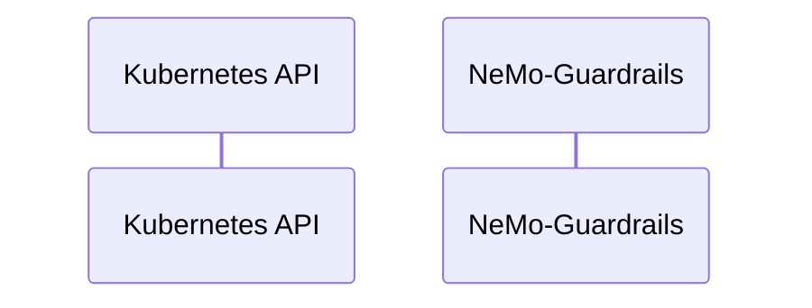

# NeMo-Guardrails: Dataflow

## Controller Watches

Kubernetes resources this controller monitors for changes. Each watch triggers reconciliation when the watched resource is created, updated, or deleted.

No controller watches found in analyzed sources.

## Reconciliation Flow

How the controller interacts with the Kubernetes API during reconciliation.

### HTTP Endpoints

| Method | Path | Source |
|--------|------|--------|
| GET | / | [`fern/openapi.yml`](https://github.com/red-hat-data-services/NeMo-Guardrails/blob/83c29d76217d38acab8d86535766d7d854b12f2f/fern/openapi.yml) |
| GET | /healthz | [`fern/openapi.yml`](https://github.com/red-hat-data-services/NeMo-Guardrails/blob/83c29d76217d38acab8d86535766d7d854b12f2f/fern/openapi.yml) |
| GET | /v1/challenges | [`fern/openapi.yml`](https://github.com/red-hat-data-services/NeMo-Guardrails/blob/83c29d76217d38acab8d86535766d7d854b12f2f/fern/openapi.yml) |
| POST | /v1/chat/completions | [`fern/openapi.yml`](https://github.com/red-hat-data-services/NeMo-Guardrails/blob/83c29d76217d38acab8d86535766d7d854b12f2f/fern/openapi.yml) |
| GET | /v1/health | [`fern/openapi.yml`](https://github.com/red-hat-data-services/NeMo-Guardrails/blob/83c29d76217d38acab8d86535766d7d854b12f2f/fern/openapi.yml) |
| GET | /v1/models | [`fern/openapi.yml`](https://github.com/red-hat-data-services/NeMo-Guardrails/blob/83c29d76217d38acab8d86535766d7d854b12f2f/fern/openapi.yml) |
| GET | /v1/rails/configs | [`fern/openapi.yml`](https://github.com/red-hat-data-services/NeMo-Guardrails/blob/83c29d76217d38acab8d86535766d7d854b12f2f/fern/openapi.yml) |

## Configuration

ConfigMaps and Helm values that control this component's runtime behavior.

