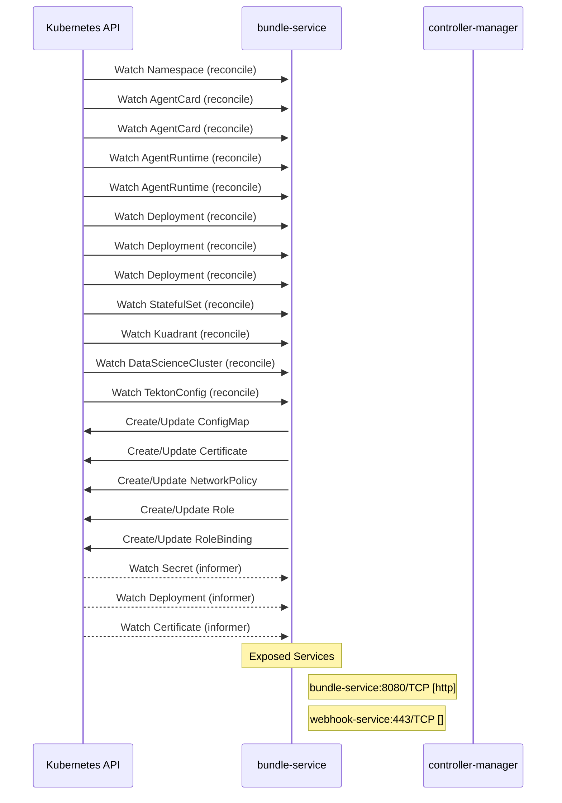

# agents-operator: Dataflow

## Controller Watches

Kubernetes resources this controller monitors for changes. Each watch triggers reconciliation when the watched resource is created, updated, or deleted.

| Type | GVK | Source |
|------|-----|--------|
| For | /v1/Namespace | [`kagenti-operator/internal/controller/authbridgeconfig_controller.go:186`](https://github.com/red-hat-data-services/agents-operator/blob/cea595935e348e2f2c4bffc5481350fd8509d2d1/kagenti-operator/internal/controller/authbridgeconfig_controller.go#L186) |
| For | api/v1alpha1/AgentCard | [`kagenti-operator/internal/controller/agentcard_networkpolicy_controller.go:372`](https://github.com/red-hat-data-services/agents-operator/blob/cea595935e348e2f2c4bffc5481350fd8509d2d1/kagenti-operator/internal/controller/agentcard_networkpolicy_controller.go#L372) |
| For | api/v1alpha1/AgentCard | [`kagenti-operator/internal/controller/agentcard_controller.go:1653`](https://github.com/red-hat-data-services/agents-operator/blob/cea595935e348e2f2c4bffc5481350fd8509d2d1/kagenti-operator/internal/controller/agentcard_controller.go#L1653) |
| For | api/v1alpha1/AgentRuntime | [`kagenti-operator/internal/controller/agentruntime_controller.go:1382`](https://github.com/red-hat-data-services/agents-operator/blob/cea595935e348e2f2c4bffc5481350fd8509d2d1/kagenti-operator/internal/controller/agentruntime_controller.go#L1382) |
| For | api/v1alpha1/AgentRuntime | [`kagenti-operator/internal/controller/tlsbridge_ca_controller.go:99`](https://github.com/red-hat-data-services/agents-operator/blob/cea595935e348e2f2c4bffc5481350fd8509d2d1/kagenti-operator/internal/controller/tlsbridge_ca_controller.go#L99) |
| For | apps/v1/Deployment | [`kagenti-operator/internal/controller/mlflow_controller.go:353`](https://github.com/red-hat-data-services/agents-operator/blob/cea595935e348e2f2c4bffc5481350fd8509d2d1/kagenti-operator/internal/controller/mlflow_controller.go#L353) |
| For | apps/v1/Deployment | [`kagenti-operator/internal/controller/clientregistration_controller.go:602`](https://github.com/red-hat-data-services/agents-operator/blob/cea595935e348e2f2c4bffc5481350fd8509d2d1/kagenti-operator/internal/controller/clientregistration_controller.go#L602) |
| For | apps/v1/Deployment | [`kagenti-operator/internal/controller/agentcardsync_controller.go:410`](https://github.com/red-hat-data-services/agents-operator/blob/cea595935e348e2f2c4bffc5481350fd8509d2d1/kagenti-operator/internal/controller/agentcardsync_controller.go#L410) |
| For | apps/v1/StatefulSet | [`kagenti-operator/internal/controller/agentcardsync_controller.go:418`](https://github.com/red-hat-data-services/agents-operator/blob/cea595935e348e2f2c4bffc5481350fd8509d2d1/kagenti-operator/internal/controller/agentcardsync_controller.go#L418) |
| For | github.com/kagenti/operator/internal/kuadrant/Kuadrant | [`kagenti-operator/internal/controller/kuadrant_controller.go:128`](https://github.com/red-hat-data-services/agents-operator/blob/cea595935e348e2f2c4bffc5481350fd8509d2d1/kagenti-operator/internal/controller/kuadrant_controller.go#L128) |
| For | github.com/kagenti/operator/internal/mlflow/DataScienceCluster | [`kagenti-operator/internal/controller/mlflow_operand_controller.go:427`](https://github.com/red-hat-data-services/agents-operator/blob/cea595935e348e2f2c4bffc5481350fd8509d2d1/kagenti-operator/internal/controller/mlflow_operand_controller.go#L427) |
| For | github.com/kagenti/operator/internal/tekton/TektonConfig | [`kagenti-operator/internal/controller/tektonconfig_controller.go:91`](https://github.com/red-hat-data-services/agents-operator/blob/cea595935e348e2f2c4bffc5481350fd8509d2d1/kagenti-operator/internal/controller/tektonconfig_controller.go#L91) |
| Owns | /v1/ConfigMap | [`kagenti-operator/internal/controller/authbridgeconfig_controller.go:201`](https://github.com/red-hat-data-services/agents-operator/blob/cea595935e348e2f2c4bffc5481350fd8509d2d1/kagenti-operator/internal/controller/authbridgeconfig_controller.go#L201) |
| Owns | certmanager/v1/Certificate | [`kagenti-operator/internal/controller/tlsbridge_ca_controller.go:100`](https://github.com/red-hat-data-services/agents-operator/blob/cea595935e348e2f2c4bffc5481350fd8509d2d1/kagenti-operator/internal/controller/tlsbridge_ca_controller.go#L100) |
| Owns | networking.k8s.io/v1/NetworkPolicy | [`kagenti-operator/internal/controller/agentcard_networkpolicy_controller.go:373`](https://github.com/red-hat-data-services/agents-operator/blob/cea595935e348e2f2c4bffc5481350fd8509d2d1/kagenti-operator/internal/controller/agentcard_networkpolicy_controller.go#L373) |
| Owns | rbac.authorization.k8s.io/v1/Role | [`kagenti-operator/internal/controller/mlflow_controller.go:354`](https://github.com/red-hat-data-services/agents-operator/blob/cea595935e348e2f2c4bffc5481350fd8509d2d1/kagenti-operator/internal/controller/mlflow_controller.go#L354) |
| Owns | rbac.authorization.k8s.io/v1/RoleBinding | [`kagenti-operator/internal/controller/mlflow_controller.go:355`](https://github.com/red-hat-data-services/agents-operator/blob/cea595935e348e2f2c4bffc5481350fd8509d2d1/kagenti-operator/internal/controller/mlflow_controller.go#L355) |
| Watches | /v1/Secret | [`kagenti-operator/internal/controller/sharedtrust_controller.go:390`](https://github.com/red-hat-data-services/agents-operator/blob/cea595935e348e2f2c4bffc5481350fd8509d2d1/kagenti-operator/internal/controller/sharedtrust_controller.go#L390) |
| Watches | apps/v1/Deployment | [`kagenti-operator/internal/controller/mlflow_operand_controller.go:430`](https://github.com/red-hat-data-services/agents-operator/blob/cea595935e348e2f2c4bffc5481350fd8509d2d1/kagenti-operator/internal/controller/mlflow_operand_controller.go#L430) |
| Watches | certmanager/v1/Certificate | [`kagenti-operator/internal/controller/sharedtrust_controller.go:389`](https://github.com/red-hat-data-services/agents-operator/blob/cea595935e348e2f2c4bffc5481350fd8509d2d1/kagenti-operator/internal/controller/sharedtrust_controller.go#L389) |

## Reconciliation Flow

How the controller interacts with the Kubernetes API during reconciliation.

### Webhooks

| Name | Type | Path | Failure Policy | Service | Overlays | Enable Condition | Sources |
|------|------|------|----------------|---------|----------|------------------|----------|
| inject.kagenti.io | mutating |  |  |  |  |  | [`kagenti-operator/config/default/webhook_namespace_selector_patch.yaml`](https://github.com/red-hat-data-services/agents-operator/blob/cea595935e348e2f2c4bffc5481350fd8509d2d1/kagenti-operator/config/default/webhook_namespace_selector_patch.yaml) |
| inject.kagenti.io | mutating |  |  |  |  |  | [`kagenti-operator/config/default/webhook_selector_patch.yaml`](https://github.com/red-hat-data-services/agents-operator/blob/cea595935e348e2f2c4bffc5481350fd8509d2d1/kagenti-operator/config/default/webhook_selector_patch.yaml) |
| vagentcard.kb.io | validating | /validate-agent-kagenti-dev-v1alpha1-agentcard | fail |  |  |  | [`kagenti-operator/internal/webhook/v1alpha1/agentcard_webhook.go`](https://github.com/red-hat-data-services/agents-operator/blob/cea595935e348e2f2c4bffc5481350fd8509d2d1/kagenti-operator/internal/webhook/v1alpha1/agentcard_webhook.go), [`kagenti-operator/internal/webhook/v1alpha1/agentcard_webhook.go`](https://github.com/red-hat-data-services/agents-operator/blob/cea595935e348e2f2c4bffc5481350fd8509d2d1/kagenti-operator/internal/webhook/v1alpha1/agentcard_webhook.go) |

### HTTP Endpoints

| Method | Path | Source |
|--------|------|--------|
| * | / | [`authbridge/demos/finance-sparc/finance-agent/main.go:464`](https://github.com/red-hat-data-services/agents-operator/blob/cea595935e348e2f2c4bffc5481350fd8509d2d1/authbridge/demos/finance-sparc/finance-agent/main.go#L464) |
| * | / | [`authbridge/demos/echo/agent/main.go:383`](https://github.com/red-hat-data-services/agents-operator/blob/cea595935e348e2f2c4bffc5481350fd8509d2d1/authbridge/demos/echo/agent/main.go#L383) |
| * | / | [`authbridge/authlib/observe/statserver.go:65`](https://github.com/red-hat-data-services/agents-operator/blob/cea595935e348e2f2c4bffc5481350fd8509d2d1/authbridge/authlib/observe/statserver.go#L65) |
| * | / | [`authbridge/demos/ibac/evil-server/main.go:17`](https://github.com/red-hat-data-services/agents-operator/blob/cea595935e348e2f2c4bffc5481350fd8509d2d1/authbridge/demos/ibac/evil-server/main.go#L17) |
| * | / | [`authbridge/demos/ibac/agent/main.go:799`](https://github.com/red-hat-data-services/agents-operator/blob/cea595935e348e2f2c4bffc5481350fd8509d2d1/authbridge/demos/ibac/agent/main.go#L799) |
| * | /.well-known/agent-card.json | [`authbridge/demos/echo/agent/main.go:384`](https://github.com/red-hat-data-services/agents-operator/blob/cea595935e348e2f2c4bffc5481350fd8509d2d1/authbridge/demos/echo/agent/main.go#L384) |
| * | /.well-known/agent-card.json | [`kagenti-operator/cmd/test-tls-agent/main.go:52`](https://github.com/red-hat-data-services/agents-operator/blob/cea595935e348e2f2c4bffc5481350fd8509d2d1/kagenti-operator/cmd/test-tls-agent/main.go#L52) |
| * | /.well-known/agent-card.json | [`authbridge/demos/ibac/agent/main.go:800`](https://github.com/red-hat-data-services/agents-operator/blob/cea595935e348e2f2c4bffc5481350fd8509d2d1/authbridge/demos/ibac/agent/main.go#L800) |
| * | /.well-known/agent-card.json | [`authbridge/demos/finance-sparc/finance-agent/main.go:465`](https://github.com/red-hat-data-services/agents-operator/blob/cea595935e348e2f2c4bffc5481350fd8509d2d1/authbridge/demos/finance-sparc/finance-agent/main.go#L465) |
| * | /bundles | [`kagenti-operator/internal/bundleservice/handler/handler.go:32`](https://github.com/red-hat-data-services/agents-operator/blob/cea595935e348e2f2c4bffc5481350fd8509d2d1/kagenti-operator/internal/bundleservice/handler/handler.go#L32) |
| * | /config | [`authbridge/authlib/observe/statserver.go:59`](https://github.com/red-hat-data-services/agents-operator/blob/cea595935e348e2f2c4bffc5481350fd8509d2d1/authbridge/authlib/observe/statserver.go#L59) |
| * | /echo | [`authbridge/demos/echo/upstream/main.go:33`](https://github.com/red-hat-data-services/agents-operator/blob/cea595935e348e2f2c4bffc5481350fd8509d2d1/authbridge/demos/echo/upstream/main.go#L33) |
| * | /healthz | [`kagenti-operator/cmd/test-tls-agent/main.go:56`](https://github.com/red-hat-data-services/agents-operator/blob/cea595935e348e2f2c4bffc5481350fd8509d2d1/kagenti-operator/cmd/test-tls-agent/main.go#L56) |
| * | /healthz | [`authbridge/cmd/authbridge-lite/main.go:298`](https://github.com/red-hat-data-services/agents-operator/blob/cea595935e348e2f2c4bffc5481350fd8509d2d1/authbridge/cmd/authbridge-lite/main.go#L298) |
| * | /healthz | [`authbridge/cmd/authbridge-proxy/main.go:420`](https://github.com/red-hat-data-services/agents-operator/blob/cea595935e348e2f2c4bffc5481350fd8509d2d1/authbridge/cmd/authbridge-proxy/main.go#L420) |
| * | /healthz | [`authbridge/cmd/authbridge-envoy/main.go:266`](https://github.com/red-hat-data-services/agents-operator/blob/cea595935e348e2f2c4bffc5481350fd8509d2d1/authbridge/cmd/authbridge-envoy/main.go#L266) |
| * | /healthz | [`kagenti-operator/internal/bundleservice/handler/handler.go:33`](https://github.com/red-hat-data-services/agents-operator/blob/cea595935e348e2f2c4bffc5481350fd8509d2d1/kagenti-operator/internal/bundleservice/handler/handler.go#L33) |
| * | /mcp | [`authbridge/demos/finance-sparc/finance-mcp/main.go:213`](https://github.com/red-hat-data-services/agents-operator/blob/cea595935e348e2f2c4bffc5481350fd8509d2d1/authbridge/demos/finance-sparc/finance-mcp/main.go#L213) |
| * | /mcp | [`authbridge/demos/ibac/email-server/main.go:161`](https://github.com/red-hat-data-services/agents-operator/blob/cea595935e348e2f2c4bffc5481350fd8509d2d1/authbridge/demos/ibac/email-server/main.go#L161) |
| * | /readyz | [`authbridge/cmd/authbridge-lite/main.go:301`](https://github.com/red-hat-data-services/agents-operator/blob/cea595935e348e2f2c4bffc5481350fd8509d2d1/authbridge/cmd/authbridge-lite/main.go#L301) |
| * | /readyz | [`authbridge/cmd/authbridge-envoy/main.go:269`](https://github.com/red-hat-data-services/agents-operator/blob/cea595935e348e2f2c4bffc5481350fd8509d2d1/authbridge/cmd/authbridge-envoy/main.go#L269) |
| * | /readyz | [`authbridge/cmd/authbridge-proxy/main.go:423`](https://github.com/red-hat-data-services/agents-operator/blob/cea595935e348e2f2c4bffc5481350fd8509d2d1/authbridge/cmd/authbridge-proxy/main.go#L423) |
| * | /readyz | [`kagenti-operator/internal/bundleservice/handler/handler.go:34`](https://github.com/red-hat-data-services/agents-operator/blob/cea595935e348e2f2c4bffc5481350fd8509d2d1/kagenti-operator/internal/bundleservice/handler/handler.go#L34) |
| * | /reload/status | [`authbridge/authlib/observe/statserver.go:62`](https://github.com/red-hat-data-services/agents-operator/blob/cea595935e348e2f2c4bffc5481350fd8509d2d1/authbridge/authlib/observe/statserver.go#L62) |
| * | /stats | [`authbridge/authlib/observe/statserver.go:60`](https://github.com/red-hat-data-services/agents-operator/blob/cea595935e348e2f2c4bffc5481350fd8509d2d1/authbridge/authlib/observe/statserver.go#L60) |
| * | GET /healthz | [`authbridge/authlib/sessionapi/server.go:128`](https://github.com/red-hat-data-services/agents-operator/blob/cea595935e348e2f2c4bffc5481350fd8509d2d1/authbridge/authlib/sessionapi/server.go#L128) |
| * | GET /v1/events | [`authbridge/authlib/sessionapi/server.go:125`](https://github.com/red-hat-data-services/agents-operator/blob/cea595935e348e2f2c4bffc5481350fd8509d2d1/authbridge/authlib/sessionapi/server.go#L125) |
| * | GET /v1/pipeline | [`authbridge/authlib/sessionapi/server.go:126`](https://github.com/red-hat-data-services/agents-operator/blob/cea595935e348e2f2c4bffc5481350fd8509d2d1/authbridge/authlib/sessionapi/server.go#L126) |
| * | GET /v1/plugins | [`authbridge/authlib/sessionapi/server.go:127`](https://github.com/red-hat-data-services/agents-operator/blob/cea595935e348e2f2c4bffc5481350fd8509d2d1/authbridge/authlib/sessionapi/server.go#L127) |
| * | GET /v1/sessions | [`authbridge/authlib/sessionapi/server.go:123`](https://github.com/red-hat-data-services/agents-operator/blob/cea595935e348e2f2c4bffc5481350fd8509d2d1/authbridge/authlib/sessionapi/server.go#L123) |
| * | GET /v1/sessions/{id} | [`authbridge/authlib/sessionapi/server.go:124`](https://github.com/red-hat-data-services/agents-operator/blob/cea595935e348e2f2c4bffc5481350fd8509d2d1/authbridge/authlib/sessionapi/server.go#L124) |

## Configuration

ConfigMaps and Helm values that control this component's runtime behavior.

### ConfigMaps

| Name | Data Keys | Source |
|------|-----------|--------|
| authbridge-config | ISSUER, KEYCLOAK_REALM, KEYCLOAK_URL | [`authbridge/demos/github-issue/k8s/configmaps.yaml`](https://github.com/red-hat-data-services/agents-operator/blob/cea595935e348e2f2c4bffc5481350fd8509d2d1/authbridge/demos/github-issue/k8s/configmaps.yaml) |
| authbridge-config | CLIENT_AUTH_TYPE, EXPECTED_AUDIENCE, ISSUER, JWKS_URL, KEYCLOAK_NAMESPACE, KEYCLOAK_REALM, KEYCLOAK_URL, SPIFFE_IDP_ALIAS, SPIRE_ENABLED, TOKEN_URL | [`authbridge/demos/weather-agent/k8s/configmaps-advanced.yaml`](https://github.com/red-hat-data-services/agents-operator/blob/cea595935e348e2f2c4bffc5481350fd8509d2d1/authbridge/demos/weather-agent/k8s/configmaps-advanced.yaml) |
| authproxy-routes | routes.yaml | [`authbridge/demos/github-issue/k8s/configmaps.yaml`](https://github.com/red-hat-data-services/agents-operator/blob/cea595935e348e2f2c4bffc5481350fd8509d2d1/authbridge/demos/github-issue/k8s/configmaps.yaml) |
| authproxy-routes | routes.yaml | [`authbridge/demos/weather-agent/k8s/configmaps-advanced.yaml`](https://github.com/red-hat-data-services/agents-operator/blob/cea595935e348e2f2c4bffc5481350fd8509d2d1/authbridge/demos/weather-agent/k8s/configmaps-advanced.yaml) |

### Helm

**Chart:** kagenti-operator-chart v0.2.0-alpha.24

