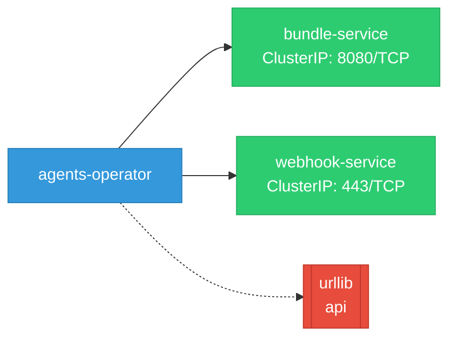
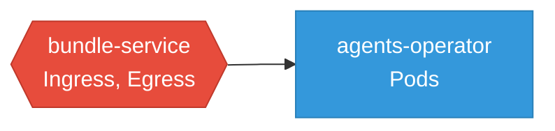

# agents-operator: Network

## Service Map

### Services

| Name | Type | Ports | Source |
|------|------|-------|--------|
| bundle-service | ClusterIP | 8080/TCP | [`kagenti-operator/config/bundleservice/service.yaml`](https://github.com/red-hat-data-services/agents-operator/blob/cea595935e348e2f2c4bffc5481350fd8509d2d1/kagenti-operator/config/bundleservice/service.yaml) |
| webhook-service | ClusterIP | 443/TCP | [`kagenti-operator/config/webhook/service.yaml`](https://github.com/red-hat-data-services/agents-operator/blob/cea595935e348e2f2c4bffc5481350fd8509d2d1/kagenti-operator/config/webhook/service.yaml) |

### Ingress / Routing

| Kind | Name | Hosts | Paths | TLS | Source |
|------|------|-------|-------|-----|--------|
| HTTPRoute | token-broker-oauth-callback | token-broker.localtest.me | /oauth/callback | no | [`token-broker/deploy/04-httproute.yaml`](https://github.com/red-hat-data-services/agents-operator/blob/cea595935e348e2f2c4bffc5481350fd8509d2d1/token-broker/deploy/04-httproute.yaml) |

### Network Policies

| Name | Policy Types | Source |
|------|-------------|--------|
| bundle-service | Ingress, Egress | [`kagenti-operator/config/bundleservice/networkpolicy.yaml`](https://github.com/red-hat-data-services/agents-operator/blob/cea595935e348e2f2c4bffc5481350fd8509d2d1/kagenti-operator/config/bundleservice/networkpolicy.yaml) |

## Network Policy Graph

Visual representation of NetworkPolicy rules. Ingress rules show what traffic is allowed into pods, egress rules show what traffic is allowed out.

