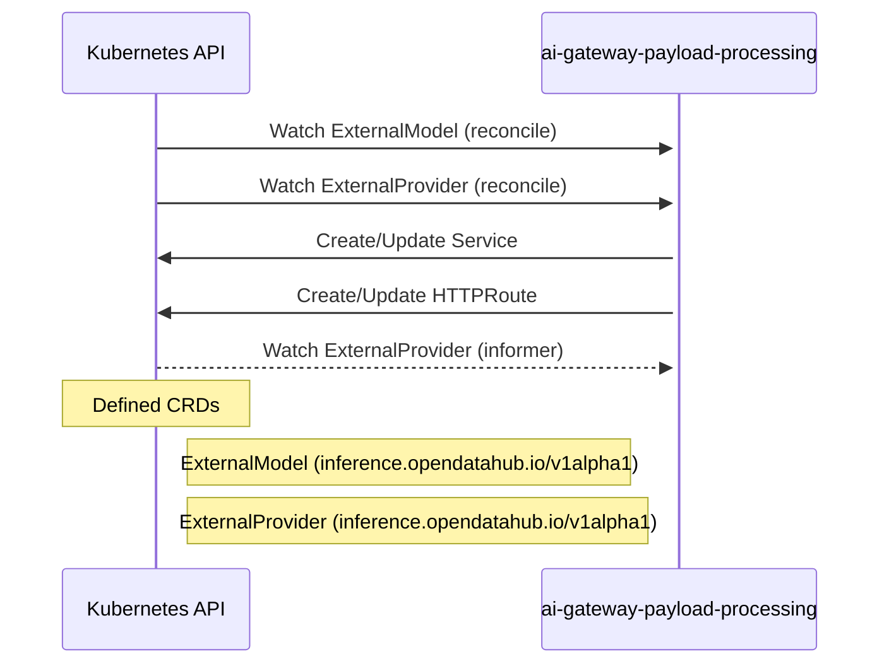

# ai-gateway-payload-processing: Dataflow

## Controller Watches

Kubernetes resources this controller monitors for changes. Each watch triggers reconciliation when the watched resource is created, updated, or deleted.

| Type | GVK | Source |
|------|-----|--------|
| For | inference/v1alpha1/ExternalModel | [`pkg/controller/externalmodel/reconciler.go:258`](https://github.com/opendatahub-io/ai-gateway-payload-processing/blob/582c80e2b18ecda2ede4a40f597b7efc8da0dcc5/pkg/controller/externalmodel/reconciler.go#L258) |
| For | inference/v1alpha1/ExternalProvider | [`pkg/controller/externalprovider/reconciler.go:243`](https://github.com/opendatahub-io/ai-gateway-payload-processing/blob/582c80e2b18ecda2ede4a40f597b7efc8da0dcc5/pkg/controller/externalprovider/reconciler.go#L243) |
| Owns | /v1/Service | [`pkg/controller/externalprovider/reconciler.go:244`](https://github.com/opendatahub-io/ai-gateway-payload-processing/blob/582c80e2b18ecda2ede4a40f597b7efc8da0dcc5/pkg/controller/externalprovider/reconciler.go#L244) |
| Owns | apis/v1/HTTPRoute | [`pkg/controller/externalmodel/reconciler.go:259`](https://github.com/opendatahub-io/ai-gateway-payload-processing/blob/582c80e2b18ecda2ede4a40f597b7efc8da0dcc5/pkg/controller/externalmodel/reconciler.go#L259) |
| Watches | inference/v1alpha1/ExternalProvider | [`pkg/controller/externalmodel/reconciler.go:260`](https://github.com/opendatahub-io/ai-gateway-payload-processing/blob/582c80e2b18ecda2ede4a40f597b7efc8da0dcc5/pkg/controller/externalmodel/reconciler.go#L260) |

## Reconciliation Flow

How the controller interacts with the Kubernetes API during reconciliation.

## Configuration

ConfigMaps and Helm values that control this component's runtime behavior.

### Helm

**Chart:** payload-processing v0.1.0

