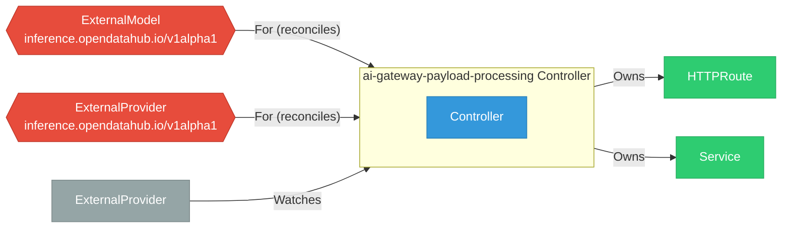

# ai-gateway-payload-processing

> **Architecture snapshot: 2026-09-07** (2026-09-07)

**Repository:** opendatahub-io/ai-gateway-payload-processing  
**Analyzer:** arch-analyzer dev  
**Extracted:** 2026-09-07T04:03:21Z

## Summary

| Metric | Count |
|--------|-------|
| CRDs | 2 |
| Deployments | 0 |
| Services | 0 |
| Secrets | 0 |
| Cluster Roles | 0 |
| Controller Watches | 5 |

## Component Architecture

CRDs, controllers, and owned Kubernetes resources.

### CRDs

| Group | Version | Kind | Scope | Fields | Validation Rules | Discovery | Source |
|-------|---------|------|-------|--------|------------------|-----------|--------|
| inference.opendatahub.io | v1alpha1 | ExternalModel | Namespaced | 27 | 0 | YAML | [`config/crd/bases/inference.opendatahub.io_externalmodels.yaml`](https://github.com/opendatahub-io/ai-gateway-payload-processing/blob/582c80e2b18ecda2ede4a40f597b7efc8da0dcc5/config/crd/bases/inference.opendatahub.io_externalmodels.yaml) |
| inference.opendatahub.io | v1alpha1 | ExternalProvider | Namespaced | 20 | 0 | YAML | [`config/crd/bases/inference.opendatahub.io_externalproviders.yaml`](https://github.com/opendatahub-io/ai-gateway-payload-processing/blob/582c80e2b18ecda2ede4a40f597b7efc8da0dcc5/config/crd/bases/inference.opendatahub.io_externalproviders.yaml) |

## Dependencies

### Key External Dependencies

| Module | Version |
|--------|---------|
| github.com/go-logr/logr | v1.4.4 |
| github.com/prometheus/client_golang | v1.24.1 |
| google.golang.org/grpc | v1.83.0 |
| k8s.io/api | v0.35.7 |
| k8s.io/apimachinery | v0.35.7 |
| k8s.io/client-go | v0.35.7 |
| sigs.k8s.io/controller-runtime | v0.23.3 |

