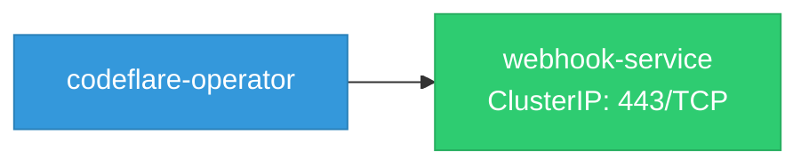

# codeflare-operator: Network

## Service Map

### Services

| Name | Type | Ports | Source |
|------|------|-------|--------|
| webhook-service | ClusterIP | 443/TCP | [`config/webhook/service.yaml`](https://github.com/project-codeflare/codeflare-operator/blob/d8ceeb64e5a40e3a27b2c0cb6e294ed85e0c69ac/config/webhook/service.yaml) |

### Ingress / Routing

| Kind | Name | Hosts | Paths | TLS | Source |
|------|------|-------|-------|-----|--------|
| Ingress | rbac-inferred |  |  | no | [`rbac/manager-role`](https://github.com/project-codeflare/codeflare-operator/blob/d8ceeb64e5a40e3a27b2c0cb6e294ed85e0c69ac/rbac/manager-role) |
| Route | rbac-inferred |  |  | no | [`rbac/manager-role`](https://github.com/project-codeflare/codeflare-operator/blob/d8ceeb64e5a40e3a27b2c0cb6e294ed85e0c69ac/rbac/manager-role) |

!!! warning "No Network Policies"
    No NetworkPolicy resources were found in the analyzed sources. Network policies may exist in overlays, Helm values, or cluster-level configurations not captured by static analysis.

