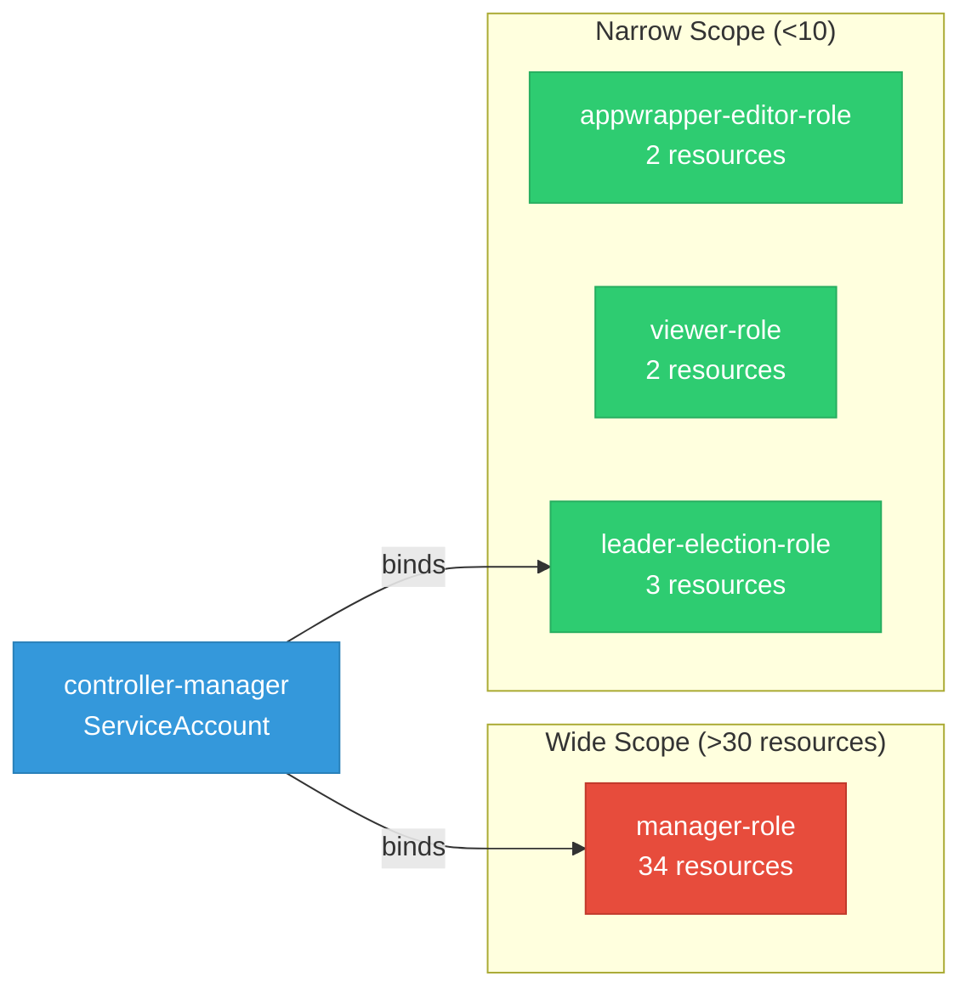

# codeflare-operator: RBAC

ServiceAccount bindings, roles, and resource permissions.

## RBAC Overview

This component defines a large RBAC surface (95 diagram lines). The graph below groups roles by permission scope.

## Bindings

Subject-to-role mappings defining who has access to what.

| Binding | Type | Role | Subject |
|---------|------|------|---------|
| manager-rolebinding | ClusterRoleBinding | manager-role | ServiceAccount/controller-manager |
| leader-election-rolebinding | RoleBinding | leader-election-role | ServiceAccount/controller-manager |

## Role Details

Per-rule breakdown of API groups, resources, and verbs for each role.

| Role | Kind | API Groups | Resources | Verbs |
|------|------|------------|-----------|-------|
| appwrapper-editor-role | ClusterRole |  | appwrappers | create, delete, get, list, patch, update, watch |
| appwrapper-editor-role | ClusterRole |  | appwrappers/status | get |
| manager-role | ClusterRole |  | events | create, patch, update, watch |
| manager-role | ClusterRole |  | nodes | get, list, watch |
| manager-role | ClusterRole |  | pods, services | create, delete, get, list, patch, update, watch |
| manager-role | ClusterRole |  | secrets | get, list, update, watch |
| manager-role | ClusterRole |  | mutatingwebhookconfigurations | get, list, update, watch |
| manager-role | ClusterRole |  | validatingwebhookconfigurations | get, list, update, watch |
| manager-role | ClusterRole |  | customresourcedefinitions | get, list, watch |
| manager-role | ClusterRole |  | deployments, statefulsets | create, delete, get, list, patch, update, watch |
| manager-role | ClusterRole |  | tokenreviews | create |
| manager-role | ClusterRole |  | subjectaccessreviews | create |
| manager-role | ClusterRole |  | jobs | create, delete, get, list, patch, update, watch |
| manager-role | ClusterRole |  | ingresses | get |
| manager-role | ClusterRole |  | secrets | create, get, patch |
| manager-role | ClusterRole |  | serviceaccounts | create, delete, get, list, patch, update, watch |
| manager-role | ClusterRole |  | services | create, delete, get, list, patch, update, watch |
| manager-role | ClusterRole |  | dscinitializations | get, list, watch |
| manager-role | ClusterRole |  | jobsets | create, delete, get, list, patch, update, watch |
| manager-role | ClusterRole |  | pytorchjobs | create, delete, get, list, patch, update, watch |
| manager-role | ClusterRole |  | ingresses | create, delete, get, list, patch, update, watch |
| manager-role | ClusterRole |  | networkpolicies | create, delete, get, list, patch, update, watch |
| manager-role | ClusterRole |  | rayclusters | create, delete, get, list, patch, update, watch |
| manager-role | ClusterRole |  | rayclusters/finalizers | update |
| manager-role | ClusterRole |  | rayclusters/status | get, patch, update |
| manager-role | ClusterRole |  | rayjobs | create, delete, get, list, patch, update, watch |
| manager-role | ClusterRole |  | clusterrolebindings | create, delete, get, list, patch, update, watch |
| manager-role | ClusterRole |  | routes, routes/custom-host | create, delete, get, list, patch, update, watch |
| manager-role | ClusterRole |  | podgroups | create, delete, get, list, patch, update, watch |
| manager-role | ClusterRole |  | podgroups | create, delete, get, list, patch, update, watch |
| manager-role | ClusterRole |  | appwrappers | create, delete, get, list, patch, update, watch |
| manager-role | ClusterRole |  | appwrappers/finalizers | update |
| manager-role | ClusterRole |  | appwrappers/status | get, patch, update |
| viewer-role | ClusterRole |  | appwrappers | get, list, watch |
| viewer-role | ClusterRole |  | appwrappers/status | get |
| leader-election-role | Role |  | configmaps | get, list, watch, create, update, patch, delete |
| leader-election-role | Role |  | leases | get, list, watch, create, update, patch, delete |
| leader-election-role | Role |  | events | create, patch |

