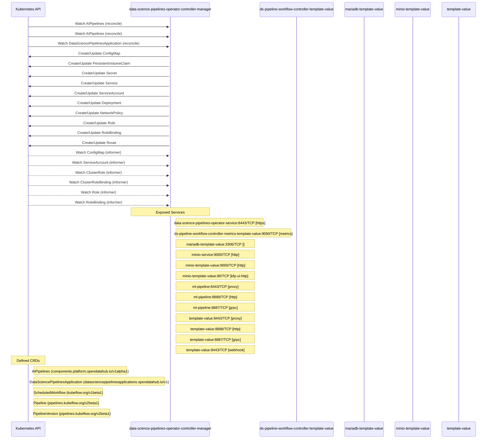

# data-science-pipelines-operator: Dataflow

## Controller Watches

Kubernetes resources this controller monitors for changes. Each watch triggers reconciliation when the watched resource is created, updated, or deleted.

| Type | GVK | Source |
|------|-----|--------|
| For | aipipelines/v1alpha1/AIPipelines | [`controllers/aipipelines_argo_controller.go:334`](https://github.com/opendatahub-io/data-science-pipelines-operator/blob/31b5c0e4338aefc77daa666044a80cfdb92867cb/controllers/aipipelines_argo_controller.go#L334) |
| For | aipipelines/v1alpha1/AIPipelines | [`controllers/aipipelines_controller.go:163`](https://github.com/opendatahub-io/data-science-pipelines-operator/blob/31b5c0e4338aefc77daa666044a80cfdb92867cb/controllers/aipipelines_controller.go#L163) |
| For | api/v1/DataSciencePipelinesApplication | [`controllers/dspipeline_controller.go:908`](https://github.com/opendatahub-io/data-science-pipelines-operator/blob/31b5c0e4338aefc77daa666044a80cfdb92867cb/controllers/dspipeline_controller.go#L908) |
| Owns | /v1/ConfigMap | [`controllers/dspipeline_controller.go:911`](https://github.com/opendatahub-io/data-science-pipelines-operator/blob/31b5c0e4338aefc77daa666044a80cfdb92867cb/controllers/dspipeline_controller.go#L911) |
| Owns | /v1/PersistentVolumeClaim | [`controllers/dspipeline_controller.go:914`](https://github.com/opendatahub-io/data-science-pipelines-operator/blob/31b5c0e4338aefc77daa666044a80cfdb92867cb/controllers/dspipeline_controller.go#L914) |
| Owns | /v1/Secret | [`controllers/dspipeline_controller.go:910`](https://github.com/opendatahub-io/data-science-pipelines-operator/blob/31b5c0e4338aefc77daa666044a80cfdb92867cb/controllers/dspipeline_controller.go#L910) |
| Owns | /v1/Service | [`controllers/dspipeline_controller.go:912`](https://github.com/opendatahub-io/data-science-pipelines-operator/blob/31b5c0e4338aefc77daa666044a80cfdb92867cb/controllers/dspipeline_controller.go#L912) |
| Owns | /v1/ServiceAccount | [`controllers/dspipeline_controller.go:913`](https://github.com/opendatahub-io/data-science-pipelines-operator/blob/31b5c0e4338aefc77daa666044a80cfdb92867cb/controllers/dspipeline_controller.go#L913) |
| Owns | apps/v1/Deployment | [`controllers/dspipeline_controller.go:909`](https://github.com/opendatahub-io/data-science-pipelines-operator/blob/31b5c0e4338aefc77daa666044a80cfdb92867cb/controllers/dspipeline_controller.go#L909) |
| Owns | networking.k8s.io/v1/NetworkPolicy | [`controllers/dspipeline_controller.go:915`](https://github.com/opendatahub-io/data-science-pipelines-operator/blob/31b5c0e4338aefc77daa666044a80cfdb92867cb/controllers/dspipeline_controller.go#L915) |
| Owns | rbac.authorization.k8s.io/v1/Role | [`controllers/dspipeline_controller.go:916`](https://github.com/opendatahub-io/data-science-pipelines-operator/blob/31b5c0e4338aefc77daa666044a80cfdb92867cb/controllers/dspipeline_controller.go#L916) |
| Owns | rbac.authorization.k8s.io/v1/RoleBinding | [`controllers/dspipeline_controller.go:917`](https://github.com/opendatahub-io/data-science-pipelines-operator/blob/31b5c0e4338aefc77daa666044a80cfdb92867cb/controllers/dspipeline_controller.go#L917) |
| Owns | route/v1/Route | [`controllers/dspipeline_controller.go:918`](https://github.com/opendatahub-io/data-science-pipelines-operator/blob/31b5c0e4338aefc77daa666044a80cfdb92867cb/controllers/dspipeline_controller.go#L918) |
| Watches | /v1/ConfigMap | [`controllers/aipipelines_argo_controller.go:363`](https://github.com/opendatahub-io/data-science-pipelines-operator/blob/31b5c0e4338aefc77daa666044a80cfdb92867cb/controllers/aipipelines_argo_controller.go#L363) |
| Watches | /v1/ServiceAccount | [`controllers/aipipelines_argo_controller.go:364`](https://github.com/opendatahub-io/data-science-pipelines-operator/blob/31b5c0e4338aefc77daa666044a80cfdb92867cb/controllers/aipipelines_argo_controller.go#L364) |
| Watches | rbac.authorization.k8s.io/v1/ClusterRole | [`controllers/aipipelines_argo_controller.go:367`](https://github.com/opendatahub-io/data-science-pipelines-operator/blob/31b5c0e4338aefc77daa666044a80cfdb92867cb/controllers/aipipelines_argo_controller.go#L367) |
| Watches | rbac.authorization.k8s.io/v1/ClusterRoleBinding | [`controllers/aipipelines_argo_controller.go:368`](https://github.com/opendatahub-io/data-science-pipelines-operator/blob/31b5c0e4338aefc77daa666044a80cfdb92867cb/controllers/aipipelines_argo_controller.go#L368) |
| Watches | rbac.authorization.k8s.io/v1/Role | [`controllers/aipipelines_argo_controller.go:365`](https://github.com/opendatahub-io/data-science-pipelines-operator/blob/31b5c0e4338aefc77daa666044a80cfdb92867cb/controllers/aipipelines_argo_controller.go#L365) |
| Watches | rbac.authorization.k8s.io/v1/RoleBinding | [`controllers/aipipelines_argo_controller.go:366`](https://github.com/opendatahub-io/data-science-pipelines-operator/blob/31b5c0e4338aefc77daa666044a80cfdb92867cb/controllers/aipipelines_argo_controller.go#L366) |

### Programmatic Resource Operations

| Verb | Kind | Group | Condition |
|------|------|-------|----------|
| update | AIPipelines | aipipelines |  |
| create | Unstructured | unstructured |  |
| update | Unstructured | unstructured |  |
| update | DataSciencePipelinesApplication | api |  |

## Reconciliation Flow

How the controller interacts with the Kubernetes API during reconciliation.

### Webhooks

| Name | Type | Path | Failure Policy | Service | Overlays | Enable Condition | Sources |
|------|------|------|----------------|---------|----------|------------------|----------|
| pipelineversions.pipelines.kubeflow.org | mutating | /webhooks/mutate-pipelineversion | Fail | template-value/template-value |  |  | [`config/internal/webhook/mutating_webhook.yaml.tmpl`](https://github.com/opendatahub-io/data-science-pipelines-operator/blob/31b5c0e4338aefc77daa666044a80cfdb92867cb/config/internal/webhook/mutating_webhook.yaml.tmpl) |
| pipelineversions.pipelines.kubeflow.org | validating | /webhooks/validate-pipelineversion | Fail | template-value/template-value |  |  | [`config/internal/webhook/validating_webhook.yaml.tmpl`](https://github.com/opendatahub-io/data-science-pipelines-operator/blob/31b5c0e4338aefc77daa666044a80cfdb92867cb/config/internal/webhook/validating_webhook.yaml.tmpl) |

## Configuration

ConfigMaps and Helm values that control this component's runtime behavior.

### ConfigMaps

| Name | Data Keys | Source |
|------|-----------|--------|
| workflow-controller-configmap |  | [`config/argo/configmap.workflow-controller-configmap.yaml`](https://github.com/opendatahub-io/data-science-pipelines-operator/blob/31b5c0e4338aefc77daa666044a80cfdb92867cb/config/argo/configmap.workflow-controller-configmap.yaml) |

