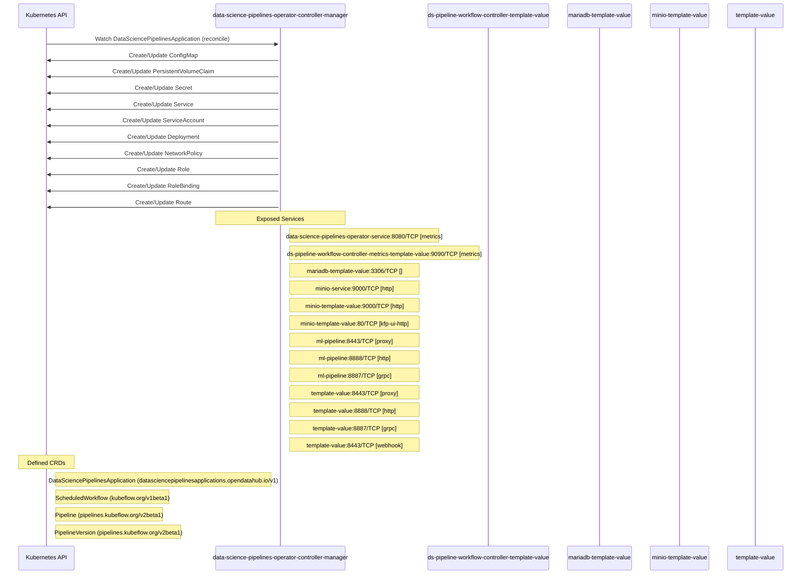

# data-science-pipelines-operator: Dataflow

## Controller Watches

Kubernetes resources this controller monitors for changes. Each watch triggers reconciliation when the watched resource is created, updated, or deleted.

| Type | GVK | Source |
|------|-----|--------|
| For | api/v1/DataSciencePipelinesApplication | [`controllers/dspipeline_controller.go:893`](https://github.com/opendatahub-io/data-science-pipelines-operator/blob/17634f8eb9c92fcc6a71f9f4d5e38cda37cd762c/controllers/dspipeline_controller.go#L893) |
| Owns | /v1/ConfigMap | [`controllers/dspipeline_controller.go:896`](https://github.com/opendatahub-io/data-science-pipelines-operator/blob/17634f8eb9c92fcc6a71f9f4d5e38cda37cd762c/controllers/dspipeline_controller.go#L896) |
| Owns | /v1/PersistentVolumeClaim | [`controllers/dspipeline_controller.go:899`](https://github.com/opendatahub-io/data-science-pipelines-operator/blob/17634f8eb9c92fcc6a71f9f4d5e38cda37cd762c/controllers/dspipeline_controller.go#L899) |
| Owns | /v1/Secret | [`controllers/dspipeline_controller.go:895`](https://github.com/opendatahub-io/data-science-pipelines-operator/blob/17634f8eb9c92fcc6a71f9f4d5e38cda37cd762c/controllers/dspipeline_controller.go#L895) |
| Owns | /v1/Service | [`controllers/dspipeline_controller.go:897`](https://github.com/opendatahub-io/data-science-pipelines-operator/blob/17634f8eb9c92fcc6a71f9f4d5e38cda37cd762c/controllers/dspipeline_controller.go#L897) |
| Owns | /v1/ServiceAccount | [`controllers/dspipeline_controller.go:898`](https://github.com/opendatahub-io/data-science-pipelines-operator/blob/17634f8eb9c92fcc6a71f9f4d5e38cda37cd762c/controllers/dspipeline_controller.go#L898) |
| Owns | apps/v1/Deployment | [`controllers/dspipeline_controller.go:894`](https://github.com/opendatahub-io/data-science-pipelines-operator/blob/17634f8eb9c92fcc6a71f9f4d5e38cda37cd762c/controllers/dspipeline_controller.go#L894) |
| Owns | networking.k8s.io/v1/NetworkPolicy | [`controllers/dspipeline_controller.go:900`](https://github.com/opendatahub-io/data-science-pipelines-operator/blob/17634f8eb9c92fcc6a71f9f4d5e38cda37cd762c/controllers/dspipeline_controller.go#L900) |
| Owns | rbac.authorization.k8s.io/v1/Role | [`controllers/dspipeline_controller.go:901`](https://github.com/opendatahub-io/data-science-pipelines-operator/blob/17634f8eb9c92fcc6a71f9f4d5e38cda37cd762c/controllers/dspipeline_controller.go#L901) |
| Owns | rbac.authorization.k8s.io/v1/RoleBinding | [`controllers/dspipeline_controller.go:902`](https://github.com/opendatahub-io/data-science-pipelines-operator/blob/17634f8eb9c92fcc6a71f9f4d5e38cda37cd762c/controllers/dspipeline_controller.go#L902) |
| Owns | route/v1/Route | [`controllers/dspipeline_controller.go:903`](https://github.com/opendatahub-io/data-science-pipelines-operator/blob/17634f8eb9c92fcc6a71f9f4d5e38cda37cd762c/controllers/dspipeline_controller.go#L903) |

### Programmatic Resource Operations

| Verb | Kind | Group | Condition |
|------|------|-------|----------|
| update | DataSciencePipelinesApplication | api |  |

## Reconciliation Flow

How the controller interacts with the Kubernetes API during reconciliation.

### Webhooks

| Name | Type | Path | Failure Policy | Service | Overlays | Enable Condition | Sources |
|------|------|------|----------------|---------|----------|------------------|----------|
| pipelineversions.pipelines.kubeflow.org | mutating | /webhooks/mutate-pipelineversion | Fail | template-value/template-value |  |  | [`config/internal/webhook/mutating_webhook.yaml.tmpl`](https://github.com/opendatahub-io/data-science-pipelines-operator/blob/17634f8eb9c92fcc6a71f9f4d5e38cda37cd762c/config/internal/webhook/mutating_webhook.yaml.tmpl) |
| pipelineversions.pipelines.kubeflow.org | validating | /webhooks/validate-pipelineversion | Fail | template-value/template-value |  |  | [`config/internal/webhook/validating_webhook.yaml.tmpl`](https://github.com/opendatahub-io/data-science-pipelines-operator/blob/17634f8eb9c92fcc6a71f9f4d5e38cda37cd762c/config/internal/webhook/validating_webhook.yaml.tmpl) |

## Configuration

ConfigMaps and Helm values that control this component's runtime behavior.

### ConfigMaps

| Name | Data Keys | Source |
|------|-----------|--------|
| workflow-controller-configmap |  | [`config/argo/configmap.workflow-controller-configmap.yaml`](https://github.com/opendatahub-io/data-science-pipelines-operator/blob/17634f8eb9c92fcc6a71f9f4d5e38cda37cd762c/config/argo/configmap.workflow-controller-configmap.yaml) |

