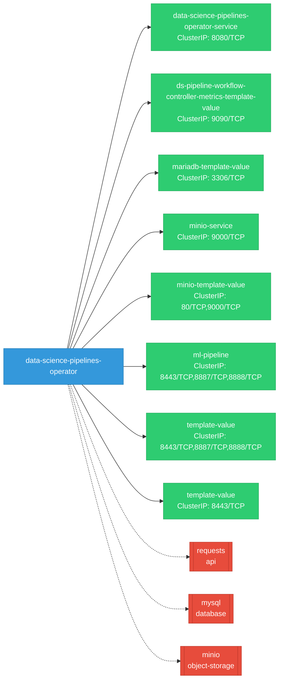
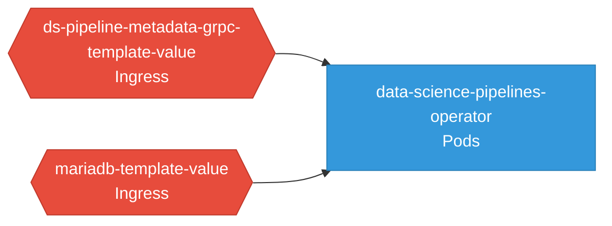

# data-science-pipelines-operator: Network

## Service Map

### Services

| Name | Type | Ports | Source |
|------|------|-------|--------|
| data-science-pipelines-operator-service | ClusterIP | 8080/TCP | [`kustomize:config/overlays/odh`](https://github.com/opendatahub-io/data-science-pipelines-operator/blob/17634f8eb9c92fcc6a71f9f4d5e38cda37cd762c/kustomize:config/overlays/odh) |
| ds-pipeline-workflow-controller-metrics-template-value | ClusterIP | 9090/TCP | [`config/internal/workflow-controller/service.yaml.tmpl`](https://github.com/opendatahub-io/data-science-pipelines-operator/blob/17634f8eb9c92fcc6a71f9f4d5e38cda37cd762c/config/internal/workflow-controller/service.yaml.tmpl) |
| mariadb-template-value | ClusterIP | 3306/TCP | [`config/internal/mariadb/default/service.yaml.tmpl`](https://github.com/opendatahub-io/data-science-pipelines-operator/blob/17634f8eb9c92fcc6a71f9f4d5e38cda37cd762c/config/internal/mariadb/default/service.yaml.tmpl) |
| minio-service | ClusterIP | 9000/TCP | [`config/internal/minio/default/service.minioservice.yaml.tmpl`](https://github.com/opendatahub-io/data-science-pipelines-operator/blob/17634f8eb9c92fcc6a71f9f4d5e38cda37cd762c/config/internal/minio/default/service.minioservice.yaml.tmpl) |
| minio-template-value | ClusterIP | 9000/TCP, 80/TCP | [`config/internal/minio/default/service.yaml.tmpl`](https://github.com/opendatahub-io/data-science-pipelines-operator/blob/17634f8eb9c92fcc6a71f9f4d5e38cda37cd762c/config/internal/minio/default/service.yaml.tmpl) |
| ml-pipeline | ClusterIP | 8443/TCP, 8888/TCP, 8887/TCP | [`config/internal/apiserver/default/service.ml-pipeline.yaml.tmpl`](https://github.com/opendatahub-io/data-science-pipelines-operator/blob/17634f8eb9c92fcc6a71f9f4d5e38cda37cd762c/config/internal/apiserver/default/service.ml-pipeline.yaml.tmpl) |
| template-value | ClusterIP | 8443/TCP, 8888/TCP, 8887/TCP | [`config/internal/apiserver/default/service.yaml.tmpl`](https://github.com/opendatahub-io/data-science-pipelines-operator/blob/17634f8eb9c92fcc6a71f9f4d5e38cda37cd762c/config/internal/apiserver/default/service.yaml.tmpl) |
| template-value | ClusterIP | 8443/TCP | [`config/internal/webhook/service.yaml.tmpl`](https://github.com/opendatahub-io/data-science-pipelines-operator/blob/17634f8eb9c92fcc6a71f9f4d5e38cda37cd762c/config/internal/webhook/service.yaml.tmpl) |

### Ingress / Routing

| Kind | Name | Hosts | Paths | TLS | Source |
|------|------|-------|-------|-----|--------|
| Ingress | rbac-inferred |  |  | no | [`rbac/manager-role`](https://github.com/opendatahub-io/data-science-pipelines-operator/blob/17634f8eb9c92fcc6a71f9f4d5e38cda37cd762c/rbac/manager-role) |
| Route | ds-pipeline-md-template-value |  |  | yes | [`config/internal/ml-metadata/route/metadata-envoy.route.yaml.tmpl`](https://github.com/opendatahub-io/data-science-pipelines-operator/blob/17634f8eb9c92fcc6a71f9f4d5e38cda37cd762c/config/internal/ml-metadata/route/metadata-envoy.route.yaml.tmpl) |
| Route | minio-template-value |  |  | yes | [`config/internal/minio/route.yaml.tmpl`](https://github.com/opendatahub-io/data-science-pipelines-operator/blob/17634f8eb9c92fcc6a71f9f4d5e38cda37cd762c/config/internal/minio/route.yaml.tmpl) |
| Route | template-value |  |  | yes | [`config/internal/apiserver/route/route.yaml.tmpl`](https://github.com/opendatahub-io/data-science-pipelines-operator/blob/17634f8eb9c92fcc6a71f9f4d5e38cda37cd762c/config/internal/apiserver/route/route.yaml.tmpl) |

### Network Policies

| Name | Policy Types | Source |
|------|-------------|--------|
| ds-pipeline-metadata-grpc-template-value | Ingress | [`config/internal/ml-metadata/metadata-grpc.networkpolicy.yaml.tmpl`](https://github.com/opendatahub-io/data-science-pipelines-operator/blob/17634f8eb9c92fcc6a71f9f4d5e38cda37cd762c/config/internal/ml-metadata/metadata-grpc.networkpolicy.yaml.tmpl) |
| mariadb-template-value | Ingress | [`config/internal/mariadb/default/networkpolicy.yaml.tmpl`](https://github.com/opendatahub-io/data-science-pipelines-operator/blob/17634f8eb9c92fcc6a71f9f4d5e38cda37cd762c/config/internal/mariadb/default/networkpolicy.yaml.tmpl) |

## Network Policy Graph

Visual representation of NetworkPolicy rules. Ingress rules show what traffic is allowed into pods, egress rules show what traffic is allowed out.

