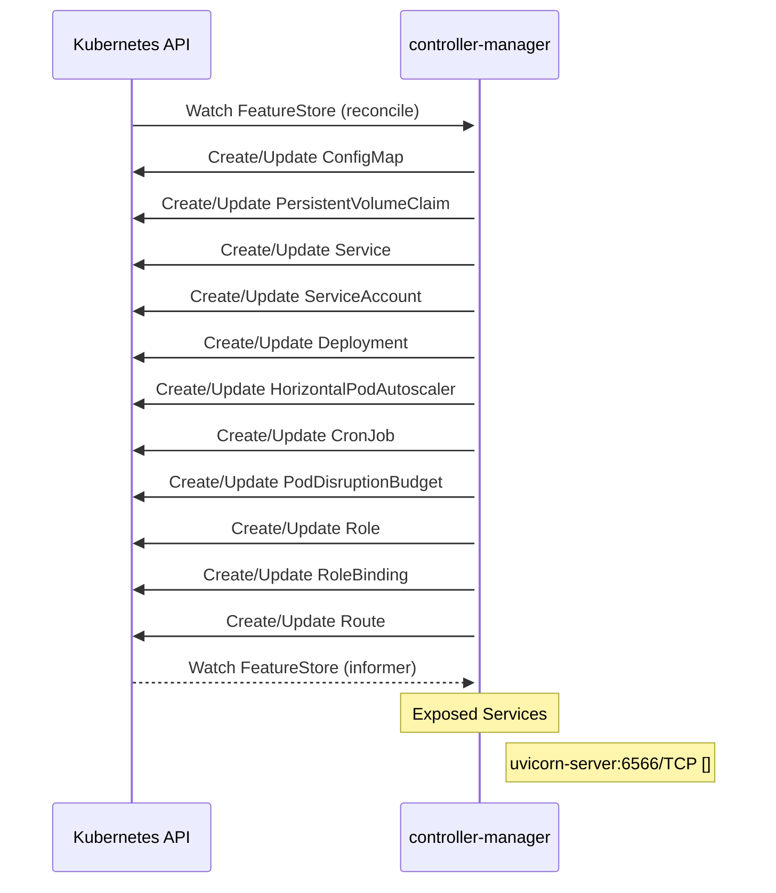

# feast: Dataflow

## Controller Watches

Kubernetes resources this controller monitors for changes. Each watch triggers reconciliation when the watched resource is created, updated, or deleted.

| Type | GVK | Source |
|------|-----|--------|
| For | api/v1/FeatureStore | [`infra/feast-operator/internal/controller/featurestore_controller.go:279`](https://github.com/feast-dev/feast/blob/3d770a5a3d77012cc32ac53d571ffde7586de732/infra/feast-operator/internal/controller/featurestore_controller.go#L279) |
| Owns | /v1/ConfigMap | [`infra/feast-operator/internal/controller/featurestore_controller.go:280`](https://github.com/feast-dev/feast/blob/3d770a5a3d77012cc32ac53d571ffde7586de732/infra/feast-operator/internal/controller/featurestore_controller.go#L280) |
| Owns | /v1/PersistentVolumeClaim | [`infra/feast-operator/internal/controller/featurestore_controller.go:283`](https://github.com/feast-dev/feast/blob/3d770a5a3d77012cc32ac53d571ffde7586de732/infra/feast-operator/internal/controller/featurestore_controller.go#L283) |
| Owns | /v1/Service | [`infra/feast-operator/internal/controller/featurestore_controller.go:282`](https://github.com/feast-dev/feast/blob/3d770a5a3d77012cc32ac53d571ffde7586de732/infra/feast-operator/internal/controller/featurestore_controller.go#L282) |
| Owns | /v1/ServiceAccount | [`infra/feast-operator/internal/controller/featurestore_controller.go:284`](https://github.com/feast-dev/feast/blob/3d770a5a3d77012cc32ac53d571ffde7586de732/infra/feast-operator/internal/controller/featurestore_controller.go#L284) |
| Owns | apps/v1/Deployment | [`infra/feast-operator/internal/controller/featurestore_controller.go:281`](https://github.com/feast-dev/feast/blob/3d770a5a3d77012cc32ac53d571ffde7586de732/infra/feast-operator/internal/controller/featurestore_controller.go#L281) |
| Owns | autoscaling/v2/HorizontalPodAutoscaler | [`infra/feast-operator/internal/controller/featurestore_controller.go:288`](https://github.com/feast-dev/feast/blob/3d770a5a3d77012cc32ac53d571ffde7586de732/infra/feast-operator/internal/controller/featurestore_controller.go#L288) |
| Owns | batch/v1/CronJob | [`infra/feast-operator/internal/controller/featurestore_controller.go:287`](https://github.com/feast-dev/feast/blob/3d770a5a3d77012cc32ac53d571ffde7586de732/infra/feast-operator/internal/controller/featurestore_controller.go#L287) |
| Owns | policy/v1/PodDisruptionBudget | [`infra/feast-operator/internal/controller/featurestore_controller.go:289`](https://github.com/feast-dev/feast/blob/3d770a5a3d77012cc32ac53d571ffde7586de732/infra/feast-operator/internal/controller/featurestore_controller.go#L289) |
| Owns | rbac.authorization.k8s.io/v1/Role | [`infra/feast-operator/internal/controller/featurestore_controller.go:286`](https://github.com/feast-dev/feast/blob/3d770a5a3d77012cc32ac53d571ffde7586de732/infra/feast-operator/internal/controller/featurestore_controller.go#L286) |
| Owns | rbac.authorization.k8s.io/v1/RoleBinding | [`infra/feast-operator/internal/controller/featurestore_controller.go:285`](https://github.com/feast-dev/feast/blob/3d770a5a3d77012cc32ac53d571ffde7586de732/infra/feast-operator/internal/controller/featurestore_controller.go#L285) |
| Owns | route/v1/Route | [`infra/feast-operator/internal/controller/featurestore_controller.go:293`](https://github.com/feast-dev/feast/blob/3d770a5a3d77012cc32ac53d571ffde7586de732/infra/feast-operator/internal/controller/featurestore_controller.go#L293) |
| Watches | api/v1/FeatureStore | [`infra/feast-operator/internal/controller/featurestore_controller.go:290`](https://github.com/feast-dev/feast/blob/3d770a5a3d77012cc32ac53d571ffde7586de732/infra/feast-operator/internal/controller/featurestore_controller.go#L290) |

## Reconciliation Flow

How the controller interacts with the Kubernetes API during reconciliation.

### HTTP Endpoints

| Method | Path | Source |
|--------|------|--------|
| * | /get-online-features | [`go/internal/feast/server/http_server.go:388`](https://github.com/feast-dev/feast/blob/3d770a5a3d77012cc32ac53d571ffde7586de732/go/internal/feast/server/http_server.go#L388) |
| * | /get-online-features | [`go/internal/feast/server/http_server.go:402`](https://github.com/feast-dev/feast/blob/3d770a5a3d77012cc32ac53d571ffde7586de732/go/internal/feast/server/http_server.go#L402) |
| * | /health | [`go/internal/feast/server/http_server.go:389`](https://github.com/feast-dev/feast/blob/3d770a5a3d77012cc32ac53d571ffde7586de732/go/internal/feast/server/http_server.go#L389) |
| * | /health | [`go/internal/feast/server/http_server.go:403`](https://github.com/feast-dev/feast/blob/3d770a5a3d77012cc32ac53d571ffde7586de732/go/internal/feast/server/http_server.go#L403) |
| * | /metrics | [`go/main.go:204`](https://github.com/feast-dev/feast/blob/3d770a5a3d77012cc32ac53d571ffde7586de732/go/main.go#L204) |
| * | /metrics | [`go/main.go:264`](https://github.com/feast-dev/feast/blob/3d770a5a3d77012cc32ac53d571ffde7586de732/go/main.go#L264) |

## Configuration

ConfigMaps and Helm values that control this component's runtime behavior.

### Helm

**Chart:** feast v0.66.0

