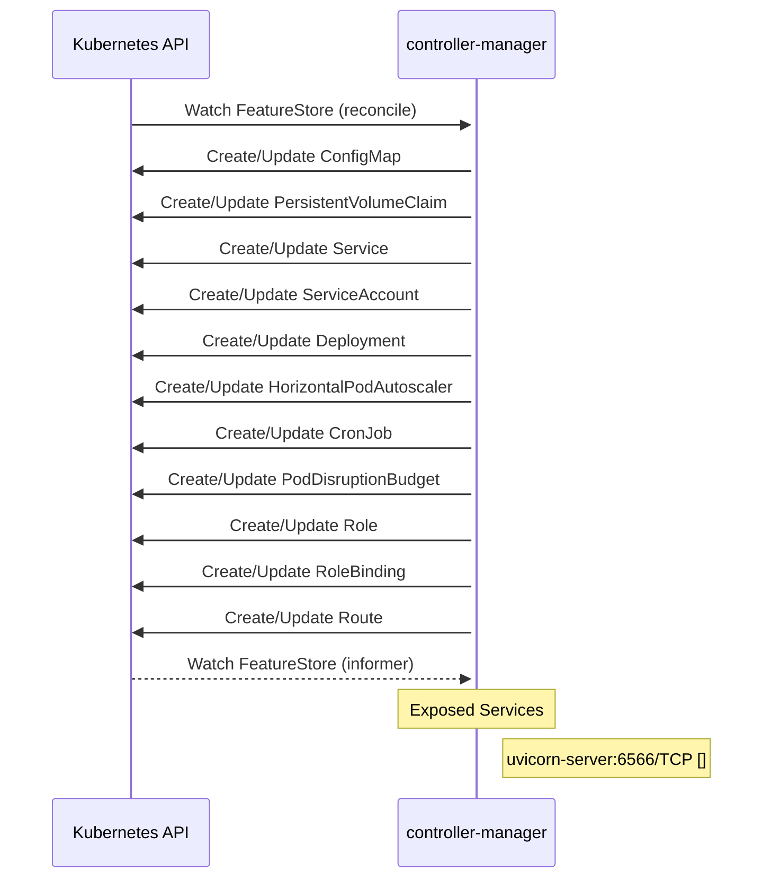

# feast: Dataflow

## Controller Watches

Kubernetes resources this controller monitors for changes. Each watch triggers reconciliation when the watched resource is created, updated, or deleted.

| Type | GVK | Source |
|------|-----|--------|
| For | api/v1/FeatureStore | [`infra/feast-operator/internal/controller/featurestore_controller.go:396`](https://github.com/feast-dev/feast/blob/2c07345e339e7299f0d4c640d62a01d9b51622ac/infra/feast-operator/internal/controller/featurestore_controller.go#L396) |
| Owns | /v1/ConfigMap | [`infra/feast-operator/internal/controller/featurestore_controller.go:397`](https://github.com/feast-dev/feast/blob/2c07345e339e7299f0d4c640d62a01d9b51622ac/infra/feast-operator/internal/controller/featurestore_controller.go#L397) |
| Owns | /v1/PersistentVolumeClaim | [`infra/feast-operator/internal/controller/featurestore_controller.go:400`](https://github.com/feast-dev/feast/blob/2c07345e339e7299f0d4c640d62a01d9b51622ac/infra/feast-operator/internal/controller/featurestore_controller.go#L400) |
| Owns | /v1/Service | [`infra/feast-operator/internal/controller/featurestore_controller.go:399`](https://github.com/feast-dev/feast/blob/2c07345e339e7299f0d4c640d62a01d9b51622ac/infra/feast-operator/internal/controller/featurestore_controller.go#L399) |
| Owns | /v1/ServiceAccount | [`infra/feast-operator/internal/controller/featurestore_controller.go:401`](https://github.com/feast-dev/feast/blob/2c07345e339e7299f0d4c640d62a01d9b51622ac/infra/feast-operator/internal/controller/featurestore_controller.go#L401) |
| Owns | apps/v1/Deployment | [`infra/feast-operator/internal/controller/featurestore_controller.go:398`](https://github.com/feast-dev/feast/blob/2c07345e339e7299f0d4c640d62a01d9b51622ac/infra/feast-operator/internal/controller/featurestore_controller.go#L398) |
| Owns | autoscaling/v2/HorizontalPodAutoscaler | [`infra/feast-operator/internal/controller/featurestore_controller.go:405`](https://github.com/feast-dev/feast/blob/2c07345e339e7299f0d4c640d62a01d9b51622ac/infra/feast-operator/internal/controller/featurestore_controller.go#L405) |
| Owns | batch/v1/CronJob | [`infra/feast-operator/internal/controller/featurestore_controller.go:404`](https://github.com/feast-dev/feast/blob/2c07345e339e7299f0d4c640d62a01d9b51622ac/infra/feast-operator/internal/controller/featurestore_controller.go#L404) |
| Owns | policy/v1/PodDisruptionBudget | [`infra/feast-operator/internal/controller/featurestore_controller.go:406`](https://github.com/feast-dev/feast/blob/2c07345e339e7299f0d4c640d62a01d9b51622ac/infra/feast-operator/internal/controller/featurestore_controller.go#L406) |
| Owns | rbac.authorization.k8s.io/v1/Role | [`infra/feast-operator/internal/controller/featurestore_controller.go:403`](https://github.com/feast-dev/feast/blob/2c07345e339e7299f0d4c640d62a01d9b51622ac/infra/feast-operator/internal/controller/featurestore_controller.go#L403) |
| Owns | rbac.authorization.k8s.io/v1/RoleBinding | [`infra/feast-operator/internal/controller/featurestore_controller.go:402`](https://github.com/feast-dev/feast/blob/2c07345e339e7299f0d4c640d62a01d9b51622ac/infra/feast-operator/internal/controller/featurestore_controller.go#L402) |
| Owns | route/v1/Route | [`infra/feast-operator/internal/controller/featurestore_controller.go:410`](https://github.com/feast-dev/feast/blob/2c07345e339e7299f0d4c640d62a01d9b51622ac/infra/feast-operator/internal/controller/featurestore_controller.go#L410) |
| Watches | api/v1/FeatureStore | [`infra/feast-operator/internal/controller/featurestore_controller.go:407`](https://github.com/feast-dev/feast/blob/2c07345e339e7299f0d4c640d62a01d9b51622ac/infra/feast-operator/internal/controller/featurestore_controller.go#L407) |

## Reconciliation Flow

How the controller interacts with the Kubernetes API during reconciliation.

```mermaid
sequenceDiagram
    %% Static dataflow for feast

    participant KubernetesAPI as Kubernetes API
    participant controller_manager as controller-manager

    KubernetesAPI->>+controller_manager: Watch FeatureStore (reconcile)
    controller_manager->>KubernetesAPI: Create/Update ConfigMap
    controller_manager->>KubernetesAPI: Create/Update PersistentVolumeClaim
    controller_manager->>KubernetesAPI: Create/Update Service
    controller_manager->>KubernetesAPI: Create/Update ServiceAccount
    controller_manager->>KubernetesAPI: Create/Update Deployment
    controller_manager->>KubernetesAPI: Create/Update HorizontalPodAutoscaler
    controller_manager->>KubernetesAPI: Create/Update CronJob
    controller_manager->>KubernetesAPI: Create/Update PodDisruptionBudget
    controller_manager->>KubernetesAPI: Create/Update Role
    controller_manager->>KubernetesAPI: Create/Update RoleBinding
    controller_manager->>KubernetesAPI: Create/Update Route
    KubernetesAPI-->>+controller_manager: Watch FeatureStore (informer)

    Note over controller_manager: Exposed Services
    Note right of controller_manager: uvicorn-server:6566/TCP []
```

### HTTP Endpoints

| Method | Path | Source |
|--------|------|--------|
| * | /get-online-features | [`go/internal/feast/server/http_server.go:388`](https://github.com/feast-dev/feast/blob/2c07345e339e7299f0d4c640d62a01d9b51622ac/go/internal/feast/server/http_server.go#L388) |
| * | /get-online-features | [`go/internal/feast/server/http_server.go:402`](https://github.com/feast-dev/feast/blob/2c07345e339e7299f0d4c640d62a01d9b51622ac/go/internal/feast/server/http_server.go#L402) |
| * | /health | [`go/internal/feast/server/http_server.go:389`](https://github.com/feast-dev/feast/blob/2c07345e339e7299f0d4c640d62a01d9b51622ac/go/internal/feast/server/http_server.go#L389) |
| * | /health | [`go/internal/feast/server/http_server.go:403`](https://github.com/feast-dev/feast/blob/2c07345e339e7299f0d4c640d62a01d9b51622ac/go/internal/feast/server/http_server.go#L403) |
| * | /metrics | [`go/main.go:204`](https://github.com/feast-dev/feast/blob/2c07345e339e7299f0d4c640d62a01d9b51622ac/go/main.go#L204) |
| * | /metrics | [`go/main.go:264`](https://github.com/feast-dev/feast/blob/2c07345e339e7299f0d4c640d62a01d9b51622ac/go/main.go#L264) |

## Configuration

ConfigMaps and Helm values that control this component's runtime behavior.

### Helm

**Chart:** feast v0.66.0

