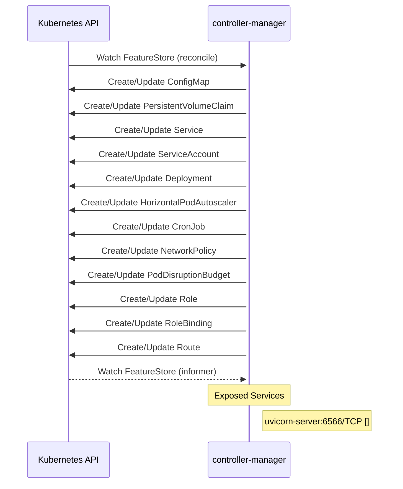

# feast: Dataflow

## Controller Watches

Kubernetes resources this controller monitors for changes. Each watch triggers reconciliation when the watched resource is created, updated, or deleted.

| Type | GVK | Source |
|------|-----|--------|
| For | api/v1/FeatureStore | [`infra/feast-operator/internal/controller/featurestore_controller.go:889`](https://github.com/red-hat-data-services/feast/blob/aef6ff0b29279fe53af4dc0fcd6d7cad4716cd83/infra/feast-operator/internal/controller/featurestore_controller.go#L889) |
| Owns | /v1/ConfigMap | [`infra/feast-operator/internal/controller/featurestore_controller.go:890`](https://github.com/red-hat-data-services/feast/blob/aef6ff0b29279fe53af4dc0fcd6d7cad4716cd83/infra/feast-operator/internal/controller/featurestore_controller.go#L890) |
| Owns | /v1/PersistentVolumeClaim | [`infra/feast-operator/internal/controller/featurestore_controller.go:893`](https://github.com/red-hat-data-services/feast/blob/aef6ff0b29279fe53af4dc0fcd6d7cad4716cd83/infra/feast-operator/internal/controller/featurestore_controller.go#L893) |
| Owns | /v1/Service | [`infra/feast-operator/internal/controller/featurestore_controller.go:892`](https://github.com/red-hat-data-services/feast/blob/aef6ff0b29279fe53af4dc0fcd6d7cad4716cd83/infra/feast-operator/internal/controller/featurestore_controller.go#L892) |
| Owns | /v1/ServiceAccount | [`infra/feast-operator/internal/controller/featurestore_controller.go:894`](https://github.com/red-hat-data-services/feast/blob/aef6ff0b29279fe53af4dc0fcd6d7cad4716cd83/infra/feast-operator/internal/controller/featurestore_controller.go#L894) |
| Owns | apps/v1/Deployment | [`infra/feast-operator/internal/controller/featurestore_controller.go:891`](https://github.com/red-hat-data-services/feast/blob/aef6ff0b29279fe53af4dc0fcd6d7cad4716cd83/infra/feast-operator/internal/controller/featurestore_controller.go#L891) |
| Owns | autoscaling/v2/HorizontalPodAutoscaler | [`infra/feast-operator/internal/controller/featurestore_controller.go:898`](https://github.com/red-hat-data-services/feast/blob/aef6ff0b29279fe53af4dc0fcd6d7cad4716cd83/infra/feast-operator/internal/controller/featurestore_controller.go#L898) |
| Owns | batch/v1/CronJob | [`infra/feast-operator/internal/controller/featurestore_controller.go:897`](https://github.com/red-hat-data-services/feast/blob/aef6ff0b29279fe53af4dc0fcd6d7cad4716cd83/infra/feast-operator/internal/controller/featurestore_controller.go#L897) |
| Owns | networking.k8s.io/v1/NetworkPolicy | [`infra/feast-operator/internal/controller/featurestore_controller.go:900`](https://github.com/red-hat-data-services/feast/blob/aef6ff0b29279fe53af4dc0fcd6d7cad4716cd83/infra/feast-operator/internal/controller/featurestore_controller.go#L900) |
| Owns | policy/v1/PodDisruptionBudget | [`infra/feast-operator/internal/controller/featurestore_controller.go:899`](https://github.com/red-hat-data-services/feast/blob/aef6ff0b29279fe53af4dc0fcd6d7cad4716cd83/infra/feast-operator/internal/controller/featurestore_controller.go#L899) |
| Owns | rbac.authorization.k8s.io/v1/Role | [`infra/feast-operator/internal/controller/featurestore_controller.go:896`](https://github.com/red-hat-data-services/feast/blob/aef6ff0b29279fe53af4dc0fcd6d7cad4716cd83/infra/feast-operator/internal/controller/featurestore_controller.go#L896) |
| Owns | rbac.authorization.k8s.io/v1/RoleBinding | [`infra/feast-operator/internal/controller/featurestore_controller.go:895`](https://github.com/red-hat-data-services/feast/blob/aef6ff0b29279fe53af4dc0fcd6d7cad4716cd83/infra/feast-operator/internal/controller/featurestore_controller.go#L895) |
| Owns | route/v1/Route | [`infra/feast-operator/internal/controller/featurestore_controller.go:904`](https://github.com/red-hat-data-services/feast/blob/aef6ff0b29279fe53af4dc0fcd6d7cad4716cd83/infra/feast-operator/internal/controller/featurestore_controller.go#L904) |
| Watches | api/v1/FeatureStore | [`infra/feast-operator/internal/controller/featurestore_controller.go:901`](https://github.com/red-hat-data-services/feast/blob/aef6ff0b29279fe53af4dc0fcd6d7cad4716cd83/infra/feast-operator/internal/controller/featurestore_controller.go#L901) |

## Reconciliation Flow

How the controller interacts with the Kubernetes API during reconciliation.

```mermaid
sequenceDiagram
    %% Static dataflow for feast

    participant KubernetesAPI as Kubernetes API
    participant controller_manager as controller-manager

    KubernetesAPI->>+controller_manager: Watch FeatureStore (reconcile)
    controller_manager->>KubernetesAPI: Create/Update ConfigMap
    controller_manager->>KubernetesAPI: Create/Update PersistentVolumeClaim
    controller_manager->>KubernetesAPI: Create/Update Service
    controller_manager->>KubernetesAPI: Create/Update ServiceAccount
    controller_manager->>KubernetesAPI: Create/Update Deployment
    controller_manager->>KubernetesAPI: Create/Update HorizontalPodAutoscaler
    controller_manager->>KubernetesAPI: Create/Update CronJob
    controller_manager->>KubernetesAPI: Create/Update NetworkPolicy
    controller_manager->>KubernetesAPI: Create/Update PodDisruptionBudget
    controller_manager->>KubernetesAPI: Create/Update Role
    controller_manager->>KubernetesAPI: Create/Update RoleBinding
    controller_manager->>KubernetesAPI: Create/Update Route
    KubernetesAPI-->>+controller_manager: Watch FeatureStore (informer)

    Note over controller_manager: Exposed Services
    Note right of controller_manager: uvicorn-server:6566/TCP []
```

### HTTP Endpoints

| Method | Path | Source |
|--------|------|--------|
| * | /get-online-features | [`go/internal/feast/server/http_server.go:387`](https://github.com/red-hat-data-services/feast/blob/aef6ff0b29279fe53af4dc0fcd6d7cad4716cd83/go/internal/feast/server/http_server.go#L387) |
| * | /get-online-features | [`go/internal/feast/server/http_server.go:401`](https://github.com/red-hat-data-services/feast/blob/aef6ff0b29279fe53af4dc0fcd6d7cad4716cd83/go/internal/feast/server/http_server.go#L401) |
| * | /health | [`go/internal/feast/server/http_server.go:388`](https://github.com/red-hat-data-services/feast/blob/aef6ff0b29279fe53af4dc0fcd6d7cad4716cd83/go/internal/feast/server/http_server.go#L388) |
| * | /health | [`go/internal/feast/server/http_server.go:402`](https://github.com/red-hat-data-services/feast/blob/aef6ff0b29279fe53af4dc0fcd6d7cad4716cd83/go/internal/feast/server/http_server.go#L402) |
| * | /metrics | [`go/main.go:204`](https://github.com/red-hat-data-services/feast/blob/aef6ff0b29279fe53af4dc0fcd6d7cad4716cd83/go/main.go#L204) |
| * | /metrics | [`go/main.go:264`](https://github.com/red-hat-data-services/feast/blob/aef6ff0b29279fe53af4dc0fcd6d7cad4716cd83/go/main.go#L264) |

## Configuration

ConfigMaps and Helm values that control this component's runtime behavior.

### Helm

**Chart:** feast v0.67.0

