# kserve: Dataflow

## Controller Watches

Kubernetes resources this controller monitors for changes. Each watch triggers reconciliation when the watched resource is created, updated, or deleted.

| Type | GVK | Source |
|------|-----|--------|
| For | apis/v1alpha1/Kserve | [`kserve-module/pkg/kservemodule/setup.go:115`](https://github.com/kserve/kserve/blob/0694c4ed702c0d31fdb6b2a54031a0fa7853898f/kserve-module/pkg/kservemodule/setup.go#L115) |
| For | serving/v1alpha1/InferenceGraph | [`pkg/controller/v1alpha1/inferencegraph/controller.go:454`](https://github.com/kserve/kserve/blob/0694c4ed702c0d31fdb6b2a54031a0fa7853898f/pkg/controller/v1alpha1/inferencegraph/controller.go#L454) |
| For | serving/v1alpha1/LocalModelCache | [`pkg/controller/v1alpha1/localmodel/reconcilers/localmodelcache_reconciler.go:340`](https://github.com/kserve/kserve/blob/0694c4ed702c0d31fdb6b2a54031a0fa7853898f/pkg/controller/v1alpha1/localmodel/reconcilers/localmodelcache_reconciler.go#L340) |
| For | serving/v1alpha1/LocalModelNamespaceCache | [`pkg/controller/v1alpha1/localmodel/reconcilers/localmodelnamespacecache_reconciler.go:431`](https://github.com/kserve/kserve/blob/0694c4ed702c0d31fdb6b2a54031a0fa7853898f/pkg/controller/v1alpha1/localmodel/reconcilers/localmodelnamespacecache_reconciler.go#L431) |
| For | serving/v1alpha1/LocalModelNode | [`pkg/controller/v1alpha1/localmodelnode/controller.go:601`](https://github.com/kserve/kserve/blob/0694c4ed702c0d31fdb6b2a54031a0fa7853898f/pkg/controller/v1alpha1/localmodelnode/controller.go#L601) |
| For | serving/v1alpha1/TrainedModel | [`pkg/controller/v1alpha1/trainedmodel/controller.go:306`](https://github.com/kserve/kserve/blob/0694c4ed702c0d31fdb6b2a54031a0fa7853898f/pkg/controller/v1alpha1/trainedmodel/controller.go#L306) |
| For | serving/v1alpha2/LLMInferenceService | [`pkg/controller/v1alpha2/llmisvc/controller.go:425`](https://github.com/kserve/kserve/blob/0694c4ed702c0d31fdb6b2a54031a0fa7853898f/pkg/controller/v1alpha2/llmisvc/controller.go#L425) |
| For | serving/v1alpha2/LLMInferenceServiceConfig | [`pkg/controller/v1alpha2/llmisvc/llmisvcconfig_controller.go:241`](https://github.com/kserve/kserve/blob/0694c4ed702c0d31fdb6b2a54031a0fa7853898f/pkg/controller/v1alpha2/llmisvc/llmisvcconfig_controller.go#L241) |
| For | serving/v1beta1/InferenceService | [`pkg/controller/v1beta1/inferenceservice/controller.go:668`](https://github.com/kserve/kserve/blob/0694c4ed702c0d31fdb6b2a54031a0fa7853898f/pkg/controller/v1beta1/inferenceservice/controller.go#L668) |
| Owns | /v1/ConfigMap | [`kserve-module/pkg/kservemodule/setup.go:116`](https://github.com/kserve/kserve/blob/0694c4ed702c0d31fdb6b2a54031a0fa7853898f/kserve-module/pkg/kservemodule/setup.go#L116) |
| Owns | /v1/PersistentVolume | [`pkg/controller/v1alpha1/localmodel/reconcilers/localmodelcache_reconciler.go:341`](https://github.com/kserve/kserve/blob/0694c4ed702c0d31fdb6b2a54031a0fa7853898f/pkg/controller/v1alpha1/localmodel/reconcilers/localmodelcache_reconciler.go#L341) |
| Owns | /v1/PersistentVolume | [`kserve-module/pkg/kservemodule/setup.go:120`](https://github.com/kserve/kserve/blob/0694c4ed702c0d31fdb6b2a54031a0fa7853898f/kserve-module/pkg/kservemodule/setup.go#L120) |
| Owns | /v1/PersistentVolumeClaim | [`pkg/controller/v1alpha1/localmodel/reconcilers/localmodelcache_reconciler.go:342`](https://github.com/kserve/kserve/blob/0694c4ed702c0d31fdb6b2a54031a0fa7853898f/pkg/controller/v1alpha1/localmodel/reconcilers/localmodelcache_reconciler.go#L342) |
| Owns | /v1/PersistentVolumeClaim | [`pkg/controller/v1alpha1/localmodel/reconcilers/localmodelnamespacecache_reconciler.go:432`](https://github.com/kserve/kserve/blob/0694c4ed702c0d31fdb6b2a54031a0fa7853898f/pkg/controller/v1alpha1/localmodel/reconcilers/localmodelnamespacecache_reconciler.go#L432) |
| Owns | /v1/PersistentVolumeClaim | [`kserve-module/pkg/kservemodule/setup.go:121`](https://github.com/kserve/kserve/blob/0694c4ed702c0d31fdb6b2a54031a0fa7853898f/kserve-module/pkg/kservemodule/setup.go#L121) |
| Owns | /v1/Secret | [`kserve-module/pkg/kservemodule/setup.go:117`](https://github.com/kserve/kserve/blob/0694c4ed702c0d31fdb6b2a54031a0fa7853898f/kserve-module/pkg/kservemodule/setup.go#L117) |
| Owns | /v1/Secret | [`pkg/controller/v1alpha2/llmisvc/controller.go:429`](https://github.com/kserve/kserve/blob/0694c4ed702c0d31fdb6b2a54031a0fa7853898f/pkg/controller/v1alpha2/llmisvc/controller.go#L429) |
| Owns | /v1/Service | [`pkg/controller/v1alpha2/llmisvc/controller.go:430`](https://github.com/kserve/kserve/blob/0694c4ed702c0d31fdb6b2a54031a0fa7853898f/pkg/controller/v1alpha2/llmisvc/controller.go#L430) |
| Owns | /v1/Service | [`kserve-module/pkg/kservemodule/setup.go:118`](https://github.com/kserve/kserve/blob/0694c4ed702c0d31fdb6b2a54031a0fa7853898f/kserve-module/pkg/kservemodule/setup.go#L118) |
| Owns | /v1/Service | [`pkg/controller/v1beta1/inferenceservice/controller.go:670`](https://github.com/kserve/kserve/blob/0694c4ed702c0d31fdb6b2a54031a0fa7853898f/pkg/controller/v1beta1/inferenceservice/controller.go#L670) |
| Owns | /v1/ServiceAccount | [`kserve-module/pkg/kservemodule/setup.go:119`](https://github.com/kserve/kserve/blob/0694c4ed702c0d31fdb6b2a54031a0fa7853898f/kserve-module/pkg/kservemodule/setup.go#L119) |
| Owns | admissionregistration.k8s.io/v1/MutatingWebhookConfiguration | [`kserve-module/pkg/kservemodule/setup.go:129`](https://github.com/kserve/kserve/blob/0694c4ed702c0d31fdb6b2a54031a0fa7853898f/kserve-module/pkg/kservemodule/setup.go#L129) |
| Owns | admissionregistration.k8s.io/v1/ValidatingWebhookConfiguration | [`kserve-module/pkg/kservemodule/setup.go:130`](https://github.com/kserve/kserve/blob/0694c4ed702c0d31fdb6b2a54031a0fa7853898f/kserve-module/pkg/kservemodule/setup.go#L130) |
| Owns | api/v1/InferencePool | [`pkg/controller/v1alpha2/llmisvc/controller.go:457`](https://github.com/kserve/kserve/blob/0694c4ed702c0d31fdb6b2a54031a0fa7853898f/pkg/controller/v1alpha2/llmisvc/controller.go#L457) |
| Owns | apis/v1/HTTPRoute | [`pkg/controller/v1beta1/inferenceservice/controller.go:714`](https://github.com/kserve/kserve/blob/0694c4ed702c0d31fdb6b2a54031a0fa7853898f/pkg/controller/v1beta1/inferenceservice/controller.go#L714) |
| Owns | apis/v1/HTTPRoute | [`pkg/controller/v1alpha2/llmisvc/controller.go:449`](https://github.com/kserve/kserve/blob/0694c4ed702c0d31fdb6b2a54031a0fa7853898f/pkg/controller/v1alpha2/llmisvc/controller.go#L449) |
| Owns | apis/v1beta1/OpenTelemetryCollector | [`pkg/controller/v1beta1/inferenceservice/controller.go:696`](https://github.com/kserve/kserve/blob/0694c4ed702c0d31fdb6b2a54031a0fa7853898f/pkg/controller/v1beta1/inferenceservice/controller.go#L696) |
| Owns | apps/v1/DaemonSet | [`kserve-module/pkg/kservemodule/setup.go:123`](https://github.com/kserve/kserve/blob/0694c4ed702c0d31fdb6b2a54031a0fa7853898f/kserve-module/pkg/kservemodule/setup.go#L123) |
| Owns | apps/v1/Deployment | [`pkg/controller/v1alpha2/llmisvc/controller.go:428`](https://github.com/kserve/kserve/blob/0694c4ed702c0d31fdb6b2a54031a0fa7853898f/pkg/controller/v1alpha2/llmisvc/controller.go#L428) |
| Owns | apps/v1/Deployment | [`pkg/controller/v1beta1/inferenceservice/controller.go:669`](https://github.com/kserve/kserve/blob/0694c4ed702c0d31fdb6b2a54031a0fa7853898f/pkg/controller/v1beta1/inferenceservice/controller.go#L669) |
| Owns | apps/v1/Deployment | [`kserve-module/pkg/kservemodule/setup.go:122`](https://github.com/kserve/kserve/blob/0694c4ed702c0d31fdb6b2a54031a0fa7853898f/kserve-module/pkg/kservemodule/setup.go#L122) |
| Owns | apps/v1/Deployment | [`pkg/controller/v1alpha1/inferencegraph/controller.go:455`](https://github.com/kserve/kserve/blob/0694c4ed702c0d31fdb6b2a54031a0fa7853898f/pkg/controller/v1alpha1/inferencegraph/controller.go#L455) |
| Owns | autoscaling/v2/HorizontalPodAutoscaler | [`pkg/controller/v1alpha2/llmisvc/controller.go:431`](https://github.com/kserve/kserve/blob/0694c4ed702c0d31fdb6b2a54031a0fa7853898f/pkg/controller/v1alpha2/llmisvc/controller.go#L431) |
| Owns | batch/v1/Job | [`pkg/controller/v1alpha1/localmodelnode/controller.go:602`](https://github.com/kserve/kserve/blob/0694c4ed702c0d31fdb6b2a54031a0fa7853898f/pkg/controller/v1alpha1/localmodelnode/controller.go#L602) |
| Owns | batch/v1/Job | [`pkg/controller/v1alpha1/localmodel/reconcilers/localmodelnamespacecache_reconciler.go:434`](https://github.com/kserve/kserve/blob/0694c4ed702c0d31fdb6b2a54031a0fa7853898f/pkg/controller/v1alpha1/localmodel/reconcilers/localmodelnamespacecache_reconciler.go#L434) |
| Owns | gie/v1alpha2pool/InferencePool | [`pkg/controller/v1alpha2/llmisvc/controller.go:462`](https://github.com/kserve/kserve/blob/0694c4ed702c0d31fdb6b2a54031a0fa7853898f/pkg/controller/v1alpha2/llmisvc/controller.go#L462) |
| Owns | keda/v1alpha1/ScaledObject | [`pkg/controller/v1alpha2/llmisvc/controller.go:467`](https://github.com/kserve/kserve/blob/0694c4ed702c0d31fdb6b2a54031a0fa7853898f/pkg/controller/v1alpha2/llmisvc/controller.go#L467) |
| Owns | keda/v1alpha1/ScaledObject | [`pkg/controller/v1beta1/inferenceservice/controller.go:679`](https://github.com/kserve/kserve/blob/0694c4ed702c0d31fdb6b2a54031a0fa7853898f/pkg/controller/v1beta1/inferenceservice/controller.go#L679) |
| Owns | leaderworkerset/v1/LeaderWorkerSet | [`pkg/controller/v1alpha2/llmisvc/controller.go:471`](https://github.com/kserve/kserve/blob/0694c4ed702c0d31fdb6b2a54031a0fa7853898f/pkg/controller/v1alpha2/llmisvc/controller.go#L471) |
| Owns | monitoring/v1/PodMonitor | [`pkg/controller/v1alpha2/llmisvc/controller.go:476`](https://github.com/kserve/kserve/blob/0694c4ed702c0d31fdb6b2a54031a0fa7853898f/pkg/controller/v1alpha2/llmisvc/controller.go#L476) |
| Owns | monitoring/v1/ServiceMonitor | [`pkg/controller/v1alpha2/llmisvc/controller.go:479`](https://github.com/kserve/kserve/blob/0694c4ed702c0d31fdb6b2a54031a0fa7853898f/pkg/controller/v1alpha2/llmisvc/controller.go#L479) |
| Owns | networking.k8s.io/v1/Ingress | [`pkg/controller/v1alpha2/llmisvc/controller.go:427`](https://github.com/kserve/kserve/blob/0694c4ed702c0d31fdb6b2a54031a0fa7853898f/pkg/controller/v1alpha2/llmisvc/controller.go#L427) |
| Owns | networking.k8s.io/v1/Ingress | [`pkg/controller/v1beta1/inferenceservice/controller.go:720`](https://github.com/kserve/kserve/blob/0694c4ed702c0d31fdb6b2a54031a0fa7853898f/pkg/controller/v1beta1/inferenceservice/controller.go#L720) |
| Owns | networking.k8s.io/v1/NetworkPolicy | [`kserve-module/pkg/kservemodule/setup.go:124`](https://github.com/kserve/kserve/blob/0694c4ed702c0d31fdb6b2a54031a0fa7853898f/kserve-module/pkg/kservemodule/setup.go#L124) |
| Owns | networking/v1beta1/VirtualService | [`pkg/controller/v1beta1/inferenceservice/controller.go:702`](https://github.com/kserve/kserve/blob/0694c4ed702c0d31fdb6b2a54031a0fa7853898f/pkg/controller/v1beta1/inferenceservice/controller.go#L702) |
| Owns | rbac.authorization.k8s.io/v1/ClusterRole | [`kserve-module/pkg/kservemodule/setup.go:127`](https://github.com/kserve/kserve/blob/0694c4ed702c0d31fdb6b2a54031a0fa7853898f/kserve-module/pkg/kservemodule/setup.go#L127) |
| Owns | rbac.authorization.k8s.io/v1/ClusterRoleBinding | [`kserve-module/pkg/kservemodule/setup.go:128`](https://github.com/kserve/kserve/blob/0694c4ed702c0d31fdb6b2a54031a0fa7853898f/kserve-module/pkg/kservemodule/setup.go#L128) |
| Owns | rbac.authorization.k8s.io/v1/Role | [`kserve-module/pkg/kservemodule/setup.go:125`](https://github.com/kserve/kserve/blob/0694c4ed702c0d31fdb6b2a54031a0fa7853898f/kserve-module/pkg/kservemodule/setup.go#L125) |
| Owns | rbac.authorization.k8s.io/v1/RoleBinding | [`kserve-module/pkg/kservemodule/setup.go:126`](https://github.com/kserve/kserve/blob/0694c4ed702c0d31fdb6b2a54031a0fa7853898f/kserve-module/pkg/kservemodule/setup.go#L126) |
| Owns | resource/v1/ResourceClaimTemplate | [`pkg/controller/v1alpha2/llmisvc/controller.go:483`](https://github.com/kserve/kserve/blob/0694c4ed702c0d31fdb6b2a54031a0fa7853898f/pkg/controller/v1alpha2/llmisvc/controller.go#L483) |
| Owns | route/v1/Route | [`pkg/controller/v1alpha1/inferencegraph/controller.go:458`](https://github.com/kserve/kserve/blob/0694c4ed702c0d31fdb6b2a54031a0fa7853898f/pkg/controller/v1alpha1/inferencegraph/controller.go#L458) |
| Owns | security/v1/SecurityContextConstraints | [`kserve-module/pkg/kservemodule/setup.go:155`](https://github.com/kserve/kserve/blob/0694c4ed702c0d31fdb6b2a54031a0fa7853898f/kserve-module/pkg/kservemodule/setup.go#L155) |
| Owns | serving/v1/Service | [`pkg/controller/v1beta1/inferenceservice/controller.go:673`](https://github.com/kserve/kserve/blob/0694c4ed702c0d31fdb6b2a54031a0fa7853898f/pkg/controller/v1beta1/inferenceservice/controller.go#L673) |
| Owns | serving/v1/Service | [`pkg/controller/v1alpha1/inferencegraph/controller.go:464`](https://github.com/kserve/kserve/blob/0694c4ed702c0d31fdb6b2a54031a0fa7853898f/pkg/controller/v1alpha1/inferencegraph/controller.go#L464) |
| Watches | /v1/ConfigMap | [`pkg/controller/v1alpha2/llmisvc/controller.go:432`](https://github.com/kserve/kserve/blob/0694c4ed702c0d31fdb6b2a54031a0fa7853898f/pkg/controller/v1alpha2/llmisvc/controller.go#L432) |
| Watches | /v1/ConfigMap | [`pkg/controller/v1alpha2/llmisvc/controller.go:433`](https://github.com/kserve/kserve/blob/0694c4ed702c0d31fdb6b2a54031a0fa7853898f/pkg/controller/v1alpha2/llmisvc/controller.go#L433) |
| Watches | /v1/ConfigMap | [`kserve-module/pkg/kservemodule/setup.go:136`](https://github.com/kserve/kserve/blob/0694c4ed702c0d31fdb6b2a54031a0fa7853898f/kserve-module/pkg/kservemodule/setup.go#L136) |
| Watches | /v1/Node | [`pkg/controller/v1alpha1/localmodel/reconcilers/localmodelnamespacecache_reconciler.go:464`](https://github.com/kserve/kserve/blob/0694c4ed702c0d31fdb6b2a54031a0fa7853898f/pkg/controller/v1alpha1/localmodel/reconcilers/localmodelnamespacecache_reconciler.go#L464) |
| Watches | /v1/Node | [`pkg/controller/v1alpha1/localmodel/reconcilers/localmodelcache_reconciler.go:371`](https://github.com/kserve/kserve/blob/0694c4ed702c0d31fdb6b2a54031a0fa7853898f/pkg/controller/v1alpha1/localmodel/reconcilers/localmodelcache_reconciler.go#L371) |
| Watches | /v1/Node | [`kserve-module/pkg/kservemodule/setup.go:145`](https://github.com/kserve/kserve/blob/0694c4ed702c0d31fdb6b2a54031a0fa7853898f/kserve-module/pkg/kservemodule/setup.go#L145) |
| Watches | /v1/PersistentVolumeClaim | [`pkg/controller/v1alpha1/localmodel/reconcilers/localmodelnamespacecache_reconciler.go:466`](https://github.com/kserve/kserve/blob/0694c4ed702c0d31fdb6b2a54031a0fa7853898f/pkg/controller/v1alpha1/localmodel/reconcilers/localmodelnamespacecache_reconciler.go#L466) |
| Watches | /v1/Pod | [`pkg/controller/v1beta1/inferenceservice/controller.go:724`](https://github.com/kserve/kserve/blob/0694c4ed702c0d31fdb6b2a54031a0fa7853898f/pkg/controller/v1beta1/inferenceservice/controller.go#L724) |
| Watches | /v1/Pod | [`pkg/controller/v1alpha2/llmisvc/controller.go:434`](https://github.com/kserve/kserve/blob/0694c4ed702c0d31fdb6b2a54031a0fa7853898f/pkg/controller/v1alpha2/llmisvc/controller.go#L434) |
| Watches | api/v1/InferencePool | [`pkg/controller/v1alpha2/llmisvc/controller.go:458`](https://github.com/kserve/kserve/blob/0694c4ed702c0d31fdb6b2a54031a0fa7853898f/pkg/controller/v1alpha2/llmisvc/controller.go#L458) |
| Watches | apis/v1/Gateway | [`pkg/controller/v1alpha2/llmisvc/controller.go:453`](https://github.com/kserve/kserve/blob/0694c4ed702c0d31fdb6b2a54031a0fa7853898f/pkg/controller/v1alpha2/llmisvc/controller.go#L453) |
| Watches | apis/v1/HTTPRoute | [`pkg/controller/v1alpha2/llmisvc/controller.go:450`](https://github.com/kserve/kserve/blob/0694c4ed702c0d31fdb6b2a54031a0fa7853898f/pkg/controller/v1alpha2/llmisvc/controller.go#L450) |
| Watches | gie/v1alpha2pool/InferencePool | [`pkg/controller/v1alpha2/llmisvc/controller.go:463`](https://github.com/kserve/kserve/blob/0694c4ed702c0d31fdb6b2a54031a0fa7853898f/pkg/controller/v1alpha2/llmisvc/controller.go#L463) |
| Watches | serving/v1alpha1/ClusterServingRuntime | [`pkg/controller/v1alpha2/llmisvc/controller.go:493`](https://github.com/kserve/kserve/blob/0694c4ed702c0d31fdb6b2a54031a0fa7853898f/pkg/controller/v1alpha2/llmisvc/controller.go#L493) |
| Watches | serving/v1alpha1/ClusterServingRuntime | [`pkg/controller/v1beta1/inferenceservice/controller.go:731`](https://github.com/kserve/kserve/blob/0694c4ed702c0d31fdb6b2a54031a0fa7853898f/pkg/controller/v1beta1/inferenceservice/controller.go#L731) |
| Watches | serving/v1alpha1/LocalModelNamespaceCache | [`pkg/controller/v1alpha1/localmodel/reconcilers/localmodelnamespacecache_reconciler.go:463`](https://github.com/kserve/kserve/blob/0694c4ed702c0d31fdb6b2a54031a0fa7853898f/pkg/controller/v1alpha1/localmodel/reconcilers/localmodelnamespacecache_reconciler.go#L463) |
| Watches | serving/v1alpha1/LocalModelNode | [`pkg/controller/v1alpha1/localmodel/reconcilers/localmodelcache_reconciler.go:373`](https://github.com/kserve/kserve/blob/0694c4ed702c0d31fdb6b2a54031a0fa7853898f/pkg/controller/v1alpha1/localmodel/reconcilers/localmodelcache_reconciler.go#L373) |
| Watches | serving/v1alpha1/LocalModelNode | [`pkg/controller/v1alpha1/localmodel/reconcilers/localmodelnamespacecache_reconciler.go:465`](https://github.com/kserve/kserve/blob/0694c4ed702c0d31fdb6b2a54031a0fa7853898f/pkg/controller/v1alpha1/localmodel/reconcilers/localmodelnamespacecache_reconciler.go#L465) |
| Watches | serving/v1alpha1/ServingRuntime | [`pkg/controller/v1alpha2/llmisvc/controller.go:498`](https://github.com/kserve/kserve/blob/0694c4ed702c0d31fdb6b2a54031a0fa7853898f/pkg/controller/v1alpha2/llmisvc/controller.go#L498) |
| Watches | serving/v1alpha1/ServingRuntime | [`pkg/controller/v1beta1/inferenceservice/controller.go:723`](https://github.com/kserve/kserve/blob/0694c4ed702c0d31fdb6b2a54031a0fa7853898f/pkg/controller/v1beta1/inferenceservice/controller.go#L723) |
| Watches | serving/v1alpha2/LLMInferenceService | [`pkg/controller/v1alpha1/localmodel/reconcilers/localmodelnamespacecache_reconciler.go:458`](https://github.com/kserve/kserve/blob/0694c4ed702c0d31fdb6b2a54031a0fa7853898f/pkg/controller/v1alpha1/localmodel/reconcilers/localmodelnamespacecache_reconciler.go#L458) |
| Watches | serving/v1alpha2/LLMInferenceService | [`pkg/controller/v1alpha2/llmisvc/llmisvcconfig_controller.go:242`](https://github.com/kserve/kserve/blob/0694c4ed702c0d31fdb6b2a54031a0fa7853898f/pkg/controller/v1alpha2/llmisvc/llmisvcconfig_controller.go#L242) |
| Watches | serving/v1alpha2/LLMInferenceService | [`pkg/controller/v1alpha1/localmodel/reconcilers/localmodelcache_reconciler.go:366`](https://github.com/kserve/kserve/blob/0694c4ed702c0d31fdb6b2a54031a0fa7853898f/pkg/controller/v1alpha1/localmodel/reconcilers/localmodelcache_reconciler.go#L366) |
| Watches | serving/v1alpha2/LLMInferenceServiceConfig | [`pkg/controller/v1alpha2/llmisvc/controller.go:426`](https://github.com/kserve/kserve/blob/0694c4ed702c0d31fdb6b2a54031a0fa7853898f/pkg/controller/v1alpha2/llmisvc/controller.go#L426) |
| Watches | serving/v1beta1/InferenceService | [`pkg/controller/v1alpha1/localmodel/reconcilers/localmodelcache_reconciler.go:364`](https://github.com/kserve/kserve/blob/0694c4ed702c0d31fdb6b2a54031a0fa7853898f/pkg/controller/v1alpha1/localmodel/reconcilers/localmodelcache_reconciler.go#L364) |
| Watches | serving/v1beta1/InferenceService | [`pkg/controller/v1alpha1/localmodel/reconcilers/localmodelnamespacecache_reconciler.go:456`](https://github.com/kserve/kserve/blob/0694c4ed702c0d31fdb6b2a54031a0fa7853898f/pkg/controller/v1alpha1/localmodel/reconcilers/localmodelnamespacecache_reconciler.go#L456) |

### Programmatic Resource Operations

| Verb | Kind | Group | Condition |
|------|------|-------|----------|
| create | ConfigMap |  |  |
| update | ConfigMap |  |  |
| create | LLMInferenceService | serving |  |
| update | LLMInferenceService | serving |  |
| update | LLMInferenceServiceConfig | serving |  |
| delete | PodMonitor | monitoring |  |
| patch | HTTPRoute | apis |  |
| patch | LocalModelCache | serving |  |
| patch | LocalModelNamespaceCache | serving |  |
| create | Deployment | apps |  |
| patch | Deployment | apps |  |
| delete | Deployment | apps |  |
| delete | HTTPRoute | apis |  |
| create | HTTPRoute | apis |  |
| update | HTTPRoute | apis |  |
| create | VirtualService | networking |  |
| update | VirtualService | networking |  |
| delete | VirtualService | networking |  |
| create | Service |  |  |
| update | Service |  |  |
| delete | Service |  |  |
| delete | Ingress | networking.k8s.io |  |
| create | Ingress | networking.k8s.io |  |
| update | Ingress | networking.k8s.io |  |
| create | HorizontalPodAutoscaler | autoscaling |  |
| update | HorizontalPodAutoscaler | autoscaling |  |
| delete | HorizontalPodAutoscaler | autoscaling |  |
| delete | ScaledObject | keda |  |
| create | ScaledObject | keda |  |
| update | ScaledObject | keda |  |
| delete | OpenTelemetryCollector | apis |  |
| create | OpenTelemetryCollector | apis |  |
| update | OpenTelemetryCollector | apis |  |
| patch | InferenceGraph | serving |  |
| delete | Service | serving |  |
| update | Service | serving |  |
| create | Service | serving |  |
| delete | Route | route |  |
| create | Route | route |  |
| update | Route | route |  |
| delete | TrainedModel | serving |  |
| update | TrainedModel | serving |  |
| patch | InferenceService | serving |  |

## Reconciliation Flow

How the controller interacts with the Kubernetes API during reconciliation.

```mermaid
sequenceDiagram
    %% Static dataflow for kserve

    participant KubernetesAPI as Kubernetes API
    participant kserve_controller_manager as kserve-controller-manager
    participant kserve_localmodel_controller_manager as kserve-localmodel-controller-manager
    participant kserve_module_controller_manager as kserve-module-controller-manager
    participant llmisvc_controller_manager as llmisvc-controller-manager
    participant odh_model_controller as odh-model-controller

    KubernetesAPI->>+kserve_controller_manager: Watch Kserve (reconcile)
    KubernetesAPI->>+kserve_controller_manager: Watch InferenceGraph (reconcile)
    KubernetesAPI->>+kserve_controller_manager: Watch LocalModelCache (reconcile)
    KubernetesAPI->>+kserve_controller_manager: Watch LocalModelNamespaceCache (reconcile)
    KubernetesAPI->>+kserve_controller_manager: Watch LocalModelNode (reconcile)
    KubernetesAPI->>+kserve_controller_manager: Watch TrainedModel (reconcile)
    KubernetesAPI->>+kserve_controller_manager: Watch LLMInferenceService (reconcile)
    KubernetesAPI->>+kserve_controller_manager: Watch LLMInferenceServiceConfig (reconcile)
    KubernetesAPI->>+kserve_controller_manager: Watch InferenceService (reconcile)
    kserve_controller_manager->>KubernetesAPI: Create/Update ConfigMap
    kserve_controller_manager->>KubernetesAPI: Create/Update PersistentVolume
    kserve_controller_manager->>KubernetesAPI: Create/Update PersistentVolume
    kserve_controller_manager->>KubernetesAPI: Create/Update PersistentVolumeClaim
    kserve_controller_manager->>KubernetesAPI: Create/Update PersistentVolumeClaim
    kserve_controller_manager->>KubernetesAPI: Create/Update PersistentVolumeClaim
    kserve_controller_manager->>KubernetesAPI: Create/Update Secret
    kserve_controller_manager->>KubernetesAPI: Create/Update Secret
    kserve_controller_manager->>KubernetesAPI: Create/Update Service
    kserve_controller_manager->>KubernetesAPI: Create/Update Service
    kserve_controller_manager->>KubernetesAPI: Create/Update Service
    kserve_controller_manager->>KubernetesAPI: Create/Update ServiceAccount
    kserve_controller_manager->>KubernetesAPI: Create/Update MutatingWebhookConfiguration
    kserve_controller_manager->>KubernetesAPI: Create/Update ValidatingWebhookConfiguration
    kserve_controller_manager->>KubernetesAPI: Create/Update InferencePool
    kserve_controller_manager->>KubernetesAPI: Create/Update HTTPRoute
    kserve_controller_manager->>KubernetesAPI: Create/Update HTTPRoute
    kserve_controller_manager->>KubernetesAPI: Create/Update OpenTelemetryCollector
    kserve_controller_manager->>KubernetesAPI: Create/Update DaemonSet
    kserve_controller_manager->>KubernetesAPI: Create/Update Deployment
    kserve_controller_manager->>KubernetesAPI: Create/Update Deployment
    kserve_controller_manager->>KubernetesAPI: Create/Update Deployment
    kserve_controller_manager->>KubernetesAPI: Create/Update Deployment
    kserve_controller_manager->>KubernetesAPI: Create/Update HorizontalPodAutoscaler
    kserve_controller_manager->>KubernetesAPI: Create/Update Job
    kserve_controller_manager->>KubernetesAPI: Create/Update Job
    kserve_controller_manager->>KubernetesAPI: Create/Update InferencePool
    kserve_controller_manager->>KubernetesAPI: Create/Update ScaledObject
    kserve_controller_manager->>KubernetesAPI: Create/Update ScaledObject
    kserve_controller_manager->>KubernetesAPI: Create/Update LeaderWorkerSet
    kserve_controller_manager->>KubernetesAPI: Create/Update PodMonitor
    kserve_controller_manager->>KubernetesAPI: Create/Update ServiceMonitor
    kserve_controller_manager->>KubernetesAPI: Create/Update Ingress
    kserve_controller_manager->>KubernetesAPI: Create/Update Ingress
    kserve_controller_manager->>KubernetesAPI: Create/Update NetworkPolicy
    kserve_controller_manager->>KubernetesAPI: Create/Update VirtualService
    kserve_controller_manager->>KubernetesAPI: Create/Update ClusterRole
    kserve_controller_manager->>KubernetesAPI: Create/Update ClusterRoleBinding
    kserve_controller_manager->>KubernetesAPI: Create/Update Role
    kserve_controller_manager->>KubernetesAPI: Create/Update RoleBinding
    kserve_controller_manager->>KubernetesAPI: Create/Update ResourceClaimTemplate
    kserve_controller_manager->>KubernetesAPI: Create/Update Route
    kserve_controller_manager->>KubernetesAPI: Create/Update SecurityContextConstraints
    kserve_controller_manager->>KubernetesAPI: Create/Update Service
    kserve_controller_manager->>KubernetesAPI: Create/Update Service
    KubernetesAPI-->>+kserve_controller_manager: Watch ConfigMap (informer)
    KubernetesAPI-->>+kserve_controller_manager: Watch ConfigMap (informer)
    KubernetesAPI-->>+kserve_controller_manager: Watch ConfigMap (informer)
    KubernetesAPI-->>+kserve_controller_manager: Watch Node (informer)
    KubernetesAPI-->>+kserve_controller_manager: Watch Node (informer)
    KubernetesAPI-->>+kserve_controller_manager: Watch Node (informer)
    KubernetesAPI-->>+kserve_controller_manager: Watch PersistentVolumeClaim (informer)
    KubernetesAPI-->>+kserve_controller_manager: Watch Pod (informer)
    KubernetesAPI-->>+kserve_controller_manager: Watch Pod (informer)
    KubernetesAPI-->>+kserve_controller_manager: Watch InferencePool (informer)
    KubernetesAPI-->>+kserve_controller_manager: Watch Gateway (informer)
    KubernetesAPI-->>+kserve_controller_manager: Watch HTTPRoute (informer)
    KubernetesAPI-->>+kserve_controller_manager: Watch InferencePool (informer)
    KubernetesAPI-->>+kserve_controller_manager: Watch ClusterServingRuntime (informer)
    KubernetesAPI-->>+kserve_controller_manager: Watch ClusterServingRuntime (informer)
    KubernetesAPI-->>+kserve_controller_manager: Watch LocalModelNamespaceCache (informer)
    KubernetesAPI-->>+kserve_controller_manager: Watch LocalModelNode (informer)
    KubernetesAPI-->>+kserve_controller_manager: Watch LocalModelNode (informer)
    KubernetesAPI-->>+kserve_controller_manager: Watch ServingRuntime (informer)
    KubernetesAPI-->>+kserve_controller_manager: Watch ServingRuntime (informer)
    KubernetesAPI-->>+kserve_controller_manager: Watch LLMInferenceService (informer)
    KubernetesAPI-->>+kserve_controller_manager: Watch LLMInferenceService (informer)
    KubernetesAPI-->>+kserve_controller_manager: Watch LLMInferenceService (informer)
    KubernetesAPI-->>+kserve_controller_manager: Watch LLMInferenceServiceConfig (informer)
    KubernetesAPI-->>+kserve_controller_manager: Watch InferenceService (informer)
    KubernetesAPI-->>+kserve_controller_manager: Watch InferenceService (informer)

    Note over kserve_controller_manager: Exposed Services
    Note right of kserve_controller_manager: kserve-controller-manager-metrics-service:8443/TCP [https]
    Note right of kserve_controller_manager: kserve-controller-manager-service:8443/TCP []
    Note right of kserve_controller_manager: kserve-webhook-server-service:443/TCP []
    Note right of kserve_controller_manager: llmisvc-controller-manager-service:8443/TCP [https]
    Note right of kserve_controller_manager: llmisvc-webhook-server-service:443/TCP [https]
    Note right of kserve_controller_manager: localmodel-webhook-server-service:443/TCP []
    Note right of kserve_controller_manager: model-serving-api:443/TCP [https]
    Note right of kserve_controller_manager: model-serving-api:8080/TCP [metrics]
    Note right of kserve_controller_manager: odh-model-controller-webhook-service:443/TCP []

    Note over KubernetesAPI: Defined CRDs
    Note right of KubernetesAPI: ClusterServingRuntime (/v1alpha1)
    Note right of KubernetesAPI: ClusterStorageContainer (/v1alpha1)
    Note right of KubernetesAPI: InferenceGraph (/v1alpha1)
    Note right of KubernetesAPI: LLMInferenceService (/v1alpha1)
    Note right of KubernetesAPI: LLMInferenceServiceConfig (/v1alpha1)
    Note right of KubernetesAPI: LocalModelCache (/v1alpha1)
    Note right of KubernetesAPI: LocalModelNamespaceCache (/v1alpha1)
    Note right of KubernetesAPI: LocalModelNode (/v1alpha1)
    Note right of KubernetesAPI: LocalModelNodeGroup (/v1alpha1)
    Note right of KubernetesAPI: ServingRuntime (/v1alpha1)
    Note right of KubernetesAPI: TrainedModel (/v1alpha1)
    Note right of KubernetesAPI: LLMInferenceService (/v1alpha2)
    Note right of KubernetesAPI: LLMInferenceServiceConfig (/v1alpha2)
    Note right of KubernetesAPI: InferenceService (/v1beta1)
    Note right of KubernetesAPI: InferencePool (inference.networking.x-k8s.io/v1alpha2pool)
    Note right of KubernetesAPI: ClusterServingRuntime (serving.kserve.io/v1alpha1)
    Note right of KubernetesAPI: ClusterStorageContainer (serving.kserve.io/v1alpha1)
    Note right of KubernetesAPI: InferenceGraph (serving.kserve.io/v1alpha1)
    Note right of KubernetesAPI: LocalModelCache (serving.kserve.io/v1alpha1)
    Note right of KubernetesAPI: LocalModelNamespaceCache (serving.kserve.io/v1alpha1)
    Note right of KubernetesAPI: LocalModelNode (serving.kserve.io/v1alpha1)
    Note right of KubernetesAPI: LocalModelNodeGroup (serving.kserve.io/v1alpha1)
    Note right of KubernetesAPI: ServingRuntime (serving.kserve.io/v1alpha1)
    Note right of KubernetesAPI: TrainedModel (serving.kserve.io/v1alpha1)
    Note right of KubernetesAPI: LLMInferenceService (serving.kserve.io/v1alpha2)
    Note right of KubernetesAPI: LLMInferenceServiceConfig (serving.kserve.io/v1alpha2)
    Note right of KubernetesAPI: InferenceService (serving.kserve.io/v1beta1)
```

### Webhooks

| Name | Type | Path | Failure Policy | Service | Overlays | Enable Condition | Sources |
|------|------|------|----------------|---------|----------|------------------|----------|
| InferenceGraphValidator-webhook | validating | /validate-inferencegraph |  |  |  |  |  |
| InferenceServiceDefaulter-webhook | mutating | /mutate-inferenceservices |  |  |  |  |  |
| InferenceServiceValidator-webhook | validating | /validate-inferenceservices |  |  |  |  |  |
| LocalModelCacheValidator-webhook | validating | /validate-localmodelcaches |  |  |  |  |  |
| LocalModelNamespaceCacheValidator-webhook | validating | /validate-localmodelnamespacecaches |  |  |  |  |  |
| TrainedModelValidator-webhook | validating | /validate-trainedmodel |  |  |  |  |  |
| clusterservingruntime.kserve-webhook-server.validator | validating | /validate-serving-kserve-io-v1alpha1-clusterservingruntime | Fail | opendatahub/kserve-webhook-server-service | config/overlays/odh |  | [`config/webhook/manifests.yaml`](https://github.com/kserve/kserve/blob/0694c4ed702c0d31fdb6b2a54031a0fa7853898f/config/webhook/manifests.yaml), [`kustomize:config/overlays/odh (clusterservingruntime.serving.kserve.io)`](https://github.com/kserve/kserve/blob/0694c4ed702c0d31fdb6b2a54031a0fa7853898f/kustomize:config/overlays/odh %28clusterservingruntime.serving.kserve.io%29) |
| conversion-unknown | conversion | /convert |  | kserve/llmisvc-webhook-server-service |  |  | [`config/crd/full/llmisvc/llmisvc_conversion_webhook_patch.yaml`](https://github.com/kserve/kserve/blob/0694c4ed702c0d31fdb6b2a54031a0fa7853898f/config/crd/full/llmisvc/llmisvc_conversion_webhook_patch.yaml) |
| conversion-unknown | conversion | /convert |  | kserve/llmisvc-webhook-server-service |  |  | [`config/crd/full/llmisvc/llmisvcconfig_conversion_webhook_patch.yaml`](https://github.com/kserve/kserve/blob/0694c4ed702c0d31fdb6b2a54031a0fa7853898f/config/crd/full/llmisvc/llmisvcconfig_conversion_webhook_patch.yaml) |
| conversion-unknown | conversion | /convert |  | kserve/llmisvc-webhook-server-service |  |  | [`config/crd/minimal/llmisvc/llmisvc_conversion_webhook_patch.yaml`](https://github.com/kserve/kserve/blob/0694c4ed702c0d31fdb6b2a54031a0fa7853898f/config/crd/minimal/llmisvc/llmisvc_conversion_webhook_patch.yaml) |
| conversion-unknown | conversion | /convert |  | kserve/llmisvc-webhook-server-service |  |  | [`config/crd/minimal/llmisvc/llmisvcconfig_conversion_webhook_patch.yaml`](https://github.com/kserve/kserve/blob/0694c4ed702c0d31fdb6b2a54031a0fa7853898f/config/crd/minimal/llmisvc/llmisvcconfig_conversion_webhook_patch.yaml) |
| inferencegraph.kserve-webhook-server.validator | validating | /validate-serving-kserve-io-v1alpha1-inferencegraph | Fail | opendatahub/kserve-webhook-server-service | config/overlays/odh |  | [`config/webhook/manifests.yaml`](https://github.com/kserve/kserve/blob/0694c4ed702c0d31fdb6b2a54031a0fa7853898f/config/webhook/manifests.yaml), [`kustomize:config/overlays/odh (inferencegraph.serving.kserve.io)`](https://github.com/kserve/kserve/blob/0694c4ed702c0d31fdb6b2a54031a0fa7853898f/kustomize:config/overlays/odh %28inferencegraph.serving.kserve.io%29) |
| inferenceservice.kserve-webhook-server.defaulter | mutating | /mutate-serving-kserve-io-v1beta1-inferenceservice | Fail | opendatahub/kserve-webhook-server-service | config/overlays/odh |  | [`config/webhook/manifests.yaml`](https://github.com/kserve/kserve/blob/0694c4ed702c0d31fdb6b2a54031a0fa7853898f/config/webhook/manifests.yaml), [`kustomize:config/overlays/odh (inferenceservice.serving.kserve.io)`](https://github.com/kserve/kserve/blob/0694c4ed702c0d31fdb6b2a54031a0fa7853898f/kustomize:config/overlays/odh %28inferenceservice.serving.kserve.io%29) |
| inferenceservice.kserve-webhook-server.pod-mutator | mutating | /mutate-pods | Fail | opendatahub/kserve-webhook-server-service | config/overlays/odh |  | [`config/webhook/manifests.yaml`](https://github.com/kserve/kserve/blob/0694c4ed702c0d31fdb6b2a54031a0fa7853898f/config/webhook/manifests.yaml), [`kustomize:config/overlays/odh (inferenceservice.serving.kserve.io)`](https://github.com/kserve/kserve/blob/0694c4ed702c0d31fdb6b2a54031a0fa7853898f/kustomize:config/overlays/odh %28inferenceservice.serving.kserve.io%29) |
| inferenceservice.kserve-webhook-server.validator | validating | /validate-serving-kserve-io-v1beta1-inferenceservice | Fail | opendatahub/kserve-webhook-server-service | config/overlays/odh |  | [`config/webhook/manifests.yaml`](https://github.com/kserve/kserve/blob/0694c4ed702c0d31fdb6b2a54031a0fa7853898f/config/webhook/manifests.yaml), [`kustomize:config/overlays/odh (inferenceservice.serving.kserve.io)`](https://github.com/kserve/kserve/blob/0694c4ed702c0d31fdb6b2a54031a0fa7853898f/kustomize:config/overlays/odh %28inferenceservice.serving.kserve.io%29) |
| llminferenceservice.kserve-webhook-server.v1alpha1.defaulter | mutating | /mutate-serving-kserve-io-v1alpha1-llminferenceservice | Fail | opendatahub/llmisvc-webhook-server-service | config/overlays/odh |  | [`kustomize:config/overlays/odh (llminferenceservice.serving.kserve.io)`](https://github.com/kserve/kserve/blob/0694c4ed702c0d31fdb6b2a54031a0fa7853898f/kustomize:config/overlays/odh %28llminferenceservice.serving.kserve.io%29) |
| llminferenceservice.kserve-webhook-server.v1alpha1.validator | validating | /validate-serving-kserve-io-v1alpha1-llminferenceservice | Fail | opendatahub/llmisvc-webhook-server-service | config/overlays/odh |  | [`kustomize:config/overlays/odh (llminferenceservice.serving.kserve.io)`](https://github.com/kserve/kserve/blob/0694c4ed702c0d31fdb6b2a54031a0fa7853898f/kustomize:config/overlays/odh %28llminferenceservice.serving.kserve.io%29) |
| llminferenceservice.kserve-webhook-server.v1alpha2.defaulter | mutating | /mutate-serving-kserve-io-v1alpha2-llminferenceservice | Fail | opendatahub/llmisvc-webhook-server-service | config/overlays/odh |  | [`kustomize:config/overlays/odh (llminferenceservice.serving.kserve.io)`](https://github.com/kserve/kserve/blob/0694c4ed702c0d31fdb6b2a54031a0fa7853898f/kustomize:config/overlays/odh %28llminferenceservice.serving.kserve.io%29) |
| llminferenceservice.kserve-webhook-server.v1alpha2.validator | validating | /validate-serving-kserve-io-v1alpha2-llminferenceservice | Fail | opendatahub/llmisvc-webhook-server-service | config/overlays/odh |  | [`kustomize:config/overlays/odh (llminferenceservice.serving.kserve.io)`](https://github.com/kserve/kserve/blob/0694c4ed702c0d31fdb6b2a54031a0fa7853898f/kustomize:config/overlays/odh %28llminferenceservice.serving.kserve.io%29) |
| llminferenceserviceconfig.kserve-webhook-server.v1alpha1.validator | validating | /validate-serving-kserve-io-v1alpha1-llminferenceserviceconfig | Fail | opendatahub/llmisvc-webhook-server-service | config/overlays/odh |  | [`kustomize:config/overlays/odh (llminferenceserviceconfig.serving.kserve.io)`](https://github.com/kserve/kserve/blob/0694c4ed702c0d31fdb6b2a54031a0fa7853898f/kustomize:config/overlays/odh %28llminferenceserviceconfig.serving.kserve.io%29) |
| llminferenceserviceconfig.kserve-webhook-server.v1alpha2.validator | validating | /validate-serving-kserve-io-v1alpha2-llminferenceserviceconfig | Fail | opendatahub/llmisvc-webhook-server-service | config/overlays/odh |  | [`kustomize:config/overlays/odh (llminferenceserviceconfig.serving.kserve.io)`](https://github.com/kserve/kserve/blob/0694c4ed702c0d31fdb6b2a54031a0fa7853898f/kustomize:config/overlays/odh %28llminferenceserviceconfig.serving.kserve.io%29) |
| localmodelcache.kserve-webhook-server.validator | validating |  |  |  |  |  | [`config/localmodels/webhook_cainjection_patch.yaml`](https://github.com/kserve/kserve/blob/0694c4ed702c0d31fdb6b2a54031a0fa7853898f/config/localmodels/webhook_cainjection_patch.yaml) |
| servingruntime.kserve-webhook-server.validator | validating | /validate-serving-kserve-io-v1alpha1-servingruntime | Fail | opendatahub/kserve-webhook-server-service | config/overlays/odh |  | [`config/webhook/manifests.yaml`](https://github.com/kserve/kserve/blob/0694c4ed702c0d31fdb6b2a54031a0fa7853898f/config/webhook/manifests.yaml), [`kustomize:config/overlays/odh (servingruntime.serving.kserve.io)`](https://github.com/kserve/kserve/blob/0694c4ed702c0d31fdb6b2a54031a0fa7853898f/kustomize:config/overlays/odh %28servingruntime.serving.kserve.io%29) |
| trainedmodel.kserve-webhook-server.validator | validating | /validate-serving-kserve-io-v1alpha1-trainedmodel | Fail | opendatahub/kserve-webhook-server-service | config/overlays/odh |  | [`config/webhook/manifests.yaml`](https://github.com/kserve/kserve/blob/0694c4ed702c0d31fdb6b2a54031a0fa7853898f/config/webhook/manifests.yaml), [`kustomize:config/overlays/odh (trainedmodel.serving.kserve.io)`](https://github.com/kserve/kserve/blob/0694c4ed702c0d31fdb6b2a54031a0fa7853898f/kustomize:config/overlays/odh %28trainedmodel.serving.kserve.io%29) |

#### llminferenceservice.kserve-webhook-server.v1alpha1.validator Behavior

| Field | Operation | Condition |
|-------|-----------|----------|
| spec | invalid |  |
| group | invalid |  |
| group | required |  |
| weight | required |  |
| worker | invalid |  |
| dataLocal | invalid |  |
| data | invalid |  |
| pipeline | invalid |  |
| replicas | invalid |  |
| inline | invalid |  |
| ref.name | invalid |  |

#### llminferenceservice.kserve-webhook-server.v1alpha2.validator Behavior

| Field | Operation | Condition |
|-------|-----------|----------|
| spec | invalid |  |
| group | invalid |  |
| group | required |  |
| weight | required |  |
| worker | invalid |  |
| dataLocal | invalid |  |
| data | invalid |  |
| pipeline | invalid |  |
| replicas | invalid |  |
| inline | invalid |  |
| ref.name | invalid |  |

#### llminferenceserviceconfig.kserve-webhook-server.v1alpha1.validator Behavior

| Field | Operation | Condition |
|-------|-----------|----------|
| spec.baseRefs | forbidden |  |
| replicas | invalid |  |

#### llminferenceserviceconfig.kserve-webhook-server.v1alpha2.validator Behavior

| Field | Operation | Condition |
|-------|-----------|----------|
| spec.baseRefs | forbidden |  |
| replicas | invalid |  |

### HTTP Endpoints

| Method | Path | Source |
|--------|------|--------|
| * | / | [`cmd/router/main.go:675`](https://github.com/kserve/kserve/blob/0694c4ed702c0d31fdb6b2a54031a0fa7853898f/cmd/router/main.go#L675) |
| * | gateway.networking.k8s.io | [`pkg/controller/v1alpha2/llmisvc/config_merge.go:864`](https://github.com/kserve/kserve/blob/0694c4ed702c0d31fdb6b2a54031a0fa7853898f/pkg/controller/v1alpha2/llmisvc/config_merge.go#L864) |
| * | gateway.networking.k8s.io | [`pkg/controller/v1alpha2/llmisvc/fixture/gwapi_builders.go:213`](https://github.com/kserve/kserve/blob/0694c4ed702c0d31fdb6b2a54031a0fa7853898f/pkg/controller/v1alpha2/llmisvc/fixture/gwapi_builders.go#L213) |
| * | gateway.networking.k8s.io | [`pkg/controller/v1alpha2/llmisvc/fixture/gwapi_builders.go:231`](https://github.com/kserve/kserve/blob/0694c4ed702c0d31fdb6b2a54031a0fa7853898f/pkg/controller/v1alpha2/llmisvc/fixture/gwapi_builders.go#L231) |
| * | gateway.networking.k8s.io | [`pkg/controller/v1alpha2/llmisvc/fixture/gwapi_builders.go:433`](https://github.com/kserve/kserve/blob/0694c4ed702c0d31fdb6b2a54031a0fa7853898f/pkg/controller/v1alpha2/llmisvc/fixture/gwapi_builders.go#L433) |
| * | gateway.networking.k8s.io | [`pkg/controller/v1alpha2/llmisvc/fixture/gwapi_builders.go:740`](https://github.com/kserve/kserve/blob/0694c4ed702c0d31fdb6b2a54031a0fa7853898f/pkg/controller/v1alpha2/llmisvc/fixture/gwapi_builders.go#L740) |
| * | inference.networking.k8s.io | [`pkg/controller/v1alpha2/llmisvc/fixture/gwapi_builders.go:293`](https://github.com/kserve/kserve/blob/0694c4ed702c0d31fdb6b2a54031a0fa7853898f/pkg/controller/v1alpha2/llmisvc/fixture/gwapi_builders.go#L293) |
| * | inference.networking.k8s.io | [`pkg/controller/v1alpha2/llmisvc/router.go:753`](https://github.com/kserve/kserve/blob/0694c4ed702c0d31fdb6b2a54031a0fa7853898f/pkg/controller/v1alpha2/llmisvc/router.go#L753) |
| * | inference.networking.x-k8s.io | [`pkg/controller/v1alpha2/llmisvc/fixture/gwapi_builders.go:307`](https://github.com/kserve/kserve/blob/0694c4ed702c0d31fdb6b2a54031a0fa7853898f/pkg/controller/v1alpha2/llmisvc/fixture/gwapi_builders.go#L307) |

## Configuration

ConfigMaps and Helm values that control this component's runtime behavior.

### ConfigMaps

| Name | Data Keys | Source |
|------|-----------|--------|
| inferenceservice-config | agent, autoscaler, batcher, credentials, deploy, explainers, inferenceService, ingress, localModel, logger, metricsAggregator, opentelemetryCollector, router, security, service, storageInitializer | [`charts/_common/common-patches/configmap-patch.yaml`](https://github.com/kserve/kserve/blob/0694c4ed702c0d31fdb6b2a54031a0fa7853898f/charts/_common/common-patches/configmap-patch.yaml) |
| inferenceservice-config | agent, autoscaler, batcher, credentials, deploy, explainers, inferenceService, ingress, localModel, logger, metricsAggregator, opentelemetryCollector, router, security, service, storageInitializer | [`charts/kserve-llmisvc-resources/files/common/configmap-patch.yaml`](https://github.com/kserve/kserve/blob/0694c4ed702c0d31fdb6b2a54031a0fa7853898f/charts/kserve-llmisvc-resources/files/common/configmap-patch.yaml) |
| inferenceservice-config | _example, agent, autoscaler, batcher, credentials, deploy, explainers, inferenceService, ingress, localModel, logger, metricsAggregator, opentelemetryCollector, router, security, storageInitializer | [`charts/kserve-llmisvc-resources/files/common/configmap.yaml`](https://github.com/kserve/kserve/blob/0694c4ed702c0d31fdb6b2a54031a0fa7853898f/charts/kserve-llmisvc-resources/files/common/configmap.yaml) |
| inferenceservice-config | agent, autoscaler, batcher, credentials, deploy, explainers, inferenceService, ingress, localModel, logger, metricsAggregator, opentelemetryCollector, router, security, service, storageInitializer | [`charts/kserve-resources/files/common/configmap-patch.yaml`](https://github.com/kserve/kserve/blob/0694c4ed702c0d31fdb6b2a54031a0fa7853898f/charts/kserve-resources/files/common/configmap-patch.yaml) |
| inferenceservice-config | _example, agent, autoscaler, batcher, credentials, deploy, explainers, inferenceService, ingress, localModel, logger, metricsAggregator, opentelemetryCollector, router, security, storageInitializer | [`charts/kserve-resources/files/common/configmap.yaml`](https://github.com/kserve/kserve/blob/0694c4ed702c0d31fdb6b2a54031a0fa7853898f/charts/kserve-resources/files/common/configmap.yaml) |
| manager-config | config.yaml | [`kserve-module/prefetched-manifests-rhoai/wva/components/openshift/configmap-patch.yaml`](https://github.com/kserve/kserve/blob/0694c4ed702c0d31fdb6b2a54031a0fa7853898f/kserve-module/prefetched-manifests-rhoai/wva/components/openshift/configmap-patch.yaml) |

### Helm

**Chart:** kserve-crd vv0.21.0-rc0

