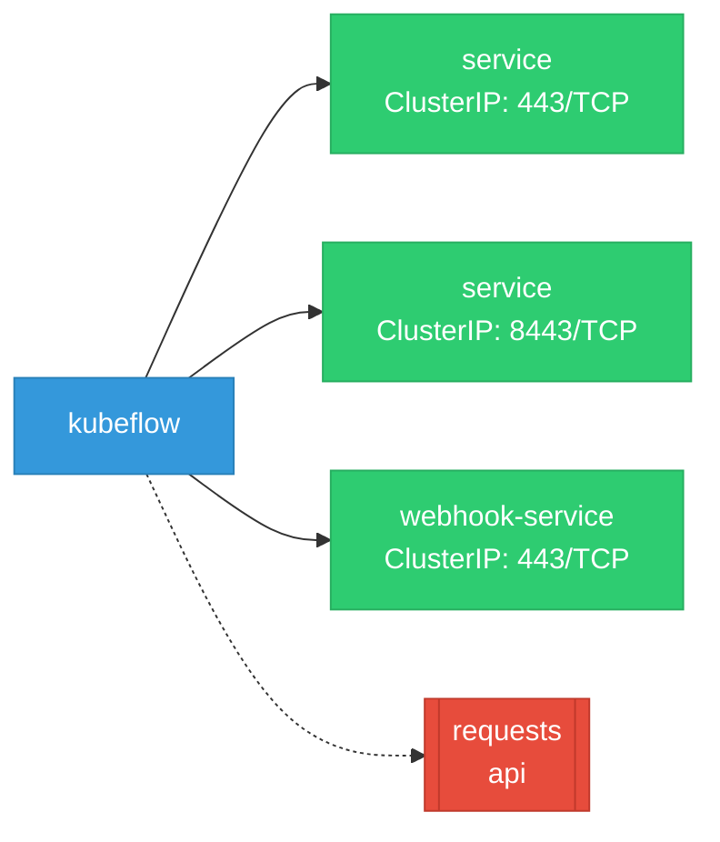

# kubeflow: Network

## Service Map

### Services

| Name | Type | Ports | Source |
|------|------|-------|--------|
| service | ClusterIP | 443/TCP | [`components/notebook-controller/config/manager/service.yaml`](https://github.com/red-hat-data-services/kubeflow/blob/0ac7fbaae9cccdc24b232e4f9827a9deb442d3f6/components/notebook-controller/config/manager/service.yaml) |
| service | ClusterIP | 8443/TCP | [`components/odh-notebook-controller/config/manager/service.yaml`](https://github.com/red-hat-data-services/kubeflow/blob/0ac7fbaae9cccdc24b232e4f9827a9deb442d3f6/components/odh-notebook-controller/config/manager/service.yaml) |
| webhook-service | ClusterIP | 443/TCP | [`components/odh-notebook-controller/config/webhook/service.yaml`](https://github.com/red-hat-data-services/kubeflow/blob/0ac7fbaae9cccdc24b232e4f9827a9deb442d3f6/components/odh-notebook-controller/config/webhook/service.yaml) |

!!! warning "No Network Policies"
    No NetworkPolicy resources were found in the analyzed sources. Network policies may exist in overlays, Helm values, or cluster-level configurations not captured by static analysis.

